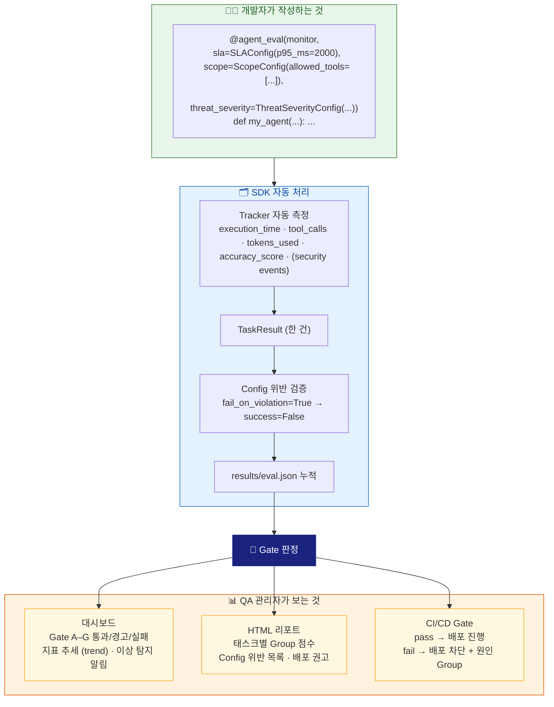

# Chapter 02: Agent-Evaluator 첫 시작

> 좋은 도구는 처음 사용하는 순간부터 작동해야 한다.

---

## 2.1 설치 — 용도별 extras 선택 가이드

Chapter 1에서 자율 에이전트의 배포 준비도를 7개의 독립적인 차원으로 평가해야 한다는 것을 확인했습니다. 목표달성(A)·행동무결성(B)·신뢰성(C)·성능계약(D)·보안경계(E)·다중에이전트(F)·운영관측성(G) — 이 7개 Gate 중 하나라도 검증하지 않고 배포하면 해당 차원에서 예상치 못한 장애가 발생합니다.

**Agent-Evaluator는 이 7차원 평가를 Python SDK로 구현합니다.** Tracker(25개)가 각 차원의 지표를 자동으로 측정하고, Config(33개)가 "어떤 수준이면 배포 가능한가"를 코드로 선언하며, Gate가 7개 차원을 종합해 배포 판정을 내립니다. Prompt Engineering → Context Engineering으로 이어진 AI 최적화 방법론의 세 번째 단계 — 자율 에이전트를 외부에서 제어·측정·판정하는 AI-native 공학 패러다임입니다.

Agent-Evaluator는 v0.7.8부터 기본 설치(`pip install agent-evaluator`)에 SDK 전체 기능이 포함됩니다. LLM Judge 엔진, FastAPI 대시보드, OTEL 모니터링, PDF 처리를 별도 설치 없이 바로 사용할 수 있습니다.

### 기본 설치에 포함된 기능

| 기능 | 패키지 | Harness 관련 |
|---|---|---|
| 25개 네이티브 트래커 (Gate A-G) | numpy, pandas, python-dotenv | 전 Gate |
| 33개 Harness Config 데이터클래스 | 코어 내장 | 전 Gate |
| LLM Judge 엔진 (Gate G) | openai, anthropic | Gate G |
| FastAPI 대시보드 | fastapi, uvicorn, jinja2, python-multipart | 운영 |
| OTEL 모니터링 (Gate G) | opentelemetry-sdk, arize-phoenix | Gate G |
| PDF 처리 | pdfplumber | Gate A |

### 별도 설치가 필요한 extras

| extras | 포함 패키지 | 사용 시기 |
|---|---|---|
| `[eval]` | deepeval, ragas, datasets | 외부 평가 도구 연동 (HybridPerformanceMonitor) |
| `[langchain]` | langchain, langchain-core, langgraph | LangChain/LangGraph 프레임워크 사용 시 |
| `[dspy]` | dspy-ai | DSPy 프로그램 평가 |
| `[pydanticai]` | pydantic-ai | PydanticAI Agent 평가 |
| `[crewai]` | crewai | CrewAI (전이 의존성 100개+, 단독 설치 권장) |
| `[autogen]` | pyautogen, autogen-agentchat | AutoGen (무거움, 단독 설치 권장) |
| `[examples]` | 기본 + eval 묶음 | 모든 예제 실행 |
| `[full]` | 위 전체 | 모든 기능 (설치 10분+ 소요) |

```bash
# 기본 설치 — 33개 Harness Config + LLMJudge + 대시보드 + OTEL 포함 (권장)
pip install agent-evaluator

# LangChain 프레임워크 통합
pip install "agent-evaluator[langchain]"

# DeepEval/Ragas 외부 평가 도구 연동
pip install "agent-evaluator[eval]"

# 모든 예제 실행
pip install "agent-evaluator[examples]"

# 전체 설치 (⚠️ crewai/autogen 포함, 10분+)
pip install "agent-evaluator[full]"

# 설치 확인
agent-eval --version
# → agent-evaluator 0.8.4
```

> 👨‍💻 **개발자 TIP**: `[crewai]`와 `[autogen]`은 의존성이 무거워 단독 extras로 분리되어 있습니다. CrewAI와 AutoGen을 동시에 설치하면 pydantic 버전 충돌이 발생할 수 있으므로, 필요한 경우에만 하나씩 설치하세요.

---

## 2.2 환경 변수 설정 (.env 파일 패턴)

Agent-Evaluator는 소스 코드에 API 키를 하드코딩하지 않는 것을 원칙으로 합니다. 프로젝트 루트에 `.env` 파일을 만들어 관리하는 것을 권장합니다.

```bash
# .env (프로젝트 루트에 생성)

# LLM API 키 (Group G — LLM Judge 사용 시 필요)
OPENAI_API_KEY=sk-...
ANTHROPIC_API_KEY=sk-ant-...

# 결과 저장 경로 (생략 시 자동 감지)
# AGENT_EVALUATOR_OUTPUT_DIR=/path/to/results
# AGENT_EVALUATOR_ROOT=/path/to/project
```

`.env` 파일을 로드하는 방법은 두 가지입니다.

```python
# 방법 1: SDK가 자동 로드 (권장)
from agent_evaluator import load_env
load_env()  # 스크립트가 위치한 디렉토리부터 상위로 .env를 탐색해 로드

# 방법 2: python-dotenv 직접 사용
from dotenv import load_dotenv
load_dotenv()
```

- **`load_env()`**: 스크립트 파일이 위치한 디렉토리부터 상위 방향으로 `.env`를 탐색해 처음 발견된 파일을 로드한다. `pip install` 또는 `pipx install`로 설치한 환경에서 스크립트를 어느 위치에서 실행하든 프로젝트 루트의 `.env`를 자동으로 찾는다.
- **방법 2**: `python-dotenv`를 직접 사용하며, 현재 작업 디렉토리(`cwd`) 기준으로 `.env`를 탐색한다. 실행 경로가 달라지면 `.env`를 찾지 못할 수 있다.

**저장 경로 자동 감지**: `output_dir`를 별도로 지정하지 않으면 SDK가 다음 순서로 경로를 자동 결정합니다.

1. 환경 변수 `AGENT_EVALUATOR_OUTPUT_DIR` (최우선)
2. 환경 변수 `AGENT_EVALUATOR_ROOT` 아래 `results/`
3. 현재 작업 디렉토리 아래 `results/` (폴백)

`AGENT_EVALUATOR_OUTPUT_DIR`를 `.env`에 명시하면 설치 위치나 실행 경로에 관계없이 결과가 항상 같은 경로에 저장됩니다.

> 📋 **QA 관리자 TIP**: `.env` 파일은 `.gitignore`에 반드시 추가하세요. API 키가 저장소에 노출되면 심각한 보안 문제가 발생할 수 있습니다. `.env.example` 파일을 만들어 팀원이 필요한 변수 목록을 알 수 있도록 공유하는 것을 권장합니다.

> 📖 **더 깊이 알고 싶다면**: 지원되는 환경변수 전체 목록과 각 변수의 동작 방식은 **[Appendix C — 환경변수 & 설정 레퍼런스](../Appendix/C_환경변수_설정_레퍼런스.md)**를 참조하세요.

---

## 2.3 5분 안에 첫 Harness 배포 판정 경험

Chapter 1에서 정의한 7개 Gate는 추상적인 개념이 아닙니다. Agent-Evaluator를 실행하면 Tracker가 각 차원을 즉시 측정하고, Gate가 실제로 PASS/FAIL 판정을 내립니다.

이 실습에서 Harness 3요소를 순서대로 경험합니다.

- **단계 1–3** — `@eval.qa` 데코레이터가 **Tracker**를 자동 활성화합니다. 에이전트 함수를 감싸기만 하면 AccuracyEvaluator·LatencyTracker 등이 즉시 작동합니다.
- **단계 4** — `eval.gate(tcr=80, accuracy=65)`가 **Gate** 역할을 합니다. 기준 미달 시 `sys.exit(1)`로 파이프라인을 차단합니다.
- **단계 4 확장** — `SLAConfig`, `InstructionConfig`를 추가하면 **Config**가 합류합니다. 배포 기준을 코드로 선언하는 패턴입니다.

가장 짧은 코드로 이 흐름을 직접 확인해봅니다.

### 단계 1 — QuickEval로 측정 시작

```python
# 출처: Evaluator_Examples/ch02_quickstart.py
from agent_evaluator import QuickEval

# QuickEval은 PerformanceMonitor + EvalDecorator를 하나로 감싼 Facade
eval = QuickEval("results/")
```

- **`QuickEval`**: `PerformanceMonitor`와 `EvalDecorator`를 1줄로 초기화하는 Facade 클래스다.
- **`"results/"`**: 평가 결과 JSON·HTML 파일이 저장될 디렉토리 경로다. 디렉토리가 없으면 자동으로 생성된다.
- **내부 동작**: `PerformanceMonitor(output_dir="results/")` 인스턴스를 생성하고, 단축 데코레이터(`qa`, `rag`, `tool_use` 등)를 제공한다.

### 단계 2 — 에이전트 함수에 데코레이터 적용

```python
@eval.qa  # Group A 목표달성: AccuracyEvaluator + TCR 자동 측정
def my_agent(question: str, ground_truth: str = "") -> str:
    answers = {
        "한국의 수도는?": "서울입니다.",
        "파이썬 창시자는?": "귀도 반 로섬입니다.",
    }
    return answers.get(question, "모르겠습니다.")
```

- **`@eval.qa`**: `task_type="qa"`로 설정된 `@agent_eval` 데코레이터의 단축형으로, Group A `AccuracyEvaluator`와 `TaskCompletionTracker`를 자동 활성화한다.
- **함수 시그니처**: `question`과 `ground_truth`를 파라미터로 받는 것이 규칙이다. `ground_truth`는 데코레이터가 정확도 계산에 사용하며 기본값 `""`으로 두면 생략 가능하다.
- **반환값**: 문자열을 반환하면 데코레이터가 `ground_truth`와 비교해 `accuracy_score`를 자동 계산한다.

### 단계 3 — 평가 실행

```python
my_agent("한국의 수도는?", ground_truth="서울")
my_agent("파이썬 창시자는?", ground_truth="귀도 반 로섬")
my_agent("우주의 나이는?", ground_truth="138억 년")
```

- **호출 방식**: 일반 함수처럼 호출하면 데코레이터가 실행 시간을 측정하고 `ground_truth`와 응답을 비교해 `TaskResult`를 자동 생성한다.
- **세 번째 케이스**: 딕셔너리에 없는 질문이므로 `"모르겠습니다."`를 반환하고 `ground_truth="138억 년"`과 비교해 낮은 정확도가 기록된다.
- **누적 저장**: 각 호출 결과가 `monitor` 내부 버퍼에 누적되며, `save()` 또는 `gate()` 호출 시 한꺼번에 처리된다.

### 단계 4 — 첫 배포 판정 (Gate)

```python
# Harness Gate — 배포 기준 선언 및 판정
eval.gate(tcr=80, accuracy=70)  # TCR < 80% 또는 Accuracy < 70% 이면 sys.exit(1)

# 결과 저장
eval.save()
print(eval.summary())
```

- **`eval.gate(tcr=80, accuracy=70)`**: TCR이 80% 미만이거나 평균 정확도가 70% 미만이면 `sys.exit(1)`을 호출해 CI/CD 파이프라인을 차단한다.
- **`eval.save()`**: `results/quickeval.json`과 `results/quickeval.html`을 동시에 생성한다.
- **`eval.summary()`**: TCR·정확도·p95 레이턴시·비용·품질 평균을 담은 딕셔너리를 반환한다.

실행 출력:

```
{
  "task_completion_rate": 0.667,
  "accuracy": 0.823,
  "p95_latency": 0.003,
  "total_cost_usd": 0.0,
  "quality_avg": 0.756
}
```

TCR 66.7%이 게이팅 기준 80% 미달이므로 `gate()`는 `sys.exit(1)`을 호출합니다. 이것이 Harness Engineering의 배포 판단입니다. **코드를 고쳐서 TCR이 80%를 넘길 때까지 배포는 차단됩니다.**

### Harness Config로 기준을 더 세밀하게

`gate()`는 간단한 단일 임계값 판정입니다. 더 복잡한 배포 기준은 **Harness Config** 데이터클래스로 선언합니다.

```python
# 출처: Evaluator_Examples/ch02_quickstart.py, 섹션 1·4 — Group A·D Config 선언 및 통합
from agent_evaluator import (
    PerformanceMonitor, HarnessEvaluationGate,
    InstructionConfig,    # Group A — 지시 준수
    SLAConfig,           # Group D — 레이턴시·비용 계약
    ThreatSeverityConfig, # Group E — 보안 위협 수준
)
from agent_evaluator.decorators import agent_eval

monitor = PerformanceMonitor(output_dir="results/")

# Config 선언 — 배포 기준을 소스 코드로 명세
instruction_cfg = InstructionConfig(
    required_keywords=["결론"],  # 응답에 "결론" 키워드 포함 필수
    max_words=500,               # 최대 500단어
    fail_on_violation=True,      # 위반 시 해당 태스크 success=False
)
sla_cfg = SLAConfig(
    p95_ms=3000,                 # p95 응답 시간 3초 이하 필요
    max_cost_per_task=0.01,      # 태스크당 비용 $0.01 이하
)

# Tracker + Config 통합 — @agent_eval이 실행마다 Config 검증
@agent_eval(
    monitor,
    task_type="qa",
    instructions=instruction_cfg,
    sla=sla_cfg,
)
def my_agent(question: str, ground_truth: str = "") -> str:
    return llm.invoke(question)

# Gate — 전체 평가 종합 배포 판정 (기준 미달 시 sys.exit(1))
report = monitor.generate_report()
gate = HarnessEvaluationGate(report)
gate.enforce()
```

- **Config 선언 패턴**: `InstructionConfig`, `SLAConfig` 등의 Config 객체를 먼저 만들고, `@agent_eval`의 파라미터로 전달하면 실행마다 자동 검증된다.
- **`fail_on_violation=True`**: 해당 Config 기준을 위반하면 그 태스크의 `success=False`로 처리되어 TCR에 직접 반영된다.
- **`HarnessEvaluationGate(report).enforce()`**: `generate_report()` 결과를 받아 Group A–G 전체 Config 위반 여부를 종합 판정하고, 기준 미달이면 `sys.exit(1)`을 호출한다.
- **`QuickEval.gate()` vs `HarnessEvaluationGate`**: 전자는 TCR·정확도 단순 임계값, 후자는 33개 Config 전체를 포함한 정밀 판정이다.

### 배포 판정 결과 이해하기

```python
report = monitor.generate_report()
d = report.to_dict()

# 7개 Group별 상태 확인
am = d.get("accuracy_metrics", {})
em = d.get("efficiency_metrics", {})
tcr = am.get("tcr", {}).get("tcr", 0.0)
p95 = em.get("latency", {}).get("p95", 0.0)
print(f"Group A (목표달성): TCR={tcr:.1%}")
print(f"Group D (성능계약): p95={p95:.2f}s")

# Harness 그룹별 점수 확인
harness_groups = d.get("extra_metrics", {}).get("harness_groups", {})
for group_key in ["A", "B", "C", "D", "E", "F", "G"]:
    group_data = harness_groups.get(group_key, {})
    if isinstance(group_data, dict) and group_data.get("score") is not None:
        print(f"  Gate {group_key}: score={group_data['score']:.3f} ({group_data.get('status', 'n/a')})")
```

- **`report.to_dict()`**: `EvaluationReport`를 직렬화해 `accuracy_metrics`, `efficiency_metrics`, `extra_metrics` 등의 키를 가진 딕셔너리를 반환한다.
- **TCR 경로**: `d["accuracy_metrics"]["tcr"]["tcr"]` — 태스크 성공 건수 / 전체 건수 비율이다.
- **p95 레이턴시 경로**: `d["efficiency_metrics"]["latency"]["p95"]` — 전체 실행 시간 중 95번째 백분위 값(초)이다.
- **`harness_groups` 경로**: `d["extra_metrics"]["harness_groups"]["A"]` ~ `["G"]` — 각 Gate의 `score`(0–1), `status`(PASS/WARN/FAIL), `gate` 필드를 포함한다.

평가 결과 파일이 `results/quickeval.json`과 `results/quickeval.html`로 저장됩니다. HTML 파일을 브라우저에서 열면 Group A-G별 시각화된 리포트를 확인할 수 있습니다.

> 📋 **QA 관리자 TIP**: `gate(tcr=80)` 단일 임계값으로 시작하고, 팀이 익숙해지면 `InstructionConfig`, `SLAConfig`, `ThreatSeverityConfig`로 세분화하세요. Part IV — Chapter 14에서 팀 수준 임계값 설정 전략을 다룹니다.

방금 5분 실습에서 `@eval.qa`, `eval.gate()`, `SLAConfig`를 경험했습니다. 이 코드가 내부적으로 어떻게 작동하는지 — Layer 구조, 3요소의 책임 분리, 58개 지표의 구성 방식 — 를 살펴봅니다.

---

## 2.4 Agent-Evaluator 아키텍처

Agent-Evaluator의 58개 지표는 **3개 레이어(Layer)**와 **3가지 역할(Tracker·Config·Gate)**, 그리고 **7개 Gate(A–G)**로 구성됩니다. 세 관점을 함께 이해하면 어느 시점에 어떤 도구를 선택해야 하는지 판단할 수 있습니다.

### 레이어 구조 — 외부 의존성 경계

@@HTML_START@@
<div class="la-wrap">
  <div class="la-header">
    PerformanceMonitor
    <span>중앙 오케스트레이터 — 모든 Tracker · Config · Gate 총괄</span>
  </div>
  <div class="la-grid">
    <div class="la-layer" style="--lc:#2e7d32;--lb:#e8f5e9">
      <div class="la-ltitle">Layer 1 — Foundation</div>
      <div class="la-ldesc">외부 의존성 없음 · 기본 설치에 포함<br/>Gate A · C · D 담당</div>
      <ul class="la-list">
        <li><code>TaskCompletionTracker</code><span class="la-meta">TCR · Gate A</span></li>
        <li><code>AccuracyEvaluator</code><span class="la-meta">4중 가중 정확도 · Gate A</span></li>
        <li><code>ResponseQualityEvaluator</code><span class="la-meta">5차원 품질 · Gate A</span></li>
        <li><code>LatencyTracker</code><span class="la-meta">p50·p95·p99 · Gate D</span></li>
        <li><code>TokenEconomyTracker</code><span class="la-meta">비용 추정 · Gate D</span></li>
        <li><code>HallucinationDetector</code><span class="la-meta">환각 탐지 · Gate C (opt-in)</span></li>
      </ul>
    </div>
    <div class="la-layer" style="--lc:#1565c0;--lb:#e3f2fd">
      <div class="la-ltitle">Layer 2 — Agentic</div>
      <div class="la-ldesc">외부 의존성 없음 · 기본 설치에 포함<br/>Gate B · C · E · F 담당</div>
      <ul class="la-list">
        <li><code>ToolCallAnalyzer</code><span class="la-meta">도구 패턴 · Gate B</span></li>
        <li><code>WorkflowExecutionTracker</code><span class="la-meta">워크플로우 · Gate B</span></li>
        <li><code>RetryCorrectionTracker</code><span class="la-meta">재시도 · Gate C</span></li>
        <li><code>ToolSelectionTracker</code><span class="la-meta">F1 정확도 · Gate F</span></li>
        <li><code>AgentCoordinationTracker</code><span class="la-meta">협업 · Gate F</span></li>
        <li><code>보안 Tracker ×5</code><span class="la-meta">위협 탐지 · Gate E (opt-in)</span></li>
      </ul>
    </div>
    <div class="la-layer" style="--lc:#e65100;--lb:#fff3e0">
      <div class="la-ltitle">Layer 3 — Hybrid</div>
      <div class="la-ldesc">선택적 의존성<br/>API 키 또는 [eval] extra</div>
      <ul class="la-list">
        <li><code>LLMJudge</code><span class="la-meta">faithfulness · G-Eval · 7차원 채점 · Gate G<br/>기본 설치 내장, API 키 필요</span></li>
        <li><code>DeepEvalAdapter</code><span class="la-meta">DeepEval 연동 · [eval] extra</span></li>
        <li><code>RagasAdapter</code><span class="la-meta">Ragas RAG 평가 · [eval] extra</span></li>
        <li><code>HybridPerformanceMonitor</code><span class="la-meta">Layer 1+2+외부 통합 · [eval] extra</span></li>
      </ul>
    </div>
  </div>
</div>
@@HTML_END@@

---

### Harness Engineering 3요소

측정·기준·판정은 서로 다른 시점에 동작합니다. **Tracker**가 측정하고, **Config**가 기준을 선언하고, **Gate**가 배포 가능 여부를 판정합니다.

| 역할 | 구성 | 설명 |
|------|------|------|
| **🚦 Gate** | `HarnessEvaluationGate` | Group A–G 전체 Config를 종합해 배포 통과/실패 판정. `.enforce()` / `QuickEval.gate()` / `agent-eval gate` CLI |
| **📋 Config** | 33개 Harness Config 데이터클래스 | 배포 기준을 소스 코드로 선언. `fail_on_violation=True` 시 위반 태스크 즉시 `success=False` 처리 |
| **🔍 Tracker** | 25개 네이티브 트래커 | Gate 직접 매핑 16종 (자동 활성 10 + opt-in 6) + 운영 지원 9종 |

**Harness Gate 직접 매핑 Tracker — 16종**

항상 자동 활성 (10종) — Gate A·B·C·D·F 담당:

| Tracker | 측정 지표 | Gate |
|---------|----------|------|
| `TaskCompletionTracker` | TCR | A |
| `AccuracyEvaluator` | 4중 가중 정확도 | A |
| `ResponseQualityEvaluator` | 5차원 품질 | A |
| `LatencyTracker` | p50 · p95 · p99 | D |
| `TokenEconomyTracker` | 비용 추정 | D |
| `ToolCallAnalyzer` | 도구 패턴 | B |
| `WorkflowExecutionTracker` | 워크플로우 | B |
| `AgentCoordinationTracker` | 협업 품질 | F |
| `ToolSelectionTracker` | F1 정확도 | F |
| `RetryCorrectionTracker` | 재시도 패턴 | C |

opt-in (6종) — 성능·비용 영향, 명시적 활성화 필요:

| Tracker | 활성화 방법 | Gate |
|---------|-----------|------|
| `HallucinationDetector` | `enable_hallucination_detection=True` | C |
| `InputSanitizationTracker` | `enable_security_metrics=True` | E |
| `OutputLeakageDetector` | `enable_security_metrics=True` | E |
| `ToolAuthorizationTracker` | `enable_security_metrics=True` | E |
| `PrivilegeEscalationDetector` | `enable_security_metrics=True` | E |
| `ToolChainAttackDetector` | `enable_security_metrics=True` | E |

**운영 지원 Tracker — 9종** (멀티턴·피드백·이상탐지·비용·스트리밍)

| Tracker | 역할 |
|---------|------|
| `LLMJudge` | Group G 7차원 채점 (`enable_llm_judge=True` + API 키) |
| `ConversationSession` | 멀티턴 대화 평가 (`@conversation_eval`) |
| `ImplicitFeedbackTracker` | 묵시적 사용자 피드백 수집 |
| `AnomalyDetector` | 지표 이상 탐지 및 경보 |
| `CostTracker` | 비용 추적 및 예산 관리 |
| `AdaptivePolicy` | 샘플링 비용 최적화 정책 |
| `SamplingStage` | 단계별 샘플링 전략 |
| `StreamingEvaluator` | 실시간 스트리밍 평가 |
| `AlertEngine` | 알림 규칙 실행 |

> 합계: Gate 직접 매핑 16종 + 운영 지원 9종 = **Native Tracker 25종**

위 목록은 Tracker에 집중했습니다. **Config 33개**가 어떤 파라미터로 기준을 선언하는지, **Gate**가 어떤 로직으로 종합 판정을 내리는지는 **[Chapter 3 §3.2](../Part_II_지표시스템/Chapter_03_Harness_Engineering_기초.md)**에서 세 역할을 동등한 깊이로 다룹니다. 이 챕터에서는 "무엇이 존재하는가"를 파악하는 것으로 충분합니다.

### 3요소의 실행 타이밍

```
에이전트 실행 → Tracker 자동 기록
                │
                ▼
         TaskResult 생성
                │
                ▼
         Config 검증 ← fail_on_violation=True → success=False
                │
                ▼
         monitor.record_task(result) → EvaluationReport 누적
                │
                ▼ (N건 후 또는 명시적 호출)
         Gate 판정 → pass / fail → 배포 결정
```

### 핵심 클래스 3종

```python
from agent_evaluator import PerformanceMonitor, TaskResult, create_taskresult

# ① PerformanceMonitor — 중앙 오케스트레이터
#    모든 Tracker를 내부에서 구성, Config 검증, Gate 판정
monitor = PerformanceMonitor(
    output_dir="results/",
    enable_hallucination_detection=False,  # Group C opt-in (성능 영향)
    enable_security_metrics=False,         # Group E opt-in (성능 영향)
    enable_llm_judge=False,                # Group G opt-in (LLM 비용)
)

# ② TaskResult — 단일 태스크 결과 (frozen dataclass)
#    Tracker가 기록한 모든 지표를 담는 컨테이너
result = create_taskresult(
    task_id="t001",
    question="한국의 수도는?",
    response="서울입니다.",
    ground_truth="서울",
    execution_time=0.85,
    task_type="qa",
)
# → accuracy_score, completion_score 자동 계산 포함

# ③ EvaluationReport — generate_report()가 반환하는 보고서
report = monitor.generate_report()
# → to_dict()로 직렬화: accuracy_metrics["tcr"]["tcr"], efficiency_metrics["latency"]["p95"] 등
```

- **`PerformanceMonitor`**: Group A–G의 모든 Tracker를 내부에서 자동 구성하며, `enable_*` 플래그로 비용이 큰 opt-in Tracker를 선택적으로 활성화한다.
- **`create_taskresult()`**: `question`·`response`·`ground_truth`를 받아 `accuracy_score`(4중 가중 알고리즘)와 `completion_score`를 자동 계산한 `TaskResult` 객체를 반환한다.
- **`TaskResult`**: `frozen=True` 데이터클래스로 불변(immutable)이며, `to_dict()` / `from_dict()` / `from_json()` 직렬화를 지원한다.
- **`generate_report()`**: `record_task()`로 누적된 모든 TaskResult를 집계해 `EvaluationReport` 객체를 반환한다. `to_dict()`로 JSON 직렬화 가능하다.

### Gate A-G 활성화 방법

| Gate | 기본 활성 | 활성화 방법 |
|------|----------|-----------|
| A 목표달성 | ✅ 자동 | 항상 활성 |
| B 행동무결성 | ✅ 자동 | tool_calls 데이터 있으면 자동 |
| C 신뢰성 | ⚠️ 부분 | `enable_hallucination_detection=True` |
| D 성능계약 | ✅ 자동 | 항상 활성 |
| E 보안경계 | ❌ opt-in | `enable_security_metrics=True` 또는 `PerformanceMonitor.for_secure_agents()` |
| F 다중에이전트 | ✅ 자동 | agent_interactions 데이터 있으면 자동 |
| G 운영관측성 | ⚠️ 부분 | `enable_llm_judge=True` + API 키 (샘플링 10%) |

```python
# 모든 Group 활성화 — 최대 측정 모드
monitor = PerformanceMonitor(
    output_dir="results/",
    enable_hallucination_detection=True,  # Group C 전체
    enable_security_metrics=True,         # Group E 전체
    enable_llm_judge=True,                # Group G LLMJudge
    judge_sample_rate=0.1,                # 비용 절감: 10%만 채점
)

# 또는 팩토리 메서드 — 용도별 최적 설정 자동 적용
monitor_rag = PerformanceMonitor.for_rag_evaluation("results/")  # Group C 강화
monitor_sec = PerformanceMonitor.for_secure_agents("results/")   # Group E 강화
```

- **최대 측정 모드**: `enable_hallucination_detection`, `enable_security_metrics`, `enable_llm_judge`를 모두 켜면 Group A–G 전체가 활성화되며 가장 포괄적인 평가가 가능하다.
- **`judge_sample_rate=0.1`**: LLMJudge가 전체 태스크의 10%만 채점하므로 Group G 품질 측정 비용을 90% 절감한다.
- **팩토리 메서드**: `for_rag_evaluation()`은 `enable_hallucination_detection=True`를, `for_secure_agents()`는 `enable_security_metrics=True`를 자동 설정해 용도별 최적 구성을 한 줄로 초기화한다.

> 📖 **더 깊이**: Gate별 Tracker 파라미터와 Config 전체 레퍼런스는 → **Part II — Chapter 03~10** (Gate A-G 챕터)에서 상세히 다룹니다.

아키텍처의 Layer 구조와 3요소의 책임이 명확해졌다면, 이제 같은 시스템을 개발자와 QA 관리자가 각각 어느 지점에서 만나는지를 살펴봅니다.

---

## 2.5 개발자와 QA 관리자가 보는 것 — 역할별 데이터 흐름

같은 평가 시스템을 두 역할이 서로 다른 지점에서 만납니다. 이 흐름을 한눈에 이해하면 나머지 챕터를 각자의 관점에서 효율적으로 읽을 수 있습니다.



### 개발자가 결정하는 것 → QA 관리자에게 미치는 영향

| 개발자 선언 | Tracker가 측정 | QA 관리자가 보는 판정 |
|-----------|--------------|-------------------|
| `SLAConfig(p95_ms=2000)` | LatencyTracker → p95 집계 | Gate D 성능계약: PASS / WARN |
| `ScopeConfig(allowed_tools=["search"])` | ToolCallAnalyzer → 범위 이탈 감지 | Gate B 행동무결성: PASS / FAIL |
| `enable_security_metrics=True` | InputSanitizationTracker → 위협 탐지 | Gate E 보안경계: 위협 건수 표시 |
| `enable_llm_judge=True` | LLMJudge → 7차원 채점 | Gate G 운영관측성: 설명가능성 점수 |
| `fail_on_violation=True` (어떤 Config든) | TaskResult.success=False 처리 | TCR 하락 → Gate A 영향 |

> **개발자 읽기 경로**: Part II(지표 이해) → Part III(데코레이터·Config 구현) → Part V(CI/CD 연동)  
> **QA 관리자 읽기 경로**: Part II(지표 이해) → Part IV(임계값 설정·대시보드) → Part V(Gate 운영)

---

## 2.6 세 가지 결과 출력 시나리오

Agent-Evaluator는 평가 결과를 세 가지 방식으로 출력할 수 있습니다.

### 시나리오 ① 터미널 출력 — 빠른 확인

개발 중 빠르게 결과를 확인할 때 사용합니다.

```python
from agent_evaluator import PerformanceMonitor, create_taskresult

monitor = PerformanceMonitor(output_dir="results/")

result = create_taskresult(
    task_id="task_001",
    question="한국의 수도는?",
    response="서울입니다.",
    ground_truth="서울",
    execution_time=0.8,
    task_type="qa",
)
monitor.record_task(result)

report = monitor.generate_report()
import json
print(json.dumps(report.to_dict(), indent=2, ensure_ascii=False))
```

- **`record_task(result)`**: `TaskResult`를 내부 버퍼에 추가한다. 여러 번 호출해 누적한 뒤 `generate_report()`를 호출한다.
- **`report.to_dict()`**: `EvaluationReport`를 JSON 직렬화 가능한 딕셔너리로 변환한다. `summary`, `accuracy_metrics`, `efficiency_metrics` 등의 키를 포함한다.
- **`ensure_ascii=False`**: 한국어 등 비ASCII 문자를 이스케이프 없이 그대로 출력한다.

출력 예시:

```json
{
  "summary": {
    "total_tasks": 1,
    "task_completion_rate": 1.0,
    "accuracy": 0.923,
    "response_quality": 0.812,
    "latency_p95": 0.8,
    "tokens_used_total": 0
  }
}
```

### 시나리오 ② 대시보드 — 시각화 UI

팀 내 공유나 지속적인 품질 모니터링에 적합합니다.

```python
from agent_evaluator import PerformanceMonitor
from agent_evaluator.decorators import agent_eval

monitor = PerformanceMonitor(output_dir="results/")

@agent_eval(monitor, task_type="qa")
def my_agent(question: str, ground_truth: str = "") -> str:
    return llm.invoke(question)

test_cases = [
    ("한국의 수도는?", "서울"),
    ("파이썬 창시자는?", "귀도 반 로섬"),
]
for question, answer in test_cases:
    my_agent(question, ground_truth=answer)

# JSON + HTML 파일 저장
monitor.save_to_file("evaluation")
```

- **`save_to_file("evaluation")`**: `results/evaluation_evaluation.json`과 `results/evaluation_evaluation.html` 두 파일을 동시에 생성한다.
- **HTML 리포트**: 브라우저에서 바로 열 수 있으며, Group A–G 탭과 태스크별 점수 테이블이 포함된 시각화 리포트다.
- **`--watch` 옵션**: 결과 디렉토리의 파일 변경을 감시해 새 평가 결과가 추가될 때 대시보드를 자동으로 갱신한다.

```bash
# 대시보드 실행 (기본 설치에 포함)
agent-eval dashboard results/ --watch
# → http://localhost:8765 에서 확인
# Group A-G별 탭으로 구성
```

### 시나리오 ③ OTEL Phoenix — 실시간 운영 모니터링 (Group G)

프로덕션 환경에서 에이전트 실행을 실시간으로 추적합니다.

**터미널 1 — Phoenix 서버 기동:**

```bash
# Phoenix 서버 시작 (UI: http://localhost:6006)
agent-eval monitor

# 설치 상태 확인
agent-eval monitor --check
```

**터미널 2 — 에이전트 코드:**

```python
from agent_evaluator import setup_otel, PerformanceMonitor
from agent_evaluator.decorators import agent_eval

# setup_otel()은 PerformanceMonitor 생성 전에 반드시 호출
setup_otel(
    endpoint="http://localhost:6006",  # 경로("/v1/traces") 붙이지 말 것
    service_name="my-qa-agent"
)

monitor = PerformanceMonitor(output_dir="results/")

@agent_eval(monitor, task_type="qa")
def my_agent(question: str, ground_truth: str = "") -> str:
    return llm.invoke(question)

my_agent("한국의 수도는?", ground_truth="서울")
# → Phoenix Tracing 탭에서 ae.tcr, ae.accuracy, ae.execution_time 실시간 확인
```

- **`setup_otel(endpoint=..., service_name=...)`**: OTLP HTTP 익스포터를 초기화하며, 반드시 `PerformanceMonitor` 생성 **이전**에 호출해야 트레이서가 올바르게 연결된다.
- **`endpoint` 주의사항**: 경로(`/v1/traces`)를 붙이지 않고 호스트:포트만 입력한다. SDK가 OTLP 경로를 자동으로 추가한다.
- **Phoenix UI**: `http://localhost:6006` 에서 Tracing 탭을 열면 태스크별 `ae.tcr`, `ae.accuracy`, `ae.execution_time` 등의 속성을 실시간으로 확인할 수 있다.
- **`service_name`**: Phoenix 대시보드에서 서비스를 구분하는 이름으로, 여러 에이전트를 동시에 추적할 때 식별자가 된다.

---

## 2.7 언제 어느 출력을 쓰는가 — 상황별 결정표

| 상황 | 권장 방법 | Harness 연관 |
|---|---|---|
| 개발 중 빠른 검증 | 터미널 출력 (`generate_report()`) | Gate A 기본 확인 |
| 팀 리뷰 또는 결과 공유 | 대시보드 (`save_to_file` + `agent-eval dashboard`) | Gate A-G 전체 시각화 |
| CI/CD 파이프라인 게이팅 | CLI (`agent-eval gate`) | HarnessEvaluationGate |
| 프로덕션 실시간 모니터링 | OTEL Phoenix (`setup_otel` + `agent-eval monitor`) | Gate G 운영관측성 |
| 배치 오프라인 평가 | `evaluation_session` 컨텍스트 매니저 | 전체 Gate 누적 |
| 에이전트 A/B 비교 | `QuickEval.compare(other)` | Gate A-D 비교 |
| 드리프트 감지 | `agent-eval trend` | Gate A/D 추세 |

### CI/CD Harness Gate 예시

```bash
# GitHub Actions 또는 Jenkins에서
python run_evaluation.py        # 평가 실행 → results/eval.json 생성

# Harness Gate — Gate A(TCR), Gate D(레이턴시) 기준으로 판정
agent-eval gate results/evaluation_evaluation.json \
    --tcr 85 --accuracy 70 --p95-latency 3.0
# 기준 미달 시 exit 1 → 파이프라인 중단 → 배포 차단
```

### 드리프트 추세 감지 (Group A/D 지속 평가)

```bash
# 최근 10개 평가 결과의 TCR·정확도 추세 분석
agent-eval trend results/ --fail-on-regression

# 결과 예시:
# TCR slope: -0.025/run → ⚠️ 지속적 하락 감지
# P95 slope: +0.12s/run → ⚠️ 레이턴시 증가 추세
# → exit 1 (CI/CD 파이프라인 중단)
```

### QuickEval로 A/B 비교

```python
from agent_evaluator import QuickEval

# 버전 A 평가
eval_a = QuickEval("results/version_a/")

@eval_a.qa
def agent_v1(question: str, ground_truth: str = "") -> str:
    return model_v1.invoke(question)

for q, gt in test_dataset:
    agent_v1(q, ground_truth=gt)
eval_a.save("v1")

# 버전 B 평가
eval_b = QuickEval("results/version_b/")

@eval_b.qa
def agent_v2(question: str, ground_truth: str = "") -> str:
    return model_v2.invoke(question)

for q, gt in test_dataset:
    agent_v2(q, ground_truth=gt)
eval_b.save("v2")

# 비교 — Group A/D 지표 차이 확인
comparison = eval_a.compare(eval_b)
print(comparison)
```

- **독립 `QuickEval` 인스턴스**: `eval_a`와 `eval_b`를 각각 다른 디렉토리로 초기화해 두 버전의 결과가 섞이지 않도록 분리한다.
- **동일 `test_dataset`**: 같은 테스트 케이스를 두 버전에 동일하게 적용해야 공정한 비교가 가능하다.
- **`eval.save("v1")`**: 파일명 접두사를 지정해 `results/version_a/v1_eval.json` 형태로 저장한다.
- **`eval_a.compare(eval_b)`**: Group A(TCR·정확도)와 Group D(레이턴시·비용)의 수치 차이를 딕셔너리로 반환한다.

---

> **이 챕터의 핵심**
>
> - v0.7.8부터 기본 설치(`pip install agent-evaluator`)에 33개 Harness Config · LLM Judge · 대시보드 · OTEL 모니터링이 포함됩니다. 프레임워크별 통합이 필요하면 `[langchain]`, DeepEval/Ragas가 필요하면 `[eval]`을 추가하세요.
> - **Harness Engineering 3요소**: Tracker(25개 지표 자동 기록) × Config(33개 배포 기준 선언) × Gate(종합 판정)
> - `QuickEval.gate(tcr=80)` 한 줄로 첫 배포 판정을 경험할 수 있습니다. 기준 미달 시 `sys.exit(1)` → CI/CD 배포 차단.
> - Gate E 보안 지표는 `enable_security_metrics=True`로, Gate G LLMJudge는 `enable_llm_judge=True` + API 키로 각각 활성화합니다.
> - `setup_otel()`은 반드시 `PerformanceMonitor` 생성 전에 호출하고, endpoint에 경로를 붙이지 마세요: `"http://localhost:6006"`.

---

## 실전 예제

챕터 2에서 설명한 Harness 아키텍처와 첫 시작 과정을 `ch02_quickstart.py`로 바로 체험할 수 있습니다.

**기본 예제**: `Evaluator_Examples/ch02_quickstart.py`

**핵심 코드**

```python
# 출처: Evaluator_Examples/ch02_quickstart.py, 섹션 1 — @agent_eval 기본 사용
from agent_evaluator import PerformanceMonitor
from agent_evaluator.decorators import agent_eval

monitor = PerformanceMonitor(output_dir="results/")

@agent_eval(monitor, task_type="qa")
def my_agent(question: str, ground_truth: str = "") -> str:
    return "에이전트 응답 텍스트"

# 호출하면 Group A (AccuracyEvaluator, TCR) + Group D (LatencyTracker) 자동 집계
my_agent("한국의 수도는?", ground_truth="서울")

# 보고서 저장 (JSON + HTML 동시 생성)
monitor.save_to_file("my_first_eval")
```

- **`@agent_eval(monitor, task_type="qa")`**: 함수를 실행할 때마다 실행 시간을 측정하고 `ground_truth`와 응답을 비교해 `TaskResult`를 생성한 뒤 `monitor`에 자동 기록한다.
- **자동 집계 범위**: `task_type="qa"` 설정 시 Gate A(`AccuracyEvaluator`, `TaskCompletionTracker`)와 Gate D(`LatencyTracker`, `TokenEconomyTracker`)가 기본 활성화된다.
- **`save_to_file("my_first_eval")`**: `results/my_first_eval_evaluation.json`과 `results/my_first_eval_evaluation.html`을 동시에 생성한다.

```python
# 출처: Evaluator_Examples/ch02_quickstart.py, 섹션 8 — QuickEval Facade — 원스톱 간편 시작
from agent_evaluator import QuickEval

eval_qe = QuickEval("results/")

@eval_qe.qa   # Group A 목표달성
def qa_agent(question: str, ground_truth: str = "") -> str:
    return "QA 에이전트 응답"

@eval_qe.rag  # Group A + Group C (hallucination_detection=True)
def rag_agent(question: str, context: str = "", ground_truth: str = "") -> str:
    return "RAG 에이전트 응답"

qa_agent("수도는?", ground_truth="서울")
qa_agent("인구는?", ground_truth="5천만")

# Harness Gate — TCR 80% 미달 시 sys.exit(1) → 배포 차단
eval_qe.gate(tcr=80, accuracy=70)

eval_qe.save()  # JSON + HTML
```

- **`@eval_qe.qa`와 `@eval_qe.rag`**: 같은 `QuickEval` 인스턴스에 여러 에이전트를 등록할 수 있으며, 각각 `task_type`이 다른 `TaskResult`로 누적된다.
- **`@eval_qe.rag`**: `task_type="information_retrieval"`로 설정되며 `hallucination_detection=True`가 자동 활성화되어 Gate C 신뢰성 지표가 추가된다.
- **`eval_qe.gate(tcr=80, accuracy=70)`**: 누적된 모든 태스크(qa + rag 합산)의 TCR·정확도를 기준으로 Gate를 판정하며, 기준 미달 시 `sys.exit(1)`을 호출한다.
- **`eval_qe.save()`**: 파일명 없이 호출하면 기본 이름 `quickeval.json` / `quickeval.html`로 저장된다.

**Harness 아키텍처 4단계와 예제 매핑**

| 단계 | 역할 | 코드 | 예제 파일·섹션 |
|------|------|------|---------------|
| 1. Tracker | 지표 수집 | `@eval.qa` / `@agent_eval(monitor)` | ch12_decorators, 섹션 1 |
| 2. Config | 기준 선언 | `InstructionConfig(required_keywords=["결론"], fail_on_violation=True)` | ch12_decorators, 섹션 4 |
| 3. Gate | 배포 판정 | `eval.gate(tcr=80)` | ch12_decorators, 섹션 7 |
| 4. 저장 | 결과 보존 | `eval.save()` / `monitor.save_to_file()` | ch12_decorators, 섹션 8 |

**실행 결과 (v0.8.4 기준)**

```
=== 04. 데코레이터 · QuickEval 종합 예제 ===
QuickEval("results/"): 초기화 완료

섹션 1: @eval.qa 기본
  14개 태스크 | TCR=57.1% | avg_accuracy=0.712

섹션 7: eval.gate(tcr=80, accuracy=70)
  ❌ Harness Gate 실패 — TCR 57.1% < 80.0%  ← 배포 차단
  (--tcr 50으로 완화 시 ✅ 통과)

결과 저장: results/quickeval.json + results/quickeval.html
```

> **2줄 시작 코드**: `eval = QuickEval("results/")` 한 줄로 Tracker + Config + Gate가 모두 설정됩니다. API 키 없이도 Gate A-F의 지표를 측정하며, `ANTHROPIC_API_KEY` 설정 시 Gate G LLMJudge가 자동 활성화됩니다.
