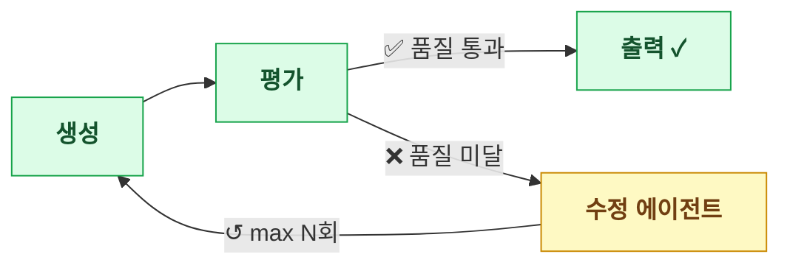
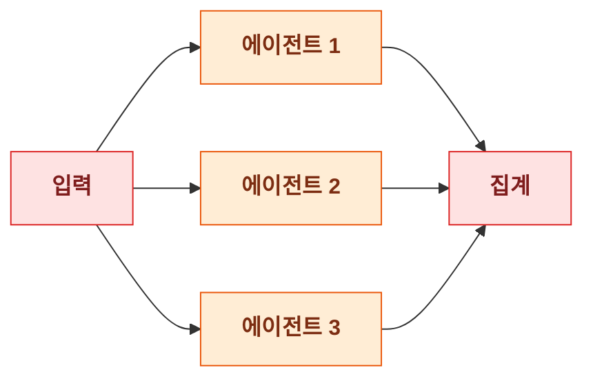
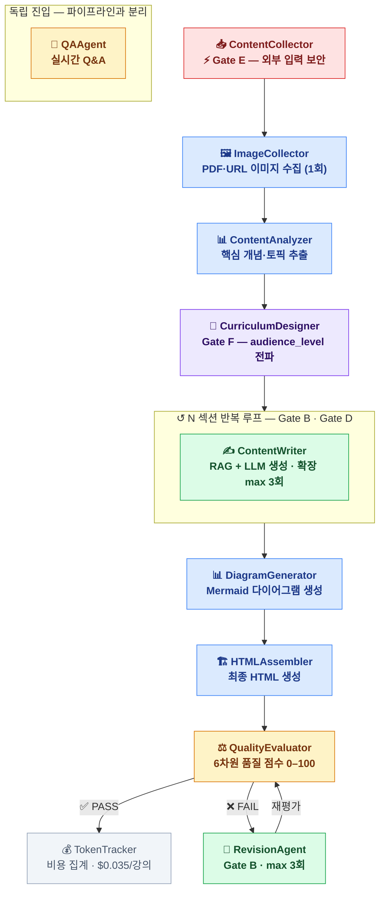

# Chapter 22. 기존 프로젝트 해부: 평가 가능한 단위를 찾아내는 법

> **이 챕터에서 배우는 것**
> - 왜 기존 프로젝트에 평가를 붙이는 것이 새 프로젝트와 근본적으로 다른 작업인지 이해하기
> - 에이전트 토폴로지, LLM 호출 지점, 기존 품질 지표, 위험 지점을 체계적으로 파악하는 **분석 4단계** 익히기
> - "측정 가능한 단위"를 추출하는 원칙과 흔한 실수 피하기
> - Lecture_forge 12-에이전트 파이프라인을 실습 대상으로 분석 4단계 적용하기
> - 어떤 프로젝트에도 즉시 적용할 수 있는 분석 체크리스트

> **독자별 읽기 가이드**
> - **👨‍💻 개발자**: §22.1을 읽고 자신의 프로젝트와 비교하면서 §22.2–22.5를 순서대로 따라오면 분석이 자연스럽게 완성됩니다.
> - **📋 QA 관리자**: §22.1(왜 어려운가) → §22.6(분석 결과를 팀에 공유하는 방법) 순으로 읽으면 팀 내 평가 도입 설득 자료가 됩니다.
> - **이 챕터는 Part VI 전체의 기초입니다.** 분석 4단계를 충분히 이해하고 넘어가야 Ch23의 Gate 매핑이 자연스럽게 연결됩니다.

---

## 22.1 왜 기존 프로젝트는 평가가 어려운가

평가 시스템을 새 프로젝트에 붙이는 것과 이미 돌아가는 프로젝트에 이식하는 것은 근본적으로 다른 작업이다.

새 프로젝트는 처음부터 측정 가능하게 설계할 수 있다. 입출력 형식을 먼저 정의하고, 성공 기준을 명시하고, 평가 훅을 코드 뼈대에 심어두면 된다. 에이전트를 설계할 때부터 "이 에이전트의 출력이 어떤 기준을 만족해야 하는가"를 함께 설계한다.

기존 프로젝트는 그렇지 않다. 이미 수만 줄의 코드가 있고, LLM 호출은 여러 파일에 흩어져 있으며, 성공의 정의는 암묵지로만 존재한다. "지금까지 별 문제 없이 돌아가고 있었다"는 사실이 오히려 평가 도입을 어렵게 만든다. 잘못 건드리면 기존 동작이 깨질 수 있고, 측정 코드가 버그를 유발할 수 있다.

이 파트는 그 상황을 위한 방법론이다. **코드를 최소한 수정하면서, 기존 시스템을 깨지 않으면서, 의미 있는 측정값을 얻는 방법**을 단계별로 설명한다.

Lecture_forge([github.com/bullpeng72/Lecture_forge](https://github.com/bullpeng72/Lecture_forge))는 이 방법론을 실증하는 재료다. 12개 에이전트, 9개 도구, ChromaDB RAG 파이프라인을 가진 실제 프로덕션 수준의 프로젝트다. 하지만 이 챕터에서 배우는 것은 Lecture_forge의 구체적인 구현이 아니라, **어떤 프로젝트에도 통하는 분석 방법**이다.

---

## 22.2 분석 4단계: 해부의 순서

어떤 AI 에이전트 프로젝트든, 다음 4단계를 순서대로 거치면 평가 가능한 단위가 드러난다.

@@HTML_START@@
<style>
.steps-container{display:flex;flex-direction:column;gap:0;margin:20px 0;}
.step-row{display:flex;align-items:stretch;gap:0;}
.step-num{width:48px;display:flex;align-items:center;justify-content:center;font-size:22px;font-weight:900;color:#fff;border-radius:12px 0 0 12px;flex-shrink:0;}
.step-body{flex:1;padding:16px 20px;border-radius:0 12px 12px 0;}
.step-title{font-weight:700;font-size:15px;margin-bottom:6px;}
.step-desc{font-size:13px;line-height:1.7;margin-bottom:8px;}
.step-key{font-size:12px;padding:6px 10px;border-radius:6px;display:inline-block;}
.step-connector{width:48px;display:flex;align-items:center;justify-content:center;font-size:20px;color:#9e9e9e;padding:4px 0;}
</style>

<div class="steps-container">
  <div class="step-row">
    <div class="step-num" style="background:#1565c0;">1</div>
    <div class="step-body" style="background:#e3f2fd;border:2px solid #42a5f5;">
      <div class="step-title" style="color:#0d47a1;">에이전트 토폴로지 파악</div>
      <div class="step-desc" style="color:#1565c0;">에이전트들이 어떤 순서로 실행되는지 그림으로 그린다. 순차 파이프라인인지, 병렬인지, 루프가 있는지 파악한다. 이 구조가 Gate 선택을 결정한다.</div>
      <span class="step-key" style="background:#bbdefb;color:#0d47a1;">→ 결과물: 에이전트 DAG (흐름도)</span>
    </div>
  </div>
  <div class="step-connector">↓</div>
  <div class="step-row">
    <div class="step-num" style="background:#2e7d32;">2</div>
    <div class="step-body" style="background:#e8f5e9;border:2px solid #66bb6a;">
      <div class="step-title" style="color:#1b5e20;">LLM 호출 지점 전수 열거</div>
      <div class="step-desc" style="color:#2e7d32;">프로젝트 전체에서 LLM을 호출하는 모든 지점을 찾는다. 각 지점마다 입력 타입, 출력 기대 형식, 현재 성공 판단 방법을 기록한다.</div>
      <span class="step-key" style="background:#c8e6c9;color:#1b5e20;">→ 결과물: LLM 호출 지점 목록 (N개)</span>
    </div>
  </div>
  <div class="step-connector">↓</div>
  <div class="step-row">
    <div class="step-num" style="background:#e65100;">3</div>
    <div class="step-body" style="background:#fff3e0;border:2px solid #ffa726;">
      <div class="step-title" style="color:#bf360c;">기존 품질 지표 발굴</div>
      <div class="step-desc" style="color:#e65100;">이미 측정되고 있는 지표를 찾는다. 로그에 찍히는 점수, 길이 검증, 비용 추적기 같은 것들이다. 동시에 측정되지 않는 공백도 명시한다.</div>
      <span class="step-key" style="background:#ffe0b2;color:#e65100;">→ 결과물: 측정됨 / 측정 안 됨 목록</span>
    </div>
  </div>
  <div class="step-connector">↓</div>
  <div class="step-row">
    <div class="step-num" style="background:#6a1b9a;">4</div>
    <div class="step-body" style="background:#f3e5f5;border:2px solid #ab47bc;">
      <div class="step-title" style="color:#4a148c;">위험 지점 우선순위화</div>
      <div class="step-desc" style="color:#6a1b9a;">외부 입력 경로, 루프·분기 구조, 비용 폭발 가능 지점 세 기준으로 측정 우선순위를 결정한다. 모든 것을 동시에 측정할 필요는 없다.</div>
      <span class="step-key" style="background:#e1bee7;color:#4a148c;">→ 결과물: 1차 측정 대상 (3개 이내)</span>
    </div>
  </div>
</div>
@@HTML_END@@

이 4단계를 거치고 나면 두 가지가 명확해진다. **첫째, 무엇을 먼저 측정할 것인가.** 둘째, 그것을 `TaskResult`로 어떻게 표현할 것인가. 나머지는 agent-evaluator가 알아서 한다.

---

## 22.3 Step 1 — 에이전트 토폴로지 파악

### 왜 토폴로지부터 시작하는가

토폴로지를 모르면 Gate 선택이 블라인드 샷이 된다. 에이전트가 하나뿐인 단순 호출 시스템과, 12개 에이전트가 체인을 이루는 복잡한 파이프라인은 완전히 다른 Gate를 필요로 한다.

토폴로지는 세 가지 패턴으로 나뉜다. 이 패턴을 식별하면 어떤 Gate가 중요한지 바로 결정할 수 있다.

#### 패턴 A — 순차 파이프라인

앞 단계 출력이 다음 단계 입력이 된다. **핵심 위험**: 앞 단계에서 전달된 필드가 변형·누락되어도 뒤 단계는 알 수 없다(무음 실패, Silent Failure). → **Gate F `PropagationConfig`**, **Gate A `GoalAlignmentConfig`** 필수.


#### 패턴 B — 루프 포함 파이프라인

품질 미달 시 자동 재시도하는 피드백 루프가 있다. **핵심 위험**: 탈출 조건 실패 → 무한 루프; 재시도 횟수 × 토큰 = 비용 폭발. → **Gate B `LoopDetectionConfig`**, **Gate D `ResourceBudgetConfig`** 필수.



#### 패턴 C — 병렬 + 집계

여러 에이전트가 동시에 실행된 후 결과를 합의·집계한다. **핵심 위험**: 에이전트마다 답변이 달라 합의 실패; 충돌 결과가 집계에 유입되어 오염. → **Gate F `ConsensusConfig` · `ConflictResolutionConfig`**, **Gate C `ReproducibilityConfig`** 필수.



### 토폴로지를 그리는 실용적인 방법

정교한 다이어그램이 필요하지 않다. 다음 세 가지 질문에 답하면 충분하다.

**첫째**, 이 시스템의 진입점(entry point)은 어디인가? CLI 커맨드, API 엔드포인트, 또는 특정 함수가 될 것이다. 그것이 DAG의 첫 번째 노드다.

**둘째**, 각 에이전트(또는 함수)가 다음 에이전트에게 무엇을 넘기는가? 객체 전체를 넘기는지, 특정 필드만 넘기는지 확인한다. 이것이 나중에 Gate F PropagationConfig의 `key_facts`가 된다.

**셋째**, 반복(loop) 구조가 있는가? `while`, `for`, 재귀 호출, 또는 "품질이 부족하면 다시 시도" 패턴이 있는지 확인한다. 루프가 있으면 Gate B가 필수다.

### Lecture_forge 토폴로지

Lecture_forge는 **패턴 A(순차)와 패턴 B(루프)가 결합된 구조**다.



이 토폴로지에서 즉시 보이는 세 가지 위험 지점이 있다.

첫째, ContentWriter가 섹션 수만큼 반복 실행된다. 섹션이 10개라면 LLM 호출이 10배로 늘어난다. 비용과 레이턴시가 선형으로 증가한다. ImageCollector는 섹션 루프와 무관하게 파이프라인 시작 시 한 번만 실행된다.

둘째, ContentWriter 내부에 확장 루프(최대 3회)가 있고, RevisionAgent에도 루프(최대 3회)가 있다. 최악의 경우 ContentWriter 3회 × N섹션 + RevisionAgent 3회가 실행된다.

셋째, QAAgent는 다른 에이전트와 독립적으로 실시간 호출된다(`lecture-forge chat` 커맨드). 나머지 파이프라인과 분리해서 평가해야 한다.

---

## 22.4 Step 2 — LLM 호출 지점 전수 열거

### 열거의 목적

LLM 호출 지점을 모두 찾는 이유는 "어디에 `create_taskresult()`를 붙일 수 있는가"를 파악하기 위해서다. 각 호출 지점이 잠재적인 측정 단위다.

동시에, 어떤 입력이 LLM 프롬프트에 들어가는지를 파악하면 보안 위험(Gate E)도 함께 식별할 수 있다.

### 열거 방법: grep 한 줄로 시작하기

```bash
# OpenAI SDK를 쓰는 프로젝트
grep -rn "chat.completions.create\|ChatCompletion" src/ --include="*.py"

# LangChain을 쓰는 프로젝트
grep -rn "\.invoke\|\.run\|\.predict" src/ --include="*.py" | grep -v test

# Anthropic SDK를 쓰는 프로젝트
grep -rn "messages.create\|\.stream(" src/ --include="*.py"

# 자체 래퍼를 쓰는 프로젝트 (함수명 패턴)
grep -rn "invoke_llm\|call_llm\|ask_llm\|query_model" src/ --include="*.py"
```

이 grep 결과가 열거의 원재료다. 이제 각 호출 지점마다 세 가지를 기록한다.

@@HTML_START@@
<style>
.enum-table{width:100%;border-collapse:collapse;font-size:13px;margin:16px 0;}
.enum-table th{background:#37474f;color:#fff;padding:10px 12px;text-align:left;}
.enum-table td{padding:9px 12px;border-bottom:1px solid #eceff1;vertical-align:top;}
.enum-table tr:nth-child(even){background:#f5f5f5;}
.tag{display:inline-block;padding:2px 7px;border-radius:10px;font-size:11px;font-weight:600;}
</style>

<table class="enum-table">
<tr>
  <th>기록 항목</th>
  <th>확인 방법</th>
  <th>의미</th>
</tr>
<tr>
  <td><strong>입력 타입</strong></td>
  <td>프롬프트 구성 코드 확인</td>
  <td>구조화 데이터 / 자유 텍스트 / 외부 콘텐츠 포함 여부</td>
</tr>
<tr>
  <td><strong>출력 기대 형식</strong></td>
  <td>반환값 파싱 코드 확인</td>
  <td>JSON / Markdown / 자유 텍스트 / 코드</td>
</tr>
<tr>
  <td><strong>현재 성공 판단</strong></td>
  <td>호출 직후 검증 코드 확인</td>
  <td>파싱 성공? 길이 범위? 점수 임계값? 아무것도 없음?</td>
</tr>
</table>
@@HTML_END@@

"아무것도 없음"이 나왔다면 그것이 가장 중요한 발견이다. 성공 기준 없이 LLM을 호출하고 있다는 뜻이고, 그 지점이 평가 도입의 1순위가 된다.

### Lecture_forge LLM 호출 전수 목록

Lecture_forge를 위 방법으로 분석하면 12개 에이전트에서 약 25개 호출 지점이 발견된다. 핵심 지점만 정리하면 다음과 같다.

| 에이전트 | 호출 함수 | 호출 수 | 입력 타입 | 출력 기대 형식 | 현재 성공 판단 |
|---------|---------|-------|---------|-------------|-------------|
| CurriculumDesigner | `invoke_llm()` | 3–5회 | 주제 + 분석 결과 | JSON 배열 | JSON 파싱 성공 |
| ContentWriter | `invoke_llm()` | 2–4회 × N섹션 | RAG 컨텍스트 + 섹션 계획 | Markdown | 단어 수 범위 충족 |
| QualityEvaluator | 없음 | 0회 | Lecture 객체 | (규칙 기반) | 점수 ≥ 80 |
| RevisionAgent | `invoke_llm()` | 1–3회 | 품질 이슈 + 기존 본문 | 수정 Markdown | 점수 상승 여부 |
| QAAgent | `invoke_llm()` | 1회/질문 | 질문 + 검색 결과 | 5섹션 Markdown | ≥ 300단어 |
| DiagramGenerator | `invoke_llm()` | 1회/다이어그램 | 섹션 요약 | Mermaid 코드 | 문법 검증 성공 |
| PDFTranslator | `invoke_llm()` | N회 (청크별) | 영문 청크 | 한국어 번역 | 없음 ← **위험** |

마지막 행이 중요하다. PDFTranslator는 번역 결과에 대한 성공 판단 기준이 없다. 번역이 제대로 됐는지, 원문 내용이 보존됐는지 아무도 모른다. 이런 지점이 평가 이식의 첫 번째 후보가 되어야 한다.

---

## 22.5 Step 3 — 기존 품질 지표 발굴

### 이미 있는 것을 활용하라

기존 프로젝트에는 이미 측정되고 있는 지표가 있다. 이것을 찾아서 agent-evaluator와 연결하는 것이, 처음부터 새로 측정하는 것보다 훨씬 빠르고 정확하다.

프로젝트에서 다음 패턴을 찾는다.

```bash
# 점수나 임계값이 코드에 등장하는 곳
grep -rn "score\|threshold\|quality\|accuracy" src/ --include="*.py" | \
  grep -v test | grep -v "#"

# 비용이나 토큰을 추적하는 코드
grep -rn "token\|cost\|usage\|billing" src/ --include="*.py" | grep -v test

# 로그에 품질 관련 값을 출력하는 코드
grep -rn "logger\.\|print(" src/ --include="*.py" | \
  grep -i "quality\|score\|accuracy\|latency"
```

### Lecture_forge에서 발굴된 기존 지표

Lecture_forge를 분석하면 이미 측정되고 있는 지표가 상당히 많다는 것을 알 수 있다.

**이미 측정되고 있는 것**:

- `QualityEvaluator.evaluate()` → 6차원 점수 (0–100), 이슈 목록, 심각도
- `TokenTracker.get_summary()` → phase별 토큰 수, 비용 합계
- `ContentWriter.write_section()` → 단어 수, 코드 블록 수, 확장 반복 횟수
- `QAAgent.answer()` → 신뢰도 점수 (0–1), 출처 목록
- `@make_api_retry` → 재시도 횟수, 재시도 성공/실패 기록

**측정되지 않는 것** — 이것이 agent-evaluator가 채우는 공백이다:

```
[ 에이전트 간 정보 왜곡 ]
  ContentAnalyzer가 추출한 audience_level이 ContentWriter 프롬프트에 실제로 전달되는가?

[ 보안 위협 ]
  외부 PDF에 삽입된 프롬프트 인젝션 패턴이 LLM에 전달되고 있는가?

[ 재현성 ]
  동일 주제로 두 번 실행하면 섹션 구조가 얼마나 다른가?

[ 추세 ]
  지난 8주간 RAG 품질이 조금씩 하락하고 있지는 않은가?

[ 에이전트별 레이턴시 분해 ]
  전체 생성 시간 120초 중 ContentWriter가 몇 초를 쓰는가?
```

이 목록이 Ch23에서 Gate를 선택하는 근거가 된다.

---

## 22.6 Step 4 — 위험 지점 우선순위화

모든 것을 동시에 측정할 필요는 없다. 그리고 모든 것을 동시에 측정하려 하면 오히려 아무것도 제대로 측정하지 못한다.

다음 세 가지 기준으로 우선순위를 정한다.

### 기준 1: 외부 입력 경로가 있는가

파일, URL, 사용자 입력이 LLM 프롬프트에 그대로 삽입되는 구조라면 **보안 측정이 최우선**이다. 이것은 단순한 품질 문제가 아니라 보안 사고 가능성이다. 발생하면 회복이 어렵다.

Lecture_forge는 외부 PDF와 URL에서 수집한 텍스트를 LLM 프롬프트에 그대로 넣는다. → **Gate E 최우선**

### 기준 2: 루프나 반복 구조가 있는가

무한 루프가 가능한 구조라면 Gate B(루프 탐지)와 Gate D(비용 예산)가 함께 우선시되어야 한다. "최대 3회"라는 코드상 제한이 있어도, 그 제한이 실제로 작동하는지 확인해야 한다.

Lecture_forge는 ContentWriter 확장 루프(3회)와 RevisionAgent 루프(3회)가 있다. → **Gate B, Gate D 우선**

### 기준 3: 비용이 예측 불가능한 지점이 있는가

입력에 따라 LLM 호출 횟수가 크게 달라지는 구조라면 Gate D(성능 계약)가 중요하다. Lecture_forge는 섹션 수, 확장 루프, 수정 루프가 모두 가변적이다. 이론적으로 강의 1건 생성 비용이 10배까지 차이날 수 있다.

### Lecture_forge 우선순위 결정

위 세 기준을 적용하면 다음 순서가 나온다.

```
1순위  Gate E — 보안     외부 PDF·URL 입력이 프롬프트에 삽입 (보안 사고 위험)
2순위  Gate B — 루프     ContentWriter 확장 루프 + RevisionAgent 루프
3순위  Gate D — 비용     가변적 LLM 호출 횟수, $0.035 비용 목표
4순위  Gate A — 목표     학습 목표 달성 여부 (핵심 비즈니스 가치)
5순위  Gate F — 협업     12에이전트 정보 전파 왜곡
6순위  Gate C — 신뢰성   API 오류 후 복구율
7순위  Gate G — 관측성   에이전트별 레이턴시 분해
```

이것이 Ch24에서 "첫 측정점"을 선택하는 근거가 되고, Ch25에서 Gate 가중치를 설정하는 근거가 된다.

---

## 22.7 측정 단위 추출 원칙

> **📦 이 섹션의 핵심 도구**
>
> 이하 코드에 처음 등장하는 두 가지 개념을 미리 설명한다.
>
> - **`create_taskresult()`**: 에이전트 실행 결과 1건을 기록하는 헬퍼 함수다. `from agent_evaluator import create_taskresult`로 임포트한다. `task_id`, `question`, `response`, `ground_truth`, `execution_time`, `task_type` 6개 필수 인자에 값을 넣으면 accuracy·latency·TCR 같은 지표가 자동으로 계산된다.
> - **`PerformanceMonitor`**: 여러 `TaskResult`를 누적해 집계 리포트를 만드는 중앙 오케스트레이터다. `monitor.record_task(result)`로 결과를 쌓고, `monitor.save_to_file("파일명")`으로 JSON + HTML 리포트를 저장한다.
>
> 이 두 도구가 Ch24–25에서 사용하는 모든 코드의 기반이다.

분석이 끝났다면 이제 "무엇을 하나의 `TaskResult`로 묶을 것인가"를 결정해야 한다. 이 결정이 이후 측정 데이터의 유용성을 좌우한다. 잘못 설정한 단위는 숫자는 나오지만 인사이트가 없는 상황을 만든다.

### 단위 설정 3원칙

**원칙 1: 원자성** — 하나의 `TaskResult`는 하나의 의미 있는 동작을 나타내야 한다. **너무 크면** 어느 부분이 문제인지 알 수 없고, **너무 작으면** 집계가 의미를 잃는다.

```python
# ✗ 너무 큰 단위: 강의 전체가 하나의 TaskResult
# → TCR이 0% 아니면 100%. "어느 섹션이 실패했는가"를 알 수 없다.
result = create_taskresult(
    task_id="lecture_001",
    question="머신러닝 강의를 만들어줘",
    response=full_lecture_html,   # 수천 줄
    ground_truth="",
    execution_time=total_time,
    task_type="document_creation",
)

# ✗ 너무 작은 단위: LLM 토큰 하나하나가 TaskResult
# → 10,000개 TaskResult가 쌓이지만 "섹션 품질"을 집계할 수 없다.

# ✅ 올바른 단위: 섹션별 TaskResult (의미 있는 동작 1개 = 섹션 1개)
for section in curriculum.sections:
    section_result = content_writer.write(section)  # 에이전트 호출
    result = create_taskresult(
        task_id=f"lecture_001_section_{section.id}",
        question=section.title,
        response=section_result.content,
        ground_truth=" ".join(section.learning_outcomes),
        execution_time=section_result.duration,
        task_type="document_creation",
    )
    monitor.record_task(result)
```

Lecture_forge에서 올바른 원자 단위는 **섹션 1개**다. 강의 1건에 섹션이 평균 8개라면 `TaskResult` 8개가 생성된다. 이 8개의 통계가 "이 강의에서 어떤 섹션이 품질이 낮았는가"를 보여준다.

---

**원칙 2: 대표성** — `ground_truth`가 없어도 구조적 성공을 판단할 수 있는 단위여야 한다. 완벽한 `ground_truth`를 만들려고 기다리다가 측정을 못 시작하는 것이 더 나쁘다. **불완전한 기준으로 시작해서 점점 정밀하게 만드는 것**이 올바른 순서다.

```python
# ✗ 잘못된 접근: ground_truth를 완벽하게 만들 때까지 기다린다
# → 결국 측정을 영원히 시작하지 못한다

# ✅ Level 0: ground_truth 없이 구조적 완료만 측정 (TCR에만 의존)
result = create_taskresult(
    task_id=f"section_{section.id}",
    question=section.title,
    response=section_result.content,
    ground_truth="",          # 비어 있어도 TCR·레이턴시·토큰은 측정됨
    execution_time=section_result.duration,
    task_type="document_creation",
)

# ✅ Level 1: 학습 목표를 ground_truth로 사용 (불완전하지만 의미 있음)
# → 정확도가 낮게 나와도 "이 섹션은 학습 목표 키워드를 다루지 않았다"는 신호가 된다
result = create_taskresult(
    task_id=f"section_{section.id}",
    question=section.title,
    response=section_result.content,
    ground_truth=" ".join(section.learning_outcomes),  # 학습 목표 키워드
    execution_time=section_result.duration,
    task_type="document_creation",
)

# ✅ Level 2: 황금 데이터셋 구축 후 정밀 측정 (Ch26에서 다룸)
# → 몇 주간 Level 1로 데이터를 쌓고, 좋은 출력을 선별해 황금 데이터셋으로 만든다
```

Level 0으로 시작해 Level 1, Level 2로 점진적으로 올라가는 것이 이식의 실용적인 경로다.

---

**원칙 3: 집계 가능성** — N개 단위의 통계가 의미 있어야 한다. 단위를 올바르게 설정하면 `PerformanceMonitor`가 자동으로 집계를 만들어준다. 단위가 잘못되면 숫자가 나와도 해석이 불가능하다.

```python
# 단위를 섹션으로 설정하면 → 강의 1건당 섹션 수만큼 TaskResult가 쌓인다
# 10회 강의 × 8섹션 = 80개 TaskResult → 의미 있는 통계

report = monitor.generate_report()
metrics = report.to_dict()

tcr   = metrics["accuracy_metrics"]["tcr"]["tcr"]            # 예: 0.87 (87% 섹션 완료)
acc   = metrics["accuracy_metrics"]["accuracy_scores"]["overall_accuracy"]  # 예: 0.72
p95   = metrics["efficiency_metrics"]["latency"]["p95"]      # 예: 12.3초

# 인사이트 예시:
# TCR 87% = 80개 중 70개 섹션이 완료 기준을 충족 → 10개 섹션을 디버깅할 수 있다
# Accuracy 72% = 학습 목표 키워드 반영률 → ground_truth 품질이 높아지면 수치도 정밀해진다
# P95 12.3초 = 95%의 섹션이 12.3초 이내에 생성됨 → 이상치 섹션을 찾을 수 있다

# ✗ 단위를 강의 전체로 설정하면 → 10회 강의 = 10개 TaskResult
# TCR은 10%·20%·...·100% 중 하나. P95 레이턴시는 "강의 전체 시간"이 되어 버린다.
# 어느 섹션에서 느려졌는지, 어느 섹션이 실패했는지 알 수 없다.
```

세 원칙을 한 문장으로 요약하면: **측정하면 디버깅할 수 있어야 한다.** 숫자가 나오더라도 그 숫자로 "어디를 고칠 것인가"를 결정할 수 없다면 단위가 잘못된 것이다.

---

## 22.8 일반화: 어떤 프로젝트에도 이 방법을 쓸 수 있다

이 챕터에서 Lecture_forge를 사용한 것은 구체적인 예시를 보여주기 위해서다. 방법론 자체는 어떤 프로젝트에도 적용된다.

다음 상황별 출발점 가이드를 참고하라.

**에이전트 클래스가 명확하게 분리된 프로젝트**: 에이전트 클래스 파일 목록이 곧 토폴로지의 노드 목록이다. 각 클래스의 `run()` 또는 `execute()` 메서드를 찾으면 LLM 호출 지점이 거의 다 나온다.

**모놀리식 코드베이스**: 진입점 파일(main.py, app.py)에서 출발해 LLM 호출 지점으로 이어지는 호출 스택을 따라가면 된다. `grep -rn "invoke\|completion\|chat" src/`로 시작하라.

**기존 품질 지표가 전혀 없는 프로젝트**: 이것 자체가 중요한 발견이다. "돌아가는데 얼마나 잘 돌아가는지 아무도 모른다"는 상태다. 이 경우 가장 단순한 지표인 TCR(완료 여부)부터 시작한다. 완료 여부를 측정하는 것만으로도 처음 3개월간 충분한 인사이트를 얻을 수 있다.

**외부 입력 경로가 없는 내부 시스템**: Gate E의 우선순위가 낮아지고, Gate A(목표 달성)가 자연스럽게 1순위가 된다.

---

## 22.9 분석 결과 체크리스트

이 챕터의 작업을 마쳤다면 다음 항목이 모두 완성되어야 한다.

```
분석 4단계 완료 체크리스트

Step 1 — 토폴로지
  □ 에이전트 실행 순서를 그림(또는 텍스트)으로 표현했다
  □ 파이프라인 패턴을 식별했다 (순차 / 루프 포함 / 병렬+집계)
  □ 외부 입력이 들어오는 지점을 표시했다

Step 2 — LLM 호출 열거
  □ 모든 LLM 호출 지점을 목록으로 만들었다
  □ 각 지점의 입력 타입, 출력 형식, 성공 기준을 기록했다
  □ 성공 기준이 없는 지점(= 1순위 측정 후보)을 식별했다

Step 3 — 기존 지표 발굴
  □ 이미 측정되는 지표 목록을 만들었다
  □ 측정되지 않는 공백 목록을 만들었다
  □ 기존 추적기(비용, 품질 점수 등)의 API를 파악했다

Step 4 — 우선순위화
  □ 외부 입력 경로 위험도를 평가했다
  □ 루프/반복 구조의 제한값을 확인했다
  □ 비용 폭발 가능 지점을 식별했다
  □ 1차 측정 대상을 3개 이내로 결정했다
```

---

> **이 챕터에서 배운 것**
>
> 기존 프로젝트에 평가를 이식하는 작업은 새 프로젝트와 다르다. 코드를 건드리지 않으면서 측정 가능한 단위를 추출하는 것이 핵심이다. 분석 4단계 — **토폴로지 파악 → LLM 호출 열거 → 기존 지표 발굴 → 위험 우선순위화** — 를 거치면 어떤 프로젝트든 측정 준비가 완성된다.
>
> Lecture_forge 분석에서 가장 중요한 발견은 세 가지였다. PDFTranslator에 성공 기준이 없다. 외부 PDF 입력이 프롬프트에 그대로 삽입된다. ContentWriter 확장 루프와 비용 사이의 관계가 추적되지 않는다.
>
> **다음 챕터**에서는 이 분석 결과를 Gate A–G의 Config로 번역하는 방법을 다룬다. "우리 프로젝트의 실패 모드"를 Gate의 언어로 옮기는 작업이 시작된다.

```
# 출처: Evaluator_Examples/ch22_project_analysis.py
```
