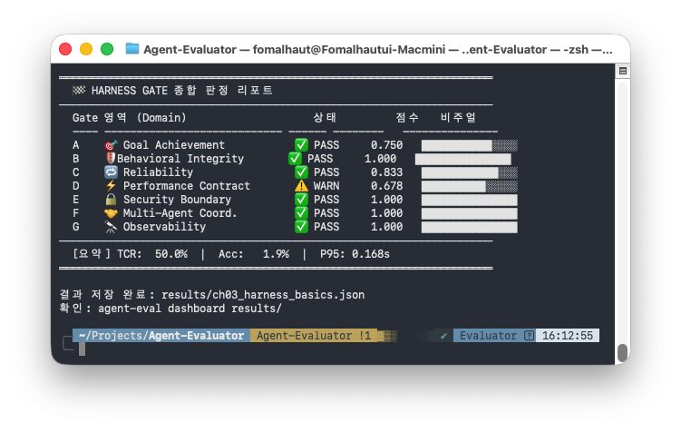

# Chapter 3. Harness Engineering 기초

Chapter 2에서 `QuickEval`과 `@eval_q.qa` 데코레이터로 첫 배포 판정을 경험했다. `@eval_q.qa`를 붙이는 순간 Tracker가 자동 활성화됐고, `eval_q.gate(tcr=80)`이 Gate를 실행했으며, `SLAConfig`를 추가하면 Config가 합류했다. 동작은 경험했지만 아직 "왜 이렇게 설계됐는가"는 설명하지 않았다.

이 챕터는 그 설계 원리를 다룬다. Tracker·Config·Gate 세 역할을 분해하고, 58개 지표가 7개 Gate로 구조화된 논리를 설명한다. Tracker·Config·Gate에 대한 이해는 이후 **Chapter 4~10**에서 Gate A-G를 각각 탐구하기 위한 공통 기반이 된다.

> 📖 **관련 레퍼런스**
> - **[Appendix A — 58개 지표 완전 레퍼런스](../Appendix/A_58개지표_레퍼런스.md)**: 각 Tracker와 Config의 입력·출력·임계값 기본값 한눈에 조회
> - **[Appendix G — AI 품질 평가 이론적 기초](../Appendix/G_AI평가_이론적기초.md)**: Harness Engineering 설계 철학의 이론적 배경
> - **[Appendix A §Part 2 — 33개 Harness Config 레퍼런스](../Appendix/A_58개지표_레퍼런스.md)**: 파라미터 상세 레퍼런스
> - **[Evaluator_Examples/ch03_harness_basics.py](../../Evaluator_Examples/ch03_harness_basics.py)**: 이 챕터 실전 예제 (Gate당 1개 Config 기초 시연 — 실제 실행 시 5개 Gate PASS + 2개 Gate WARN, 이유는 "실전 예제" 절 참고)

---

## 3.1 Harness Engineering이란 무엇인가

> *"Agent = Model + Harness"*  
> — Mitchell Hashimoto (HashiCorp 공동창업자)

**Harness Engineering**은 자율 AI 에이전트를 **외부에서 제어·측정·검증하는 시스템 전체**를 설계하는 공학 분야다. 모델 자체(가중치, 추론 엔진)를 제외한 모든 것 — 지시 구조, 제약 선언, 품질 측정, 배포 판정 — 이 Harness에 속한다.

소프트웨어 공학자 Martin Fowler는 Harness가 어떻게 작동하는지를 제어 이론 관점으로 설명한다.

> *"The agent harness acts like a cybernetic governor, combining feed-forward and feedback to regulate the codebase towards its desired state."*  
> — Martin Fowler, [Harness Engineering](https://martinfowler.com/articles/harness-engineering.html)

**Feed-forward(순방향 제어)**는 실행 이전에 에이전트의 동작 범위를 구조화하는 제어다. `InstructionConfig`로 필수 키워드를 선언하거나 `SLAConfig`로 p95 응답 시간 상한을 지정하는 것이 여기에 해당한다. 에이전트가 실행되기 전, 기대 결과를 코드로 명세한다.

**Feedback(피드백 제어)**는 실행 결과를 측정해 제어 루프로 되돌리는 과정이다. `HarnessEvaluationGate`가 TCR·IFR·p95를 집계하고 기준 미달 시 `sys.exit(1)`로 배포를 차단한다. `agent-eval trend`는 지표 추세를 분석해 장기 회귀를 감지하는 더 느린 피드백 루프를 제공한다.

Agent-Evaluator의 **25개 Tracker(측정) × 33개 Config(순방향 제어) × 7개 Gate(피드백 판정)**는 이 두 제어 축이 Python SDK로 구현된 결과다.

Harness Engineering을 이해하려면 AI 최적화 방법론이 어떻게 진화해왔는지를 먼저 살펴봐야 한다. 이 방법론은 세 단계를 거쳐 발전했다.

### 3.1.1 AI 최적화 방법론의 3단계 진화

#### 1단계: Prompt Engineering (2022–2024)

LLM 등장 초기의 최적화는 **프롬프트 자체를 정교하게 설계**하는 데 집중됐다. 같은 모델이라도 프롬프트를 어떻게 작성하느냐에 따라 출력 품질이 크게 달라진다는 사실이 밝혀지면서, Few-shot prompting, Chain-of-Thought(CoT), 역할 페르소나 설정 같은 기법이 급속히 발전했다.

그러나 Prompt Engineering은 **단일 LLM 호출**에 특화된 최적화다. 에이전트가 여러 도구를 호출하고, 멀티턴 대화를 유지하고, 외부 시스템과 연동하는 복잡한 시나리오에서는 "어떻게 질문하느냐"만으로는 한계에 부딪혔다.

#### 2단계: Context Engineering (2025)

Prompt Engineering의 한계를 돌파한 것이 **Context Engineering**이다. AI 연구자 Andrej Karpathy는 이를 이렇게 정의했다.

> *"Context Engineering is the delicate art and science of filling the context window with just the right information."*  
> — Andrej Karpathy

Context Engineering은 프롬프트 텍스트 하나가 아니라, **컨텍스트 창(context window)에 들어오는 모든 정보**를 관리 대상으로 삼는다.

| 관리 대상 | 구체적 내용 |
|----------|-----------|
| **시스템 프롬프트** | 역할 정의, 행동 지침, 제약 조건 |
| **외부 지식** | RAG 검색 결과, 문서 청크, 벡터 검색 |
| **메모리** | 단기 대화 이력, 장기 사용자 프로파일 |
| **도구 정보** | 사용 가능한 함수 스펙, 이전 호출 결과 |
| **구조화 출력** | JSON 스키마, 포맷 지정 |

Context Engineering은 에이전트 품질을 획기적으로 높였다. 그러나 여전히 해결하지 못하는 문제가 남아 있었다. **"에이전트가 실제로 어떻게 동작했는가"를 사후에 검증하고, 배포 가능 여부를 자동으로 판정하는 메커니즘**이 없었다.

#### 3단계: Harness Engineering (2026~)

Context Engineering이 모델에게 **무엇을 줄 것인가(입력 관리)**를 다룬다면, Harness Engineering은 **모델 주변의 제어 구조 전체(외부 통제 시스템)**를 설계한다.

| 구분 | Prompt Engineering | Context Engineering | Harness Engineering |
|------|-------------------|--------------------|--------------------|
| **최적화 대상** | 프롬프트 텍스트 | 컨텍스트 창 전체 | 에이전트 주변 제어 구조 |
| **관심 시점** | 호출 이전 (사전 설계) | 호출 이전 (입력 구성) | 호출 전후 (사전+사후 제어) |
| **핵심 질문** | "어떻게 물어볼까?" | "무엇을 넣어줄까?" | "어떤 조건에서 배포 가능한가?" |
| **적용 범위** | 단일 LLM 호출 | 단일~다중 호출 | 자율 에이전트 전체 생명주기 |
| **검증 방식** | 수동 평가 | 수동+부분 자동 | 코드로 선언된 자동 판정 |

Harness Engineering은 단순한 테스트 프레임워크가 아니다. Shopify CEO Tobi Lütke가 **"AI 사용은 이제 선택이 아닌 기본 기대치(Baseline Expectation)"**라고 사내 AI 정책에서 선언한 것처럼, 에이전트를 자율적으로 신뢰하는 방향으로 나아가는 만큼, 그 자율성을 **외부에서 구조적으로 제어·검증할 수 있어야** 한다는 공학적 응답이다.

> *"Model is commodity, Harness is the moat."*  
> — Aakash Gupta (AI 제품 전략가)

모델 자체는 점점 상품화된다. 차별화는 **에이전트를 얼마나 신뢰할 수 있도록 제어·검증하느냐**에서 나온다.

#### Context Engineering이 해결하지 못한 문제: 배포 준비도 공백

Context Engineering은 에이전트에게 올바른 정보를 제공하는 데 탁월하다. RAG로 관련 문서를 검색하고, 대화 이력을 메모리에 보존하고, 도구 스펙을 컨텍스트 창에 정확히 구성한다. 그러나 이 모든 최적화는 **실행 이전(pre-execution)**에 작동한다.

실행이 끝난 후, 에이전트가 실제로:
- 정확한 정보를 반환했는지 (정확도가 기준을 충족하는지)
- SLA 내에서 응답했는지 (P95 지연이 계약 범위 안에 있는지)
- 보안 정책을 위반하지 않았는지 (프롬프트 인젝션이 통과됐는지)
- 이 상태로 프로덕션에 배포해도 되는지

…를 자동으로 판정하는 메커니즘은 Context Engineering의 영역 밖이다. 이 **배포 준비도 공백(deployment readiness gap)**을 채우는 것이 Harness Engineering의 존재 이유다.

Fowler는 [같은 글, Harness engineering for coding agent users](https://martinfowler.com/articles/harness-engineering.html)에서 cybernetic governor가 제어해야 할 코드베이스의 상태를 **세 가지 규제 도메인**으로 분류한다.

| 도메인 | 핵심 질문 | Feed-forward (Guides) | Feedback (Sensors) |
|--------|---------|----------------------|-------------------|
| **① 유지보수성** (Maintainability) | 에이전트가 빠르게 코드를 생성하면서 발생하는 문서·설정의 부식을 막는가? | `AGENTS.md` · 문서화 지침 선언 | 백그라운드 에이전트가 주기적으로 부식된 설정 탐지·수리 |
| **② 아키텍처 적합성** (Architecture Fitness) | 에이전트가 설계된 시스템 경계·기술적 제약을 결정론적으로 준수하는가? | 타입 체크 · 의존성 규칙 선언 | 린터·구조적 테스트가 위반 코드의 커밋/PR 자체를 차단 |
| **③ 행동** (Behavior) | 에이전트가 실행 시마다 선언된 품질 기준·비즈니스 성공 조건에 수렴하는가? | `InstructionConfig` · 키워드·SLA 기준 선언 | 자동화 평가 파이프라인 · Gate 판정 · 작성-테스트-수정 루프 |

**① 유지보수성 Harness**는 에이전트가 코드를 빠르게 생성할수록 심각해지는 **문서·설정의 부식(entropy)**을 막는 하네스다. Fowler는 에이전트가 코드를 바꿀 때 기술 문서·아키텍처 다이어그램·README를 최신화하도록 강제하거나, 주기적 백그라운드 에이전트가 부식된 설정을 탐지·수리하는 정기 관리 시스템이 여기에 해당한다고 설명한다.

**② 아키텍처 적합성 Harness**는 시스템 프롬프트로 "보안을 지켜라", "레이어를 나누어라"라고 지시하는 것이 아니라, **결정론적 제약(deterministic constraints)**으로 위반을 원천 차단하는 하네스다. Fowler는 강한 타입 체크, 구조적 테스트, 모듈 경계를 검사하는 린터를 Sensors로 배치해 에이전트가 아키텍처 규칙을 위반한 코드를 생성하면 커밋·PR 자체가 불가능하도록 막아야 한다고 강조한다.

**③ 행동 Harness**는 에이전트가 실행 시마다 선언된 품질 기준과 비즈니스 성공 조건으로 **수렴(convergence)**하는지 검증하는 하네스다. Fowler는 자동화 평가 파이프라인을 돌리고, 에이전트가 스스로 테스트를 작성한 뒤 통과할 때까지 실행 오류를 다시 모델로 피드백하는 **작성-테스트-수정(Write-Test-Fix) 루프**를 핵심 패턴으로 강조한다. AI가 생성한 테스트 자체의 품질 검증도 이 도메인에 속한다.

Context Engineering이 해결하지 못한 배포 준비도 공백은 바로 이 세 번째 도메인 — **행동 Harness** — 의 부재에서 비롯된다. 에이전트가 도구를 사용하고 작업을 완료할 때, 그 결과가 정해진 기준을 충족하는지 실행 시마다 자동으로 검증하는 피드백 루프가 없었던 것이다.

위 세가지 하네스 구조는 arXiv:2604.17025 **"Harness as an Asset: Enforcing Determinism via the Convergent AI Agent Framework (CAAF)"**에서 수학적으로 형식화한 설계와 일치한다. CAAF는 LLM 에이전트의 두 가지 근본 취약점을 문제로 정의한다. 첫째, **제어력 공백(Controllability Gap)** — 자연어 프롬프트는 에이전트의 출력 범위를 결정론적으로 묶지 못한다. 둘째, **확률적 진동(Stochastic Oscillation)** — 에이전트가 스스로 결과를 수정하는 루프에서 출력이 수렴하지 않고 진동한다. 이를 해결하기 위해 CAAF는 도메인의 변하지 않는 규칙(Domain Invariants)을 자연어가 아닌 **기계 실행 가능한 제약 레지스트리(Constraint Registry)**에 등록하고, 에이전트의 모든 출력을 이 레지스트리 기준으로 기계적으로 검사(Unified Assertion)해 단 하나의 위반이라도 발생하면 다음 단계 진행을 차단하는 폐쇄 루프(Closed-loop)를 구성한다.

CAAF의 핵심 명제는 Aakash Gupta와 Fowler의 직관과 동일하다. **"모델은 상품(Commodity), 하네스는 해자(Moat)"** — LLM은 언제든 더 저렴하고 강력한 모델로 교체할 수 있지만, 비즈니스 도메인 규칙을 기계 가독형 코드로 정의해 둔 Constraint Registry는 모델이 교체되어도 기업에 남는 기술 자산이 된다. 파울러의 3대 규제 도메인은 이 레지스트리에서 구체적 제약 집합으로 구현되며 계층을 이룬다. 유지보수성은 문서화 누락·설정 부식을 탐지하는 정적 분석 규칙으로 *장기 관리* 조건을 만들고, 아키텍처 적합성은 허용되지 않은 레이어 호출·패키지 접근을 차단하는 구조 제약으로 *구조적 위반*을 사전 차단하며, 행동은 입출력 스키마 일치 여부·테스트 커버리지 기준을 통과해야만 다음 단계로 진행할 수 있는 어설션으로 *매 실행 순간*의 품질을 자동 검증한다.

### 3.1.2 Harness Engineering의 작동 원리: Guides + Sensors

Harness Engineering은 두 가지 제어 메커니즘으로 구성된다.
위의 다이어그램은 Guides와 Sensors가 에이전트 실행을 감싸는 구조를 시각화한다. Guides가 실행 전 행동 범위를 선언하고, Sensors가 실행 후 측정값을 수집하며, Gate가 두 결과를 통합해 배포 판정을 내린다

**Guides (사전 제어, Feedforward)**는 에이전트가 실행되기 *전에* 작동하는 지침과 제약이다. 무엇을 해도 되고 무엇을 하면 안 되는지를 사전에 선언한다.

- 시스템 프롬프트의 행동 지침
- `AGENTS.md` 같은 에이전트 명세 파일
- 도구 호출 허용 목록(allowlist)
- 응답 언어·형식 제약

**Sensors (사후 제어, Feedback)**는 에이전트가 실행된 *후에* 작동하는 측정과 검증이다. 실제로 어떻게 동작했는지를 측정하고 기준과 비교한다.

- 정확도·환각 탐지 (AccuracyEvaluator, HallucinationDetector (opt-in))
- 지연·비용 측정 (LatencyTracker, TokenEconomyTracker)
- 보안 패턴 탐지 (InputSanitizationTracker, OutputLeakageDetector)
- 행동 이상 감지 (ToolCallAnalyzer, WorkflowExecutionTracker).

> **Guides와 Sensors가 실시간으로 만나면 — `LiveGuardrail`**: 지금까지 설명한 Guides/Sensors 구분은 *배치(batch)* 채점을 전제로 한다 — Config가 사전에 기준을 선언하고, Tracker가 사후에 측정하며, Gate가 세션이 끝난 뒤 한 번 판정한다. `LiveGuardrail`(`agent_evaluator.gates.live_guardrail`)은 같은 Gate B/E 평가 함수를 세션 단위가 아니라 **도구 호출 하나하나**에 대해 실행 *직전*에 동기 호출해, Guides(사전 제약)와 Sensors(사후 측정)의 경계를 도구 호출 단위로 좁힌 실시간 버전이다. OpenCode 같은 로컬 코딩 에이전트에 연결하는 방법은 **[Part VII — Chapter 27~28](../Part_VII_실시간가드레일/Chapter_27_LiveGuardrail_OpenCode_연동.md)**에서 다룬다.

#### Agent-Evaluator의 Config와 Tracker
**Agent-Evaluator는 행동 Harness 도메인을 Python SDK로 구현한다.** 
Harness Engineering의 Guides/Sensors 구분은 Agent-Evaluator에서 두 구현체로 직결된다.

- **Guides → Config**: 실행 *전* 선언하는 행동 제약이 33개 Config 데이터클래스로 구현된다. `@agent_eval` 데코레이터에 파라미터로 전달하는 순간 해당 제약이 Gate 판정 기준으로 등록된다.
- **Sensors → Tracker**: 실행 *후* 자동으로 기동되는 측정 엔진이 25개 Tracker 클래스로 구현된다. `PerformanceMonitor`가 내부에서 Tracker를 오케스트레이션하므로 별도 호출 없이 수치가 수집된다.

Agent-Evaluator에서 **33개 Config 데이터클래스**는 Constraint Registry에 해당하고(Guides), **25개 Tracker**는 Sensors, **7개 Gate**는 Unified Assertion 메커니즘에 해당한다. 세 구성 요소의 구체적인 역할과 모듈 위치는 §3.1.3에서 다룬다.

### 3.1.3 핵심 3요소: Tracker · Config · Gate

세 요소가 결합하면 하나의 완전한 배포 검증 파이프라인이 완성된다. 각 요소는 독립적으로도 사용 가능하다 — Tracker만 단독으로 사용하면 관찰 인프라로, Config를 추가하면 기준 검증으로, Gate까지 연결하면 배포 자동화 판정으로 확장된다.

| 요소 | Harness 역할 | 구현체(모듈) | 진입 방법 |
|------|-------------|------------|---------|
| **Tracker** | Sensor — 사후 측정 | `core/trackers/` `layer1.py`(7종) · `layer2.py`(5종) · `security.py`(5종) | `PerformanceMonitor.record_task()` 호출 시 자동 실행 |
| **Config** | Guide — 사전 제약 선언 | `gates/gate_x/configs.py` 33개 데이터클래스 (7개 Gate 패키지에 분산 정의; `decorators.py`는 re-export만 담당) | `@agent_eval(monitor, sla=SLAConfig(...))` 파라미터 |
| **Gate** | 통합 판정 | `gates/gate_x/aggregate.py`(Gate별 점수 계산) + `core/trackers/monitor.py`의 `PerformanceMonitor._compute_harness_groups()`(오케스트레이션) | `HarnessEvaluationGate(report).evaluate()` 또는 `QuickEval.gate()` |

**핵심 원칙: "기준이 코드 안에 있어야 한다."** Config를 `@agent_eval` 데코레이터로 에이전트 코드 바로 옆에 선언하면, 에이전트가 자신의 배포 기준을 소유한다. 품질 기준이 문서나 암묵적 판단 안에 있으면 릴리스마다 기준이 흔들리지만, 코드에 선언된 기준은 어떤 환경에서도 동일하게 반복 검증된다.

`PerformanceMonitor`는 세 요소의 오케스트레이터다. Tracker를 내부에 보유하고, Config를 `@agent_eval`을 통해 수신하며, Gate 판정에 필요한 집계를 자동으로 수행한다.

```python
# 개념 코드 — 3요소 최소 파이프라인 (QuickEval 기반 최소화 버전)
# (실행 가능 전체 예제: Evaluator_Examples/ch03_harness_basics.py 참고)
from agent_evaluator import QuickEval, SLAConfig, InstructionConfig

eval_q = QuickEval("results/")

# ① Config — 배포 기준 선언 (Guides)
@eval_q(
    task_type="qa",
    sla=SLAConfig(p95_ms=2000),
    instructions=InstructionConfig(required_keywords=["서울"], fail_on_violation=True),
)
def agent(question: str, ground_truth: str = "") -> str:
    return llm.invoke(question)
# ② Tracker — 실행 후 자동 수집 (Sensors): AccuracyEvaluator, LatencyTracker 등

# ③ Gate — Config × Tracker 종합 판정
eval_q.gate(tcr=85, accuracy=70)   # 미달 시 sys.exit(1) → CI/CD 차단
```

이 패턴(Config 선언 → Tracker 자동 수집 → Gate 판정)이 Chapter 4–10에서 다루는 33개 Config와 7개 Gate 전체의 공통 구조다.

---

### 3.1.4 "버그 없음" vs "배포 가능"

기존 소프트웨어 테스팅이 던지는 질문은 하나다. **"버그가 없는가?"**

AI 에이전트에게 그 질문은 불완전하다. 에이전트는 결정론적으로 동작하지 않는다. 같은 질문에 매번 다른 경로로 답에 도달한다. Context Engineering으로 컨텍스트 창을 정교하게 구성하더라도, "버그 없음"을 보장하는 `assert` 테스트 수백 개가 통과해도, 프로덕션에서 에이전트가 무단으로 도구를 호출하거나, 환각으로 틀린 정보를 자신감 있게 전달하거나, 비용 계약을 초과하는 일이 일어날 수 있다.

**Harness Engineering은 다른 질문을 던진다.**

> "이 에이전트는 *지금 이 조건*에서 배포해도 되는가?"

그리고 그 질문의 답을 코드로 선언한다.

```python
# 개념 코드 — "버그 없음" vs "배포 가능" 비교 패턴
# (실행 가능 전체 예제: Evaluator_Examples/ch03_harness_basics.py 참고)
# 기존 방식 — "버그가 없는지" 확인
def test_agent_response():
    result = agent("한국의 수도는?")
    assert "서울" in result  # 결정론적 assert

# Harness Engineering — "배포 가능한지" 판정
from agent_evaluator import QuickEval
from agent_evaluator import SLAConfig, InstructionConfig

eval_q = QuickEval("results/")

@eval_q(
    task_type="qa",
    sla=SLAConfig(p95_ms=2000),                               # SLA 선언
    instructions=InstructionConfig(expected_language="ko"),   # 언어 기준 선언
)
def agent(question, ground_truth=""):
    return llm.invoke(question)

# 배포 기준이 위반되면 자동으로 fail 처리
eval_q.gate(tcr=85, accuracy=70)  # → 기준 미달 시 sys.exit(1)
```

### 3.1.5 세 가지 배포 실패 유형

Harness Engineering이 방지하려는 실패는 세 가지 유형이다.

**유형 1 — 측정 없는 배포 (blind deployment)**  
에이전트를 실행하고, "응답이 나오네요"라고 확인한 뒤 배포한다. 정확도가 얼마인지, 응답 시간이 SLA 내에 있는지, 환각이 발생하는지 알 수 없다. 프로덕션 장애가 발생하면 왜 그런지 추적할 수단이 없다.

**유형 2 — 기준 없는 측정 (measurement without criteria)**  
`accuracy=0.85`라는 숫자는 있다. 하지만 이것이 배포 가능한 수준인지 팀원마다 판단이 다르다. 같은 숫자를 보고 "충분하다"와 "부족하다"가 충돌한다. 기준이 문서나 관행에 있으면 이 문제는 반복된다.

**유형 3 — 배포 후 무감지 (silent drift)**  
배포 당시에는 품질 기준을 통과했다. 하지만 LLM 모델이 업데이트되거나, 프롬프트가 조금 바뀌거나, 입력 데이터의 분포가 달라지면서 성능이 서서히 저하된다. 아무도 감지하지 못한 채 수주가 지난다.

Harness Engineering의 세 구성 요소(Tracker, Config, Gate)는 이 세 가지 유형을 각각 해결한다.

---

## 3.2 Tracker · Config · Gate 내부 동작

§3.1에서 세 요소의 역할을 개괄했다. 여기서는 각 요소가 내부에서 어떻게 작동하는가를 분해한다 — `record_task()` 한 번 호출이 내부에서 어떤 순서로 처리되고, Config 선언이 Gate 판정으로 연결되는 흐름을 추적한다.

### 3.2.1 Tracker — 관찰하는 자

Tracker는 판단하지 않는다. `TaskResult`에서 수치를 추출해 통계를 누적하는 것이 전부다. 판단은 Config와 Gate의 몫이다.

#### 레이어 구조

Tracker는 두 레이어로 나뉜다. 외부 의존성 없이 로컬에서 즉시 실행되는 것이 설계 원칙이다.

| 레이어 | Tracker | 측정 대상 |
|--------|---------|---------|
| **Layer 1 — Foundation** | `TaskCompletionTracker`, `AccuracyEvaluator`, `HallucinationDetector`(opt-in), `ResponseQualityEvaluator`, `LatencyTracker`, `TokenEconomyTracker` | 정확도·품질·지연·비용 — 모든 에이전트 공통 |
| **Layer 2 — Agentic** | `ToolCallAnalyzer`, `RetryCorrectionTracker`, `ToolSelectionTracker`, `AgentCoordinationTracker`, `WorkflowExecutionTracker` + 보안 5종(opt-in) | 도구 호출·재시도·협업·보안 — 에이전트 고유 행동 |

#### `record_task()` 호출 시 내부 처리 흐름

```
record_task(TaskResult)
    │
    ├─ Layer 1 집계
    │   ├─ TaskCompletionTracker  → completion_score 누적
    │   ├─ AccuracyEvaluator      → token_f1·jaccard·lcs·levenshtein 가중 계산
    │   ├─ ResponseQualityEvaluator → 5차원(relevance·completeness·accuracy·clarity·usefulness)
    │   ├─ LatencyTracker         → P50·P95·P99·TTFT 백분위 갱신
    │   └─ TokenEconomyTracker    → tokens_used·estimated_cost 누적
    │
    └─ Layer 2 집계 (TaskResult에 해당 필드가 있을 때만 실행)
        ├─ ToolCallAnalyzer        → tool_calls 패턴 분석
        ├─ RetryCorrectionTracker  → retry_count 추적
        ├─ ToolSelectionTracker    → expected vs actual tool F1 계산
        ├─ AgentCoordinationTracker → agent_interactions 추적
        └─ WorkflowExecutionTracker → workflow_steps 분기 추적
```

집계는 `record_task()` 마다 누적된다. 통계(평균·백분위·표준편차)는 `generate_report()` 시점에 한 번 산출된다 — 따라서 태스크 수가 많을수록 통계적 신뢰도가 높아진다.

```python
# 개념 코드 — PerformanceMonitor + create_taskresult 기본 흐름
# (실행 가능 전체 예제: Evaluator_Examples/ch03_harness_basics.py 참고)
monitor = PerformanceMonitor(output_dir="results/", use_korean_tokenizer=True)

result = create_taskresult(
    task_id="t001",
    question="한국의 수도는?",
    response="서울입니다.",
    ground_truth="서울",
    execution_time=0.8,
    task_type="qa",
)

monitor.record_task(result)
# ↑ Layer 1 전체 자동 실행
#   completion_score: TaskResult.completion_score 읽어 TCR 누적
#   accuracy_score:   response vs ground_truth 4중 가중 계산
#   latency:          execution_time → P95 버킷 갱신

report = monitor.generate_report()
# ↑ 누적 데이터 → 통계 산출 → Harness Gate 집계
```

> **`completion_score` 자동 계산**: `create_taskresult()` 헬퍼는 `task_type`을 기반으로 `completion_score`를 자동 계산한다. `code_generation`은 AST 파싱 성공 여부(1.0/0.0), `tool_use`는 `tool_calls` 존재 여부(1.0/0.6), 나머지는 응답 길이 기반 휴리스틱을 적용한다.

보안 Tracker 5종은 성능 영향이 크므로 기본값 `False`이며, `PerformanceMonitor(enable_security_metrics=True, use_korean_tokenizer=True)`로 명시 활성화해야 한다.

### 3.2.2 Config — 기준을 선언하는 자

> **Tracker만으로는 충분하지 않은가?**  
> Tracker는 "P95 응답 시간이 2.3초"라는 사실을 측정한다. 하지만 2.3초가 합격인지 불합격인지는 Tracker가 알 수 없다. 이 판단을 하려면 "P95 2초 이내가 배포 기준"이라는 선언이 별도로 존재해야 한다. 그 선언을 코드로 구현한 것이 Config다. Tracker가 없으면 측정값이 없고, Config가 없으면 기준이 없으며, 둘 중 하나라도 빠지면 Gate 판정이 불가능하다.

Config는 "어떤 상태가 합격인가"를 선언하는 기준서(Specification)다. Tracker처럼 실행 시점에 계산하지 않는다. 선언된 기준이 `PerformanceMonitor`에 등록되고, Gate 집계 시점에 Tracker 측정값과 대조된다.

#### Config 작동 메커니즘

1. **선언**: `@agent_eval` 데코레이터 파라미터로 Config 객체를 전달
2. **등록**: `PerformanceMonitor`가 Config를 내부 레지스트리에 저장
3. **대조**: `generate_report()` → `_compute_harness_groups()` 실행 시 각 Gate 소속 Config의 임계값과 Tracker 측정값을 비교
4. **위반 처리**: `fail_on_violation=True`인 Config 조건을 위반하면 해당 `TaskResult.success`가 즉시 `False`로 처리

```python
# 개념 코드 — 멀티 Gate Config 조합 선언 패턴
# (실행 가능 전체 예제: Evaluator_Examples/ch03_harness_basics.py 참고)
from agent_evaluator import (
    SLAConfig,              # Gate D: 성능계약
    InstructionConfig,      # Gate A: 목표달성
    ReproducibilityConfig,  # Gate C: 신뢰성
    ThreatSeverityConfig,   # Gate E: 보안경계
    agent_eval,
)

@agent_eval(
    monitor,
    task_type="qa",
    instructions=InstructionConfig(
        expected_language="ko",
        max_words=200,
        fail_on_violation=True,       # 위반 즉시 TaskResult.success=False
    ),
    reproducibility=ReproducibilityConfig(
        runs=3,
        reproducibility_threshold=0.85,
    ),
    sla=SLAConfig(
        p95_ms=2000,
        max_cost_per_task=0.005,
    ),
    threat_severity=ThreatSeverityConfig(
        fail_on_critical=True,
    ),
)
def agent(question, ground_truth=""):
    return llm.invoke(question)
```

#### Config가 Gate 점수에 반영되는 방식

각 Config는 소속 Gate의 집계 점수에 영향을 준다. 예를 들어 `SLAConfig(p95_ms=2000)`이 선언된 상태에서 `LatencyTracker`가 P95=2800ms를 측정하면, Gate D 점수가 하락하고 임계값에 따라 WARNING 또는 FAIL로 판정된다. **Config는 기준이고, Tracker는 실측값이다 — Gate는 그 차이를 점수로 환산한다.**

`fail_on_violation` 없이 선언된 Config는 "소프트 기준"으로 작동한다. 위반해도 `TaskResult.success`는 유지되지만, Gate 점수는 하락한다.

### 3.2.3 Gate — 판정하는 자

Gate는 Tracker 측정값과 Config 기준을 대조해 PASS / WARNING / FAIL 판정을 내리는 집계 레이어다. 개별 태스크가 아닌 **전체 평가 세션의 통계**를 대상으로 동작한다.

#### Gate 점수 산출 흐름

```
generate_report()
    │
    └─ _compute_harness_groups()
        │
        ├─ Gate A: TCR·accuracy·quality 평균 → 0.0–1.0 정규화 점수
        ├─ Gate B: loop_count·scope_violation·tool_safety → 위반률 역산
        ├─ Gate C: reproducibility·fault_tolerance → 일관성 지표 평균
        ├─ Gate D: p95_latency vs SLAConfig.p95_ms → SLA 준수율
        ├─ Gate E: threat_count·leakage_count → 위협 탐지률 역산
        ├─ Gate F: consensus_rate·propagation_accuracy → 협업 품질
        └─ Gate G: explainability·observability → 설명·추적 점수
              │
              ▼
        각 Gate: score(0.0–1.0) + status(PASS ≥ 0.7 / WARNING ≥ 0.5 / FAIL < 0.5)
              │
              ▼
        overall_score = Gate A–G 가중 평균
```

#### Gate 판정 임계값과 배포 차단

```python
# 개념 코드 — HarnessEvaluationGate 배포 판정 패턴
# (실행 가능 전체 예제: Evaluator_Examples/ch03_harness_basics.py 참고)
from agent_evaluator import HarnessEvaluationGate

report = monitor.generate_report()
gate = HarnessEvaluationGate(report)

# enforce(): FAIL Gate가 하나라도 있으면 sys.exit(1)
gate.enforce()

# evaluate(): 상세 결과 딕셔너리 반환 (종료하지 않음)
results = gate.evaluate()
# → {"passed": True,
#    "groups": {"A": {"score": 0.873, "status": "pass"}, "B": {"score": 0.421, "status": "fail"}, ...},
#    "violations": [], "summary": {"total_groups": 7, "passed_groups": 7, "overall_score": 0.87}}
```

`QuickEval.gate()`는 이 흐름의 단축 인터페이스다.

```python
# 개념 코드 — QuickEval.gate() 내부 동작 설명
eval_q.gate(tcr=85, accuracy=70)
# 내부 동작:
#   1. generate_report() 호출 → Tracker 통계 산출
#   2. TCR < 85 또는 accuracy < 70 이면 sys.exit(1)
#   3. Harness Config가 선언된 경우 Gate A–G 추가 검증
```

`agent-eval gate` CLI는 이미 저장된 `result.json`을 읽어 동일한 Gate 판정을 재실행한다. CI/CD 파이프라인에서 평가 실행(`python eval.py`)과 게이팅(`agent-eval gate result.json --tcr 85`)을 분리할 수 있는 이유다.

---

## 3.3 58개 지표 전체 지도 — Gate A-G 매핑

### 왜 정확히 7개인가 — Gate 설계 논리

7개 Gate는 임의적인 분류가 아니다. **자율 에이전트를 프로덕션에서 신뢰하기 위해 독립적으로 검증해야 하는 최소 완전 집합이다.**

"독립적"이라는 점이 설계의 핵심이다. Gate A(목표달성)가 PASS여도 Gate E(보안경계)는 알 수 없다. Gate D(성능계약)가 PASS여도 Gate B(행동무결성)는 알 수 없다. 각 Gate는 다른 Gate로 대체할 수 없는 고유한 실패 차원을 담당한다. 7개 차원은 에이전트의 본질적 특성에서 도출된다.

**① 자율성(Autonomy)에서 비롯되는 차원**

에이전트는 스스로 도구를 선택하고 행동 경로를 결정한다. 이 자율성은 목표를 달성했어도 허가되지 않은 도구를 쓰거나, 루프에 빠지거나, 허용 범위를 이탈하는 위험을 만든다.

→ **Gate B — 행동무결성**: "에이전트가 의도된 범위 안에서만 행동했는가?"

**② 확률론적 동작(Stochasticity)에서 비롯되는 차원**

LLM 기반 에이전트는 동일 입력에도 다른 추론 경로와 다른 출력을 생성한다. 단일 실행의 성공이 통계적 보장을 의미하지 않는다. 출력의 사실 일치성(환각)도 실행마다 달라진다.

→ **Gate A — 목표달성**: "통계적으로 충분히 높은 정확도·TCR이 보장되는가?"  
→ **Gate C — 신뢰성**: "동일 품질이 반복 실행에서도 재현되는가?"

**③ 프로덕션 운영(Production Contract)에서 비롯되는 차원**

아무리 정확한 에이전트도 응답이 30초 걸리거나, 태스크당 비용이 예산을 초과하면 서비스가 불가능하다. 이 제약은 기능 테스트로는 알 수 없다.

→ **Gate D — 성능계약**: "SLA(응답 시간·비용)를 예측 가능하게 지키는가?"

**④ 외부 위협(External Threat)에서 비롯되는 차원**

에이전트는 외부 사용자의 입력을 그대로 처리한다. 프롬프트 인젝션·권한 상승·민감 정보 유출 공격은 기능이 완벽한 에이전트에서도 발생할 수 있다. 기능 테스트 100% 통과가 보안을 보장하지 않는다.

→ **Gate E — 보안경계**: "외부 공격을 탐지·차단하고 정보 유출을 방지하는가?"

**⑤ 시스템 복잡성(System Complexity)에서 비롯되는 차원**

단일 에이전트의 품질이 검증되어도 여러 에이전트가 협력할 때는 교착·역할 위반·정보 왜곡 같은 창발적 실패가 발생한다. 다중 에이전트 시스템은 개별 에이전트 검증으로 충분하지 않다.

→ **Gate F — 다중에이전트**: "여러 에이전트가 합의·역할 준수·교착 없이 협력하는가?"

**⑥ 운영 가능성(Operability)에서 비롯되는 차원**

배포 후 에이전트가 예상대로 동작하지 않을 때, 내부 추론 과정을 설명하고 실패 원인을 추적할 수 없다면 수정이 불가능하다. 관측 가능성은 사후에 추가할 수 없으며 처음부터 설계되어야 한다.

→ **Gate G — 운영관측성**: "추론 과정을 설명하고 실패 원인을 즉시 추적할 수 있는가?"

| 에이전트 특성 | 발생하는 위험 | 대응 Gate |
|------------|-----------|---------|
| 자율성 | 허가 범위 이탈·루프 | **B** 행동무결성 |
| 확률론적 동작 | 통계적 품질 불보장·환각 | **A** 목표달성, **C** 신뢰성 |
| 프로덕션 계약 | SLA·비용 초과 | **D** 성능계약 |
| 외부 위협 노출 | 공격·유출 | **E** 보안경계 |
| 시스템 복잡성 | 협업 창발적 실패 | **F** 다중에이전트 |
| 블랙박스 동작 | 운영·디버깅 불가 | **G** 운영관측성 |

**결론**: 7개 Gate는 자율 에이전트의 본질적 속성에서 필연적으로 도출된다. 하나라도 미확인 상태로 배포하면, 해당 속성에서 비롯되는 장애가 프로덕션에서 반드시 발생한다. 이것이 Harness Engineering이 단일 지표가 아닌 7개 독립 차원으로 배포 준비도를 판정하는 이유다.

> **용어 정리 — Gate A-G와 HarnessEvaluationGate**
>
> 이 책에서 "Gate"는 두 가지 계층으로 쓰인다.
>
> | 용어 | 의미 | 예시 |
> |------|------|------|
> | **Gate A-G** | 7개 배포 관문(품질 차원). Tracker+Config 58개를 배포 가능 여부 판정 단위로 묶은 것 | Gate A(목표달성) — "지시를 완수했는가?" |
> | **HarnessEvaluationGate** | Gate A-G를 한 번에 실행해 종합 배포 판정을 내리는 메커니즘(3요소 중 Gate 역할) | `HarnessEvaluationGate(report).enforce()` |
>
> `HarnessEvaluationGate.evaluate()`를 호출하면 Gate A-G 각각의 PASS/WARN/FAIL 결과가 반환된다. 
> 코드 내부(JSON 출력, 대시보드 키)에서는 `harness_groups`, `group_key` 등 "group"이라는 표현이 함께 쓰이는데, 이는 동일한 7개 차원을 지표 분류 관점에서 부른 것이다. 개념적으로는 Gate가 더 정확하다 — 각 차원이 단순 분류가 아닌 "통과해야 하는 배포 관문"이기 때문이다.

### Gate A — 목표달성 (Goal Achievement)

**핵심 질문**: 에이전트가 사용자의 지시를 제대로 완수했는가?

| 유형 | 이름 | 설명 |
|------|------|------|
| Tracker | `TaskCompletionTracker` | Task Completion Rate (TCR) — 완료 비율 |
| Tracker | `AccuracyEvaluator` | 정확도 — Token F1 + Jaccard + LCS + Levenshtein 4중 가중 |
| Tracker | `ResponseQualityEvaluator` | 응답 품질 — relevance(×0.25) · completeness(×0.25) · accuracy(×0.20) · clarity(×0.15) · usefulness(×0.15) 가중 평균 |
| Config | `InstructionConfig` | 응답 형식·길이·언어 준수 기준 |
| Config | `GoalAlignmentConfig` | 목표-행동 정렬 기준 |
| Config | `PlanConfig` | 계획 실행 완성도 기준 |
| Config | `ContextRetentionConfig` | 핵심 컨텍스트 보존 기준 |
| Config | `SubtaskConfig` | 서브태스크 완료율 기준 |
| Config | `KnowledgeRetentionConfig` | 대화 중 사실 보존 기준 |

### Gate B — 행동무결성 (Behavioral Integrity)

**핵심 질문**: 에이전트가 의도하지 않은 행동 없이 동작했는가?

| 유형 | 이름 | 설명 |
|------|------|------|
| Tracker | `ToolCallAnalyzer` | 도구 호출 패턴 분석 |
| Tracker | `WorkflowExecutionTracker` | 워크플로우 실행 분기 추적 |
| Config | `LoopDetectionConfig` | 도구 호출 루프·반복 패턴 감지 기준 |
| Config | `ScopeConfig` | 허용/금지 도구 범위 선언 |
| Config | `ToolParameterSafetyConfig` | 도구 파라미터 위험 패턴 기준 |
| Config | `ContextWindowConfig` | 컨텍스트 윈도우 포화도 기준 |
| Config | `StateConsistencyConfig` | 실행 전후 상태 일관성 기준 (v0.8.2에서 Gate F→B 이동) |
| Config | `DeadlockConfig` | 교착·기아·라이브락 탐지 기준 (v0.8.2에서 Gate F→B 이동) |

### Gate C — 신뢰성 (Reliability)

**핵심 질문**: 같은 입력에 일관되고 재현 가능한 응답을 하는가?

| 유형 | 이름 | 설명 |
|------|------|------|
| Tracker | `HallucinationDetector` | 환각 탐지 — 사실 일관성 점수 (opt-in) |
| Tracker | `RetryCorrectionTracker` | 재시도·자가수정 행동 추적 |
| Config | `ReproducibilityConfig` | 동일 입력 반복 실행 재현성 기준 |
| Config | `FaultToleranceConfig` | 장애 내성·폴백 기준 |
| Config | `GracefulDegradationConfig` | 우아한 성능 저하 기준 |
| Config | `RetryConsistencyConfig` | 재시도 일관성 기준 |
| Config | `IdempotencyConfig` | 멱등성(반복 실행 부작용 없음) 기준 |

### Gate D — 성능계약 (Performance Contract)

**핵심 질문**: 약속한 SLA와 비용 계약을 지켰는가?

| 유형 | 이름 | 설명 |
|------|------|------|
| Tracker | `LatencyTracker` | 응답 시간 — P50·P95·P99·TTFT |
| Tracker | `TokenEconomyTracker` | 토큰 사용량 + 비용 추정 |
| Config | `SLAConfig` | P95·P99·TTFT·비용 SLA 선언 |
| Config | `EfficiencyConfig` | 비용 대비 완료율(ROI) 기준 |
| Config | `ResourceBudgetConfig` | 토큰·비용·실행시간 예산 상한 |
| Config | `TTFTVariabilityConfig` | TTFT 변동성 기준 |
| Config | `CostPredictabilityConfig` | 비용 예측 가능성(CV) 기준 |

> 👨‍💻 **개발자 TIP**: Gate D의 TTFT(첫 토큰 응답 시간)를 측정하려면 에이전트가 `EvalMetadata`를 통해 측정값을 주입해야 한다. `ch03_harness_basics.py`의 `gate_d_agent`는 이 패턴의 실제 예시다:
> ```python
> # 기반 코드 — gate_d_agent 패턴 (단순화 버전, 실행: ch03_harness_basics.py 줄 102~114)
> from agent_evaluator import PerformanceMonitor, agent_eval, SLAConfig, EvalMetadata
> import time
>
> monitor = PerformanceMonitor(output_dir="results/")
>
> @agent_eval(monitor, task_type="qa", task_id_prefix="d_basic",
>     sla=SLAConfig(p95_ms=2000, p99_ms=5000))
> def gate_d_agent(question: str, ground_truth: str = "") -> tuple:
>     t0 = time.perf_counter()
>     time.sleep(...)           # LLM 호출
>     ttft = (time.perf_counter() - t0) * 1000
>     return f"응답 텍스트", EvalMetadata(
>         extra={"ttft_ms": round(ttft, 1)},
>         tokens_used={"input": 80, "output": 150, "total": 230},
>     )
> ```
> `EvalMetadata`를 함께 반환하면 `LatencyTracker`가 TTFT 값을 자동으로 수집해 Gate D 점수에 반영한다.

> 📋 **QA 관리자 TIP**: Gate D(성능계약)는 SLA 준수 여부를 판정합니다. `results/ch03_harness_basics.json` → `efficiency_metrics.latency.p95` 필드에서 실측 P95를 확인하세요.
> - **권장 기준**: 일반 챗봇 3000ms / 실시간 서비스 1000ms — `SLAConfig(p95_ms=...)` 값과 같은 기준 사용
> - **경보 기준**: Gate D WARN(0.5–0.7)이면 고부하 구간 레이턴시 프로파일링 권장, FAIL(0.5 미만)이면 즉시 배포 차단
> - 대시보드 확인: `agent-eval dashboard results/` → **Gate D 성능계약** 탭

### Gate E — 보안경계 (Security Boundary)

**핵심 질문**: 외부 공격과 데이터 유출을 차단했는가?

| 유형 | 이름 | 설명 |
|------|------|------|
| Tracker | `InputSanitizationTracker` | SQL·Command·Path·XSS·Prompt Injection 탐지 |
| Tracker | `OutputLeakageDetector` | 민감 데이터 출력 유출 탐지 |
| Tracker | `ToolAuthorizationTracker` | 미허가 도구 사용 탐지 |
| Tracker | `PrivilegeEscalationDetector` | 권한 상승 패턴 탐지 |
| Tracker | `ToolChainAttackDetector` | 도구 연쇄 공격 패턴 탐지 |
| Config | `ThreatSeverityConfig` | CVSS 기반 위협 심각도 기준 |
| Config | `ComplianceConfig` | PII·컴플라이언스 위반 기준 |
| Config | `ThreatResponseConfig` | 위협 탐지 시 응답 행동 기준 |

> ⚠️ **보안 트래커 활성화**: 보안 트래커 5종(`InputSanitizationTracker`, `OutputLeakageDetector`, `ToolAuthorizationTracker`, `PrivilegeEscalationDetector`, `ToolChainAttackDetector`)은 `enable_security_metrics=True`로 명시적으로 활성화해야 한다. 성능에 영향을 주므로 기본값은 `False`다.

### Gate F — 다중에이전트 협업 (Multi-Agent Coordination)

**핵심 질문**: 여러 에이전트가 교착 없이 협력했는가?

| 유형 | 이름 | 설명 |
|------|------|------|
| Tracker | `AgentCoordinationTracker` | 에이전트 간 상호작용 추적 |
| Tracker | `ToolSelectionTracker` | 도구 선택 F1 정확도 |
| Config | `ConsensusConfig` | 다중 에이전트 합의 품질 기준 |
| Config | `PropagationConfig` | 에이전트 간 정보 전파 충실도 기준 |
| Config | `AgentRoleConfig` | 에이전트 역할 준수 기준 |
| Config | `ConflictResolutionConfig` | 에이전트 간 충돌 해결 품질 기준 |

### Gate G — 운영관측성 (Operational Observability)

**핵심 질문**: 실패 원인을 즉시 추적하고 설명할 수 있는가?

| 유형 | 이름 | 설명 |
|------|------|------|
| Config | `ObservabilityConfig` | 스팬 속성 완성도·감사 이벤트 SLO 기준 |
| Config | `ExplainabilityConfig` | 응답 설명 가능성·추론 근거 기준 |
| Config | `ErrorDiagnosisConfig` | 실패 응답의 오류 진단 품질 기준 |
| Config | `LatencyAttributionConfig` | 도구·모델·네트워크 지연 귀속 기준 |

> **Gate G와 LLM Judge**: Gate G는 관측성과 설명 가능성을 다룬다. LLMJudge (`enable_llm_judge=True`)는 Gate G와 자연스럽게 연결된다. LLM이 응답의 추론 근거와 설명 품질을 자동으로 채점하기 때문이다.

### 지표 수 요약

| Gate | Tracker | Config | 합계 |
|------|---------|--------|------|
| A 목표달성 | 3 | 6 | 9 |
| B 행동무결성 | 2 | 6 | 8 |
| C 신뢰성 | 2 | 5 | 7 |
| D 성능계약 | 2 | 5 | 7 |
| E 보안경계 | 5 | 3 | 8 |
| F 다중에이전트 | 2 | 4 | 6 |
| G 운영관측성 | 0 | 4 | 4 |
| **합계** | **16** | **33** | **49** |

> ℹ️ **지표 수 안내**: Harness Gate(A–G)에 직접 매핑되는 Native Tracker는 16개다. `ConversationSession`, `ImplicitFeedbackTracker`, `AnomalyDetector`, `CostTracker`, `StreamingEvaluator` 등 운영 지원 트래커 9개를 합산하면 SDK 전체 Native Tracker는 25개다. Harness Gate 판정 대상은 이 표의 49개(16 Tracker + 33 Config)이며, 운영 지원 트래커를 포함한 전체는 **25 + 33 = 58개**다. 전체 목록은 [Appendix A](../Appendix/A_58개지표_레퍼런스.md)에서 확인한다.

§3.2에서 세 역할의 작동 방식을, §3.3에서 58개 지표의 전체 구조를 파악했다. 이제 33개 Config를 실제로 어떻게 선언하고 조합하는지 — 실전 패턴을 살펴본다.

---

## 3.4 Config-as-Code 패턴

Config-as-Code는 에이전트의 배포 기준을 소스 코드로 선언하는 패턴이다. 이 패턴이 "기준 없는 측정" 문제를 해결한다.

### 3.4.1 왜 코드로 선언하는가

배포 기준을 코드 밖에 두면 세 가지 문제가 생긴다.

1. **버전 관리 불가**: 기준이 언제 바뀌었는지 추적할 수 없다
2. **팀원 간 불일치**: 같은 숫자를 보고 다른 판단을 내린다
3. **CI/CD 통합 불가**: 코드 변경마다 기준을 자동으로 검증할 수 없다

Config-as-Code는 이 세 가지를 모두 해결한다. Config 객체는 코드베이스의 일부이므로 `git`으로 버전 관리되고, PR 리뷰 시 기준 변경이 명시적으로 보이며, CI/CD 파이프라인에서 자동으로 실행된다.

### 3.4.2 에이전트 유형별 최소 Config 세트

| 에이전트 유형 | 필수 Config | 선택 Config |
|-------------|-------------|-------------|
| 단순 QA 봇 | `InstructionConfig`, `SLAConfig` | `ReproducibilityConfig` |
| RAG 에이전트 | `InstructionConfig`, `SLAConfig`, `ThreatSeverityConfig` | `ContextRetentionConfig`, `ComplianceConfig` |
| 코드 생성 에이전트 | `ScopeConfig`, `SLAConfig`, `ComplianceConfig` | `SubtaskConfig`, `ObservabilityConfig` |
| 멀티에이전트 시스템 | `DeadlockConfig`, `AgentRoleConfig`, `SLAConfig` | `ConsensusConfig`, `PropagationConfig` |
| 보안 중심 에이전트 | `ThreatSeverityConfig`, `ComplianceConfig`, `ThreatResponseConfig` | `StateConsistencyConfig`, `ScopeConfig` |

### 3.4.3 단계적 도입 패턴

하루 만에 모든 Config를 도입할 필요는 없다. 다음 순서로 점진적으로 적용한다.

**Step 1 — 최소 시작 (측정만)**

```python
# 개념 코드 — Step 1 최소 측정 패턴 (Config 없이 QuickEval 기반)
from agent_evaluator import QuickEval

eval_q = QuickEval("results/")

@eval_q.qa
def agent(question, ground_truth=""):
    return llm.invoke(question)

# 이 단계에서는 Config 없이 측정만 함
# 며칠간 수집된 데이터를 보며 실제 지표 분포를 파악한다
```

- **목적**: Config 선언 없이 기본 지표(TCR·정확도·품질·지연)를 수집만 한다
- **`@eval_q.qa`**: `task_type="qa"` 단축 데코레이터로 QA 태스크를 자동 인식한다
- **다음 단계**: 며칠간 데이터를 모은 뒤 실제 P95·TCR 분포를 보고 Step 2 Config 임계값을 결정한다

**Step 2 — 첫 Config 도입 (SLA + 기본 기준)**

```python
# 개념 코드 — Step 2 첫 Config 도입 패턴
from agent_evaluator import SLAConfig, InstructionConfig

@eval_q(
    task_type="qa",
    sla=SLAConfig(p95_ms=3000),           # 측정 데이터 P95 기반 설정
    instructions=InstructionConfig(
        expected_language="ko",
        max_words=300,
    ),
)
def agent(question, ground_truth=""):
    return llm.invoke(question)
```

- **`SLAConfig(p95_ms=3000)`**: Day 1 측정 데이터에서 확인한 실제 P95 응답 시간을 기준으로 SLA를 선언한다
- **`expected_language="ko"`**: 외부 라이브러리 없이 Unicode 범위 분석으로 언어를 감지한다. 응답 전체 문자 중 한글(0xAC00–0xD7A3 등) 비율이 20%를 초과하면 한국어로 판정한다. 영어 혼용 응답도 한글 비율이 기준을 넘으면 통과하므로 "강제"보다는 "비율 감지"에 가깝다
- **`max_words=300`**: `response.split()`으로 공백 기준 어절 수를 세어 300을 초과하면 위반으로 기록한다. 한국어는 어절(공백 구분 단위)이 영어 단어와 다르므로 "300단어"가 아닌 **"300어절"** 상한이다. 한국어 300어절은 대략 A4 1–1.5페이지 분량으로, 과도하게 긴 응답을 걸러내는 품질 하한선 역할을 한다
- **이 시점에서는 `fail_on_violation=False`(기본값)이므로** TCR에 직접 영향을 주는 `success=False` 처리는 발생하지 않는다. 단, 위반이 기록된 태스크는 `violation_count × violation_weight(0.1)`만큼 IFR이 차감되어 Gate A 점수에 반영된다. max_words·expected_language 두 항목이 동시 위반되면 IFR = 1.0 − 2×0.1 = 0.8이 된다

**Step 3 — 배포 판정 자동화 (fail_on_violation + gate)**

```python
# 개념 코드 — Step 3 배포 판정 자동화 패턴 (fail_on_violation + gate)
@eval_q(
    task_type="qa",
    sla=SLAConfig(p95_ms=2000, fail_threshold=3),           # P95 응답 2초 이내, 3건 위반 시 fail
    instructions=InstructionConfig(
        expected_language="ko",
        fail_on_violation=True,
    ),
)
def agent(question, ground_truth=""):
    return llm.invoke(question)

# CI/CD에서 자동 배포 차단
eval_q.gate(tcr=85, accuracy=70)
```

- **`fail_on_violation=True`**: 언어 기준 위반 시 해당 태스크의 `TaskResult.success`를 자동으로 `False`로 강제한다
- **`sla.fail_threshold=3`**: SLA 위반이 3건을 넘으면 Gate 점수를 낮춰 배포 차단에 반영한다
- **`eval_q.gate(tcr=85, accuracy=70)`**: TCR 85% 미만 또는 정확도 70% 미만이면 `sys.exit(1)`로 CI/CD 파이프라인을 차단한다

### 3.4.4 Config 조합 — 프로덕션 QA 에이전트 예시

```python
# 개념 코드 — 프로덕션 QA 에이전트 멀티 Config 조합 패턴
# (실행 가능 전체 예제: Evaluator_Examples/ch03_harness_basics.py 참고)
from agent_evaluator import (
    PerformanceMonitor, agent_eval,
    InstructionConfig,
    ReproducibilityConfig,
    SLAConfig,
    ResourceBudgetConfig,
    ThreatSeverityConfig,
    ObservabilityConfig,
)

monitor = PerformanceMonitor(
    output_dir="results/",
    enable_hallucination_detection=True,  # Gate C
    enable_security_metrics=True,         # Gate E
    use_korean_tokenizer=True,
)

@agent_eval(
    monitor,
    task_type="qa",
    # Gate A — 목표달성
    instructions=InstructionConfig(
        expected_language="ko",
        max_words=500,
        forbidden_phrases=["모르겠습니다", "확인이 필요합니다"],
        fail_on_violation=True,
    ),
    # Gate C — 신뢰성
    reproducibility=ReproducibilityConfig(
        runs=3,
        reproducibility_threshold=0.85,
        fail_on_low_reproducibility=False,  # 경고만, fail 없음
    ),
    # Gate D — 성능계약
    sla=SLAConfig(
        p95_ms=2000,
        max_cost_per_task=0.005,
        fail_threshold=5,
    ),
    resource_budget=ResourceBudgetConfig(
        max_tokens=2000,
        warn_at_pct=0.8,
    ),
    # Gate E — 보안경계
    threat_severity=ThreatSeverityConfig(
        fail_on_critical=True,
        fail_score=7.0,
    ),
    # Gate G — 운영관측성
    observability=ObservabilityConfig(
        min_coverage=0.99,
    ),
)
def qa_agent(question: str, ground_truth: str = "") -> str:
    return llm.invoke(question)
```

- **멀티 Config 조합**: 하나의 `@agent_eval`에 여러 Gate를 동시 선언해(예제의 경우 A·C·D·E·G 5개 Gate) 한 번에 평가한다
- **`enable_hallucination_detection=True`**: Gate C의 `HallucinationDetector`를 활성화한다 (기본값 False, 성능 영향 있음)
- **`enable_security_metrics=True`**: Gate E 보안 트래커 5종을 활성화한다 (기본값 False)
- **`forbidden_phrases`**: "모르겠습니다" 등 역량 부족 신호를 응답에서 탐지하면 `fail_on_violation=True`에 의해 즉시 fail 처리한다
- **`warn_at_pct=0.8`**: 토큰 예산의 80%를 소진하면 경고(fail 없음)를 발생시킨다

> 👨‍💻 **개발자 TIP**: Config를 한꺼번에 전부 추가하면 FAIL 원인 분리가 어렵습니다. §3.4.3의 3단계 순서(`SLAConfig` → `InstructionConfig` → `fail_on_violation=True`)로 도입하면 각 Config가 Gate 점수에 미치는 영향을 단독으로 확인할 수 있습니다. 특히 `fail_on_violation=False`(기본값)로 시작해 데이터를 수집한 뒤 위반 빈도를 보고 `True`로 전환하는 패턴을 권장합니다.

> 📋 **QA 관리자 TIP**: Config PR 리뷰 시 `fail_on_violation=True`로 설정된 항목을 먼저 확인하세요. 이 플래그가 있는 Config는 위반 즉시 해당 태스크를 FAIL 처리하므로 TCR에 직접 영향을 줍니다.
> - **리뷰 기준**: `fail_on_violation=True` 조건 변경은 배포 기준 변경과 같음 — 변경 이유를 PR 설명에 명시 요구
> - **확인 방법**: `results/ch03_harness_basics.json` → `accuracy_metrics.tcr` 필드로 Config 도입 전후 TCR 비교
> - 대시보드 확인: `agent-eval dashboard results/` → **Gate A 목표달성** 탭 → IFR(Instruction Follow Rate) 추이

---

## 3.5 개발자 ↔ QA 관리자 협업 브리지

Harness Engineering에는 두 종류의 사용자가 있다. **개발자**는 Tracker와 Config로 평가를 구현하고, **QA 관리자**는 Gate A–G 판정 결과로 배포를 승인하거나 차단한다. 두 역할이 어떻게 연결되는지 이해하면 팀 전체가 같은 언어로 소통할 수 있다.

### 3.5.1 두 역할이 보는 Harness

@@HTML_START@@
<div class="dual-view">
  <div class="dv-col dv-dev">
    <div class="dv-header">👨‍💻 개발자 관점 — 구현</div>
    <div class="dv-body">
      <pre class="dv-code"><span class="dv-dec">@agent_eval(</span>
    monitor,
    <span class="dv-cfg">sla=SLAConfig(p95_ms=2000)</span>,
    <span class="dv-cfg">scope=ScopeConfig(...)</span>,
    <span class="dv-cfg">threat_severity=...</span>,
<span class="dv-dec">)</span>
<span class="dv-dec">def my_agent(...): ...</span></pre>
    </div>
    <div class="dv-footer">← 코드로 선언 →</div>
  </div>

  <div class="dv-arrow">⟶</div>

  <div class="dv-col dv-qa">
    <div class="dv-header">📊 QA 관리자 관점 — 판정</div>
    <div class="dv-body">
      <div class="dv-results">
        <div class="dv-result-label">대시보드 / Gate 리포트</div>
        <div class="dv-gate-row">
          <span class="dv-gate-name">Gate D 성능계약</span>
          <span class="dv-badge dv-pass">PASS ✅</span>
        </div>
        <div class="dv-gate-row">
          <span class="dv-gate-name">Gate B 행동무결성</span>
          <span class="dv-badge dv-warn">WARN ⚠️</span>
        </div>
        <div class="dv-gate-row">
          <span class="dv-gate-name">Gate E 보안경계</span>
          <span class="dv-badge dv-pass">PASS ✅</span>
        </div>
      </div>
    </div>
    <div class="dv-footer">← 판정 결과로 소통 →</div>
  </div>
</div>
@@HTML_END@@

### 3.5.2 협업 워크플로우 — 5단계

실제 팀에서 Harness Engineering이 어떻게 흐르는지 한 사이클을 따라가 본다.

**Step 1 — 개발자: Tracker 활성화 (측정 시작)**

```python
# 기반 코드: Evaluator_Examples/ch03_harness_basics.py — PerformanceMonitor 설정
from agent_evaluator import PerformanceMonitor

monitor = PerformanceMonitor(
    output_dir="results/",
    enable_security_metrics=True,   # Gate E Tracker (기본값 False — 명시 필요)
    enable_transparency=True,       # 투명성 스팬 기록
    use_korean_tokenizer=True,
)
```

Tracker는 코드를 변경하지 않아도 자동으로 데이터를 수집한다. 이 시점에서 QA 관리자는 아직 개입하지 않는다.

**Step 2 — 개발자: 초기 평가 실행 (기준 없는 측정)**

```python
# 기반 코드: Evaluator_Examples/ch03_harness_basics.py — 데코레이터 패턴 (gate_a_agent 구조 기반)
from agent_evaluator import PerformanceMonitor, agent_eval

monitor = PerformanceMonitor(output_dir="results/")

@agent_eval(monitor, task_type="qa")
def my_agent(question, ground_truth=""):
    # TODO(현업 적용): 아래 Mock 구현을 실제 LLM 호출로 교체하세요.
    #   예) return client.chat.completions.create(model="gpt-5-nano",
    #        messages=[{"role":"user","content":question}]).choices[0].message.content
    return f"응답: {question}"

test_cases = [("데이터를 분석해줘", "분석 완료"), ("보고서를 작성해줘", "작성 완료")]
for q, gt in test_cases:
    my_agent(q, ground_truth=gt)

report = monitor.generate_report()
d = report.to_dict()
p95 = d.get("efficiency_metrics", {}).get("latency", {}).get("p95", 0.0)
tcr = d.get("accuracy_metrics", {}).get("tcr", {}).get("tcr", 0.0)
print(f"응답시간 P95: {p95:.2f}초")
print(f"TCR: {tcr:.1f}%")
```

이 결과를 QA 관리자에게 공유한다.

**Step 3 — QA 관리자: Config 기준 결정 (기준 선언)**

측정 데이터를 바탕으로 QA 관리자가 배포 기준을 결정한다.

```
측정 결과:
  - 응답시간 P95: 1.8초  →  SLAConfig(p95_ms=2500) 설정
  - TCR: 91%            →  eval_q.gate(tcr=85) 설정
  - 보안 위협 탐지: 0건  →  ThreatSeverityConfig(fail_on_critical=True) 설정

QA 관리자 결정 (문서 또는 구두):
  "P95 2.5초 이내, TCR 85% 이상, 보안 위협 0건을 배포 기준으로 한다"
```

**Step 4 — 개발자: Config 코드 반영 (기준을 코드로)**

```python
# 개념 코드 — QA 관리자 결정을 Config 코드로 반영하는 패턴
@agent_eval(
    monitor,
    task_type="qa",
    sla=SLAConfig(
        p95_ms=2500,           # QA 관리자 결정 반영
    ),
    threat_severity=ThreatSeverityConfig(
        fail_on_critical=True,  # QA 관리자 결정 반영
    ),
)
def my_agent(question, ground_truth=""):
    return llm.invoke(question)

eval_q.gate(tcr=85, accuracy=70)  # QA 관리자 결정 반영
```

- **기준의 코드화**: QA 관리자가 구두나 문서로 결정한 기준을 `@agent_eval` 파라미터로 옮긴다
- **버전 관리**: 이 코드가 Git에 커밋되므로 `git log`로 기준 변경 이력을 언제든 추적할 수 있다
- **팀 가시성**: PR 리뷰 시 Config 파라미터 변경이 diff에 명시적으로 드러나 합의 절차를 자연스럽게 강제한다

이제 기준이 소스 코드 안에 존재한다. 팀 누구나 `git log`로 기준의 변경 이력을 볼 수 있다.

**Step 5 — CI/CD: 자동 Gate 판정 (반복 검증)**

```yaml
# .github/workflows/eval.yml
- name: Harness Gate check
  run: agent-eval gate results/latest.json --tcr 85 --accuracy 70
```

PR마다 Gate가 자동으로 동작한다. 기준을 위반하면 배포가 차단된다. QA 관리자는 대시보드에서 Gate별 점수를 확인하고 추가 기준을 요청할 수 있다.

---

## 3.6 HarnessEvaluationGate — 종합 배포 판정 아키텍처

### 3.6.1 Gate의 역할

`eval_q.gate()`는 TCR·정확도 두 개 지표만 체크하는 단순 Gate다. 에이전트가 성숙해지면 7개 Gate 전체를 종합적으로 체크하는 판정이 필요하다. 그것이 `HarnessEvaluationGate`다.

```python
# 개념 코드 — HarnessEvaluationGate 종합 배포 판정 패턴
# (실행 가능 전체 예제: Evaluator_Examples/ch03_harness_basics.py 참고)
from agent_evaluator import HarnessEvaluationGate

# 평가 완료 후 Gate 실행
report = monitor.generate_report()
gate = HarnessEvaluationGate(report)
result = gate.evaluate()

print(result)
# {
#   "passed": False,
#   "groups": {
#     "A": {"passed": True,  "score": 0.91, "status": "pass"},
#     "B": {"passed": True,  "score": 0.97, "status": "pass"},
#     "C": {"passed": False, "score": 0.72, "status": "fail"},
#     "D": {"passed": True,  "score": 0.88, "status": "pass"},
#     "E": {"passed": True,  "score": 1.00, "status": "pass"},
#     "F": {"passed": True,  "score": 0.94, "status": "pass"},
#     "G": {"passed": True,  "score": 0.89, "status": "pass"},
#   },
#   "violations": [{"group": "C", "score": 0.72, "status": "fail"}],
#   "summary": {"total_groups": 7, "passed_groups": 6, "overall_score": 0.90},
# }

# CI/CD — 실패 시 sys.exit(1)
gate.enforce()
```

- **`HarnessEvaluationGate(report)`**: `monitor.generate_report()`가 반환한 `EvaluationReport`를 받아 Gate A–G를 일괄 평가한다
- **`result["passed"]`**: 하나라도 `required_groups` 기준을 미달하면 `False`가 된다
- **`result["violations"]`**: 실패한 Gate 목록과 점수를 반환해 어디서 차단됐는지 즉시 확인한다
- **`gate.enforce()`**: `passed=False`이면 `sys.exit(1)`을 호출해 CI/CD 파이프라인을 자동 차단한다

> 👨‍💻 **개발자 TIP**: `gate.enforce()` 전에 반드시 `monitor.save_to_file()` 를 호출하세요. `enforce()`가 `sys.exit(1)`을 호출하면 이후 코드가 실행되지 않아 결과 파일이 저장되지 않습니다. 결과를 저장한 뒤 판정을 실행하는 순서를 지켜야 CI 로그에서 FAIL 원인을 추적할 수 있습니다.

> 📋 **QA 관리자 TIP**: `result["violations"]` 목록에서 FAIL한 Gate와 점수를 즉시 파악할 수 있습니다. 예: `{"group": "C", "score": 0.72, "status": "fail"}` → Gate C(신뢰성) 재현성·내결함성 설정 점검.
> - **PASS 기준**: 각 Gate score ≥ 0.7 (기본값 `min_group_score=0.7`)
> - **부분 검사**: `required_groups=["A", "E"]`로 초기 도입 시 목표달성·보안경계만 필수 통과로 시작하고 나머지 Gate는 경고만 발생시킬 수 있습니다
> - 대시보드 확인: `agent-eval dashboard results/` → **Overview** 탭 → Harness Gate A–G 배포 준비도 바 차트

### 3.6.2 CI/CD 파이프라인 통합

```yaml
# .github/workflows/eval.yml
name: Harness Gate

on: [pull_request]

jobs:
  harness-gate:
    runs-on: ubuntu-latest
    steps:
      - uses: actions/checkout@v4
      - name: Run evaluation
        run: python -m pytest tests/eval/ -v
      - name: Harness Gate check
        run: |
          agent-eval gate results/latest.json \
            --tcr 85 \
            --accuracy 70 \
            --min-gate-score 0.7   # Gate A–G 복합 점수 70% 미만 시 실패
```

### 3.6.3 특정 Gate만 검사

에이전트 유형에 따라 검사할 Gate를 지정할 수 있다.
`HarnessEvaluationGate`는 `report`, `min_group_score`, `required_groups`, `fail_on_warn`을 지원한다.

```python
# 개념 코드 — 특정 Gate 선택적 필수 통과 패턴
# (실행 가능 전체 예제: Evaluator_Examples/ch03_harness_basics.py 참고)
from agent_evaluator import HarnessEvaluationGate

# 목표달성(A)·보안경계(E)만 필수 통과 — 나머지는 경고만
gate = HarnessEvaluationGate(
    report,
    required_groups=["A", "E"],  # A·E는 점수가 있으면 반드시 통과해야 함
    min_group_score=0.7,         # 각 Gate 최소 허용 점수 70%
    fail_on_warn=False,          # warn 상태는 실패로 처리하지 않음
)
result = gate.evaluate()
gate.enforce()   # 기준 미달 시 sys.exit(1)
```

- **`required_groups=["A", "E"]`**: Gate A(목표달성)와 Gate E(보안경계)만 필수 통과로 지정하고, 나머지 Gate(B·C·D·F·G)는 경고만 발생시킨다
- **`min_group_score=0.7`**: 필수 Gate의 점수가 0.7 미만이면 Gate 실패로 처리한다
- **`fail_on_warn=False`**: `warn` 상태는 실패로 간주하지 않아 점진적 기준 도입 단계에서 유용하다

---

## 3.7 AI Native 특성과 Harness Engineering의 연결

Chapter 1 §1.4에서 AI Native 평가의 5가지 고유 도전을 개념으로 정의했고, §1.4 말미에서 각 도전이 어떤 Gate에 매핑되는지를 표로 제시했다. 이 절에서는 그 매핑의 기술적 근거를 설명한다 — 각 도전에 Harness Engineering이 어떤 구체적인 메커니즘으로 대응하는지다.

기존 소프트웨어 테스팅은 결정론적 시스템을 위해 설계됐다. AI 에이전트는 5가지 AI Native 특성을 가지며, Harness Engineering은 이 각각에 직접 대응한다.

### 특성 1 — 확률론적 품질 (Probabilistic Quality)

에이전트의 품질은 단일 점수가 아니라 **분포**다. 같은 `accuracy=0.85`라도 분산이 작으면 안정적, 크면 예측 불가능하다.

Harness 대응: `ReproducibilityConfig`는 동일 입력을 N회 실행해 분포를 측정한다. `SLAConfig.p95_ms`는 단일 측정이 아닌 퍼센타일 기반 임계값이다.

```python
# 개념 코드 — 분포 기반 Harness 기준 vs 단일 assert 비교
# 단일 테스트 — AI Native에 부적합
assert accuracy > 0.8  # 한 번의 실행 결과

# Harness — 분포 기반 기준
reproducibility=ReproducibilityConfig(
    runs=5,                          # 5회 실행
    reproducibility_threshold=0.85,  # 5회 중 85% 일관성
)
sla=SLAConfig(p95_ms=2000)          # P95 기반 SLA
```

- **`ReproducibilityConfig(runs=5)`**: 동일 입력을 5회 실행해 결과 분산을 측정한다 (단일 `assert`로 확인 불가한 부분)
- **`reproducibility_threshold=0.85`**: 5회 중 85% 이상 일관된 결과가 나와야 통과로 처리한다
- **`SLAConfig(p95_ms=2000)`**: 단일 샘플이 아닌 전체 실행의 95번째 백분위수 응답 시간으로 SLA를 판정한다

### 특성 2 — AI-by-AI 평가 (AI-Evaluated AI)

사람이 수백 개의 응답을 읽으며 품질을 채점하는 것은 확장되지 않는다. LLM Judge는 선택 사항이 아니라 Harness Engineering의 핵심 도구다.

Harness 대응: `ExplainabilityConfig`와 LLMJudge의 결합.

```python
# 개념 코드 — ExplainabilityConfig + LLMJudgeConfig 결합 패턴
# (실행 가능 전체 예제: Evaluator_Examples/ch03_harness_basics.py 참고)
from agent_evaluator import PerformanceMonitor, agent_eval, ExplainabilityConfig, LLMJudgeConfig

monitor = PerformanceMonitor(output_dir="results/", enable_llm_judge=True)

@agent_eval(
    monitor,
    task_type="qa",
    llm_judge=LLMJudgeConfig(
        model="gpt-5-nano",
        criteria=["factual_accuracy", "reasoning_quality"],
        sample_rate=0.1,              # 10%만 채점 (비용 절감)
    ),
    explainability=ExplainabilityConfig(
        min_reasoning_length=50,      # 추론 근거 최소 50자
        reasoning_markers=["왜냐하면", "근거:", "출처:"],  # 추론 마커 필수
    ),
)
def agent(question, ground_truth=""):
    return llm.invoke(question)
```

- **`LLMJudgeConfig(criteria=[...])`**: LLM이 `factual_accuracy`·`reasoning_quality` 기준으로 응답을 0–5 척도로 자동 채점한다 (ground_truth 불필요)
- **`sample_rate=0.1`**: 전체 호출의 10%만 LLM Judge로 채점해 비용을 90% 절감한다
- **`ExplainabilityConfig`**: 응답에 추론 근거 마커("왜냐하면", "근거:" 등)가 포함되어야 하며, 추론 텍스트가 최소 50자 이상이어야 한다
- **두 Config의 결합**: LLM Judge가 채점한 `reasoning_quality` 점수와 `ExplainabilityConfig`의 마커 탐지가 Gate G 관측성 점수에 함께 기여한다

### 특성 3 — 드리프트 인식 (Drift Awareness)

배포 당시 통과한 기준이 시간이 지나면서 의미를 잃는다. 4가지 변경 소스(코드·모델·프롬프트·데이터)에서 드리프트가 발생한다.

Harness 대응: `agent-eval trend`로 순차 실행 결과의 추세를 모니터링한다.

```bash
# 최근 20개 결과 파일의 TCR·정확도 추세 분석
agent-eval trend results/ --window 20

# 회귀 감지 시 CI/CD 실패 처리
agent-eval trend results/ --fail-on-regression

# 변경 소스 × Harness Gate 영향 매트릭스
# 코드 변경  → Gate B(행동무결성), Gate C(신뢰성) 재검증
# 모델 교체  → Gate A(목표달성), Gate G(관측성) 재검증
# 프롬프트   → Gate A, Gate C 재검증
# 데이터 변화 → Gate A, Gate E(보안경계) 재검증
```

### 특성 4 — 돌발 행동 대응 (Emergent Behavior Response)

에이전트는 설계자가 예측하지 못한 행동을 할 수 있다. 탐지 패턴 목록에 없는 행동이다.

Harness 대응: `AnomalyDetector`와 `ScopeConfig`의 결합. `ScopeConfig`는 "허용된 도구 목록"으로 범위를 선언하고, `AnomalyDetector`는 통계적 이상치를 자동 감지한다.

```python
# 개념 코드 — ScopeConfig + AnomalyDetector 돌발 행동 탐지 패턴
# (실행 가능 전체 예제: Evaluator_Examples/ch03_harness_basics.py 참고)
from agent_evaluator import PerformanceMonitor, agent_eval, AnomalyDetector, ScopeConfig

monitor = PerformanceMonitor(
    output_dir="results/",
    enable_anomaly_detection=True,    # 이상 탐지 활성화
    use_korean_tokenizer=True,
)

@agent_eval(
    monitor,
    task_type="tool_use",
    scope=ScopeConfig(
        allowed_tools=["search", "summarize", "translate"],
        forbidden_tools=["execute_code", "delete_file"],
        fail_on_violation=True,       # 범위 외 도구 사용 시 fail
    ),
)
def agent(question, ground_truth=""):
    return tool_agent.run(question)
```

- **`enable_anomaly_detection=True`**: `AnomalyDetector`를 활성화해 지연 급등·오류율 이상·토큰 소비 급증 등 통계적 이상치를 자동 탐지한다
- **`ScopeConfig(allowed_tools=[...])`**: 허용 도구 목록 외의 도구를 사용하면 `fail_on_violation=True`에 의해 즉시 실패 처리한다
- **`forbidden_tools`**: 절대 호출하면 안 되는 도구를 명시하면 설계자가 예측하지 못한 도구 호출도 차단한다

### 특성 5 — 지속 평가 (Continuous Evaluation)

배포 전 평가만으로는 충분하지 않다. 배포 후에도 에이전트의 품질을 지속적으로 평가해야 한다.

Harness 대응: 배포 전 `HarnessEvaluationGate` + 배포 후 Phoenix OTEL 실시간 모니터링.

```
배포 전 Harness:                    배포 후 Harness:
  @agent_eval(Config 선언)    →       agent-eval monitor (Phoenix)
  HarnessEvaluationGate.evaluate()    agent-eval trend --fail-on-regression
  → 통과 시 배포 진행                  → 드리프트 감지 시 알림 + 재배포 차단
```

---

## 3.8 실습: 첫 Harness 배포 판정 (5분)

이 책의 모든 Harness 개념을 한 파일에서 경험한다.

```python
# 개념 코드 — QuickEval 5분 완성 패턴
# (실행 가능 전체 예제: Evaluator_Examples/ch03_harness_basics.py 참고)
"""5분 안에 완성하는 첫 Harness 평가"""
from agent_evaluator import QuickEval
from agent_evaluator import SLAConfig, InstructionConfig

eval_q = QuickEval("results/")

# Step 1: Config 선언 (배포 기준을 코드로)
@eval_q(
    task_type="qa",
    sla=SLAConfig(p95_ms=3000),                              # 관찰 모드 (위반 시 기록만)
    instructions=InstructionConfig(expected_language="ko"),
)
def simple_agent(question: str, ground_truth: str = "") -> str:
    # 실제 LLM 대신 규칙 기반 응답
    responses = {
        "한국의 수도": "서울입니다.",
        "파이썬 창시자": "귀도 반 로섬입니다.",
    }
    for key, val in responses.items():
        if key in question:
            return val
    return "모르겠습니다."

# Step 2: 평가 실행
test_cases = [
    ("한국의 수도는?", "서울"),
    ("파이썬 창시자는?", "귀도 반 로섬"),
    ("Java 창시자는?", "제임스 고슬링"),
]

for question, ground_truth in test_cases:
    simple_agent(question, ground_truth=ground_truth)

# Step 3: Harness Gate 판정
print("\n=== Harness Gate 결과 ===")
report = eval_q.monitor.generate_report()
d = report.to_dict()
tcr = d.get("accuracy_metrics", {}).get("tcr", {}).get("tcr", 0.0)
acc = d.get("accuracy_metrics", {}).get("accuracy_scores", {}).get("overall_accuracy", 0.0)
print(f"TCR    : {tcr:.1f}%")
print(f"정확도  : {acc:.1f}%")

# Step 4: 배포 판정 (기준 미달 시 sys.exit(1))
eval_q.gate(tcr=60, accuracy=50)
print("\n✅ Harness Gate 통과 — 배포 가능")
```

이 코드를 실행하면 Harness Engineering의 전체 흐름을 경험할 수 있다.
- Config 선언 → 측정 → 보고서 → Gate 판정 → 배포 승인/차단

> 👨‍💻 **개발자 TIP**: `eval_q.monitor`로 `PerformanceMonitor` 인스턴스에 직접 접근할 수 있습니다. `eval_q.gate(tcr=60)` 임계값을 높일수록 FAIL 가능성이 올라가므로 — 처음에는 낮게 설정하고 데이터를 보며 점진적으로 높여가세요. `eval_q.save()` 를 `eval_q.gate()` 앞에 호출하면 FAIL 시에도 결과 파일이 남습니다.

> 📋 **QA 관리자 TIP**: 5분 실습 결과를 보는 방법: `results/` 폴더의 JSON 파일을 확인하거나 `agent-eval dashboard results/`를 실행하세요.
> - **TCR 해석**: 이 예제는 "모르겠습니다" 응답으로 인해 TCR이 낮게 나올 수 있습니다 — 실제 서비스에서는 TCR 80% 이상을 배포 기준으로 권장합니다
> - **Gate D WARN**: `SLAConfig(p95_ms=3000)` 기준에서 실측 P95가 기준치 근처면 WARN이 나올 수 있습니다 — 실제 서비스 SLA와 같은 값으로 설정해야 의미있는 판정이 됩니다

---

## 이 챕터의 핵심

Harness Engineering은 Tracker·Config·Gate 세 요소로 AI 에이전트의 배포 가능 여부를 코드로 판정한다. Tracker가 런타임 동작을 측정하고, Config가 합격 기준을 선언하고, Gate가 둘을 대조해 PASS/WARN/FAIL을 결정한다. 이 구조를 이해했다면 Chapter 4부터 시작되는 Gate A–G를 일관된 시각으로 학습할 수 있다.

| 개념 | 역할 | 핵심 요소 |
|------|------|----------|
| Tracker (25개) | 런타임에 에이전트 행동을 측정하는 관찰자 | `record_task()` · `analyze_execution()` 등 |
| Config (33개) | 합격 기준을 코드로 선언하는 계약서 | `InstructionConfig` · `SLAConfig` 등 |
| Gate (A–G) | Tracker 측정값과 Config 기준을 대조해 배포 판정 | `HarnessEvaluationGate.evaluate()` |
| `fail_on_violation` | Config 위반 시 TaskResult.success를 강제 실패로 처리 | 모든 Config 공통 플래그 |
| Config-as-Code | 배포 기준을 소스 코드로 선언해 버전 관리하는 패턴 | `@agent_eval(instructions=InstructionConfig(...))` |

> 🔗 **다음 챕터**: Chapter 4 — Gate A: 목표달성  
> 에이전트가 사용자 지시를 얼마나 충실하게 이행하는지 측정하는 3개 Tracker와 6개 Config를 완전히 이해한다.


---

## 실전 예제

**기본 예제**: [`Evaluator_Examples/ch03_harness_basics.py`](../../Evaluator_Examples/ch03_harness_basics.py)

Gate A–G 각각에 `@agent_eval` 데코레이터 에이전트 1개를 연결해, 7개 Gate의 동작을 한 파일에서 확인한다. Mock 응답을 사용하므로 API 키 없이 즉시 실행 가능하며, `# TODO(현업 적용)` 위치를 실제 LLM 호출로 교체하면 프로덕션 코드가 된다.

### 파일 뼈대

```python
# 기반 코드: ch03_harness_basics.py — 초기화 (output_dir는 _OUTPUT_DIR 변수로 대체됨)
from agent_evaluator import PerformanceMonitor

monitor = PerformanceMonitor(
    output_dir="results/",
    enable_security_metrics=True,   # ← Gate E 측정에 필수
    enable_transparency=True,
    use_korean_tokenizer=True,
)
```

`enable_security_metrics=True`가 없으면 Gate E(보안 경계) 점수가 계산되지 않아 `harness_groups["E"]`가 빈 값으로 나온다.

이후 Gate A–G 에이전트 7개를 동일한 `monitor`에 연결하고 3개 케이스를 일괄 실행한다.

```python
# 출처: ch03_harness_basics.py — 실행 루프
CASES = [
    ("데이터를 분석해줘", "분석 완료"),
    ("보고서를 작성해줘", "작성 완료"),
    ("현황을 파악해줘",   "파악 완료"),
]
for q, gt in CASES:
    gate_a_agent(q, ground_truth=gt)
    ...
    gate_g_agent(q, ground_truth=gt)
```

### Gate A — InstructionConfig: 키워드·길이 기준 검사

Gate A는 에이전트 응답이 선언된 형식 기준을 충족하는지 검사한다. `required_keywords`로 지정한 키워드가 응답에 포함되어야 하고 `min_chars` 이상이어야 통과한다.

```python
# 출처: ch03_harness_basics.py — gate_a_agent (Gate A, 줄 70~76)
@agent_eval(monitor, task_type="qa", task_id_prefix="a_basic",
    instructions=InstructionConfig(required_keywords=["result", "confidence"], min_chars=20))
def gate_a_agent(question: str, ground_truth: str = "") -> str:
    return json.dumps({"result": f"{question}에 대한 답변", "confidence": 0.92})
    # → Gate A 점수: required_keywords 모두 포함 → IFR=1.0
```

- **`required_keywords`**: 응답에 이 키워드가 없으면 위반으로 기록한다 — JSON 구조화 응답의 필수 필드 존재 여부 검증에 활용한다
- **`min_chars=20`**: 응답 최소 문자 수 기준. "잘 모름" 류 짧은 응답을 걸러낸다

실제로 실행하면 `avg_instruction_adherence`(IFR)는 선언대로 1.0이 나오지만, **Gate A 최종 점수는 0.625로 WARN**이다. `gate_a_agent`가 반환하는 JSON 문자열(`{"result": "...", "confidence": 0.92}`)이 `ground_truth`(`"분석 완료"` 같은 평이한 한국어 문장)와 토큰 단위로 거의 겹치지 않아 `avg_accuracy`가 0.055까지 떨어지기 때문이다. Gate A는 IFR 하나만 보지 않고 TCR·정확도·품질·IFR을 함께 블렌딩하므로, Config 기준(IFR=1.0)을 완벽히 지켜도 응답 형식이 정답과 겹치지 않으면 Gate A 전체는 WARN에 머문다 — "Config 통과 ≠ Gate 통과"를 보여주는 실제 사례다.

### Gate B — LoopDetectionConfig: 도구 반복 호출 탐지

Gate B는 에이전트가 동일한 도구를 반복 호출하는 루프 패턴을 감지한다. `window_size` 범위 내 호출 이력에서 동일 호출이 `consecutive_repeat_threshold`를 초과하면 루프로 판정해 Gate B 점수가 하락한다.

```python
# 출처: ch03_harness_basics.py — gate_b_agent (Gate B, 줄 79~85)
@agent_eval(monitor, task_type="tool_use", task_id_prefix="b_basic",
    loop_detection=LoopDetectionConfig(consecutive_repeat_threshold=2, window_size=5))
def gate_b_agent(question: str, ground_truth: str = "") -> str:
    return f"search → analyze → summarize 순서로 처리: {question}"
    # → 순차 도구 호출 패턴 → 루프 미탐지 → Gate B PASS
```

- **`consecutive_repeat_threshold=2`**: 동일 도구가 창 내에서 2회 초과 호출되면 루프로 탐지한다
- **`window_size=5`**: 최근 5번의 도구 호출 이력 안에서 반복 패턴을 탐지한다

### Gate E — ComplianceConfig: PII 마스킹 및 컴플라이언스 검사

Gate E는 에이전트 응답에서 개인정보(PII)가 유출되는지 탐지한다. `pii_categories`로 검사 대상을 지정하고 `compliance_framework`로 준수 기준을 설정한다. **Gate E는 `PerformanceMonitor(enable_security_metrics=True, use_korean_tokenizer=True)`가 설정된 경우에만 보안 트래커가 동작한다.**

```python
# 출처: ch03_harness_basics.py — gate_e_agent (Gate E, 줄 117~123)
@agent_eval(monitor, task_type="qa", task_id_prefix="e_basic",
    compliance=ComplianceConfig(pii_categories=["email", "phone"], compliance_framework="gdpr"))
def gate_e_agent(question: str, ground_truth: str = "") -> str:
    return f"GDPR 준수 처리: {question}".replace("@", "[마스킹]")
    # → 이메일·전화번호 미포함 응답 → PII 위반 0건 → Gate E PASS
```

- **`pii_categories=["email", "phone"]`**: 이메일·전화번호 패턴이 응답에 포함되면 위반으로 기록한다
- **`compliance_framework="gdpr"`**: GDPR 기준으로 컴플라이언스를 평가한다 — `"hipaa"`, `"ccpa"` 등도 지원한다

### Gate F — PropagationConfig: 멀티에이전트 정보 전파 검사

Gate F는 에이전트 응답에 선언된 핵심 정보(`key_facts`)가 포함되어 다음 에이전트로 올바르게 전파되는지 확인한다. 파이프라인 중간 에이전트가 컨텍스트를 누락하는 문제를 탐지할 때 사용한다.

```python
# 출처: ch03_harness_basics.py — gate_f_agent (Gate F, 줄 126~132)
@agent_eval(monitor, task_type="multi_agent", task_id_prefix="f_basic",
    propagation=PropagationConfig(key_facts=["project_id", "deadline"], check_in_response=True))
def gate_f_agent(question: str, ground_truth: str = "") -> str:
    return f"project_id: PROJ-001, deadline: 2026-06-30 — {question}"
    # → key_facts 두 항목 모두 응답에 포함 → 전파 충실도 1.0 → Gate F PASS
```

- **`key_facts`**: 응답에 반드시 포함되어야 하는 핵심 정보 키 목록 — 없으면 전파 실패로 기록한다
- **`check_in_response=True`**: 응답 본문에서 key_facts 존재 여부를 실제로 검사한다 (False이면 점수 계산에서 제외)

### Gate G — ExplainabilityConfig: 추론 근거 포함 여부 검사

Gate G는 에이전트가 결론을 내리는 과정의 설명 가능성을 측정한다. `reasoning_markers`로 지정한 마커가 응답에 포함되어야 하고, 추론 텍스트 길이가 `min_reasoning_length` 이상이어야 통과한다.

```python
# 출처: ch03_harness_basics.py — gate_g_agent (Gate G, 줄 135~143)
@agent_eval(monitor, task_type="reasoning", task_id_prefix="g_basic",
    explainability=ExplainabilityConfig(require_reasoning=True, min_reasoning_length=50,
                                         reasoning_markers=["왜냐하면", "따라서", "때문에"]))
def gate_g_agent(question: str, ground_truth: str = "") -> str:
    return (f"[추론] {question}: 왜냐하면 핵심 패턴이 발견되었기 때문입니다. "
            f"따라서 적절한 조치를 취했습니다.")
    # → "왜냐하면"·"따라서"·"때문에" 마커 포함, 길이 충족 → Gate G PASS
```

- **`require_reasoning=True`**: 추론 마커가 없으면 위반으로 기록한다
- **`min_reasoning_length=50`**: 추론 텍스트가 50자 미만이면 충분한 설명이 아닌 것으로 판정한다
- **`reasoning_markers`**: 지정한 마커 중 하나라도 응답에 있어야 통과한다 — LLM Judge와 조합하면 설명 품질도 정량 채점된다 (§3.7 특성 2 참고)

### Gate D — EvalMetadata로 TTFT 주입

`SLAConfig`의 TTFT(Time To First Token)는 데코레이터가 자동 측정할 수 없다. 에이전트 외부에서는 총 응답 시간만 알 수 있고, 첫 토큰까지의 시간은 LLM 호출 내부에서만 측정 가능하기 때문이다. 이를 위해 함수가 `(응답, EvalMetadata)` 튜플을 반환하면 데코레이터가 메타데이터를 분리해 처리한다.

```python
# 출처: ch03_harness_basics.py — gate_d_agent (Gate D)
@agent_eval(monitor, task_type="qa", task_id_prefix="d_basic",
    sla=SLAConfig(p95_ms=2000, p99_ms=5000))
def gate_d_agent(question: str, ground_truth: str = "") -> tuple:
    t0 = time.perf_counter()
    time.sleep(random.uniform(0.05, 0.2))   # 실제 LLM 호출 위치
    ttft = (time.perf_counter() - t0) * 1000
    return f"SLA 준수 응답: {question}", EvalMetadata(
        extra={"ttft_ms": round(ttft, 1)},
        tokens_used={"input": 80, "output": 150, "total": 230},
    )
```

`extra={"ttft_ms": ...}`에 담긴 값이 `SLAConfig` TTFT 기준 비교에 사용된다. `tokens_used`는 `TokenEconomyTracker`로 전달되어 토큰 사용량·비용이 집계된다. `TokenEconomyTracker`는 gate score 미기여 Tracker로, Gate D 점수 산정에 직접 포함되지 않고 리포트 비용 항목(`efficiency_metrics.tokens`)에 별도 집계된다.

실제로 실행하면 **Gate D도 0.648로 WARN**이다. `p95_latency_s`는 0.154초로 `SLAConfig(p95_ms=2000)` 기준(2초)에 전혀 위협적이지 않다 — p95 자체의 기여분만 보면 0.9 이상으로 우수하다. 점수를 끌어내리는 것은 `avg_cost_predictability=0.37`이다. 리포트의 `insufficient_data_warnings`에 `"sla: 3 samples < min_samples=5"`가 함께 찍히는데, 이는 3케이스만 실행해 표본이 SDK 기본 최소 표본 수(5개)에 못 미치기 때문에 SDK가 신뢰도를 낮춰 반영한 결과다 — 실제 SLA 위반이 아니라 표본 부족 경고다. 3케이스가 아니라 5케이스 이상 실행하면 이 경고가 사라지고 Gate D 점수도 올라간다.

### Gate C — RetryConfig + FaultToleranceConfig 조합

Gate C(신뢰성)는 두 Config를 함께 사용한다. `FaultToleranceConfig`는 폴백 응답 비율을 측정하고, `RetryConfig`는 런타임 오류 발생 시 자동으로 재시도한다.

```python
# 출처: ch03_harness_basics.py — gate_c_agent (Gate C)
_c_count = {"n": 0}

@agent_eval(monitor, task_type="tool_use", task_id_prefix="c_basic",
    fault_tolerance=FaultToleranceConfig(check_fallback_attempts=True, partial_success_threshold=0.5),
    retry=RetryConfig(max=2, on=(RuntimeError,), delay=0.0))
def gate_c_agent(question: str, ground_truth: str = "") -> str:
    _c_count["n"] += 1
    if _c_count["n"] % 3 == 1:
        return f"부분 완료(폴백): 캐시 데이터로 응답합니다. {question}"
    return f"정상 처리: {question}"
```

3케이스 × 1회 실행에서 1회는 폴백 응답을 반환한다. `partial_success_threshold=0.5`는 폴백 응답을 부분 성공(0.5점)으로 처리해 Gate C 점수에 반영한다. 실행 루프에서 `gate_c_agent`만 `try/except`로 감싸는 이유도 `RetryConfig` 소진 후 예외가 전파될 수 있기 때문이다.

### 콘솔 출력 — print_harness_console_report()

`generate_report()`가 반환한 `EvaluationReport`의 `extra_metrics.harness_groups`를 읽어 Gate별 PASS/WARN/FAIL 상태와 점수 바를 시각화한다.

```python
# 출처: ch03_harness_basics.py — 리포트 출력 및 저장
report = monitor.generate_report()
print_harness_console_report(report)
monitor.save_to_file("ch03_harness_basics")
```


Gate C 점수가 0.800인 이유는 TaskCompletionTracker(TCR 50%)와 SLAConfig(SLA 위반 없음 1.00) 두 값이 `gate_c_tcr_weight=0.4` 기본 가중치로 집계되기 때문이다(`0.4 × 0.50 + 0.6 × 1.00 = 0.80`). `gate_c_agent`는 `tool_calls`를 반환하지 않으므로 `FaultToleranceConfig`가 측정 대상을 찾지 못해 Gate C 집계에서 제외된다. TCR 50%는 Mock 응답이 짧아 `completion_score=0.5`가 되는 패턴에서 비롯된다 — 실제 LLM 응답으로 교체하면 TCR이 높아진다.

결과는 `results/ch03_harness_basics.json`과 `results/ch03_harness_basics.html`로 저장된다.

```bash
python Evaluator_Examples/ch03_harness_basics.py
agent-eval dashboard results/   # 브라우저에서 결과 확인
```

> **관련 챕터 예제**: Gate A–G FAIL 케이스는 [Chapter 4 — `ch04_group_a.py`](../Part_II_지표시스템/Chapter_04_GroupA_목표달성.md)에서, CI/CD 최소 게이팅은 [Chapter 18 — `ch18_cicd_gate.py`](../Part_V_프로덕션운영/Chapter_18_CICD_품질게이팅.md)에서, 버전 비교 배포 결정은 [Chapter 20 — `ch20_deployment.py`](../Part_V_프로덕션운영/Chapter_20_프로덕션_배포전략.md)에서 확인한다.
