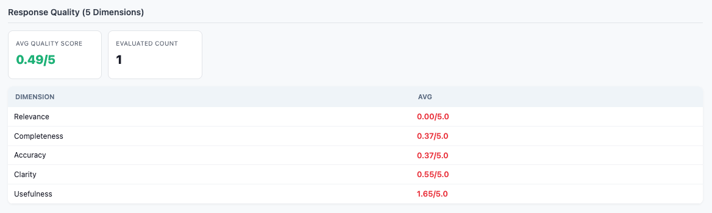
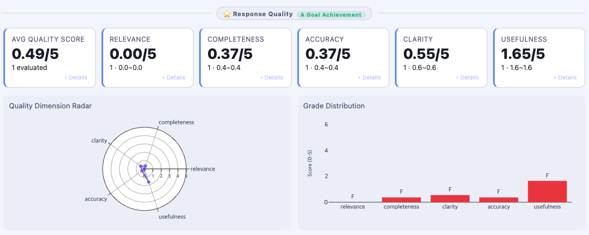

# Chapter 4. Gate A — 목표달성 지표

@@HTML_START@@
<div class="hc-card hc-a">
  <div class="hc-header">
    <span class="hc-gate-badge he-gate ga">Gate A</span>
    <span class="hc-title">🔗 Harness 연결 — Goal Achievement (목표달성)</span>
  </div>
  <div class="hc-body">
    <div class="hc-row">
      <span class="hc-label hc-tracker-label">Tracker</span>
      <div class="hc-chips">
        <span class="hc-chip hc-t-chip">TaskCompletionTracker</span>
        <span class="hc-chip hc-t-chip">AccuracyEvaluator</span>
        <span class="hc-chip hc-t-chip">ResponseQualityEvaluator</span>
      </div>
    </div>
    <div class="hc-row">
      <span class="hc-label hc-config-label">Config</span>
      <div class="hc-chips">
        <span class="hc-chip hc-c-chip">InstructionConfig</span>
        <span class="hc-chip hc-c-chip">GoalAlignmentConfig</span>
        <span class="hc-chip hc-c-chip">PlanConfig</span>
        <span class="hc-chip hc-c-chip">ContextRetentionConfig</span>
        <span class="hc-chip hc-c-chip">SubtaskConfig</span>
        <span class="hc-chip hc-c-chip">KnowledgeRetentionConfig</span>
      </div>
    </div>
  </div>
  <div class="hc-footer">
    <code>HarnessEvaluationGate(report).evaluate()</code>
  </div>
</div>
@@HTML_END@@

> 📖 **관련 레퍼런스**
> - **[Appendix A — 58개 지표 완전 레퍼런스](../Appendix/A_58개지표_레퍼런스.md)**: Gate A 지표 입력·출력·기본값
> - **[Appendix H — 수학적 상세](../Appendix/H_알고리즘_수학적_레퍼런스.md)**: 4중 가중 정확도 공식, TCR 의사코드
> - **[Appendix A §Part 2 — Config 레퍼런스](../Appendix/A_58개지표_레퍼런스.md)**: Gate A Config 파라미터 전체 목록
> - **[Evaluator_Examples/ch04_group_a.py](../../Evaluator_Examples/ch04_group_a.py)**: 이 챕터 실전 예제 (Gate A 6개 Config + FAIL 역케이스 · 배포 차단 케이스 포함)

> **독자별 읽기 가이드**  
> - **QA 관리자**: §4.1(개요) → §4.4(Config 설정) → §4.5(임계값·Gate 판정) 순서로 읽으면 "어떤 기준을 세울지"를 빠르게 파악할 수 있습니다.  
> - **개발자**: §4.2(Tracker 상세) → §4.3(코드 예제) → §4.4(Config 선언) 순서로 읽으면 구현에 바로 적용할 수 있습니다.

---

@@HTML_START@@
<div class="gw-box">
  <div class="gw-header">⚠️ Gate A가 없으면 생기는 일</div>
  <div class="gw-body">
    <p>"응답이 나왔다"는 것을 알지만, "목표를 달성했다"는 것은 알 수 없다. 에이전트가 매번 응답을 생성하더라도 TCR이 70% 이하면 3건 중 1건은 사용자가 원하는 결과를 얻지 못한다.</p>
    <div class="gw-case">
      <strong>사례 예시:</strong> 고객 응대 봇이 "응답 생성률 100%"를 보고하면서 고객 만족도가 60%에 머무른 회사. 응답은 나왔지만 질문에 맞는 답변이 아니었다. AccuracyEvaluator 미도입이 원인.
    </div>
  </div>
</div>
@@HTML_END@@

---

## 4.1 Gate A 개요

Gate A는 에이전트가 사용자의 **목표를 달성했는가**를 측정한다. 이것이 Harness Engineering의 출발점이다. 에이전트가 아무리 빠르고 안전해도 목표를 달성하지 못하면 배포할 수 없다.

### Gate A가 첫 번째인 이유 — 에이전트의 존재 이유를 판정한다

Harness Engineering에서 Gate A는 단순히 "정확도가 높은가"를 측정하는 것이 아니다. **"이 에이전트가 배포될 자격이 있는가"의 출발 조건**을 선언한다.

- Gate D(성능)가 아무리 좋아도, Gate E(보안)가 완벽해도, Gate A를 통과하지 못하면 에이전트는 배포 불가다. 빠르고 안전하게 틀린 답을 내는 에이전트는 오히려 더 위험하다.
- Gate A는 에이전트의 **"지시 이행 계약"을 코드로 선언**한다. `InstructionConfig(expected_format="json", fail_on_violation=True)`라는 한 줄이 "JSON 형식을 지키지 않으면 성공으로 인정하지 않는다"는 배포 기준이 된다. 이것이 Config-as-Code 관점이다.
- 6개 Config는 각자 다른 목표달성 실패 유형을 커버한다: 형식 미준수(Instruction), 목표-행동 불일치(GoalAlignment), 계획 포기(Plan), 서브태스크 미완(Subtask), 컨텍스트 망각(ContextRetention), 사실 망각(KnowledgeRetention).

### Gate A가 다루는 3가지 질문

1. **완수**: 태스크가 실제로 완료되었는가? (TCR)
2. **정확**: 완료된 내용이 ground_truth와 일치하는가? (Accuracy)
3. **형식**: 응답이 요구된 형식·언어·길이를 충족하는가? (InstructionConfig)

### Tracker vs Config — Gate A 대비표

| 관점 | Tracker (측정) | Config (기준 선언) |
|------|--------------|------------------|
| 역할 | "현재 목표달성이 어느 수준인가?" | "이 수준이면 배포 가능한가?" |
| 코드 위치 | `PerformanceMonitor` 내부 자동 동작 | `@agent_eval` 데코레이터 파라미터 |
| 타이밍 | 런타임 매 호출 | 배포 전 선언 |
| 결과 | `report.to_dict()["tcr"]` 등 | `fail_on_violation=True` 시 자동 fail |
| 예시 | `tcr=0.87` → "현재 87% 완료" | `InstructionConfig(max_words=200)` → "200단어 초과 불가" |

---

## 4.2 Tracker 3종 심화

Gate A의 Layer 1 Tracker는 세 가지다. `TaskCompletionTracker`·`AccuracyEvaluator`·`ResponseQualityEvaluator` 모두 Gate A 점수에 직접 반영되는 **상시 활성** Tracker다. 단, `ResponseQualityEvaluator`는 relevance·completeness 두 차원이 측정됐을 때만 `_a_vals`에 추가된다(§4.2.3 참고). Layer 1의 네 번째 Tracker인 `HallucinationDetector`는 **Gate C(신뢰성)** 소속 opt-in Tracker다(상세는 Chapter 6에서 다룬다).

### 4.2.1 TaskCompletionTracker — TCR

**Task Completion Rate(TCR)**는 에이전트가 태스크를 얼마나 성공적으로 완수하는지 보여주는 핵심 KPI다. 단순한 성공/실패 이분법 대신 3단계 완료 수준으로 측정한다.

| 완료 수준 | completion_score | 의미 |
|---------|-----------------|------|
| 완전 성공 | 1.0 | 정확한 답변, 정상 완료 |
| 부분 성공 | 0.7 ≤ score < 1.0 | 일부 불완전한 답변 |
| 실패 | score < 0.7 | 오류, 빈 응답, 예외 발생 |

**TCR 계산 공식:**
```
TCR(%) = (Σ completion_score / N) × 100
```

예: 3건의 completion_score가 1.0, 0.8, 0.0이면 TCR = (1.8 / 3) × 100 = **60.0%**

**task_type별 구조적 완료 판정 (v0.8.0+)**

ground_truth 없는 환경에서도 task_type으로 완료 여부를 자동 추론한다.

| task_type | 판정 기준 | completion_score |
|-----------|----------|-----------------|
| `code_generation` / `coding` | Python AST 파싱 성공 여부 | 1.0 or 길이 기반 |
| `tool_use` | `tool_calls` 비어 있지 않음 | 1.0 or 0.6 |
| 기타 | 응답 길이 ≥ 10자 | 1.0 (기본값) |

```python
# 기반 코드 — PerformanceMonitor + create_taskresult TCR 패턴 (ch04_group_a.py 기반)
from agent_evaluator import PerformanceMonitor, create_taskresult

monitor = PerformanceMonitor(output_dir="results/", use_korean_tokenizer=True)

# tool_use: 도구를 사용한 경우만 완전 완료
r1 = create_taskresult(
    task_id="t1",
    question="날씨 검색",
    response="서울 맑음",
    execution_time=1.0,
    task_type="tool_use",
    tool_calls=[{"name": "search", "args": {"query": "서울 날씨"}}],
)
# → completion_score = 1.0 (도구 사용 확인)

r2 = create_taskresult(
    task_id="t2",
    question="날씨 검색",
    response="서울은 보통 맑습니다",
    execution_time=0.5,
    task_type="tool_use",
    tool_calls=[],  # 도구 미사용
)
# → completion_score = 0.6 (실패 — 부분 임계값 0.7 미만)

monitor.record_task(r1)
monitor.record_task(r2)

# 개념 코드 — PerformanceMonitor TCR 결과 접근 패턴
report = monitor.generate_report()
d = report.to_dict()
tcr_data = d.get("accuracy_metrics", {}).get("tcr", {})
total = tcr_data.get("total_tasks", 1) or 1
tcr   = tcr_data.get("tcr", 0.0)
full  = tcr_data.get("full_success", 0)
fail  = tcr_data.get("failures", 0)
print(f"TCR: {tcr:.1f}%")                                  # → TCR: 80.0%
print(f"완전 성공: {full}/{total} ({full/total*100:.1f}%)")  # → 1/2 (50.0%)
print(f"실패: {fail}/{total} ({fail/total*100:.1f}%)")       # → 1/2 (50.0%)
```

> **채점 경로 — TCR 80.0%가 되는 이유**
>
> `TaskCompletionTracker`는 `task_type`과 `tool_calls` 유무로 `completion_score`를 결정하고, 전체 평균 × 100이 TCR이 된다.
>
> | 태스크 | `tool_calls` | `completion_score` | 분류 |
> |--------|------------|-------------------|------|
> | r1 | `[{"name": "search", ...}]` (있음) | **1.0** | `full_success` |
> | r2 | `[]` (없음) | **0.6** | `failures` (0.6 < 0.7 임계값) |
>
> `TCR = (1.0 + 0.6) / 2 × 100 = 80.0%`
>
> `partial_success` 구간은 `0.7 ≤ score < 1.0`이다. r2는 0.6이므로 `partial`이 아닌 `failures`로 분류된다.

- **`task_type="tool_use"`**: 도구 호출이 있으면 `completion_score=1.0`, 없으면 `0.6`으로 자동 계산한다
- **완료 분류 기준**: `full_success` (score ≥ 1.0) · `partial_success` (0.7 ≤ score < 1.0) · `failures` (score < 0.7) — `tool_use`에서 도구 미사용 시 score=0.6이므로 `failures`로 분류된다
- **`tool_calls` 필드**: 실제 도구 호출 목록을 전달해야 `TaskCompletionTracker`가 도구 사용 여부를 정확히 판단한다
- **TCR 집계 경로**: `report.to_dict()["accuracy_metrics"]["tcr"]` 하위에 `tcr`·`full_success`·`partial_success`·`failures` 네 값이 들어 있다 — 위 예제에서 TCR=80.0%인 이유: r1의 `completion_score=1.0`, r2의 `completion_score=0.6`이므로 `(1.0 + 0.6) / 2 × 100 = 80.0%`
- **주의점**: `total_tasks`가 0인 경우 ZeroDivisionError를 방지하기 위해 `or 1` 가드가 필요하다

**TCR 임계값 가이드:**

| TCR | 상태 | 권장 행동 |
|-----|------|---------|
| ≥ 90% | 🟢 프로덕션 준비 | 배포 가능 |
| 80~90% | 🟡 개선 필요 | 실패 케이스 분석 |
| 70~80% | 🟠 위험 | 주요 버그 수정 필요 |
| < 70% | 🔴 배포 불가 | 근본적 재설계 검토 |

> **TCR 임계값 조정 방법**
>
> 위 표의 기준값(80%/90%)은 기본값이며, 서비스 특성에 맞게 조정할 수 있다. `_TCR_PARTIAL_THRESHOLD = 0.7`(완료/부분/실패 내부 분류 경계)은 SDK 내부 고정값으로 변경 불가다.
>
> | 방법 | 기본값 | 예시 |
> |------|--------|------|
> | **Dashboard UI** (`agent-eval dashboard`) | `tcr = 90.0%` | Settings 패널 슬라이더 → 저장 시 `results/.thresholds.json` 반영 |
> | **코드** (`monitor.thresholds`) | `tcr = 80.0%` | `monitor.thresholds = {"tcr": 85.0, "accuracy": 70.0}` |
> | **QuickEval** (`eval.gate()`) | 없음(필수 지정) | `eval.gate(tcr=85, accuracy=70)` |
> | **설정 파일** | — | `eval.gate(config_file=".thresholds.json")` — JSON에서 로드, 인자로 override 가능 |
> | **CLI** | — | `agent-eval gate result.json --tcr 85 --accuracy 70` |
> | **자동 생성** | 현재 성능의 95% | `eval.generate_gate_config("gate_config.json")` |
>
> Dashboard와 `monitor.thresholds`의 기본값이 다른 이유: Dashboard는 Alert 표시 기준(엄격), `monitor.thresholds`는 경고 트리거 기준(완화)으로 용도가 다르다.

> 👨‍💻 **개발자 TIP**: TCR이 낮을 때 가장 먼저 확인할 것은 `task_type`과 `tool_calls` 설정이다. `task_type="tool_use"`에서 에이전트 함수가 `tool_calls`를 반환하지 않으면 `completion_score=0.6`으로 고정되어 TCR이 60% 이하로 떨어진다. `@agent_eval` 데코레이터의 `task_type`이 실제 에이전트 동작과 일치하는지 먼저 확인한다.
>
> ```python
> # completion_score를 높이는 올바른 tool_use 패턴
> from agent_evaluator import PerformanceMonitor, agent_eval, EvalMetadata
> monitor = PerformanceMonitor(output_dir="results/")
>
> @agent_eval(monitor, task_type="tool_use")
> def my_agent(question: str, ground_truth: str = "") -> tuple:
>     # 도구 호출 결과를 EvalMetadata로 전달해야 tool_calls가 기록됨
>     return "답변 텍스트", EvalMetadata(tool_calls=[{"name": "search", "args": {}}])
> ```

> 📋 **QA 관리자 TIP**: TCR은 에이전트 배포 판단의 1순위 지표다. 아래 기준을 팀 배포 정책으로 명문화하길 권장한다.
> - **배포 가능**: TCR ≥ 90% (프로덕션 준비)
> - **조건부 배포**: TCR 80~90% — 실패 케이스 원인 분석 후 판단
> - **배포 차단**: TCR < 80% — 반드시 원인 수정 후 재평가
> - **대시보드 확인**: `agent-eval dashboard results/` → **Gate A** 탭 → TCR 추이 그래프

### 4.2.2 AccuracyEvaluator — 4중 가중 정확도

Accuracy는 응답이 ground_truth와 얼마나 가까운지 측정한다. BLEU나 ROUGE 대신 **4중 가중 알고리즘**을 사용한다. 각 알고리즘의 약점을 서로 보완하는 구조다.

| 지표 | 가중치 | 측정 방식 | 강점 |
|------|--------|---------|------|
| Token F1 | 40% | 토큰 단위 정밀도-재현율 조화평균 | 긴 응답의 과평가 방지 |
| Jaccard | 30% | 집합 교집합/합집합 비율 | 순서 무관 일치도 |
| LCS | 20% | Longest Common Subsequence | 연속 구절 매칭 |
| Char Similarity | 10% | Levenshtein 거리 기반 | 문자 순서·오타 반영 |

```python
# 개념 코드 — AccuracyEvaluator 4중 가중 정확도 패턴
from agent_evaluator import create_taskresult

result = create_taskresult(
    task_id="t1",
    question="한국의 수도는?",
    response="한국의 수도는 서울특별시입니다.",
    ground_truth="서울",
    execution_time=0.5,
    task_type="qa",
    use_korean_tokenizer=True,
)
print(f"정확도: {result.accuracy_score:.3f}")  # → 0.038 (서울특별시는 하나의 형태소 — 서울과 불일치)

result2 = create_taskresult(
    task_id="t2",
    question="한국의 수도는?",
    response="서울입니다.",
    ground_truth="서울",
    execution_time=0.5,
    task_type="qa",
    use_korean_tokenizer=True,
)
print(f"정확도: {result2.accuracy_score:.3f}")  # → 0.820 (kiwipiepy가 서울/입니다 정확히 분리)
```

> **채점 경로 — 같은 질문에 0.038 vs 0.820이 나오는 이유**
>
> 4중 가중 알고리즘은 토큰화 결과에 민감하다. kiwipiepy 형태소 분석 결과가 두 응답의 점수를 결정한다.
>
> | 응답 | 형태소 분리 | ground_truth 토큰 | Token F1 | 최종 accuracy |
> |------|-----------|-----------------|----------|--------------|
> | "서울특별시입니다" | `["서울특별시", "입니다"]` | `["서울"]` | 0.0 (불일치) | **0.038** |
> | "서울입니다." | `["서울", "입니다", "."]` | `["서울"]` | 1.0 (완전 일치) | **0.820** |
>
> "서울특별시"가 단일 형태소로 처리되어 "서울"과 Token F1=0이 되고, Jaccard·LCS도 낮아져 전체 0.038이 된다. 응답에 ground_truth 단어를 정확히 포함시키면 Token F1이 높아져 점수가 크게 올라간다.

- **`create_taskresult(use_korean_tokenizer=True)`**: kiwipiepy 형태소 분석기로 토큰화해 Token F1·Jaccard·LCS·Levenshtein 4중 가중을 계산한다
- **형태소 경계**: "서울입니다"는 `서울 + 입니다`로 분리되어 `ground_truth="서울"`과 Token F1=1.0 → 0.820이 나온다
- **복합어 주의**: "서울특별시"는 kiwipiepy가 하나의 형태소로 처리하므로 "서울"과 불일치 → 0.038로 낮게 계산된다

> **한국어 평가 설정 — 패턴별 필요 위치**
>
> `use_korean_tokenizer=True`를 어디에 설정해야 하는지는 사용 패턴에 따라 다르다.
>
> | 패턴 | `PerformanceMonitor` | `create_taskresult` |
> |------|---------------------|---------------------|
> | `@agent_eval` 데코레이터 | ✅ 필요 | 불필요 (자동 전달) |
> | `create_taskresult` + `record_task` 직접 호출 | ✅ 필요 | ✅ 필요 |
>
> **데코레이터 경로**: `@agent_eval`은 내부적으로 `PerformanceMonitor._use_korean_tokenizer` 값을 읽어 `accuracy_score` 계산에 자동 반영한다. 별도 설정 불필요.
>
> **직접 호출 경로**: `create_taskresult()`가 `accuracy_score`를 먼저 계산해 `TaskResult`에 저장한다. 이후 `monitor.record_task(result)` 시점에 `accuracy_score is not None`이므로 모니터의 `AccuracyEvaluator`는 재계산을 건너뛴다. 따라서 `create_taskresult`에도 반드시 `use_korean_tokenizer=True`를 지정해야 한다.

```python
# 패턴 1 — 데코레이터: PerformanceMonitor 설정만으로 충분
monitor = PerformanceMonitor(output_dir="results/", use_korean_tokenizer=True)

@agent_eval(monitor, task_type="qa")
def my_agent(question: str, ground_truth: str = "") -> str:
    return "서울입니다."  # accuracy_score 자동 계산 (kiwipiepy 적용)

# 패턴 2 — 직접 호출: create_taskresult에도 지정 필요
monitor = PerformanceMonitor(output_dir="results/", use_korean_tokenizer=True)

result = create_taskresult(
    task_id="t1", question="한국의 수도는?",
    response="서울입니다.", ground_truth="서울",
    execution_time=0.5, task_type="qa",
    use_korean_tokenizer=True,   # ← 반드시 지정
)
monitor.record_task(result)
```

**코드 정확도 — AST 비교**

`task_type="code_generation"`이면 텍스트 비교 대신 Python AST 비교를 사용한다.

```python
# 개념 코드 — create_taskresult code_generation AST 비교 패턴
result = create_taskresult(
    task_id="code1",
    question="두 수를 더하는 함수",
    response="def add(a,b):\n    return a+b",
    ground_truth="def add(a, b):\n    return a + b",
    execution_time=1.0,
    task_type="code_generation",
    use_korean_tokenizer=True,
)
# AST 구조 동일 → accuracy_score = 1.0 (공백 차이 무시)
```

- **`task_type="code_generation"`**: 텍스트 비교 대신 Python AST 파싱 후 구조 비교를 수행한다
- **공백 무시**: `add(a,b)`와 `add(a, b)`는 AST 구조가 동일하므로 `accuracy_score=1.0`이 된다
- **AST 파싱 실패 시 fallback**: 유효한 Python 코드가 아니면 응답 길이 기반으로 `completion_score`를 계산한다

**Accuracy 임계값 가이드:**

| 정확도 | 상태 | 의미 |
|--------|------|------|
| ≥ 0.85 | 🟢 우수 | 배포 가능 |
| 0.70~0.85 | 🟡 보통 | 프롬프트 개선 권장 |
| 0.50~0.70 | 🟠 미흡 | ground_truth 품질 확인 필요 |
| < 0.50 | 🔴 낮음 | 에이전트 전면 재검토 |

> **Accuracy 임계값 조정 방법**
>
> Accuracy 임계값은 TCR과 동일한 4가지 방법으로 조정한다. Dashboard는 `acc` 키, 코드/CLI는 `accuracy` 키를 사용한다.
>
> | 방법 | 기본값 | 예시 |
> |------|--------|------|
> | **Dashboard UI** (`agent-eval dashboard`) | `acc = 70.0%` | Settings 패널 슬라이더 → `results/.thresholds.json` 저장 |
> | **코드** (`monitor.thresholds`) | `accuracy = 70.0%` | `monitor.thresholds = {"tcr": 85.0, "accuracy": 75.0}` |
> | **QuickEval** (`eval.gate()`) | 없음(필수 지정) | `eval.gate(tcr=85, accuracy=70)` |
> | **설정 파일** | — | `{"tcr": 85, "accuracy": 70}` → `eval.gate(config_file=".thresholds.json")` |
> | **CLI** | — | `agent-eval gate result.json --tcr 85 --accuracy 70` |
>
> `task_type`에 따라 권장 임계값이 다르다 — `code_generation`·`coding`은 AST 비교로 1.0이 달성 가능해 0.95 이상을 목표로 잡고, `qa`·`reasoning`은 0.70~0.80이 현실적인 운영 기준이다.

> 👨‍💻 **개발자 TIP**: 한국어 에이전트에서 accuracy가 예상보다 낮으면 먼저 `use_korean_tokenizer=True` 설정을 확인한다. `PerformanceMonitor(use_korean_tokenizer=True)` 없이 한국어 응답을 평가하면 기본 공백 분리로 토큰화되어 Token F1이 낮게 나온다. `ground_truth`와 응답에 동일한 형태소가 포함되어 있는지도 확인한다 — "서울특별시"와 "서울"은 다른 형태소이므로 0.038처럼 매우 낮게 나올 수 있다.

> 📋 **QA 관리자 TIP**: accuracy는 task_type에 따라 해석 기준이 다르다. 일률적으로 "70% 이상"을 배포 기준으로 적용하면 코드 생성처럼 높은 정확도가 필요한 task에서 품질 문제를 놓칠 수 있다.
> - **권장 기준**: `qa`·`information_retrieval` → 0.70 이상 / `code_generation` → 0.90 이상 / `creative` → 0.50 이상
> - **경보 기준**: 주간 평균이 기준값에서 5%p 이상 하락하면 프롬프트 변경 또는 데이터 드리프트를 의심한다
> - **ground_truth 품질**: accuracy 0.50 미만이 지속되면 ground_truth 데이터 자체의 품질을 재검토한다

### 4.2.3 ResponseQualityEvaluator — 5차원 가중 품질 평가

> **Gate A와의 관계**: `ResponseQualityEvaluator`는 `TaskCompletionTracker`·`AccuracyEvaluator`와 함께 Gate A에 직접 기여하는 Layer 1 상시 활성 Tracker다. `@agent_eval` 데코레이터를 붙이면 자동 활성화되며, relevance·completeness 두 차원의 평균을 `/ 5`(0-1 정규화)한 값이 `_a_vals`에 추가 항목으로 포함된다. 단, 두 차원이 모두 측정됐을 때만 반영된다. 5차원 점수 전체는 `report.to_dict()["quality_metrics"]`에도 별도 집계되며, HTML 리포트와 대시보드에서는 Gate A 섹션에 "Response Quality (5 Dimensions)"로 표시된다. ground_truth 없이 응답 품질을 정성적으로 판단하고 싶을 때 가장 먼저 도입한다.

ground_truth 없이도 응답 자체의 품질을 5개 차원으로 평가한다. 각 차원을 0~5 척도로 측정하고 **가중 평균**으로 `quality_score`를 계산한다.

| 차원 | 가중치 | 측정 내용 |
|------|-------|---------|
| relevance | ×0.25 | 응답이 질문과 관련이 있는가? |
| completeness | ×0.25 | 응답이 질문에 완전히 답했는가? |
| accuracy | ×0.20 | 응답의 사실적 정확성이 높은가? |
| clarity | ×0.15 | 응답이 명확하고 이해하기 쉬운가? |
| usefulness | ×0.15 | 응답이 실제로 유용한가? |

```
quality_score = relevance×0.25 + completeness×0.25 + accuracy×0.20 + clarity×0.15 + usefulness×0.15
```

```python
# 개념 코드 — ResponseQualityEvaluator 직접 호출 패턴
from agent_evaluator import ResponseQualityEvaluator

rqe = ResponseQualityEvaluator()

result = rqe.evaluate_response(
    task_id="t1",
    response="파이썬은 범용 프로그래밍 언어로 데이터 과학, 웹 개발, 자동화에 널리 쓰입니다.",
    request="파이썬이란?",
    expected_elements=["프로그래밍", "데이터"],   # 포함 기대 키워드 (선택)
)
print(f"총점: {result['total_score']:.2f}/5  등급: {result['grade']}")
# → 총점: 2.58/5  등급: F

dims = result.get("dimension_scores", {})
print(f"관련성={dims.get('relevance', 0):.2f}  완전성={dims.get('completeness', 0):.2f}")
# → 관련성=0.00  완전성=5.00
print(f"정확도={dims.get('accuracy', 0):.2f}  명확성={dims.get('clarity', 0):.2f}")
# → 정확도=5.00  명확성=0.55
print(f"유용성={dims.get('usefulness', 0):.2f}")
# → 유용성=1.65
```

> **채점 경로 — 총점 2.58/5·등급 F인 이유**
>
> `ResponseQualityEvaluator`는 키워드·길이·구조 기반 휴리스틱으로 동작한다. `relevance`는 질문 단어와 응답 단어의 중복도로 계산하는데, "파이썬이란?"과 "파이썬은 범용 프로그래밍…"에서 공통 토큰이 적어 0.00이 된다.
>
> | 차원 | 점수 | 원인 |
> |------|------|------|
> | `relevance` | 0.00 | 질문("파이썬이란?")과 응답 간 공통 키워드 부족 |
> | `completeness` | 5.00 | `expected_elements=["프로그래밍","데이터"]` 모두 포함 → 최고점 |
> | `accuracy` | 5.00 | ground_truth 없을 때 내부 기본값으로 최고점 부여 |
> | `clarity` | 0.55 | 문장 구조·길이 휴리스틱 |
> | `usefulness` | 1.65 | 구체성·구조 휴리스틱 |
>
> `total_score = 0.00×0.25 + 5.00×0.25 + 5.00×0.20 + 0.55×0.15 + 1.65×0.15 = 2.58` → 3.0 미만 → 등급 F.  
> 정밀한 5차원 점수를 원하면 `PerformanceMonitor(enable_llm_judge=True)`로 LLMJudge를 활성화한다.

**`PerformanceMonitor`와 자동 연동:**

```python
# 기반 코드 — PerformanceMonitor + @agent_eval 자동 연동 패턴 (ch04_group_a.py 기반)
from agent_evaluator import PerformanceMonitor, agent_eval

monitor = PerformanceMonitor(output_dir="results/", use_korean_tokenizer=True)

@agent_eval(monitor, task_type="qa")
def agent(question: str, ground_truth: str = "") -> str:
    return "딥러닝은 인공신경망을 여러 층으로 쌓아 복잡한 패턴을 학습하는 머신러닝의 한 분야입니다."

agent("딥러닝이란 무엇인가?")

# JSON + HTML 동시 저장
# results/eval.json  ← agent-eval dashboard 로딩용
# results/eval.html  ← 브라우저에서 바로 확인 (Gate G 섹션 → "Response Quality (5 Dimensions)")
monitor.save_to_file("eval")

# Python 코드에서 직접 읽기
report = monitor.generate_report()
d = report.to_dict()
qm = d.get("quality_metrics", {})
print(round(float(qm.get("avg_total_score", 0.0)), 2))                           # → 0.49
dims = {k: round(float(v), 2) for k, v in qm.get("dimension_averages", {}).items()}
print(dims)  # → {"relevance": 0.0, "completeness": 0.37, "accuracy": 0.37, "clarity": 0.55, "usefulness": 1.65}
```

> **채점 경로 — `avg_total_score=0.49`인 이유**
>
> `@agent_eval`로 자동 연동된 `ResponseQualityEvaluator`는 응답 텍스트와 질문 간 키워드 중복도를 기준으로 채점한다. 이 예제에서 에이전트는 `ground_truth=""`(미설정)로 호출되어 accuracy 계산이 기본 경로를 따른다.
>
> | 차원 | dimension_averages | 가중치 | 기여 |
> |------|------------------|-------|------|
> | relevance | 0.0 | ×0.25 | 0.000 |
> | completeness | 0.37 | ×0.25 | 0.093 |
> | accuracy | 0.37 | ×0.20 | 0.074 |
> | clarity | 0.55 | ×0.15 | 0.083 |
> | usefulness | 1.65 | ×0.15 | 0.248 |
>
> `avg_total_score ≈ 0.49` (0~5 스케일 기준 실제 값 × 1/5 환산이 아니라 `quality_metrics`에서는 0~5 원점수 그대로 저장됨). `relevance=0.0`은 질문("딥러닝이란 무엇인가?")과 응답 간 공통 형태소가 없어 0이 된 것이다.

- `evaluate_response()` 직접 호출: `task_id`(집계용 식별자), `response`(평가 대상), `request`(원래 질문), `expected_elements`(포함 기대 키워드 목록) 4개 인자를 받는다.
- `grade` 필드: `total_score` 기준 `"A"` (≥4.5) / `"B"` (≥4.0) / `"C"` (≥3.5) / `"D"` (≥3.0) / `"F"` (<3.0) 학점 체계.
- **ground_truth 불필요**: 응답 자체만으로 5차원을 평가하므로 ground_truth 없이도 품질을 측정할 수 있다.
- **`@agent_eval` 자동 연동**: 데코레이터만 붙이면 `AccuracyEvaluator`·`TaskCompletionTracker`와 함께 `ResponseQualityEvaluator`가 자동 활성화된다.
- **휴리스틱 vs LLMJudge**: `ResponseQualityEvaluator`는 기본적으로 키워드·길이·구조 기반 휴리스틱으로 동작해 점수가 낮게 나올 수 있다. `PerformanceMonitor(enable_llm_judge=True)`를 설정하면 LLMJudge가 개입해 더 정밀한 5차원 점수를 산정한다.
- **HTML 리포트 / 대시보드 확인**: `monitor.save_to_file("eval")` 호출 후 `results/eval.html`의 **Gate A** 섹션 또는 `agent-eval dashboard`(`http://localhost:8765`) Gate A 슬라이드에서 "Response Quality (5 Dimensions)"를 확인할 수 있다.

[HTML 리포트]


[Dashboard]


> 👨‍💻 **개발자 TIP**: `ResponseQualityEvaluator`는 키워드·길이·구조 기반 휴리스틱으로 동작하므로 `enable_llm_judge=True` 없이는 점수가 예상보다 낮게 나올 수 있습니다. `ground_truth` 없이도 응답 자체만으로 5차원을 평가할 수 있다는 점이 `AccuracyEvaluator`와의 핵심 차이입니다. `@agent_eval` 데코레이터만 추가하면 자동으로 활성화됩니다.

> 📋 **QA 관리자 TIP**: `avg_quality_score`가 낮으면 먼저 `expected_elements` 파라미터를 확인하세요. 선언된 키워드와 응답 내용의 매칭률이 quality 점수에 직접 영향을 줍니다. `PerformanceMonitor(enable_llm_judge=True)` 설정 시 LLMJudge가 5차원을 더 정밀하게 채점하므로 낮은 점수의 원인이 되는 차원을 특정할 수 있습니다.

---

## 4.3 Config 6종 레퍼런스

### 4.3.1 InstructionConfig — 응답 형식·언어·길이 준수

응답이 선언된 형식·언어·길이 기준을 지키는지 검증한다. **가장 먼저 도입해야 할 Config**다.

```python
# 개념 코드 — InstructionConfig 전체 파라미터 참고
from agent_evaluator import InstructionConfig

InstructionConfig(
    expected_format="json",           # "json"|"markdown"|"yaml"|"plain"|None
    required_sections=["요약", "근거"], # 응답에 포함되어야 할 섹션 이름
    max_chars=2000,                   # 최대 문자 수
    min_chars=50,                     # 최소 문자 수
    max_words=300,                    # 최대 단어 수
    min_words=20,                     # 최소 단어 수
    forbidden_phrases=[               # 응답에 포함되면 안 되는 구절
        "모르겠습니다",
        "확인이 필요합니다",
        "죄송합니다",
    ],
    required_keywords=["결론"],       # 반드시 포함해야 할 키워드
    expected_language="ko",           # "ko"|"en"|None
    fail_on_violation=True,           # 위반 시 success=False
    violation_weight=0.1,             # fail_on_violation=False 시 감점 가중치
)
```

**파라미터 레퍼런스:**

| 파라미터 | 타입 | 기본값 | 설명 |
|----------|------|--------|------|
| `expected_format` | `str\|None` | `None` (검사 안 함) | `"json"` `"markdown"` `"yaml"` `"plain"` — 응답 형식을 파싱해 검증 |
| `required_sections` | `List[str]` | `[]` (검사 안 함) | 응답에 반드시 포함되어야 할 섹션·키 이름 목록 |
| `max_chars` | `int\|None` | `None` (제한 없음) | 응답 최대 문자 수 |
| `min_chars` | `int\|None` | `None` (제한 없음) | 응답 최소 문자 수 |
| `max_words` | `int\|None` | `None` (제한 없음) | 응답 최대 어절 수 (공백 기준) |
| `min_words` | `int\|None` | `None` (제한 없음) | 응답 최소 어절 수 |
| `forbidden_phrases` | `List[str]` | `[]` (차단 없음) | 응답에 포함되면 안 되는 구절 목록. **미선언 시 아무것도 차단되지 않음** |
| `required_keywords` | `List[str]` | `[]` (검사 안 함) | 응답에 반드시 포함해야 할 키워드 목록 |
| `expected_language` | `str\|None` | `None` (검사 안 함) | `"ko"` `"en"` — Unicode 범위 분석으로 언어 감지 |
| `fail_on_violation` | `bool` | `False` | `True`이면 위반 시 `TaskResult.success=False` → TCR 직접 감소 |
| `violation_weight` | `float` | `0.1` | `fail_on_violation=False`일 때 위반 횟수당 `instruction_score` 감점 가중치 |

> **`fail_on_violation` 선택 기준**: 형식 위반이 사용 불가 수준(예: JSON 파싱 실패)이면 `True`, 품질 저하 수준(예: 권장 길이 초과)이면 `False`로 설정한다. `False`로도 위반은 Gate A 점수에 반영

**사용 예시:**

```python
# 기반 코드 — InstructionConfig 고객 응대 봇 패턴
# (실행 가능 전체 예제: Evaluator_Examples/ch04_group_a.py 참고)
from agent_evaluator import PerformanceMonitor, agent_eval, InstructionConfig
import json

monitor = PerformanceMonitor(output_dir="results/")

# 고객 응대 봇 — JSON 구조화 응답 강제
@agent_eval(
    monitor,
    task_type="qa",
    instructions=InstructionConfig(
        expected_format="json",
        required_sections=["답변", "신뢰도"],
        expected_language="ko",
        forbidden_phrases=["모르겠습니다", "확인이 필요합니다", "죄송합니다"],
        fail_on_violation=True,
    ),
)
def customer_bot(question: str, ground_truth: str = "") -> str:
    # TODO(현업 적용): 아래 Mock 구현을 실제 LLM 호출로 교체하세요.
    #   예) return client.chat.completions.create(model="gpt-5-nano",
    #        messages=[{"role":"user","content":question}]).choices[0].message.content
    # 반드시 {"답변": "...", "신뢰도": 0.9} 형태로 반환해야 함
    return json.dumps({"답변": f"{question}에 대한 응답입니다.", "신뢰도": 0.9})
```

- **`expected_format="json"`**: 응답이 유효한 JSON인지 파싱해 검증하며, 위반 시 `fail_on_violation=True`에 의해 즉시 fail 처리한다
- **`required_sections`**: JSON 응답에 `"답변"`·`"신뢰도"` 키가 반드시 포함되어야 한다
- **`forbidden_phrases`**: 역량 부족 신호("모르겠습니다")나 불필요한 사과 표현을 탐지해 응답 품질 기준을 코드로 강제한다

> **채점 경로 — InstructionConfig가 1.0을 받는 이유**
>
> 응답이 `expected_format`·`required_sections`·`min_chars`·`required_keywords`·`expected_language`·`forbidden_phrases` 기준을 순서대로 검사해 위반이 0건이면 `avg_instruction_adherence=1.0`이 된다.
>
> | 조건 | `avg_instruction_adherence` |
> |------|-----------------|
> | 위반 0건 | **1.0** |
> | 위반 N건 (`fail_on_violation=False`) | `max(0.0, 1.0 − N × violation_weight(기본 0.1))` |
> | 위반 1건 이상 (`fail_on_violation=True`) | 해당 태스크 `success=False` → TCR 직접 감소 |
>
> 위 고객 응대 봇 예제에서 응답이 `{"답변": "...", "신뢰도": 0.9}` 형태이면 format·sections 체크 통과 → `avg_instruction_adherence=1.0`. "모르겠습니다"를 포함하면 forbidden_phrases 위반 → `fail_on_violation=True`이므로 `success=False`.  
> 결과 접근: `gate_a_details.get('avg_instruction_adherence')` (`gate_a_details = harness_groups.get("A", {}).get("details", {})`)

**임계값 가이드:**

| 항목 | 권장 기준 |
|------|---------|
| `expected_language` | UI 언어와 일치 (`"ko"` 또는 `"en"`). 다국어 서비스는 `None` 유지 |
| `max_words` | 챗봇: 150 / 일반 QA: 300 / 리포트: 500 |
| `min_words` | 단답형: 5 / 설명형: 30 이상 |
| `forbidden_phrases` | 서비스 정책에 따라 직접 선언. **미선언 시 아무것도 차단되지 않음** |
| `fail_on_violation` | 형식 위반(JSON 파싱 실패 등) → `True` / 품질 위반(길이 초과 등) → `False` |
| `violation_weight` | 기본값 `0.1` 유지 권장. 위반 민감도를 높이려면 `0.2~0.3`으로 조정 |

> 👨‍💻 **개발자 TIP**: InstructionConfig 도입 시 `fail_on_violation=False`로 먼저 설정해 위반 발생률을 확인한 뒤, 안정화되면 `True`로 전환하는 2단계 전략을 권장한다. `fail_on_violation=True`를 처음부터 설정하면 TCR이 급락해 문제 원인 파악이 어려워진다.
>
> ```python
> # 1단계: fail_on_violation=False로 모니터링
> instructions=InstructionConfig(expected_format="json", fail_on_violation=False)
> # → avg_instruction_adherence 점수를 확인해 위반률 측정
>
> # 2단계: 위반률 < 5% 확인 후 True로 전환
> instructions=InstructionConfig(expected_format="json", fail_on_violation=True)
> ```

> 📋 **QA 관리자 TIP**: `InstructionConfig`의 `forbidden_phrases`는 반드시 팀이 직접 선언해야 한다. 미선언 시 아무것도 차단되지 않는다. PR 리뷰 시 `fail_on_violation=True`로 변경되는 항목은 배포 기준 변경과 동일하게 취급한다.
> - **권장 기준**: `avg_instruction_adherence` ≥ 0.90이면 형식 준수 양호 / 0.70 미만이면 프롬프트 개선 필요
> - **경보 기준**: `fail_on_violation=True` 설정에서 TCR이 갑자기 하락하면 forbidden_phrases 위반이 원인일 가능성이 높다
> - **리포트 확인**: `results/ch04_group_a.json` → `harness_groups.A.details.avg_instruction_adherence` 필드

### 4.3.2 GoalAlignmentConfig — 목표-행동 정렬

에이전트가 사용한 도구가 질문의 목표와 정렬되어 있는지 측정한다. "검색"이 목표인데 "코드 실행"을 사용했다면 정렬이 낮다.

```python
# 개념 코드 — GoalAlignmentConfig 전체 파라미터 참고
from agent_evaluator import GoalAlignmentConfig

GoalAlignmentConfig(
    use_keyword_overlap=True,          # 질문 키워드 ↔ 도구명 오버랩 측정
    goal_tool_map={                    # 목표 키워드 → 적합한 도구 목록
        "검색": ["web_search", "search"],
        "요약": ["summarize", "compress"],
        "번역": ["translate"],
        "분석": ["analyze", "compute"],
    },
    use_llm_scoring=False,             # LLM-as-Judge 정렬 점수 (opt-in)
    llm_blend_weight=0.5,              # 키워드 점수와 LLM 점수의 혼합 비율 (0.0~1.0, 기본 0.5)
    alignment_threshold=0.6,           # 경고 임계값 (0.0~1.0)
    ignore_no_tool_tasks=True,         # 도구 미사용 태스크는 건너뜀
)
```

**파라미터 레퍼런스:**

| 파라미터 | 타입 | 기본값 | 설명 |
|----------|------|--------|------|
| `use_keyword_overlap` | `bool` | `True` | 질문 키워드 ↔ 도구명 오버랩으로 정렬 점수 계산 |
| `goal_tool_map` | `Dict[str, List[str]]` | `{}` (검사 안 함) | 목표 키워드 → 적합한 도구 목록 매핑. **미선언 시 정렬 검사 불가** |
| `use_llm_scoring` | `bool` | `False` | LLM-as-Judge 의미론적 정렬 채점 (opt-in, `enable_llm_judge=True` 필요 — 별도 LLM 호출 없음) |
| `llm_blend_weight` | `float` | `0.5` | `use_llm_scoring=True`일 때 LLM 점수 혼합 비율 (0.0=규칙만, 1.0=LLM만) |
| `alignment_threshold` | `float` | `0.6` | 정렬 점수 경고 임계값 (0.0~1.0) |
| `ignore_no_tool_tasks` | `bool` | `True` | 도구 미사용 태스크를 정렬 계산에서 제외 |

**임계값 가이드:**

| 항목 | 기본값 | 권장 기준 |
|------|--------|---------|
| `goal_tool_map` | `{}` (비어 있음) | 에이전트가 실제 사용하는 도구명 기준으로 직접 선언. 미선언 시 정렬 점수가 계산되지 않음 |
| `alignment_threshold` | `0.6` | 도구 선택이 엄격히 제어되어야 하는 서비스는 `0.7~0.8`로 상향 |
| `use_llm_scoring` | `False` | 규칙 기반 오버랩만으로 부족할 때(의미론적 목표-도구 관계) opt-in |

> **채점 경로 — avg_goal_alignment 산출 경로**
>
> `tool_calls`에 포함된 도구 이름과 `goal_tool_map` 매핑을 비교해 목표-행동 정렬 점수를 산출한다.
>
> | 조건 | `avg_goal_alignment` |
> |------|---------------------|
> | `tool_calls=[]` (도구 미사용) | `score=0.0` (method="no_tools") |
> | 모든 도구가 `goal_tool_map`에 매핑 | **1.0** (method="goal_tool_map") |
> | 일부 도구만 매핑 | `정렬 도구 수 / 전체 도구 수` |
> | `goal_tool_map={}` (미선언) | `0.0` (검사 불가) |
>
> 결과 접근: `gate_a_details.get('avg_goal_alignment')` — `ignore_no_tool_tasks=True`(기본값)이면 도구 미사용 태스크는 집계에서 제외된다.

> 👨‍💻 **개발자 TIP**: `GoalAlignmentConfig`는 기본값 `ignore_no_tool_tasks=True`로 도구를 호출하지 않는 QA·대화형 에이전트를 자동으로 집계에서 제외합니다. 비도구 에이전트에서 goal_alignment를 측정하려면 `GoalAlignmentConfig(ignore_no_tool_tasks=False)`로 명시해야 `avg_goal_alignment` 값이 산출됩니다.

> 📋 **QA 관리자 TIP**: Gate A 리포트에서 `avg_goal_alignment`가 `None`으로 나오면 두 가지를 확인하세요. ① 해당 태스크에 `tool_calls`가 기록되었는지, ② `GoalAlignmentConfig(ignore_no_tool_tasks=False)` 설정 여부. 도구 미호출 에이전트는 이 항목 자체가 Gate A 점수에 반영되지 않으므로 Gate A 점수가 TCR·AccuracyEvaluator 비중으로만 결정됩니다.

### 4.3.3 PlanConfig — 계획 실행 완성도

에이전트가 계획(plan)을 수립하고 그 계획대로 실행하는지 추적한다. 다단계 추론이나 복잡한 태스크를 처리하는 에이전트에 적합하다.

```python
# 개념 코드 — PlanConfig 전체 파라미터 참고
from agent_evaluator import PlanConfig

PlanConfig(
    plan_field="plan",                 # 응답 JSON에서 계획 추출할 필드명
    steps_field="steps",               # 계획 내 단계 필드명
    check_goal_coverage=True,          # 목표 키워드가 계획 단계에 포함되는지
    check_step_ordering=True,          # 단계 순서 논리성 확인
    check_executability=True,          # 사용 가능한 도구로 실행 가능한지
    available_tools=["search", "code_exec", "summarize"],
    use_llm_scoring=False,             # LLM-as-Judge 계획 품질 채점 (opt-in)
    llm_blend_weight=0.5,              # 규칙 기반 점수와 LLM 점수의 혼합 비율 (0.0~1.0, 기본 0.5)
    min_steps=2,                       # 최소 계획 단계 수
    max_steps=15,                      # 최대 계획 단계 수
)
```

**파라미터 레퍼런스:**

| 파라미터 | 타입 | 기본값 | 설명 |
|----------|------|--------|------|
| `plan_field` | `str` | `"plan"` | 응답 JSON에서 계획을 추출할 필드명 |
| `steps_field` | `str` | `"steps"` | 계획 내 단계 목록 필드명 |
| `check_goal_coverage` | `bool` | `True` | 목표 키워드가 계획 단계에 포함되는지 확인 |
| `check_step_ordering` | `bool` | `True` | 단계 순서의 논리적 일관성 확인 |
| `check_executability` | `bool` | `True` | 각 단계가 `available_tools`로 실행 가능한지 확인 |
| `available_tools` | `List[str]` | `[]` (검사 안 함) | 사용 가능한 도구 목록. **미선언 시 실행 가능성 검사 불가** |
| `use_llm_scoring` | `bool` | `False` | LLM-as-Judge 계획 품질 채점 (opt-in, `enable_llm_judge=True` 필요 — 별도 LLM 호출 없음) |
| `llm_blend_weight` | `float` | `0.5` | `use_llm_scoring=True`일 때 LLM 점수 혼합 비율 (0.0=규칙만, 1.0=LLM만) |
| `min_steps` | `int` | `2` | 최소 계획 단계 수 |
| `max_steps` | `int` | `15` | 최대 계획 단계 수 |

**임계값 가이드:**

| 항목 | 기본값 | 권장 기준 |
|------|--------|---------|
| `available_tools` | `[]` (비어 있음) | 에이전트가 실제 호출하는 도구명 목록을 선언. 미선언 시 `check_executability` 동작 안 함 |
| `min_steps` | `2` | 복잡한 리서치 에이전트: `3~5` / 단순 QA: `1~2` |
| `max_steps` | `15` | 과도한 계획 방지. 일반 에이전트: `10~15` 권장 |

> 👨‍💻 **개발자 TIP**: `PlanConfig`가 동작하려면 에이전트 응답이 반드시 `{"steps": [...]}` 또는 `{"plan": [...]}` 형태의 JSON이어야 한다. `{"plan": {"steps": [...]}}` 처럼 plan 키 값이 dict이면 파싱에 실패해 `coherence_score=0.0`이 된다. 계획 에이전트 개발 시 응답 형식을 먼저 확인한다.

> 📋 **QA 관리자 TIP**: `PlanConfig`는 계획 에이전트(리서치 봇, 멀티스텝 태스크 처리 에이전트)에 필수 Gate A Config다. `avg_plan_coherence` 점수가 0.0이 나오면 응답 형식이 JSON이 아닌 경우가 많다 — 에이전트 프롬프트에 JSON 형식 응답을 명시하도록 개발팀에 요청한다.
> - **권장 기준**: `avg_plan_coherence` ≥ 0.70 — 목표 커버리지·순서·실행 가능성 3개 기준의 가중 평균
> - **경보 기준**: 0.50 미만이면 `available_tools` 선언이 누락됐거나 단계 수가 `min_steps` 미만일 가능성이 높다

**사용 예시 — 연구 에이전트:**

```python
# 개념 코드 — PlanConfig 연구 에이전트 패턴
# (실행 가능 전체 예제: Evaluator_Examples/ch04_group_a.py 참고)
@agent_eval(
    monitor,
    task_type="planning",
    plan_tracking=PlanConfig(
        available_tools=["web_search", "read_document", "summarize", "write_report"],
        min_steps=3,
        max_steps=10,
        check_executability=True,
    ),
)
def research_agent(question: str, ground_truth: str = "") -> str:
    # 응답에 plan.steps 필드가 있으면 자동으로 계획 추적
    return planner.run(question)
```

- **`task_type="planning"`**: 계획 태스크에 적합한 task_type으로 TCR 판정 방식에 영향을 준다. `PlanConfig`의 Gate A 포함 여부는 `task_type`과 무관하며, `plan_tracking=...` 선언 유무로만 결정된다 — `"qa"`든 `"tool_use"`든 선언하면 항상 Gate A에 포함된다
- **응답 형식 조건**: `planner.run()` 반환값은 `{"steps": [...]}` 또는 `{"plan": [...]}` (plan 키가 직접 리스트) 구조여야 `PlanConfig`가 계획을 파싱할 수 있다 — `{"plan": {"steps": [...]}}` 중첩 dict 구조는 **지원하지 않음**
- **`check_executability=True`**: 계획 단계의 도구가 `available_tools`에 없으면 실행 불가 단계로 표시해 계획 완성도 점수를 낮춘다

> **채점 경로 — avg_plan_coherence 산출 경로**
>
> 응답 JSON에서 `{"steps": [...]}` 또는 `{"plan": [...]}` 구조를 파싱해 3가지 기준으로 계획 완성도(`coherence_score`)를 채점한다.
>
> | 기준 | 가중치 | 측정 내용 |
> |------|--------|---------|
> | 목표 커버리지 | ×0.4 | 질문 키워드가 plan steps에 포함되는 비율 |
> | 순서 논리성 | ×0.3 | 단계 순서가 논리적인지 (시제·의존성) |
> | 실행 가능성 | ×0.3 | 각 단계가 `available_tools`로 실행 가능한지 |
>
> `coherence_score = coverage × 0.4 + ordering × 0.3 + executability × 0.3`  
> 응답이 JSON이 아니거나 `steps` 필드가 없으면 `coherence_score=0.0`.  
> 결과 접근: `gate_a_details.get('avg_plan_coherence')`

### 4.3.4 ContextRetentionConfig — 핵심 컨텍스트 보존

RAG 에이전트나 멀티턴 대화 에이전트에서 원래 목표와 핵심 엔티티가 응답 전반에 유지되는지 측정한다.

```python
# 개념 코드 — ContextRetentionConfig 전체 파라미터 참고
from agent_evaluator import ContextRetentionConfig

ContextRetentionConfig(
    key_entities=["서울", "2024년", "인공지능"],  # 보존되어야 할 핵심 엔티티
    context_arg="context",                        # 컨텍스트 인자 이름
    retention_threshold=0.7,                      # 보존율 임계값
    check_original_goal=True,                     # 원래 목표 질문 보존 여부 확인
    entity_weight=0.6,                            # 엔티티 보존 가중치
    goal_weight=0.4,                              # 목표 보존 가중치
)
```

**파라미터 레퍼런스:**

| 파라미터 | 타입 | 기본값 | 설명 |
|----------|------|--------|------|
| `key_entities` | `List[str]` | `[]` (검사 안 함) | 응답에 보존되어야 할 핵심 엔티티 목록. **미선언 시 엔티티 보존 검사 불가** |
| `context_arg` | `str` | `"context"` | 에이전트 함수에서 컨텍스트를 받는 인자 이름 |
| `retention_threshold` | `float` | `0.7` | 엔티티 보존율 임계값 (0.0~1.0) |
| `check_original_goal` | `bool` | `True` | 원래 목표 질문이 응답에 유지되는지 확인 |
| `entity_weight` | `float` | `0.6` | 최종 점수에서 엔티티 보존율 가중치 |
| `goal_weight` | `float` | `0.4` | 최종 점수에서 목표 보존율 가중치 (`entity_weight + goal_weight = 1.0`) |

**임계값 가이드:**

| 항목 | 기본값 | 권장 기준 |
|------|--------|---------|
| `key_entities` | `[]` (비어 있음) | 제품명·날짜·고유명사 등 서비스 도메인 핵심 엔티티를 직접 선언. 미선언 시 보존 검사 동작 안 함 |
| `retention_threshold` | `0.7` | 엄격한 사실 보존이 필요한 의료·법률 도메인: `0.85~0.95` / 일반 QA: `0.7` 유지 |
| `entity_weight` / `goal_weight` | `0.6` / `0.4` | 엔티티 누락이 치명적인 서비스: `entity_weight=0.8, goal_weight=0.2`로 조정 |

**사용 예시 — RAG 에이전트:**

```python
# 개념 코드 — ContextRetentionConfig RAG 에이전트 패턴
# (실행 가능 전체 예제: Evaluator_Examples/ch04_group_a.py 참고)
@agent_eval(
    monitor,
    task_type="information_retrieval",
    context_retention=ContextRetentionConfig(
        key_entities=["제품명", "버전", "오류코드"],
        context_arg="context",
        retention_threshold=0.8,
        check_original_goal=True,
    ),
)
def rag_agent(question: str, context: str = "", ground_truth: str = "") -> str:
    return rag_chain.invoke({"question": question, "context": context})
```

- **`task_type="information_retrieval"`**: RAG 태스크에 적합한 타입으로 TCR 판정 방식에 영향을 준다. `ContextRetentionConfig`의 Gate A 포함 여부는 `task_type`과 무관하며, `context_retention=...` 선언 유무로만 결정된다 — `"qa"`든 `"tool_use"`든 선언하면 항상 Gate A에 포함된다
- **`context` 파라미터**: RAG 에이전트는 함수 시그니처에 `context` 인자를 포함해야 `ContextRetentionConfig.context_arg`가 올바르게 동작한다
- **`retention_threshold=0.8`**: `retention_score`가 이 값 이상이면 `threshold_met=True`가 된다. `retention_score`는 엔티티 보존(`entity_weight`, 기본 0.6)과 질문 보존(`goal_weight`, 기본 0.4)의 가중 합이므로, 기본 가중치에서 임계값 0.8을 달성하려면 두 항목이 모두 통과해야 한다. 엔티티 비중을 높이려면 `entity_weight=0.8, goal_weight=0.2`처럼 조정한다
- **`check_original_goal=True`**: 응답이 원래 질문을 다루는지 확인해 `goal_weight`만큼 `retention_score`에 반영한다. `False`로 끄면 엔티티 존재 여부만 평가되어 `retention_score`의 최대값이 `entity_weight`(기본 0.6)에 고정된다 — 이 예시의 `retention_threshold=0.8`은 달성 불가능해지므로 RAG 에이전트에서는 `True`로 유지하는 것을 권장한다

> **채점 경로 — avg_context_retention 산출 경로**
>
> `key_entities`의 각 항목이 응답에 포함됐는지 확인해 엔티티 보존율을 구하고, 목표 보존율(`check_original_goal`)과 가중 합산으로 `retention_score`를 산출한다.
>
> ```
> entity_retention = (응답에 포함된 key_entities 수) / len(key_entities)
> goal_retention   = 응답이 원래 질문을 다루면 1.0, 아니면 0.0
> retention_score  = entity_weight(0.6) × entity_retention + goal_weight(0.4) × goal_retention
> ```
>
> 위 예제(`key_entities=["제품명","버전","오류코드"]`)에서 응답에 3개 모두 포함 → `entity_retention=1.0`, 질문 보존 → `goal_retention=1.0` → `retention_score=1.0`.  
> 결과 접근: `gate_a_details.get('avg_context_retention')`

> 👨‍💻 **개발자 TIP**: `ContextRetentionConfig`는 `key_entities` 리스트에 선언된 키워드가 응답에 포함되는지를 기준으로 문맥 유지율을 측정합니다. `key_entities`를 선언하지 않으면 질문 보존(`goal_retention`)만 측정하므로 멀티턴 대화에서는 반드시 핵심 엔티티를 지정하세요. `ConversationSession`과 함께 사용하면 턴별 문맥 흐름을 추적할 수 있습니다.

> 📋 **QA 관리자 TIP**: `avg_context_retention` 점수가 낮으면 `key_entities` 선언 항목과 응답 내 실제 언급 간 매칭률을 확인하세요. 엔티티 표기 방식(대소문자·축약어)이 다르면 점수가 낮아집니다. 멀티턴 시나리오에서는 초반 턴의 핵심 정보가 후반 응답에 유지되는지 별도로 검토하는 것이 좋습니다.

### 4.3.5 SubtaskConfig — 서브태스크 완료율

복잡한 태스크를 여러 하위 작업(subtask)으로 분해하고, 각 서브태스크의 완료 여부를 추적한다.

```python
# 개념 코드 — SubtaskConfig 전체 파라미터 참고
from agent_evaluator import SubtaskConfig

SubtaskConfig(
    expected_subtasks=["키워드 추출", "검색", "요약", "번역"],  # 기대하는 서브태스크 목록
    completion_markers=[             # 이름 미검출 시 폴백: N번째 서브태스크 ↔ N번째 줄에 마커 있으면 완료
        "완료", "done", "✓", "finished", "처리됨",
    ],
    check_ordering=False,            # 서브태스크 순서 준수 여부 (False: 순서 무관)
    min_completion_rate=0.8,         # 최소 완료율 (80% 이상 완료해야 합격)
    auto_extract=False,              # True: 응답의 번호·불릿 목록을 서브태스크로 자동 추출 (expected_subtasks=[] 일 때만 동작)
)
```

**파라미터 레퍼런스:**

| 파라미터 | 타입 | 기본값 | 설명 |
|----------|------|--------|------|
| `expected_subtasks` | `List[str]` | `[]` (검사 안 함) | 완료되어야 할 서브태스크 목록. **미선언 시 완료율 검사 불가** |
| `completion_markers` | `List[str]` | `["done", "completed", "finished", "✓", "완료", "처리"]` | 완료 판정 폴백. ①이름이 응답에 있으면 마커 없이도 완료. ②이름이 없으면 N번째 서브태스크는 응답의 N번째 줄(빈 줄 제외)에 마커가 있을 때 완료로 인정. 번호형 응답(`"1. 완료\n2. done"`)에 유용 |
| `check_ordering` | `bool` | `False` | 이름 기반으로 완료된 서브태스크들이 `expected_subtasks` 선언 순서대로 응답에 등장하는지 확인 (마커 기반 완료 항목은 순서 검사 제외) |
| `min_completion_rate` | `float` | `0.8` | 최소 완료율 임계값 (0.0~1.0) |
| `auto_extract` | `bool` | `False` | `True`이면 응답 텍스트에서 번호(`1.` `2.`)·불릿(`-` `*` `•`) 목록 항목을 regex로 파싱해 서브태스크로 자동 추출. `expected_subtasks`가 선언돼 있으면 무시됨. LLM 호출 없음 |

**임계값 가이드:**

| 항목 | 기본값 | 권장 기준 |
|------|--------|---------|
| `expected_subtasks` | `[]` (비어 있음) | 에이전트가 수행해야 할 단계를 직접 선언. 미선언 시 동작 안 함 |
| `min_completion_rate` | `0.8` | 핵심 단계 누락이 치명적인 서비스: `0.9~1.0` / 일반: `0.7~0.8` |
| `completion_markers` | 기본 6개 | 이름 없는 번호형 응답(`"1. 완료\n2. done"`)에서 폴백으로 동작. 한국어 서비스는 `"처리 완료"`, `"수행됨"` 등 도메인 마커 추가 권장 |

> **채점 경로 — avg_subtask_completion 산출 경로**
>
> `expected_subtasks`의 각 항목이 응답에 포함됐는지 이름 매칭→마커 폴백 순으로 판정해 `completion_rate`를 계산한다.
>
> | 완료 판정 방법 | 조건 |
> |--------------|------|
> | ① 이름 매칭 | 서브태스크 이름이 응답 텍스트에 포함됨 |
> | ② 마커 폴백 | N번째 서브태스크 → 응답 N번째 줄에 `completion_markers` 중 하나 포함 |
>
> `completion_rate = 완료된 서브태스크 수 / len(expected_subtasks)`  
> `expected_subtasks=["키워드 추출","검색","요약"]`에서 응답에 3개 이름이 모두 포함 → `completion_rate=1.0`.  
> 결과 접근: `gate_a_details.get('avg_subtask_completion')`

> 👨‍💻 **개발자 TIP**: `SubtaskConfig`는 `expected_subtasks` 리스트의 키워드가 응답 텍스트에 포함되는지로 완료 여부를 판정합니다. 키워드는 응답에서 실제로 확인 가능한 동작 이름(예: `"검색"`, `"요약"`, `"저장"`)으로 지정하고, 응답 형식이 서브태스크 명칭을 반드시 언급하는 구조인지 미리 확인하세요.

> 📋 **QA 관리자 TIP**: `avg_subtask_completion`이 낮으면 에이전트 응답이 서브태스크 이름을 명시하지 않는 경우가 많습니다. `expected_subtasks` 키워드를 응답에서 실제로 쓰이는 단어와 일치시키거나, 에이전트 프롬프트에 단계별 수행 내용을 명시하도록 가이드하면 점수가 개선됩니다.

### 4.3.6 KnowledgeRetentionConfig — 대화 중 사실 보존

멀티턴 대화에서 초기 턴에 언급된 사실이 이후 응답에서도 유지되는지 측정한다. 에이전트가 대화 중 "기억"을 잃는 문제를 탐지한다.

```python
# 개념 코드 — KnowledgeRetentionConfig 전체 파라미터 참고
from agent_evaluator import KnowledgeRetentionConfig

KnowledgeRetentionConfig(
    facts_to_retain=[                # 보존되어야 할 사실 목록
        "사용자 이름: 김민준",
        "프로젝트: Agent-Evaluator",
        "마감: 2026-05-01",
    ],
    seed_turns=2,                    # facts_to_retain=[] 일 때만 동작 — 자동 추출할 초기 턴 수
    check_from_turn=3,               # 몇 번째 턴부터 보존 여부 확인
    allow_implicit_retention=True,   # 암묵적 참조도 보존으로 인정
    retention_threshold=0.6,         # 사실 보존율 임계값
)
```

**파라미터 레퍼런스:**

| 파라미터 | 타입 | 기본값 | 설명 |
|----------|------|--------|------|
| `facts_to_retain` | `List[str]` | `[]` (검사 안 함) | 보존되어야 할 사실 목록. **미선언 시 보존 검사 불가** |
| `seed_turns` | `int` | `2` | `facts_to_retain=[]`일 때 자동 추출할 초기 턴 수. `facts_to_retain`이 선언되면 무시됨 |
| `check_from_turn` | `int` | `3` | 보존 여부를 검사하기 시작하는 턴 번호. 현재 턴(`대화 이력 수 + 1`)이 이 값 미만이면 평가를 건너뜀 |
| `allow_implicit_retention` | `bool` | `True` | 간접 표현도 보존으로 인정. 사실을 공백으로 분리한 토큰 중 50% 이상이 응답에 포함되면 보존으로 판정 (예: `"김민준 프로젝트"` → 응답에 "김민준" 포함 시 1/2=50% 통과) |
| `retention_threshold` | `float` | `0.6` | 사실 보존율 임계값 (0.0~1.0) |

**임계값 가이드:**

| 항목 | 기본값 | 권장 기준 |
|------|--------|---------|
| `facts_to_retain` | `[]` (비어 있음) | 대화에서 반드시 기억해야 할 사실을 직접 선언. 미선언 시 동작 안 함 |
| `retention_threshold` | `0.6` | 사용자 정보 누락이 치명적인 서비스: `0.8` 이상 / 일반 챗봇: `0.6` 유지 |
| `seed_turns` / `check_from_turn` | `2` / `3` | `seed_turns`: `facts_to_retain=[]`일 때만 유효 — 자동 추출 범위 조정. `check_from_turn`: 초기 시드 턴(`1~2`)을 평가에서 제외하고 `3`번째 턴부터 보존 검사 시작 |
| `allow_implicit_retention` | `True` | 엄격한 사실 일치가 필요하면 `False`로 설정 (간접 표현 불인정) |

> **채점 경로 — avg_knowledge_retention 산출 경로**
>
> `facts_to_retain`의 각 사실이 응답에 완전 일치하거나 암묵적으로 보존됐는지 판정해 `retention_rate`를 계산한다.
>
> | 판정 방식 | 조건 |
> |---------|------|
> | 완전 일치 | 사실 문자열이 응답에 포함됨 |
> | 암묵적 보존 (`allow_implicit_retention=True`) | 사실 토큰의 50% 이상이 응답에 포함됨 |
>
> `retention_rate = 보존된 사실 수 / len(facts_to_retain)`  
> `facts_to_retain=["사용자 이름: 김민준", "프로젝트: Agent-Evaluator"]`에서 응답에 "김민준"·"Agent-Evaluator" 포함 → 암묵적 보존 인정 → `retention_rate=1.0`.  
> 결과 접근: `gate_a_details.get('avg_knowledge_retention')`

- **멀티턴 대화 활용**: `ConversationSession`·`@conversation_eval`과 함께 사용하면 턴별 사실 보존 추이를 자세히 추적할 수 있다

> 👨‍💻 **개발자 TIP**: `KnowledgeRetentionConfig`는 `facts_to_retain` 리스트에 명시된 사실이 이후 응답에 그대로 보존되는지 측정합니다. 측정 대상 사실은 "에이전트가 반드시 기억해야 할 핵심 정보"를 짧고 명확하게 기술하세요. `ConversationSession`과 함께 사용하면 어느 턴에서 망각이 발생하는지 턴 단위로 추적할 수 있습니다.

> 📋 **QA 관리자 TIP**: `avg_knowledge_retention`이 낮다면 에이전트가 초기 턴의 사용자 정보를 컨텍스트 창 밖으로 밀어내는 상황을 의심하세요. `ContextWindowConfig`와 함께 설정하여 컨텍스트 한계 초과 여부를 동시에 모니터링하고, 장기 대화에서는 컨텍스트 압축 전략을 검토하는 것이 좋습니다.

---

## 4.4 조합 패턴 — 에이전트 유형별 추천 구성

### 패턴 1 — 단순 QA 봇 (최소 구성)

```python
# 개념 코드 — 단순 QA 봇 Gate A 최소 구성 패턴
# (실행 가능 전체 예제: Evaluator_Examples/ch04_group_a.py 참고)
from agent_evaluator import PerformanceMonitor, agent_eval, InstructionConfig, SLAConfig

monitor = PerformanceMonitor(output_dir="results/", use_korean_tokenizer=True)

@agent_eval(
    monitor,
    task_type="qa",
    instructions=InstructionConfig(
        expected_language="ko",
        max_words=200,
        forbidden_phrases=["모르겠습니다"],
        fail_on_violation=True,
    ),
    sla=SLAConfig(p95_ms=3000),   # Gate D도 함께 선언 (권장)
)
def simple_qa(question: str, ground_truth: str = "") -> str:
    # TODO(현업 적용): 아래 Mock 구현을 실제 LLM 호출로 교체하세요.
    #   예) return client.chat.completions.create(model="gpt-5-nano",
    #        messages=[{"role":"user","content":question}]).choices[0].message.content
    return f"{question}에 대한 응답입니다."
```

- **최소 Config**: Gate A의 `InstructionConfig` 하나로 응답 언어·길이·금지 표현을 한 번에 선언한다
- **`SLAConfig` 동시 선언**: Gate A(목표달성)와 Gate D(성능계약)를 하나의 데코레이터에 함께 선언해 두 Gate를 동시에 평가한다
- **`fail_on_violation=True`**: "모르겠습니다" 응답이 나오면 즉시 `success=False`로 처리해 TCR에 반영한다

### 패턴 2 — RAG 에이전트 (컨텍스트 보존 포함)

```python
# 개념 코드 — RAG 에이전트 Gate A 3-Config 조합 패턴
# (실행 가능 전체 예제: Evaluator_Examples/ch04_group_a.py 참고)
from agent_evaluator import (
    PerformanceMonitor, agent_eval,
    InstructionConfig,
    ContextRetentionConfig,
    GoalAlignmentConfig,
)

monitor = PerformanceMonitor(output_dir="results/", use_korean_tokenizer=True)

@agent_eval(
    monitor,
    task_type="information_retrieval",
    rag_mode=True,                  # HallucinationDetector 자동 활성화
    instructions=InstructionConfig(
        expected_language="ko",
        required_keywords=["출처"],  # 응답에 출처 포함 강제
        fail_on_violation=False,
    ),
    context_retention=ContextRetentionConfig(
        key_entities=["RAG", "벡터 검색", "임베딩"],  # 도메인 핵심 엔티티 직접 선언
        retention_threshold=0.75,
    ),
    goal_alignment=GoalAlignmentConfig(
        goal_tool_map={"검색": ["vector_search", "keyword_search"]},
        alignment_threshold=0.65,
    ),
)
def rag_agent(question: str, context: str = "", ground_truth: str = "") -> str:
    # TODO(현업 적용): 아래 Mock 구현을 실제 LLM 호출로 교체하세요.
    #   예) return rag_chain.invoke({"question": question, "context": context})
    return f"RAG 응답 (출처: 검색 결과): {question}에 대한 답변입니다."
```

- **`rag_mode=True`**: `HallucinationDetector`를 자동으로 opt-in 활성화한다. 이 Tracker는 **규칙 기반(LLM 호출 없음)** Layer 1 Gate C 소속이며, 응답 문장과 검색 컨텍스트 간 토큰 겹침 비율로 사실 일관성(hallucination_score)을 측정한다. SDK 집계 구조상 **Gate C(신뢰성, _rel_vals)와 Gate G(운영관측성, _obs_vals) 양쪽에 기여**한다. Gate A의 `ContextRetentionConfig`와 함께 사용하면 추가 비용 없이 RAG 에이전트의 사실 정확성을 이중으로 보호할 수 있다
- **`required_keywords=["출처"]`**: 응답에 "출처" 키워드가 없으면 경고를 발생시킨다 (`fail_on_violation=False`이므로 fail은 아님)
- **3개 Config 조합**: 형식 기준(A)·컨텍스트 보존(A)·목표-도구 정렬(A)을 동시에 선언해 RAG 에이전트의 Gate A 핵심 요소를 완전히 커버한다

### 패턴 3 — 복잡한 계획 에이전트 (서브태스크 추적)

```python
# 개념 코드 — 복잡한 계획 에이전트 Gate A 구성 패턴
# (실행 가능 전체 예제: Evaluator_Examples/ch04_group_a.py 참고)
from agent_evaluator import (
    PerformanceMonitor, agent_eval,
    PlanConfig,
    SubtaskConfig,
    InstructionConfig,
)
import json

monitor = PerformanceMonitor(output_dir="results/", use_korean_tokenizer=True)

@agent_eval(
    monitor,
    task_type="planning",
    plan_tracking=PlanConfig(
        available_tools=["search", "analyze", "write", "format"],
        min_steps=3,
        check_executability=True,
    ),
    subtask_tracking=SubtaskConfig(
        expected_subtasks=["조사", "분석", "작성", "검토"],
        min_completion_rate=0.75,
    ),
    instructions=InstructionConfig(
        required_sections=["개요", "결론"],
        min_words=100,
    ),
)
def research_agent(question: str, ground_truth: str = "") -> str:
    # TODO(현업 적용): 아래 Mock 구현을 실제 LLM 호출로 교체하세요.
    #   예) return planner.run(question)
    return json.dumps({"steps": ["search로 조사", "analyze로 분석", "write로 작성", "format으로 검토"],
                       "개요": f"{question} 개요", "결론": "조사 분석 완료"})
```

- **`PlanConfig` + `SubtaskConfig` 병용**: 거시적 계획 구조(단계 수·실행 가능성)와 미시적 서브태스크 완료율을 동시에 측정한다
- **`required_sections=["개요", "결론"]`**: 연구 보고서 형식의 필수 구조를 강제해 형식 미준수 응답을 탐지한다
- **`min_completion_rate=0.75`**: 4개 서브태스크 중 3개 이상 완료되어야 Gate A 판정이 통과된다

---

## 4.5 AI Native 관점 — Gate A의 확률론적 품질

### 4.5.1 TCR은 분포로 이해해야 한다

`TCR=0.85`는 완전한 정보가 아니다. 동일한 TCR이라도:
- 분산이 작은 경우: 거의 모든 태스크에서 안정적으로 85% 달성
- 분산이 큰 경우: 어떤 태스크에선 100%, 어떤 태스크에선 40%

배포 결정은 분포를 보고 내려야 한다.

```python
# 개념 코드 — RunTrendAnalyzer TCR 추세 분석 (agent_evaluator.cli.trend)
from agent_evaluator.cli.trend import RunTrendAnalyzer

# 최근 10개 평가 결과의 TCR 추세 분석 (window는 생성자에서 지정)
analyzer = RunTrendAnalyzer("results/", window=10)
report = analyzer.analyze()   # RunTrendReport 반환

if report.tcr_trend:
    print(f"TCR 추세 기울기: {report.tcr_trend.slope:.4f}")    # 음수면 하락 추세
    print(f"TCR 방향: {report.tcr_trend.direction}")            # "stable"|"improving"|"degrading"
    print(f"TCR 최초값: {report.tcr_trend.first_val:.3f}")
    print(f"TCR 최종값: {report.tcr_trend.last_val:.3f}")
print(f"회귀 감지: {report.any_regression}")   # True → 배포 위험
```

- **`RunTrendAnalyzer("results/", window=10)`**: `results/` 디렉토리의 JSON 결과 파일을 수정 시간순으로 정렬해 최근 10개를 분석한다
- **`slope` 음수**: TCR이 시간이 지나면서 하락 중임을 의미하며, `direction="degrading"`으로 표시된다
- **`any_regression=True`**: TCR·정확도·비용 중 하나라도 회귀가 감지되면 `True`가 된다 — CI/CD에서 즉시 배포 차단 신호로 활용한다

또는 CLI로 간단히 확인:

```bash
# 최근 10개 결과 추세 분석
agent-eval trend results/ --window 10

# 회귀 감지 시 CI/CD 실패 처리
agent-eval trend results/ --fail-on-regression
```

### 4.5.2 accuracy는 task_type별로 다르게 해석한다

같은 `accuracy=0.8`이라도 task_type에 따라 의미가 다르다:
- `qa`: 정보 검색 정확도 — 0.8이면 보통 수준
- `code_generation`: 코드 정확도 — 0.8이면 낮음 (프로덕션 코드는 0.95+ 권장)
- `creative`: 창의적 글쓰기 — ground_truth와의 일치도가 낮아도 품질이 높을 수 있음

```python
# 개념 코드 — task_type별 accuracy 임계값 패턴
from agent_evaluator import QuickEval

eval_q = QuickEval("results/")

# task_type별 권장 Accuracy 임계값
ACCURACY_THRESHOLDS = {
    "qa": 0.70,
    "code_generation": 0.90,
    "information_retrieval": 0.75,
    "creative": 0.50,      # 창의적 작업은 낮게 설정
    "reasoning": 0.80,
    "planning": 0.70,
}

task_type = "qa"  # 런타임에 에이전트의 task_type으로 교체

eval_q.gate(
    tcr=85,
    accuracy=int(ACCURACY_THRESHOLDS.get(task_type, 0.70) * 100),
)
# task_type="qa"            → accuracy=70
# task_type="code_generation" → accuracy=90
```

- **`task_type`별 차등 임계값**: 코드 생성은 0.90처럼 높게, 창의적 작업은 0.50처럼 낮게 설정해 task_type의 특성을 반영한다
- **`eval_q.gate(accuracy=...)`**: `accuracy` 파라미터는 0–100 정수 퍼센트로 전달한다 (0.0–1.0 float이 아닌 점에 주의)
- **동적 임계값**: 에이전트의 `task_type`을 런타임에 조회해 gate 기준을 유연하게 적용할 수 있다

> 👨‍💻 **개발자 TIP**: `eval_q.gate(accuracy=int(threshold * 100))` 호출 시 `accuracy` 파라미터는 0–100 정수로 전달해야 한다. `accuracy=0.70`처럼 float로 넣으면 70% 기준이 아닌 0.70% 기준으로 적용된다. `int(...)`를 반드시 씌워야 의도한 임계값이 동작한다.

> 📋 **QA 관리자 TIP**: task_type별 accuracy 임계값 표는 팀 내 배포 기준서에 포함하길 권장한다. 특히 `code_generation`(AST 비교로 0.95+ 달성 가능)과 `qa`(0.70 현실적)의 기준이 달라야 혼선이 없다.
> - **기준 선정 방법**: 처음에는 현재 성능의 95%(`eval_q.generate_gate_config("gate_config.json")`)로 자동 생성한 뒤, 팀 토의로 조정한다
> - **대시보드 확인**: `agent-eval trend results/ --window 10`으로 최근 10회 정확도 추이를 확인한다

### 4.5.3 AI-by-AI 평가 — LLM Judge로 목표달성 측정

ground_truth 없이 LLM Judge가 목표달성을 5차원으로 채점한다.

```python
# 개념 코드 — LLMJudgeConfig Gate A 목표달성 채점 패턴
from agent_evaluator import PerformanceMonitor, agent_eval, load_env, LLMJudgeConfig

load_env()  # 스크립트 위치부터 상위로 .env 탐색 후 로드 (agent-eval init 설정 자동 인식)

# enable_llm_judge=True 필수 — 미선언 시 LLMJudgeConfig 선언과 무관하게 비활성
monitor = PerformanceMonitor(output_dir="results/", enable_llm_judge=True)

@agent_eval(
    monitor,
    task_type="qa",
    llm_judge=LLMJudgeConfig(
        model="gpt-5-nano",
        criteria=["goal_achievement", "instruction_following", "completeness"],
        sample_rate=1.0,  # 개념 코드: 항상 채점. 프로덕션에서는 0.1~0.2 권장
    ),
)
def agent(question: str, ground_truth: str = "") -> str:
    # TODO(현업 적용): 아래 Mock 구현을 실제 LLM 호출로 교체하세요.
    #   예) return client.chat.completions.create(model="gpt-5-nano",
    #        messages=[{"role":"user","content":question}]).choices[0].message.content
    return f"{question}에 대한 답변입니다."

agent("서울의 인구는?", ground_truth="약 950만 명")

# LLM Judge 결과 접근 — monitor.llm_judge.get_summary() 사용
# (report.to_dict()["extra_metrics"] 에는 harness_groups만 있고 llm_judge 없음)
if monitor.llm_judge:
    summary = monitor.llm_judge.get_summary()
    criteria_scores = summary.get("avg_scores", {}).get("criteria_scores", {})
    print(criteria_scores)
    # {"completeness": 3.8, "goal_achievement": 4.2, "instruction_following": 4.5}
```

- **`criteria=["goal_achievement", ...]`**: Gate A 관련 커스텀 기준을 G-Eval 방식으로 LLM에게 채점 요청한다 (0–5 척도)
- **`sample_rate=0.2`**: 전체 호출의 20%만 LLM Judge로 채점해 비용을 80% 절감한다
- **결과 경로**: `monitor.llm_judge.get_summary()["avg_scores"]["criteria_scores"]`에 기준별 평균 점수가 집계된다 — `report.to_dict()["extra_metrics"]`에는 `harness_groups`만 있으며 `llm_judge` 키는 없음
- **ground_truth 불필요**: LLM Judge는 응답과 질문만으로 목표달성 여부를 판단하므로 레이블 없이도 사용할 수 있다

---

## 4.6 HarnessEvaluationGate — Gate A 판정

Gate A의 Config 위반과 Tracker 지표를 종합해 배포 가능 여부를 판정한다.

```python
# 개념 코드 — HarnessEvaluationGate 다중 Gate 판정 패턴
from agent_evaluator import (
    PerformanceMonitor, agent_eval, HarnessEvaluationGate,
    InstructionConfig, GoalAlignmentConfig,
    SLAConfig, ThreatSeverityConfig,
)

monitor = PerformanceMonitor(output_dir="results/", use_korean_tokenizer=True)

@agent_eval(
    monitor,
    task_type="qa",
    instructions=InstructionConfig(
        expected_language="ko",
        fail_on_violation=True,
    ),
    goal_alignment=GoalAlignmentConfig(
        alignment_threshold=0.6,
    ),
    sla=SLAConfig(p95_ms=2000),
    threat_severity=ThreatSeverityConfig(fail_on_critical=True),
)
def agent(question: str, ground_truth: str = "") -> str:
    # TODO(현업 적용): 아래 Mock 구현을 실제 LLM 호출로 교체하세요.
    #   예) return client.chat.completions.create(model="gpt-5-nano",
    #        messages=[{"role":"user","content":question}]).choices[0].message.content
    return f"{question}에 대한 답변입니다."

test_dataset = [
    ("한국의 수도는?",       "서울"),
    ("파이썬을 만든 사람은?", "귀도 반 로섬"),
    ("지구의 위성은?",        "달"),
]

# 평가 실행
for question, gt in test_dataset:
    agent(question, ground_truth=gt)

# Harness Gate 판정
report = monitor.generate_report()
gate = HarnessEvaluationGate(report)
result = gate.evaluate()

# Gate A 상세 결과
group_a = result["groups"].get("A", {})
print(f"Gate A 통과: {group_a.get('passed', 'n/a')}")   # → True
print(f"Gate A 점수: {group_a.get('score', 0.0):.3f}")  # → 1.000 (TCR만 집계된 경우)
print(f"Gate A 상태: {group_a.get('status', 'n/a')}")   # → pass

# Gate E 상세 결과 (ThreatSeverityConfig)
group_e = result["groups"].get("E", {})
if group_e:
    print(f"Gate E 통과: {group_e.get('passed', 'n/a')}")
    print(f"Gate E 점수: {group_e.get('score', 0.0):.3f}")
    print(f"Gate E 상태: {group_e.get('status', 'n/a')}")
    # evaluate()의 groups 항목에는 "details"가 없음 — extra_metrics.harness_groups에서 접근
    harness_groups = (report.to_dict().get("extra_metrics") or {}).get("harness_groups", {})
    details_e = harness_groups.get("E", {}).get("details", {})
    print(f"  위협 탐지 수: {details_e.get('threat_count', 0)}")
    print(f"  권한 상승 비율: {details_e.get('privilege_escalation_rate', 0.0):.3f}")
    print(f"  주입 탐지 수: {details_e.get('injection_count', 0)}")

# 전체 Gate 결과
if result["passed"]:
    print("✅ Harness Gate 통과 — 배포 가능")
else:
    print(f"❌ Harness Gate 실패")
    # violations: [{"group": str, "score": float, "status": str}, ...]
    for v in result.get("violations", []):
        print(f"  Gate {v['group']} 실패: score={v.get('score', 0.0):.3f} ({v.get('status', '')})")
```

- **4개 Config 선언 효과**: `InstructionConfig`·`GoalAlignmentConfig`는 Gate A에, `SLAConfig` breach rate는 Gate C(신뢰성, `_rel_vals`)에, `ThreatSeverityConfig`는 Gate E에 기여한다. `SLAConfig`는 Gate D가 아닌 Gate C에 기여하므로 주의할 것 — Gate D는 `LatencyTracker` 실측 P95 지연이 있어야 점수가 산출된다
- **`result["groups"]["A"]`**: Gate A의 점수(`score`)와 통과 여부(`passed`)를 개별적으로 확인할 수 있다 — `evaluate()` 반환의 groups 항목은 `{score, status, passed}` 3개 키만 포함하며 "details" 키는 없다
- **Gate 세부 지표(details)**: `report.to_dict()["extra_metrics"]["harness_groups"]["E"]["details"]`처럼 harness_groups에서 직접 접근한다 — Gate E details에는 `threat_count`, `privilege_escalation_rate`, `injection_count`, `leakage_count` 등이 포함된다
- **`result["violations"]`**: Gate 실패 시 어느 Gate가 몇 점으로 실패했는지 목록으로 반환해 즉각적인 원인 파악이 가능하다
- **`gate.enforce()` 대안**: 수동으로 `result["passed"]`를 확인하는 대신 `gate.enforce()`를 호출하면 실패 시 자동으로 `sys.exit(1)`이 실행된다

---

## 이 챕터의 핵심

Gate A는 에이전트가 사용자의 지시를 이행하고 목표를 달성했는지 판정한다. TCR(`TaskCompletionTracker`)과 정확도(`AccuracyEvaluator`)가 Gate A의 두 핵심 축이며, 6개 Config로 형식·목표 정렬·계획·컨텍스트·서브태스크·지식 보존 계약을 각각 선언한다.

| 지표 / Config | 역할 | 핵심 파라미터 |
|--------------|------|-------------|
| `TaskCompletionTracker` | TCR 측정 — Gate A 핵심 지표 | `tcr`, `full_success`, `partial_success` (`accuracy_metrics.tcr`) |
| `AccuracyEvaluator` | 4중 가중 정확도 — Gate A 핵심 지표 | Token F1 40% · Jaccard 30% · LCS 20% · Levenshtein 10% (`accuracy_metrics.accuracy_scores`) |
| `ResponseQualityEvaluator` | 5차원 가중 품질 — `quality_metrics`에 별도 집계 | `avg_total_score`, `dimension_averages` (`quality_metrics`) |
| `InstructionConfig` | 형식·언어·키워드·길이 기준 | `expected_format`, `required_keywords`, `fail_on_violation` |
| `GoalAlignmentConfig` | 목표-도구 정렬 기준 | `goal_tool_map`, `alignment_threshold`, `llm_blend_weight` |
| `PlanConfig` | 계획 완성도 기준 | `available_tools`, `check_executability` |
| `ContextRetentionConfig` | 컨텍스트 보존 기준 | `key_entities`, `retention_threshold` |
| `SubtaskConfig` | 서브태스크 완료율 기준 | `expected_subtasks`, `min_completion_rate` |
| `KnowledgeRetentionConfig` | 대화 중 사실 보존 기준 | `facts_to_retain`, `seed_turns` |

> ℹ️ **HallucinationDetector**: Gate C(신뢰성) 소속 opt-in Tracker — Chapter 6 참고. SDK 집계 구조상 Gate C(`_rel_vals`)와 Gate G(`_obs_vals`) 양쪽에 기여한다.

> 🔗 **다음 챕터**: Chapter 5 — Gate B: 행동무결성  
> 에이전트가 허가된 범위 안에서만 동작하는지, 루프나 스코프 이탈 없이 작동하는지 측정하는 2개 Tracker와 6개 Config를 완전히 이해한다.


---

## 실전 예제

이 챕터에서 설명한 Gate A Config 전체를 바로 실행해볼 수 있는 예제 파일이 준비되어 있다.

**기본 예제**: [`Evaluator_Examples/ch04_group_a.py`](../../Evaluator_Examples/ch04_group_a.py)
— Gate A FAIL 시나리오 포함, InstructionConfig·GoalAlignmentConfig·ContextRetentionConfig·PlanConfig·SubtaskConfig·KnowledgeRetentionConfig 6개 Config 전용 실전 예제

> **관련 챕터 예제**: Harness 전체 Gate 통합 흐름은 [Chapter 3 — `ch03_harness_basics.py`](Chapter_03_Harness_Engineering_기초.md), Layer 1 기초 트래커는 [Chapter 1 — `ch01_first_eval.py`](../Part_I_기초/Chapter_01_AI에이전트_평가란_무엇인가.md)에서 확인한다.

**핵심 코드**

```python
# 기반 코드 (단순화) — Gate A 6-Config 패턴
# (use_llm_scoring·llm_blend_weight 등 일부 파라미터 생략; 전체 예제: Evaluator_Examples/ch04_group_a.py)
from agent_evaluator import (
    PerformanceMonitor, agent_eval,
    InstructionConfig, GoalAlignmentConfig,
    PlanConfig, SubtaskConfig, ContextRetentionConfig, KnowledgeRetentionConfig,
)
import json

monitor = PerformanceMonitor(output_dir="results/", use_korean_tokenizer=True)

# ── InstructionConfig: 응답 형식·필수 키워드·최소 길이 선언 ──
@agent_eval(
    monitor,
    task_type="qa",
    task_id_prefix="a_instruction",
    instructions=InstructionConfig(
        expected_format="json",
        required_keywords=["result", "confidence"],
        min_chars=20,
    ),
)
def instruction_agent(question: str, ground_truth: str = "") -> str:
    # TODO(현업 적용): 아래 Mock 구현을 실제 LLM 호출로 교체하세요.
    #   예) return client.chat.completions.create(model="gpt-5-nano",
    #        messages=[{"role":"user","content":question}]).choices[0].message.content
    return json.dumps({"result": f"{question}에 대한 답변", "confidence": 0.92})

# ── GoalAlignmentConfig: 목표-도구 정렬 임계값 선언 ──
@agent_eval(
    monitor,
    task_type="tool_use",
    task_id_prefix="a_goal",
    goal_alignment=GoalAlignmentConfig(
        goal_tool_map={"분석": ["analyze_tool", "search"]},
        alignment_threshold=0.5,
    ),
)
def goal_aligned_agent(question: str, ground_truth: str = "") -> str:
    # TODO(현업 적용): 아래 Mock 구현을 실제 LLM 호출로 교체하세요.
    #   예) return client.chat.completions.create(model="gpt-5-nano",
    #        messages=[{"role":"user","content":question}]).choices[0].message.content
    return f"분석 결과: {question}에 대한 검색 및 분석 완료"

# ── PlanConfig: 계획 완성도·단계 완주율 선언 ──
@agent_eval(
    monitor,
    task_type="planning",
    task_id_prefix="a_plan",
    plan_tracking=PlanConfig(
        check_goal_coverage=True,
        min_steps=2,
        available_tools=["search", "analyze"],
    ),
)
def plan_agent(question: str, ground_truth: str = "") -> str:
    # TODO(현업 적용): 아래 Mock 구현을 실제 LLM 호출로 교체하세요.
    #   예) return client.chat.completions.create(model="gpt-5-nano",
    #        messages=[{"role":"user","content":question}]).choices[0].message.content
    # PlanConfig 지원 형식: {"steps": [...]} 또는 {"plan": [...]} — plan 키는 직접 리스트여야 함
    return json.dumps({"steps": ["search로 정보 검색", "analyze로 결과 분석", "요약 작성"]})

# ── SubtaskConfig: 하위 태스크 분해·완료율 선언 ──
@agent_eval(
    monitor,
    task_type="planning",
    task_id_prefix="a_subtask",
    subtask_tracking=SubtaskConfig(
        expected_subtasks=["데이터 수집", "분석", "요약"],
        min_completion_rate=0.7,
    ),
)
def subtask_agent(question: str, ground_truth: str = "") -> str:
    # TODO(현업 적용): 아래 Mock 구현을 실제 LLM 호출로 교체하세요.
    #   예) return client.chat.completions.create(model="gpt-5-nano",
    #        messages=[{"role":"user","content":question}]).choices[0].message.content
    return "데이터 수집 완료, 분석 완료, 요약 작성 완료"

# ── ContextRetentionConfig: 핵심 엔티티 보존 선언 ──
@agent_eval(
    monitor,
    task_type="information_retrieval",
    task_id_prefix="a_context",
    context_retention=ContextRetentionConfig(
        key_entities=["GPT-4", "Claude", "Gemini"],
        retention_threshold=0.7,
    ),
)
def context_agent(question: str, ground_truth: str = "") -> str:
    # TODO(현업 적용): 아래 Mock 구현을 실제 LLM 호출로 교체하세요.
    #   예) return client.chat.completions.create(model="gpt-5-nano",
    #        messages=[{"role":"user","content":question}]).choices[0].message.content
    return f"GPT-4, Claude, Gemini를 비교하면: {question}에 대해 각 모델이 다른 접근을 취합니다."

# ── KnowledgeRetentionConfig: 대화 중 사실 보존 선언 ──
@agent_eval(
    monitor,
    task_type="qa",
    task_id_prefix="a_knowledge",
    knowledge_retention=KnowledgeRetentionConfig(
        facts_to_retain=["OpenAI", "Anthropic"],
        retention_threshold=0.7,
    ),
)
def knowledge_agent(question: str, ground_truth: str = "") -> str:
    # TODO(현업 적용): 아래 Mock 구현을 실제 LLM 호출로 교체하세요.
    #   예) return client.chat.completions.create(model="gpt-5-nano",
    #        messages=[{"role":"user","content":question}]).choices[0].message.content
    return f"OpenAI와 Anthropic은 대표적인 AI 기업입니다. {question}"
```

- **`task_id_prefix`**: 각 에이전트 함수에 고유 prefix를 지정해 리포트에서 Gate A의 어느 Config가 어떤 태스크를 평가했는지 식별한다
- **`plan_agent` 반환 형식**: `{"steps": ["단계1", "단계2", ...]}` 또는 `{"plan": ["단계1", ...]}` (plan 키가 직접 리스트) 형식이어야 `PlanConfig`가 파싱한다 — `{"plan": {"steps": [...]}}` 중첩 구조는 **지원하지 않음**
- **`subtask_agent` 응답**: "완료" 마커가 포함된 텍스트를 반환해 `SubtaskConfig`의 `completion_markers` 탐지가 작동한다
- **단일 monitor 공유**: 6개 에이전트 함수가 동일 `monitor`를 공유하므로 `generate_report()` 한 번으로 모든 Config 결과를 통합 집계한다

**Layer 1 Tracker 예제**

```python
# 개념 코드 — @agent_eval 기본 사용 패턴
@agent_eval(monitor, task_type="qa", task_id_prefix="qa")
def qa_agent(question: str, ground_truth: str = "") -> str:
    """단순 QA 에이전트 — AccuracyEvaluator 자동 활성."""
    answers = {
        "한국의 수도는?":       "서울입니다.",
        "파이썬을 만든 사람은?": "귀도 반 로섬입니다.",
        "지구의 위성은?":        "달입니다.",
    }
    return answers.get(question, "잘 모르겠습니다.")

# 실행 후 결과 확인
report = monitor.generate_report()
monitor.save_to_file("group_a_eval")
# → results/group_a_eval.json  (+ .html)
# → agent-eval dashboard results/
```

- **`@agent_eval(monitor, task_type="qa")`**: 데코레이터만 붙이면 `AccuracyEvaluator`·`TaskCompletionTracker`·`ResponseQualityEvaluator`가 자동으로 활성화된다
- **한국어 정확도**: `PerformanceMonitor(use_korean_tokenizer=True)` 설정 하나로 충분하다. 데코레이터가 내부적으로 `monitor._use_korean_tokenizer` 값을 읽어 `accuracy_score` 계산에 자동 반영한다 (`create_taskresult`에 별도 지정 불필요).
- **`save_to_file("group_a_eval")`**: `results/group_a_eval.json`과 `results/group_a_eval.html` 두 파일을 자동 생성한다
- **대시보드 확인**: `agent-eval dashboard results/`를 실행하면 브라우저에서 Gate A 지표를 시각적으로 확인할 수 있다

```bash
# 전체 예제 실행
python Evaluator_Examples/ch03_harness_basics.py        # Gate A~G 전체
python Evaluator_Examples/ch01_first_eval.py  # Layer 1 Tracker 전체
python Evaluator_Examples/ch04_group_a.py   # 시나리오 6+7: Gate A FAIL 케이스
```

**FAIL 케이스**

시나리오 6: `InstructionConfig` + `GoalAlignmentConfig` 동시 위반 — JSON 형식 무시·목표 도구 미사용

```python
# 기반 코드 — ch04_group_a.py 역케이스 Gate A FAIL (간략화)
# (실행 가능 전체 예제: Evaluator_Examples/ch04_group_a.py — _a_fail_agent 참고)
from agent_evaluator import PerformanceMonitor, agent_eval, InstructionConfig, GoalAlignmentConfig

monitor_a = PerformanceMonitor(output_dir="results/", use_korean_tokenizer=True)

@agent_eval(
    monitor_a,
    task_type="qa",
    task_id_prefix="bad_a_goal",
    instructions=InstructionConfig(
        expected_format="json",
        required_keywords=["result", "confidence", "reasoning"],
        min_chars=100,
    ),
    goal_alignment=GoalAlignmentConfig(
        goal_tool_map={"분석": ["analyze_tool", "search"]},
        alignment_threshold=0.6,
        ignore_no_tool_tasks=False,
    ),
)
def goal_failing_agent(question: str, ground_truth: str = "") -> str:
    # TODO(현업 적용): 이 함수는 Gate A FAIL을 시연하는 역케이스입니다.
    #   실제 에이전트에서는 expected_format 준수 + required_keywords 포함 + 목표 도구 사용이 필요합니다.
    # JSON 형식 미준수, required_keywords 없음, 목표 도구 미사용
    return f"네, {question} 처리했습니다."

goal_failing_agent("이 데이터를 분석해줘", ground_truth="분석 완료")
# → Gate A FAIL: instruction_score=0.0 (format 위반) + goal_alignment=0.0 (도구 미사용)
```

시나리오 7: `ContextRetentionConfig` + `KnowledgeRetentionConfig` 위반 — 핵심 엔티티 망각

```python
# 기반 코드 — ch04_group_a.py 역케이스 Gate A FAIL (간략화)
from agent_evaluator import PerformanceMonitor, agent_eval, ContextRetentionConfig, KnowledgeRetentionConfig

monitor_a = PerformanceMonitor(output_dir="results/", use_korean_tokenizer=True)

@agent_eval(
    monitor_a,
    task_type="qa",
    task_id_prefix="bad_a_context",
    context_retention=ContextRetentionConfig(
        key_entities=["GPT-4", "Claude", "Gemini", "LLaMA"],
        retention_threshold=0.8,
    ),
    knowledge_retention=KnowledgeRetentionConfig(
        facts_to_retain=["OpenAI", "Anthropic", "Google", "Meta"],
        retention_threshold=0.8,
    ),
)
def context_forgetting_agent(question: str, ground_truth: str = "") -> str:
    # TODO(현업 적용): 이 함수는 Gate A FAIL을 시연하는 역케이스입니다.
    #   실제 에이전트에서는 key_entities를 응답에 반드시 포함해야 합니다.
    # 핵심 엔티티를 전혀 언급하지 않음 → context_retention_score=0.0
    return f"이 주제에 대해 AI 업계에서 연구 중입니다. {question}"

context_forgetting_agent("주요 LLM 모델들을 비교해줘", ground_truth="모델 비교")
# → Gate A FAIL: context_retention=0.0 + knowledge_retention=0.0
```

- `goal_failing_agent`는 `expected_format="json"` 준수 실패 + `required_keywords` 누락 + 목표 도구(`analyze_tool`) 미사용으로 Gate A FAIL을 유도한다
- `context_forgetting_agent`는 응답에 `key_entities` 목록("GPT-4", "Claude" 등)이 전혀 없어 `context_retention_score=0.0`이 된다
- 두 시나리오 합산 시 Gate A 점수 ≈ 46% (FAIL)
- **대응 방법**: 응답 함수가 `expected_format`·`required_keywords`를 반드시 포함하도록 프롬프트를 수정하고, 컨텍스트 창에 `key_entities`를 항상 포함시킨다

**실행 결과 예시 (`python Evaluator_Examples/ch04_group_a.py`)**

```
=== 섹션 1~6: Gate A 정상 경로 ===
Gate A 점수: 0.6153
Gate A 상태: warn
→ results/ch04_group_a_normal.json + .html

=== 섹션 7~8: Gate A FAIL 시나리오 ===
Gate A 점수: 0.459  ← 약 46% 예상 (fail)
Gate A 상태: fail
→ results/ch04_group_a_fail.json + .html

완료. agent-eval dashboard results/ 로 결과를 확인하세요.
```

- 정상 경로 Gate A 점수가 `warn(0.6153)` 수준인 이유: `results/ch04_group_a_normal.json`의 `harness_groups.A.details`를 보면 `avg_instruction_adherence=1.0`·`avg_plan_coherence=0.556`·`avg_subtask_completion=1.0`·`avg_context_retention=1.0`은 모두 양호하다. 점수를 끌어내리는 것은 `avg_accuracy=0.049`(4.9%)다 — JSON·평서문 형태의 mock 응답이 `ground_truth`(짧은 한국어 문구)와 토큰 단위로 거의 겹치지 않기 때문이다. `goal_aligned_agent`는 실제 도구를 호출하지 않으므로 `GoalAlignmentConfig`는 `ignore_no_tool_tasks=True`(기본값) 조건에 걸려 아예 집계에서 제외된다(`avg_goal_alignment=null`) — "낮은 점수"가 아니라 "측정 자체가 스킵됨"이라는 점에 주의하라. 실제 LLM 에이전트로 교체해 `ground_truth`와 자연스럽게 겹치는 응답을 반환하면 `pass` 수준으로 향상된다.
- FAIL 경로 Gate A 점수 `0.459(fail)`은 `results/ch04_group_a_fail.json` 기준 `avg_goal_alignment=0.0`(도구 완전 미사용)과 `avg_context_retention=0.4`(엔티티 4개 중 일부만 인식)가 실제로 집계에 반영되어 평균을 끌어내린 결과다. `avg_instruction_adherence=0.7`은 예상보다 덜 나쁘고(`required_keywords` 3개 중 일부만 위반), `avg_knowledge_retention`은 이번에도 `null`(집계 제외)이라 이 시나리오의 저하 요인이 아니다 — "4개 Config가 동시에 최저점"이 아니라 goal_alignment·context_retention 2개가 실제로 낮게 잡힌 결과임을 리포트로 직접 확인하는 것이 정확하다.
