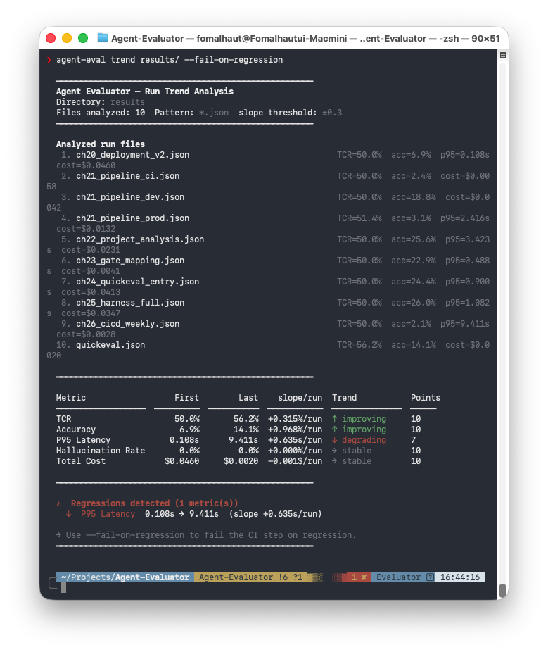
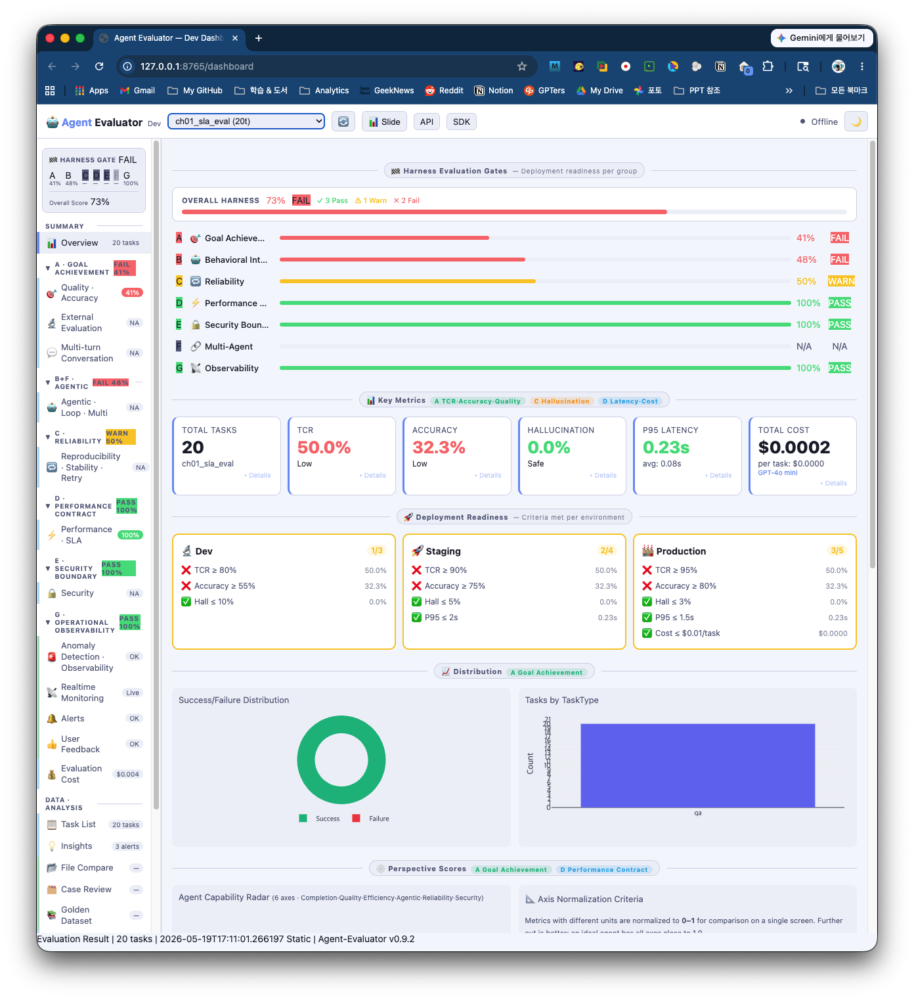

# Chapter 01: AI 에이전트 평가란 무엇인가

> "측정할 수 없으면 개선할 수 없다." — Peter Drucker

---

## 1.1 LLM과 에이전트의 차이 — 왜 평가 방식이 다른가

LLM(Large Language Model)을 API로 호출하는 것과 AI 에이전트를 운영하는 것은 근본적으로 다른 문제입니다. 겉으로는 비슷해 보이지만, 내부 동작 방식과 실패 패턴이 전혀 다릅니다.

### 단순 LLM 호출: 입력 → 출력 1회

```python
# 개념 코드 — 단순 LLM 호출 패턴 (에이전트와의 비교를 위한 예시)
# 단순 LLM 호출 — 평가가 상대적으로 간단하다
response = openai.chat.completions.create(
    model="gpt-5-nano",
    messages=[{"role": "user", "content": "한국의 수도는?"}]
)
answer = response.choices[0].message.content
# → "서울입니다."
```

- **단일 호출**: 입력 → 출력이 1회로 완결되어 평가가 단순하다.
- **결정론적 비교**: `answer == "서울"` 수준의 정확 매칭으로 품질을 판단할 수 있다.
- **한계**: 온도(temperature) > 0 이면 같은 입력에도 다른 표현이 나오며, 이 비교 방식은 곧 한계에 부딪힌다.

이 흐름은 결정론적에 가깝습니다. 입력이 고정되면 출력도 거의 고정됩니다(온도=0일 때). 정확성 평가는 `answer == "서울"` 수준의 비교로 충분할 때가 많습니다.

### 에이전트: 도구 호출 + 멀티스텝 + 상태 + 반복

에이전트는 다릅니다. 동일한 질문에 대해 에이전트는 다음과 같이 동작할 수 있습니다.

```
사용자: "서울의 내일 날씨를 조사해서 여행 계획을 짜줘"

에이전트 실행 흐름:
  Step 1: search_weather("서울", "내일") 도구 호출
  Step 2: 날씨 데이터 수신 → 맑음, 최고 22°C
  Step 3: get_attractions("서울", weather="맑음") 도구 호출
  Step 4: 관광지 목록 수신 → 경복궁, 북촌한옥마을, 남산타워
  Step 5: 계획 생성 → "오전 경복궁, 오후 북촌..."
  (→ 실패 시 Step 1 재시도 또는 다른 도구 선택)
```

이 흐름에서 발생하는 평가 대상은 최종 답변 하나가 아닙니다.

- **도구 선택의 정확성**: `search_weather` 대신 `wikipedia_search`를 선택했다면?
- **도구 사용 효율성**: 불필요한 도구를 5번 더 호출했다면?
- **재시도 동작**: 첫 번째 도구 호출이 실패했을 때 적절히 자기수정했는가?
- **멀티에이전트 협업**: 날씨 에이전트와 관광 에이전트가 올바르게 협력했는가?
- **보안**: 사용자 입력에 숨겨진 프롬프트 인젝션 공격을 탐지했는가?
- **비용**: 목표를 달성하는 데 토큰을 얼마나 사용했는가?

**결정론적 vs 확률론적 동작**이라는 차이도 있습니다. LLM은 동일 입력에 대해 비슷한 출력을 생성하지만, 에이전트는 도구 응답, 외부 상태, 실행 시점의 컨텍스트에 따라 완전히 다른 실행 경로를 택할 수 있습니다. 이는 재현 가능한 테스트를 작성하기 어렵게 만들고, 통계적 접근이 필요한 이유가 됩니다.

> 📋 **QA 관리자 TIP**: 에이전트 테스트는 "이 케이스가 통과했는가"가 아니라 "이 에이전트가 충분히 높은 성공률을 보이는가"로 기준을 바꿔야 합니다. 단일 테스트 케이스 통과가 아닌, 통계적 품질 임계값 관리가 핵심입니다.

---

## 1.2 프로덕션에서 발생하는 품질 위기 — 실제 사례 3가지

### 사례 1: 환각으로 인한 잘못된 정보 제공

의료 정보 서비스에 배포된 RAG(Retrieval-Augmented Generation) 에이전트가 있었습니다. 에이전트는 사용자의 약 관련 질문에 유사하지만 다른 약의 복용량 정보를 자신감 있게 답변했습니다. 검색된 문서에는 올바른 정보가 있었지만, 에이전트는 문서의 내용을 벗어난 정보를 생성했습니다.

**문제**: 개발 단계에서 몇 가지 케이스만 손으로 확인하고 배포했기 때문에, 저빈도 질의 패턴에서 발생하는 환각을 발견하지 못했습니다.

**필요했던 평가**: `HallucinationDetector` — 에이전트의 답변이 제공된 컨텍스트와 사실적으로 일치하는지 측정하는 자동화된 지표. **Gate C 신뢰성**(반복 실행 품질 보장)과 **Gate G 운영관측성**(이상 탐지) 차원 모두에 영향을 미치는 핵심 지표입니다.

> *참고: RAG 파이프라인의 문맥 이탈 환각(context-unfaithful hallucination) 패턴 — Ji et al. (2023). "Survey of Hallucination in Natural Language Generation." ACM Computing Surveys, 55(12). / Singhal et al. (2023). "Large Language Models Encode Clinical Knowledge." Nature, 620, 172–180 — 의료 LLM의 임상 지식 인코딩 능력과 정확도 한계 분석.*

### 사례 2: 도구 권한 초과 사용 (보안 위협)

내부 업무 자동화 에이전트가 파일 시스템에 접근하는 도구를 가지고 있었습니다. 외부 사용자 입력을 처리하던 에이전트는 정교하게 설계된 프롬프트 인젝션 공격을 받아, 허가되지 않은 파일 경로에 접근하고 그 내용을 응답에 포함시켰습니다. 민감한 시스템 설정 파일의 내용이 외부로 노출되는 보안 사고가 발생했습니다.

**문제**: 에이전트의 기능 테스트만 수행했고, 악의적 입력에 대한 보안 테스트가 없었습니다.

**필요했던 평가**: `InputSanitizationTracker`(프롬프트 인젝션 탐지), `OutputLeakageDetector`(민감 정보 출력 탐지), `ToolAuthorizationTracker`(허가된 도구만 사용하는지 감시), `PrivilegeEscalationDetector`(권한 상승 패턴 탐지), `ToolChainAttackDetector`(도구 연쇄 공격 탐지). **Gate E 보안경계** 차원의 5개 트래커입니다.

> *참고: 간접 프롬프트 인젝션을 통한 LLM 통합 애플리케이션 공격 실증 — Greshake et al. (2023). "Not What You've Signed Up For: Compromising Real-World LLM-Integrated Applications with Indirect Prompt Injection." arXiv:2302.12173. / OWASP LLM Top 10 v1.1 (2023). LLM01: Prompt Injection. owasp.org/www-project-top-10-for-large-language-model-applications*

### 사례 3: 응답 시간 급증으로 인한 서비스 장애

고객 지원 에이전트 서비스가 트래픽 급증 시점에 갑작스러운 레이턴시 증가를 경험했습니다. 평소 2초 이내로 응답하던 에이전트가 피크 타임에 30초 이상 응답하지 못했고, 많은 사용자가 서비스를 이탈했습니다. 원인을 추적한 결과, 특정 유형의 질의에서 에이전트가 도구를 평균 12번 호출하는 것으로 확인됐습니다. 정상적인 경우는 3번이었습니다.

**문제**: 응답 시간과 도구 호출 횟수를 지속적으로 모니터링하는 체계가 없었습니다.

**필요했던 평가**: `LatencyTracker`(p95 레이턴시 + `SLAConfig` 위반 감지)가 **Gate D 성능계약** 차원의 핵심 지표입니다. 도구를 12번이나 호출한 원인 진단에는 `ToolCallAnalyzer`(도구 호출 패턴 분석, **Gate B 행동무결성** 귀속)와 `AnomalyDetector`(비정상 패턴 자동 감지, Gate 비귀속 운영 지원 Tracker)가 보조적으로 사용됩니다.

> *참고: 에이전트의 반복적 도구 호출 패턴 — Yao et al. (2023). "ReAct: Synergizing Reasoning and Acting in Language Models." ICLR 2023 — 추론-행동 반복 루프 기반 도구 호출 아키텍처 실증. / Liu et al. (2024). "AgentBench: Evaluating LLMs as Agents." ICLR 2024 — 다양한 환경에서 LLM 에이전트의 도구 호출 수행 능력 평가.*

> 👨‍💻 **개발자 TIP**: 이 세 가지 사례는 각각 신뢰성/관측성(C·G), 보안(E), 성능(D) 실패입니다. 사례 1의 환각은 반복 실행 품질(Gate C)과 운영 이상 탐지(Gate G) 양쪽에 걸쳐 있습니다. 개발 단계의 몇 가지 수동 테스트로는 발견할 수 없습니다. 자동화된 평가 파이프라인이 없는 상태로 에이전트를 배포하는 것은 시트벨트 없이 고속도로에 진입하는 것과 같습니다.

세 사례가 공통적으로 보여주는 첫 번째 교훈은 명확합니다. **배포 전에 에이전트가 갖춰야 할 기준이 선언되지 않았다**는 것입니다. 어떤 수준의 환각률이 허용되는지, 어떤 레이턴시 이하여야 서비스가 가능한지, 어떤 도구는 쓸 수 없는지 — 이 기준들이 코드로 존재했다면 배포 전에 차단됐을 것입니다.

그런데 여기서 더 중요한 두 번째 교훈이 있습니다. **세 사례는 서로 다른 실패 차원을 드러냅니다.** 사례 1은 출력의 사실 정확성(목표달성), 사례 2는 외부 공격에 대한 보안 경계, 사례 3은 성능과 비용 계약의 실패입니다. 어느 한 차원을 완벽하게 측정해도 다른 차원은 알 수 없습니다 — 높은 정확도가 보안을 보장하지 않고, 빠른 응답이 환각 없음을 보장하지 않습니다. **AI 에이전트의 배포 준비도는 단일 지표로 표현할 수 없습니다.** 자율 에이전트는 구조적으로 서로 다른 여러 차원에서 독립적으로 실패할 수 있으며, 각 차원을 별도로 검증해야만 신뢰할 수 있는 배포 판단을 내릴 수 있습니다.

---

## 1.3 Harness Engineering — 배포 판단의 7차원

AI 최적화 방법론은 세 단계를 거쳐 진화했습니다.

- **Prompt Engineering (2022–2024)**: 단일 LLM 호출의 입력 텍스트를 최적화합니다. "어떻게 물어볼까?"가 핵심 질문입니다. 그러나 에이전트가 여러 도구를 호출하고 멀티턴 추론을 수행하는 복잡한 시나리오에서는 한계에 부딪힙니다.
- **Context Engineering (2025)**: 컨텍스트 창에 들어오는 모든 정보(RAG, 메모리, 도구 스펙, 이력)를 관리합니다. Andrej Karpathy가 "컨텍스트 창을 정확히 채우는 섬세한 과학"으로 정의했습니다. 에이전트 품질을 크게 높였지만, **"에이전트가 실제로 어떻게 동작했는가"를 사후에 검증하고 배포 가능 여부를 자동 판정**하는 메커니즘은 없었습니다.
- **Harness Engineering (2026~)**: 모델 주변의 제어 구조 전체를 설계합니다. Mitchell Hashimoto의 정의처럼, **"Agent = Model + Harness"** — 모델을 제외한 모든 것(지시 구조, 제약 선언, 품질 측정, 배포 판정)이 Harness에 속합니다.

에이전트를 배포하기 전에 "통과/실패"를 선언할 근거가 필요합니다. 이 책에서 Harness Engineering은 그 판단 구조를 세 가지 역할로 구현합니다. 아래 세 개념은 이 책 전체에서 반복 등장하는 핵심 용어이므로, 처음 만나는 시점에 명확히 구분해 두는 것이 중요합니다.

```
Tracker (관찰/측정) × Config (기준 선언) × Gate (배포 판정)
```

세 역할은 서로 다른 시점에 독립적으로 작동합니다.

- **Tracker**: 에이전트가 실행되는 동안 지표를 자동 기록합니다. 판단하지 않습니다. "응답 시간이 1.3초였다", "도구를 3번 호출했다"처럼 사실만 측정합니다 (25개 네이티브 트래커).
- **Config**: "이 에이전트는 어떤 조건에서 배포될 수 있는가"를 코드로 선언합니다. 측정하지 않습니다. `SLAConfig(p95_ms=2000)`처럼 기준을 정의하고, Tracker 측정값이 이 기준을 위반하면 해당 태스크를 `success=False`로 처리합니다 (33개 Harness Config). Config는 "품질 계약"을 코드로 문서화하는 수단이기도 합니다.
- **Gate**: Config 위반이 축적된 Tracker 측정값과 대조해 배포 가능 여부를 최종 판정합니다. `eval_q.gate(tcr=85)` 또는 `HarnessEvaluationGate.enforce()`가 이 역할을 합니다. 기준 미달이면 `sys.exit(1)`로 CI/CD 파이프라인을 차단합니다.

이 세 역할이 어떻게 실제 코드에서 보이는지는 **Chapter 2**에서 직접 경험합니다. 설계 원리와 각 역할의 내부 구조는 **Chapter 3**에서 동등한 깊이로 다룹니다.

### 7개 품질 차원 (Gate A-G)

#### 왜 7개인가 — 자율 에이전트 배포 준비도의 독립 차원

§1.2에서 확인한 세 가지 실패 사례(신뢰성·보안·성능)는 더 넓은 구조를 암시합니다. 자율 에이전트 시스템 전체를 분석하면 프로덕션 배포를 승인하기 위해 반드시 "예"로 답해야 하는 질문이 정확히 7가지임을 알 수 있습니다.

이 7가지 질문이 핵심인 이유는 **서로 독립적**이기 때문입니다. 하나를 확인해도 다른 하나는 알 수 없어서, 7개 모두 통과해야 배포를 신뢰할 수 있습니다.

- **Gate A (목표달성)**: "에이전트가 지시를 제대로 완수했는가?" — 어떤 에이전트도 생략할 수 없는 기본 요건. 정확도와 TCR(Task Completion Rate, 작업 완료율)로 측정.
- **Gate B (행동무결성)**: "의도된 범위 안에서만 행동했는가?" — 자율 에이전트 고유의 위험. 정답을 냈어도 허가되지 않은 도구를 썼다면 실패.
- **Gate C (신뢰성)**: "같은 품질이 반복 실행에서도 보장되는가?" — 확률론적 AI에서 한 번 성공이 통계적 보장을 의미하지 않는다.
- **Gate D (성능계약)**: "비용·응답 시간 SLA를 지켰는가?" — 정확한 답도 30초가 걸리거나 비용이 예산을 초과하면 서비스가 불가능하다.
- **Gate E (보안경계)**: "외부 공격과 정보 유출을 차단했는가?" — 기능 테스트 100% 통과가 보안을 보장하지 않는다.
- **Gate F (다중에이전트)**: "여러 에이전트가 교착 없이 협력하는가?" — 단일 에이전트의 품질이 멀티에이전트 시스템의 안전성을 보장하지 않는다.
- **Gate G (운영관측성)**: "실패 원인을 즉시 추적·설명할 수 있는가?" — 지금 성능이 좋아도 블랙박스이면 문제 발생 시 대응할 수 없다.

7개 Gate 중 하나라도 미확인 상태로 배포하면, 해당 차원에서 반드시 예상치 못한 장애가 발생합니다. §1.2의 세 사례는 각각 Gate C·G(신뢰성·운영관측성 — 환각), Gate E(보안경계 — 권한 초과), Gate D(성능계약 — 레이턴시 급증)의 실패였습니다. Harness Engineering은 이 7개 질문에 코드로 선언된 기준을 대조해 자동으로 답하는 체계입니다.

58개 지표(25 Tracker + 33 Config)는 7개 품질 차원으로 구분됩니다.

| Gate | 차원 | 핵심 질문 | Tracker 수¹ | Config 수 |
|------|------|-----------|-----------|-----------|
| **A** | 목표달성 | 에이전트가 지시를 제대로 완수했는가? | 3 | 6 |
| **B** | 행동무결성 | 의도하지 않은 행동 없이 동작했는가? | 2 | 6 |
| **C** | 신뢰성 | 같은 입력에 일관되게 응답하는가? | 2 | 5 |
| **D** | 성능계약 | SLA/비용 계약을 지켰는가? | 2 | 5 |
| **E** | 보안경계 | 외부 공격·데이터 유출을 차단했는가? | 5 | 3 |
| **F** | 다중에이전트 협업 | 여러 에이전트가 교착 없이 협력했는가? | 2 | 4 |
| **G** | 운영관측성 | 실패 원인을 즉시 추적·설명할 수 있는가? | 0 | 4 |
| | **Harness Gate 직접 지표** | | **16** | **33** |
| | **운영 지원 Tracker** (모니터링·비용·스트리밍 등) | | **+9** | — |
| | **SDK 전체 합계** | | **25** | **33** |

> ¹ Harness Gate(A–G)에 직접 집계되는 Native Tracker는 16개다. `ConversationSession`, `ImplicitFeedbackTracker`, `AnomalyDetector`, `CostTracker`, `StreamingEvaluator` 등 운영 지원 Tracker 9개를 합산하면 SDK 전체 Native Tracker는 25개다. Gate G는 별도 Tracker 없이 `LLMJudge`(선택 활성화)와 Config 4개로 관측성을 측정한다.

> **"25 Tracker + 33 Config = 58개 지표"**

### 배포 판단 코드 예시

아래는 세 가지 차원(목표달성·성능·보안)을 선언하고 배포 판단을 내리는 최소 예제입니다.

```python
# 개념 코드 — 3-Element Harness(Tracker·Config·Gate) 최소 예시
# (실행 가능 전체 예제: Evaluator_Examples/ch01_first_eval.py 섹션 4)
from agent_evaluator import (
    PerformanceMonitor, HarnessEvaluationGate,
    InstructionConfig, SLAConfig, ThreatSeverityConfig,
)
from agent_evaluator import agent_eval

monitor = PerformanceMonitor(output_dir="results/", use_korean_tokenizer=True)

# ① Config 선언 — 배포 기준을 코드로 정의
instruction_cfg = InstructionConfig(
    required_keywords=["결과"],  # 응답에 포함되어야 할 키워드
    fail_on_violation=True,
)
sla_cfg = SLAConfig(
    p95_ms=3000,                # P95 응답 3초 이내
    max_cost_per_task=0.01,     # 태스크당 비용 $0.01 이하
)
threat_cfg = ThreatSeverityConfig(
    fail_on_critical=True,       # 치명적 위협 탐지 시 fail
    fail_score=7.0,
)

# ② Tracker 자동 수집 — @agent_eval이 실행마다 지표 기록
@agent_eval(
    monitor,
    task_type="qa",
    instructions=instruction_cfg,
    sla=sla_cfg,
    threat_severity=threat_cfg,
)
def my_agent(question: str, ground_truth: str = "") -> str:
    # TODO(현업 적용): 실제 LLM 호출로 교체하세요. 예) return llm.invoke(question)
    return "결과: 처리 완료되었습니다."

# ③ Gate — Config 위반 시 배포 중단
report = monitor.generate_report()
gate = HarnessEvaluationGate(report)
gate.enforce()   # 기준 미달 시 sys.exit(1) → CI/CD 파이프라인 차단
```

- **3요소 패턴**: ① Config(기준 선언) → ② `@agent_eval`(Tracker 자동 수집) → ③ `HarnessEvaluationGate.enforce()`(종합 판정) 순서로 구성된다.
- **`InstructionConfig(required_keywords=["결과"])`**: 응답에 "결과" 키워드가 없으면 해당 태스크를 `success=False`로 처리해 TCR을 낮춘다.
- **`SLAConfig(p95_ms=3000)`**: p95 응답 시간이 3초를 초과하거나 태스크당 비용이 $0.01을 넘으면 Gate D에서 FAIL 판정을 받는다. SLA 위반율(breach_rate)은 Gate C(신뢰성) 점수에도 함께 반영된다.
- **`ThreatSeverityConfig(fail_on_critical=True, fail_score=7.0)`**: 위협 점수 7.0 이상의 입력이 탐지되면 해당 태스크를 즉시 실패 처리하고 Gate E에 반영한다.
- **`gate.enforce()`**: Gate A–G 전체 Config 위반 여부를 종합 판정해 기준 미달이면 `sys.exit(1)`을 호출해 CI/CD 파이프라인을 차단한다.

Gate A-G 각 차원의 구체적인 Tracker와 Config는 **Part II — Harness 지표 체계**(Chapter 03~10)에서 상세히 다룹니다.

> 📋 **QA 관리자 TIP**: "어떤 지표를 먼저 적용해야 하나?" → 우선순위: **A(목표달성) → D(성능계약)/E(보안경계) → C(신뢰성) → B(행동무결성) → G(관측성) → F(다중에이전트)**. Gate A는 모든 에이전트의 기본 판단 근거입니다. Gate E 보안은 외부 입력을 처리하는 에이전트라면 즉시 적용해야 합니다.

§1.3에서 7개 Gate의 구조와 3요소의 역할 분리를 개념으로 확인했습니다. 그런데 왜 기존 소프트웨어 테스팅으로는 이 구조가 필요하지 않았을까요? 그 이유를 이해해야 Harness Engineering이 왜 새로운 패러다임인지가 명확해집니다.

---

## 1.4 AI Native 평가의 고유 도전 — 기존 테스팅과 다른 이유

Harness Engineering은 기존 소프트웨어 테스팅을 개선한 것이 아닌, AI 에이전트의 고유한 속성에서 비롯된 **AI-native 패러다임**입니다. 기존 QA가 "버그가 없는가(결함 부재)?"를 묻는다면, Harness Engineering은 "지금 이 조건에서 배포해도 되는가(배포 준비도)?"를 코드로 선언하고 자동으로 판정합니다.

### AI First vs AI Native — 평가 패러다임의 출발점

**AI First**는 기존의 소프트웨어·조직·프로세스에 AI 기능을 *추가*하는 접근입니다. 기존 워크플로우가 선행하고, AI가 그것을 보조하거나 자동화합니다. 평가도 마찬가지입니다 — 기존 QA 방법론 위에 AI 관련 테스트를 추가합니다. 더 나은 프롬프트를 테스트하고, LLM 출력을 수동으로 검토하고, 모델 버전을 A/B 비교하는 방식입니다. 소프트웨어 중심의 사고방식이 그대로 유지됩니다.

**AI Native**는 프로세스 자체를 AI 에이전트를 중심으로 *처음부터* 설계하는 접근입니다. AI가 보조 도구가 아닌 핵심 실행 주체입니다. 에이전트는 사람이 하던 일을 직접 수행하고, 자율적으로 도구를 선택하며, 멀티스텝 추론을 통해 목표를 추구합니다. 소프트웨어가 AI를 포함하는 것이 아니라, AI가 소프트웨어 구조를 결정합니다.

이 차이는 평가에 근본적인 함의를 가집니다. **AI First 평가는 기존 QA를 확장하는 문제**이고, **AI Native 평가는 새로운 패러다임을 필요로 합니다.** AI Native 환경의 평가는 기술적으로 해결되지 않은 영역을 포함합니다.

| 어려움 | 이유 | 현재 한계 | 대응 도전 |
|--------|------|----------|----------|
| **비결정론적 출력** | 동일 입력에도 매번 다른 응답 | 단일 테스트 케이스로 품질 확정 불가 | ① 확률론적 품질 |
| **Ground Truth 부재** | 복잡한 태스크에서 "정답"이 하나가 아님 | 자동 채점 정확도가 인간 판단과 괴리 | ② AI-by-AI 평가 |
| **평가 비용** | LLM-as-Judge는 API 비용 발생 | 프로덕션 전량 평가 불가, 샘플링 필수 | ② AI-by-AI 평가 |
| **순환 참조 문제** | AI로 AI를 평가할 때 Judge 편향 내재 | Judge 모델 자체의 신뢰도를 어떻게 보장하는가 | ② AI-by-AI 평가 |
| **드리프트 탐지 지연** | 성능 저하가 점진적·무증상으로 발생 | 임계값 돌파 전 조기 감지가 어려움 | ③ 드리프트 인식 |
| **돌발 행동** | 설계하지 않은 동작이 예상치 못하게 등장 | 사전 테스트 케이스로 커버 불가 | ④ 돌발 행동 대응 |
| **다중에이전트 복잡성** | 에이전트 수 증가 시 상호작용 경우의 수 폭발 | 전수 테스트가 계산적으로 불가능 | ④ 돌발 행동 대응 |

이 어려움들은 "더 좋은 도구"로 완전히 해소되지 않습니다. Harness Engineering은 이 한계를 인정하면서 **통계적 배포 판정** — "완벽한 검증" 대신 "충분히 높은 신뢰 수준" — 을 목표로 설계됩니다.

7가지 어려움은 실전에서 **5가지 고유 도전**으로 수렴됩니다. Ground Truth 부재·평가 비용·순환 참조는 모두 "AI가 AI를 채점해야 하는 구조"라는 동일한 근원에서 파생되므로 도전 ②로 묶이고, 돌발 행동·다중에이전트 복잡성은 "예측 불가 동작"이라는 공통 속성으로 도전 ④로 묶입니다. 이 네 가지 도전이 배포 후에도 멈추지 않는다는 사실 자체가 다섯 번째 도전을 만들어냅니다.

### 5가지 고유 도전 — AI Native 환경의 실전 문제

각 도전이 어떻게 나타나고, Harness Engineering이 어떻게 대응하는지 살펴봅니다.

### 도전 ①: 확률론적 품질 (Probabilistic Quality)

동일 입력 → 비결정론적 출력. 기존 `assert` 기반 테스트는 의미가 없습니다.

```python
# 개념 코드 — 전통 테스트 vs AI 에이전트 테스트 (확률론적 품질 한계 시연)
# 전통 소프트웨어 테스트 — 결정론적
def test_add():
    assert add(2, 3) == 5  # 항상 5

# AI 에이전트 테스트 — 확률론적
def test_agent():
    result = agent("한국의 수도는?")
    assert result == "서울입니다."  # 이 비교는 의미가 없다.
    # "서울이 한국의 수도입니다", "수도는 서울입니다" 모두 정답인데
    # 하나만 통과 처리된다.
```

**해결**: `AccuracyEvaluator`의 TokenF1 + Jaccard + LCS + Char Levenshtein 4중 가중 알고리즘으로 **의미적 유사도**를 측정합니다. 단일 케이스 통과 여부 대신 **평균 정확도 분포**로 판단합니다.

```
기존 방식: assert response == "서울입니다."    # ❌ 표현이 조금만 달라도 실패
Harness 방식: accuracy_score ≥ 0.85           # ✅ 의미가 같으면 통과
```

확률론적 응답은 **반복 통계 검증**을 필요로 합니다. "이번 실행에서 통과했는가"가 아니라 "1,000번 실행했을 때 90% 이상 정확한가"가 올바른 질문입니다. 전통 테스트와의 구조적 차이는 다음과 같습니다.

| 테스트 방식 | 전통 소프트웨어 | AI 에이전트 |
|-----------|-------------|-----------|
| 케이스 반복 | 불필요 (결정론적) | 필수 (확률론적) |
| 결과 판단 | 정확히 일치 | 임계값 기반 통계 |
| 재현 가능성 | 항상 재현 | 확률적 재현 |
| 실패 정의 | 하나라도 실패 | N% 이상 성공 |

`ReproducibilityConfig`의 `reproducibility_threshold`는 이 문제를 해결합니다. 이 조합으로 "같은 입력에 대해 90% 이상 일관된 응답을 생성하는가"와 같은 품질 지표를 자동 판정합니다.

### 도전 ②: AI-by-AI 평가 (AI Evaluating AI)

에이전트 응답의 품질을 자동으로 채점하려면 또 다른 LLM이 필요합니다. 이를 LLM-as-Judge라고 합니다. 하지만 채점 LLM 자체도 편향이 있고, API 호출 비용이 발생합니다.

**해결**: `LLMJudge`는 **샘플링(기본 10%)** 방식으로 비용을 제어합니다. 기본 5차원(completeness·relevance·factual_consistency·toxicity·bias)으로 ground_truth 없이 품질을 측정하며, RAG 모드 활성화 시 faithfulness, 커스텀 기준(judge_criteria) 지정 시 criteria_scores/criteria_overall이 추가됩니다.

```python
judge = LLMJudge(sample_rate=0.1)  # 10%만 LLM 채점, 나머지는 네이티브 알고리즘
```

- **`sample_rate=0.1`**: 전체 태스크의 10%만 LLM으로 채점해 API 비용을 90% 절감한다.
- **나머지 90%**: 외부 API 호출 없이 네이티브 알고리즘(TokenF1·Jaccard·LCS)으로 즉시 계산된다.
- **자동 모델 결정**: `model=None`(기본값)이면 환경에 설정된 API 키를 기반으로 OpenAI 또는 Anthropic 모델을 자동 선택한다.

### 도전 ③: 드리프트 인식 (Drift Awareness)

모델·데이터·환경의 변화가 코드 변경 없이 에이전트 동작을 바꿉니다. 대표적인 원인은 다음과 같습니다.

- **데이터 드리프트**: 입력 패턴이 학습 분포에서 멀어짐
- **모델 업스트림 변경**: LLM 공급자가 모델을 조용히 업데이트
- **컨텍스트 길이 증가**: 히스토리 누적으로 컨텍스트 윈도우 포화
- **외부 API 변화**: 도구가 의존하는 외부 API 응답 형식 변경

이 드리프트는 기존 테스트 스위트를 통과해도 프로덕션에서 발생합니다. **해결**: `RunTrendAnalyzer`가 순차 평가 결과의 기울기를 자동 계산합니다. TCR이 지속적으로 감소하는 추세를 감지하면 경보를 발령합니다.

```
평가 결과 시계열: [0.92, 0.91, 0.89, 0.86, 0.82, ...]
slope = -0.025/평가 → 드리프트 감지 → CI 경보
```

```bash
# 100번 평가 결과의 드리프트를 자동 감지
agent-eval trend results/ --fail-on-regression
# → slope < -0.05 이면 exit 1 (CI/CD 파이프라인 중단)
```



### 도전 ④: 돌발 행동 대응 (Emergent Behavior)

설계하지 않은 동작이 에이전트에서 예상치 못하게 등장합니다. 특히 도구 체인이 길어질수록, 멀티에이전트 시스템일수록 예측 불가능한 상호작용이 발생합니다.

**해결**: `AnomalyDetector`가 통계적 정상 범위를 학습하고 이탈 시 즉시 탐지합니다. `ToolChainAttackDetector`는 도구 체인에서 발생하는 비정상 연쇄 호출을 추적합니다.

```python
# 개념 코드 — 도구 체인 이상 탐지
# Gate E 전체 예제: Evaluator_Examples/ch08_group_e.py
# 돌발 행동 탐지 전체 예제: Evaluator_Examples/ch10_group_g.py
from agent_evaluator import PerformanceMonitor, AnomalyDetector

monitor = PerformanceMonitor(
    output_dir="results/",
    enable_security_metrics=True,   # Gate E 활성화
    use_korean_tokenizer=True,
)
# AnomalyDetector는 PerformanceMonitor와 별개로 인스턴스화
anomaly = AnomalyDetector()

# 에이전트 실행 후 — scan()으로 이상 탐지 결과 확인
events = anomaly.scan(monitor)
if events:
    for e in events:
        print(f"[{e.severity.upper()}] {e.type}: {e.detail}")
    # 예시 출력:
    # [WARNING] latency_trend: P95 latency rising for 20 tasks (+42%)
    # [CRITICAL] accuracy_drift: Accuracy drifted -18.3% from baseline (z-score=2.71)
else:
    print("이상 없음 — 정상 범위 내 동작 중")
```

- **`enable_security_metrics=True`**: Gate E(보안경계) — `InputSanitizationTracker`, `OutputLeakageDetector`, `ToolAuthorizationTracker`, `PrivilegeEscalationDetector`, `ToolChainAttackDetector` 5개 트래커를 활성화한다.
- **`AnomalyDetector`**: `PerformanceMonitor`와 별개로 인스턴스화하며, 통계적 정상 범위를 학습하고 도구 호출 횟수·응답 시간 등이 비정상적으로 이탈할 때 자동으로 탐지한다.
- **opt-in 설계**: `enable_security_metrics`는 기본값 `False`이며, 활성화하면 태스크당 측정 오버헤드가 증가하므로 필요할 때만 켠다.

### 도전 ⑤: 지속 평가 (Continuous Evaluation)

AI 에이전트는 배포 후에도 계속 변합니다. 일회성 배포 전 테스트만으로는 충분하지 않습니다.

**해결**: `evaluation_session` 컨텍스트 매니저 + `agent-eval trend` + Phoenix OTEL을 결합한 **자기개선 루프**를 구성합니다.

```
[운영] 실시간 평가 → [이상 탐지] 드리프트 경보 → [원인 분석] LLMJudge·Phoenix
→ [개선] 프롬프트/모델 교체 → [검증] HarnessEvaluationGate 재통과 → [배포]
```

> 👨‍💻 **개발자 TIP**: 5가지 도전의 공통 대응은 **지속 평가**입니다. 배포 전 1회 테스트가 아닌, 프로덕션에서도 계속 측정하는 루프가 Harness Engineering의 핵심입니다. Context Engineering이 입력을 아무리 정교하게 구성해도, 에이전트가 프로덕션에서 실제로 어떻게 동작하는지는 사후 측정(Sensor)과 코드 선언 기준(Guide)이 없으면 알 수 없습니다.

### AI Native 5대 도전 ↔ Harness Gate A–G 매핑

5가지 도전은 추상적인 문제가 아닙니다. Harness Engineering의 7개 Gate(A–G)가 각 도전에 정확히 대응합니다. 5가지 도전은 7개 Gate 중 6개(A·B·C·D·E·G)를 직접 유발하고, Gate F(다중에이전트 협업)는 단일 에이전트 시스템에서는 나타나지 않는 멀티에이전트 고유의 추가 차원입니다.

| AI Native 도전 | 핵심 질문 | 대응 Gate | 주요 Tracker / Config |
|--------------|---------|-----------|----------------------|
| ① 확률론적 품질 | "통계적으로 충분히 정확한가?" | **Gate A** 목표달성, **Gate C** 신뢰성 | AccuracyEvaluator, ReproducibilityConfig |
| ② AI-by-AI 평가 | "LLM Judge 비용 없이 품질을 측정할 수 있는가?" | **Gate G** 운영관측성 | LLMJudge (sample_rate 조절), ExplainabilityConfig |
| ③ 드리프트 인식 | "배포 후 성능 저하를 조기에 감지하는가?" | **Gate D** 성능계약, **Gate C** 신뢰성 | LatencyTracker, RunTrendAnalyzer, CostPredictabilityConfig |
| ④ 돌발 행동 대응 | "예측 못한 도구 호출·루프·범위 이탈을 탐지하는가?" | **Gate B** 행동무결성, **Gate E** 보안경계 | ToolChainAttackDetector, AnomalyDetector, ScopeConfig |
| ⑤ 지속 평가 | "배포 후에도 지속적으로 품질을 검증하는가?" | **Gate A–G 전체** (CI/CD + 실시간 모니터링) | HarnessEvaluationGate, Phoenix OTEL, agent-eval trend |
| *(멀티에이전트 고유)* | "여러 에이전트가 교착 없이 협력하는가?" | **Gate F** 다중에이전트 | AgentCoordinationTracker, ConsensusConfig |

**개발자 관점**: 각 도전에 대응하는 Tracker를 활성화하고 Config로 기준을 선언합니다.  
**QA 관리자 관점**: 도전이 해결됐는지를 Gate A–G별 PASS/WARN/FAIL 판정으로 확인합니다.

> 📋 **QA 관리자 TIP**: AI Native 5가지 도전은 전통 QA 역할을 없애지 않습니다. "케이스를 통과했는가" 대신 "품질 분포가 배포 기준을 만족하는가"로 판단 언어를 바꾸는 것입니다. Part IV — QA 관리자 가이드에서 이 전환을 단계별로 다룹니다.

5가지 도전을 정의했으니, 자연스럽게 이어지는 질문이 있습니다. **시장에는 이미 다양한 평가 도구가 존재합니다. 그 중 어떤 도구가 이 도전들을 실제로 해결하는가?**

---

## 1.5 AI 에이전트 평가 프레임워크 생태계 — 9개 도구 비교표

앞서 정의한 5가지 AI Native 도전 — 확률론적 품질, AI-by-AI 평가, 드리프트, 돌발 행동, 지속 평가 — 은 기존 도구들이 해결하지 못한 지점이기도 합니다. 현재 시장에 다양한 평가 도구가 존재하지만, 각 도구가 이 도전에 어떻게 대응하는지를 비교하면 팀 상황에 맞는 선택 기준이 명확해집니다.

### 주요 도구 개요

| 프레임워크 | 유형 | 버전 (2025-2026) | 주력 기능 |
|---|---|---|---|
| **LangSmith** | SaaS + 셀프호스트 | SDK v0.7.33 | LangChain 생태계 관측 |
| **Ragas** | OSS 라이브러리 | v0.4.3 | RAG + 에이전트 평가 |
| **DeepEval** | OSS + SaaS | v3.9.7 | LLM 단위 테스트 (Red-team → DeepTeam으로 분리) |
| **Arize Phoenix** | OSS + Cloud | v14.6.x (SDK: <14.7) | LLM 관측가능성 (OTEL 기반) |
| **Evidently AI** | OSS + Cloud | v0.7.21 | ML/LLM 모니터링 |
| **Braintrust** | SaaS + OSS SDK | v0.16.0 | LLM 실험 + 에이전트 관측 |
| **Helicone** | SaaS + OSS | — | LLM 프록시 + 비용 관측 |
| **W&B Weave** | SaaS + OSS SDK | v0.52.37 | 에이전트 평가 + 실험 관리 |
| **Agent Evaluator** | OSS SDK | v0.9.7 | Harness Engineering 배포 판단 |

### 에이전틱 지표 지원 비교

에이전트 평가에서 가장 중요한 것은 일반 LLM 품질 지표가 아닌, 에이전트 고유의 동작을 측정하는 지표입니다.

| 지표 | LangSmith | Ragas | DeepEval | Phoenix | Evidently | Braintrust | Helicone | W&B | Agent Evaluator |
|---|:---:|:---:|:---:|:---:|:---:|:---:|:---:|:---:|:---:|
| Tool 선택 정확도 | ❌ | ✅ | ⚠️ LLM-judge | ⚠️ LLM-judge | ❌ | ❌ | ❌ | ❌ | ✅ |
| Tool 효율성 / 불필요 호출 | ❌ | ❌ | ✅ | ❌ | ❌ | ❌ | ❌ | ❌ | ✅ |
| 재시도 / 자기수정 패턴 | ❌ | ❌ | ❌ | ❌ | ❌ | ❌ | ❌ | ❌ | ✅ |
| 멀티에이전트 협업 품질 | ❌ | ❌ | ❌ | ❌ | ❌ | ❌ | ❌ | ❌ | ✅ |
| 워크플로우 퍼널 / 분기 | ✅ (LangGraph) | ❌ | ❌ | ✅ | ❌ | 부분 | ❌ | 부분 | ✅ |
| 프롬프트 인젝션 탐지 | ❌ | ❌ | ⚠️ DeepTeam | ❌ | ❌ | ❌ | ❌ | ❌ | ✅ |
| 출력 정보 유출 탐지 | ❌ | ❌ | ❌ | ❌ | ❌ | ❌ | ❌ | ❌ | ✅ |
| 권한 상승 탐지 | ❌ | ❌ | ❌ | ❌ | ❌ | ❌ | ❌ | ❌ | ✅ |
| **Harness Config 배포 판정** | ❌ | ❌ | ❌ | ❌ | ❌ | ❌ | ❌ | ❌ | **✅** |
| **드리프트 추세 탐지** | 부분 | ❌ | ❌ | 부분 | ✅ | 부분 | ❌ | ✅ | ✅ |

### 비용 및 오프라인 실행 비교

| 도구 | 추가 LLM 비용 (1,000건) | 오프라인 실행 | 계산 지연 |
|---|---|---|---|
| LangSmith | $2~10 | ❌ | 수 초 |
| Ragas | $5~20 | ❌ | 수 초~분 |
| DeepEval | $3~15 | 부분 | 수 초 |
| Arize Phoenix | $3~10 | ✅ 로컬 서버 | 수 초 |
| Evidently AI | $0 | ✅ | 밀리초~초 |
| Braintrust | 선택적 | 부분 | 선택적 |
| Helicone | $0 | ❌ | 없음 (집계만) |
| W&B Weave | 선택적 | 부분 | 선택적 |
| **Agent Evaluator** | **$0** | **✅** | **밀리초** |

### 어떤 도구를 선택해야 하는가?

- **LangChain/LangGraph를 이미 사용 중이고 클라우드 서비스를 선호한다면**: LangSmith
- **RAG 파이프라인 품질을 집중적으로 평가하고 싶다면**: Ragas
- **LLM 관측가능성과 분산 트레이싱이 중심이라면**: Arize Phoenix
- **Tool 선택, 보안, 재시도 등 에이전트 고유 동작을 평가하고, 배포 판단 기준을 코드로 선언하며, 외부 API 비용 없이 로컬에서 실행하고 싶다면**: Agent Evaluator

> **위 비교표는 모두 배치(batch) 채점 — 세션이 끝난 뒤 판정하는 도구다.** Agent Evaluator는 여기에 더해 `LiveGuardrail`로 도구 호출 직전에 동일한 Gate B/E 판정을 동기 실행해 위험한 호출 자체를 막는 실시간 계층을 별도로 제공한다(§1.6 ⑥, Part VII). 이 표의 다른 도구들이 같은 기능을 제공하는지는 이 책이 별도로 검증하지 않았으므로 표에는 포함하지 않았다 — 자체 도입을 검토 중이라면 각 도구의 최신 문서를 직접 확인하는 것을 권한다.

이 책의 나머지 챕터들은 Agent-Evaluator를 중심으로 진행하지만, Part III에서 다른 도구들과의 연동 방법도 함께 다룹니다.

---

## 1.6 Agent-Evaluator SDK — 설계 철학, 핵심 기능, 지향점

§1.5의 생태계 비교에서 Agent-Evaluator는 "Harness Config 배포 판정"과 "에이전틱 전용 지표"를 외부 API 비용 없이 제공하는 유일한 도구로 나타났습니다. 이 포지션은 우연이 아닙니다. SDK의 모든 아키텍처 결정은 하나의 신념에서 출발합니다.

> **"측정되지 않은 에이전트는 신뢰할 수 없다. 선언되지 않은 기준은 판단의 근거가 될 수 없다."**

이 절에서는 그 신념이 코드 구조와 설계 결정에 어떻게 반영되었는지, 그리고 SDK가 어디를 향하는지를 정리합니다.

### SDK의 탄생 배경

Prompt Engineering에서 Context Engineering으로, 다시 Harness Engineering으로 무게 중심이 이동하는 동안, 에이전트 평가 도구들은 두 갈래로 갈렸습니다. 한쪽은 클라우드 관측성(SaaS + OTEL 트레이싱)에 집중했고, 다른 쪽은 LLM 단위 테스트(LLM-as-Judge)에 집중했습니다.

그 사이에 채워지지 않은 공백이 있었습니다.

- **배포 판정 자동화**: "이 에이전트를 지금 배포해도 되는가?"를 코드로 선언하고 자동으로 YES/NO를 반환하는 도구가 없었습니다.
- **에이전틱 고유 지표**: 도구 선택 정확도·재시도 일관성·멀티에이전트 합의처럼 에이전트에만 존재하는 동작을 측정하는 지표가 없었습니다.
- **외부 의존성 없는 실시간 평가**: LLM Judge API 호출 없이 밀리초 안에 동작하는 평가 루프가 없었습니다.

Agent-Evaluator는 이 세 공백을 채우기 위해 설계됐습니다.

### 5가지 설계 원칙

SDK의 모든 구현 결정은 다음 다섯 원칙에서 파생됩니다.

#### 원칙 1. 계층 독립 (Layer Independence)

SDK는 세 계층으로 구성됩니다 — Foundation(Layer 1), Agentic(Layer 2), Hybrid(Layer 3). **Layer 1과 2는 어떤 외부 패키지도 필요하지 않습니다.** `pip install agent-evaluator`만으로 25개 Native Tracker 전부를 즉시 사용할 수 있습니다.

이 원칙의 이유: 프로덕션 환경에서는 패키지 버전 충돌, 에어갭(air-gap) 네트워크, 컨테이너 이미지 크기 제한이 빈번하게 발생합니다. 평가 기능이 외부 의존성으로 인해 동작하지 않으면, 에이전트를 측정할 수 없게 됩니다.

```
Layer 1 — Foundation (외부 의존성 없음)
  TaskCompletionTracker · AccuracyEvaluator · HallucinationDetector
  ResponseQualityEvaluator · LatencyTracker · TokenEconomyTracker

Layer 2 — Agentic (외부 의존성 없음)
  ToolCallAnalyzer · RetryCorrectionTracker · ToolSelectionTracker
  AgentCoordinationTracker · WorkflowExecutionTracker
  보안: InputSanitizationTracker · OutputLeakageDetector
       ToolAuthorizationTracker · PrivilegeEscalationDetector · ToolChainAttackDetector

Layer 3 — Hybrid (선택 의존성: DeepEval / Ragas)
  HybridPerformanceMonitor · DeepEvalAdapter · RagasAdapter
  LLMJudge (네이티브 — faithfulness, G-Eval, 5차원 채점)
```

Hybrid 계층은 DeepEval과 Ragas를 선택적으로 통합합니다. 두 도구가 설치되지 않아도 SDK의 핵심 기능에는 영향이 없습니다.

#### 원칙 2. 하네스 독립 (Harness Independence)

**33개 Config 데이터클래스는 `gates/gate_x/configs.py`(7개 Gate 패키지에 분산 정의, `decorators.py`는 re-export만 담당)에 선언되고, `gates/gate_x/aggregate.py`에서 독립적으로 집계됩니다.** Config는 측정하지 않고, Tracker는 판단하지 않습니다. 두 역할의 분리가 Harness Engineering의 구현 핵심입니다.

이 분리가 중요한 이유: Config는 팀의 "배포 계약"입니다. 코드 변경 없이 `SLAConfig(p95_ms=2000)`의 임계값만 바꿔도 판정 기준이 달라집니다. Tracker와 분리되어 있기 때문에, 평가 로직을 수정하지 않고도 기준만 버전 관리할 수 있습니다.

```python
# Config 변경 → 판정 기준 변경 (Tracker 코드 수정 없음)
# 개발 환경: 느슨한 기준
sla_dev = SLAConfig(p95_ms=5000)

# 프로덕션 환경: 엄격한 기준
sla_prod = SLAConfig(p95_ms=800, warn_threshold=2, fail_threshold=5)
```

#### 원칙 3. Tracker 격리 (Tracker Isolation)

**각 Tracker는 독립적으로 인스턴스화하고 테스트할 수 있습니다.** PerformanceMonitor에 종속되지 않고, 개별 Tracker를 단독으로 사용해 특정 지표만 측정하는 것이 가능합니다.

```python
# Tracker 단독 사용 — PerformanceMonitor 없이
from agent_evaluator.core.trackers.layer1 import AccuracyEvaluator

evaluator = AccuracyEvaluator()
score = evaluator.evaluate("서울이 수도입니다", "서울은 대한민국의 수도입니다")
# → {"overall_accuracy": 0.81, "token_f1": 0.83, ...}
```

이 격리 원칙은 두 가지 실용적 이점을 만들어냅니다. 첫째, 특정 지표만 필요한 경량 파이프라인에서 Tracker 하나만 가져다 쓸 수 있습니다. 둘째, 각 Tracker를 단위 테스트(Unit Test)로 독립 검증할 수 있어, 평가 로직 자체의 신뢰성을 보장합니다.

#### 원칙 4. 고비용 연산 옵트인 (Opt-in for Expensive Operations)

환각 탐지(`enable_hallucination_detection`)와 보안 지표(`enable_security_metrics`)는 **기본값이 `False`**입니다. 이 두 기능은 태스크당 측정 오버헤드가 수십 밀리초에서 수백 밀리초에 달합니다.

이 원칙의 이유: 프로덕션에서 에이전트 응답이 200ms인데 평가 오버헤드가 150ms라면, 평가 시스템이 서비스 성능을 훼손합니다. 필요한 기능만 활성화해 오버헤드를 최소화하는 것이 운영 가능한 실시간 평가의 전제조건입니다.

```python
# 기본값: 고비용 기능 모두 꺼짐
monitor = PerformanceMonitor(output_dir="results/")

# 보안 검사가 필요한 에이전트에만 선택 활성화
monitor_secure = PerformanceMonitor(
    output_dir="results/",
    enable_security_metrics=True,    # Gate E: 5개 보안 Tracker
    enable_hallucination_detection=True,  # Gate C/G: HallucinationDetector
)
```

#### 원칙 5. 최소 부작용 (Minimal Side Effects)

SDK는 `sys.path`, `os.chdir()`, 전역 상태를 수정하지 않습니다. 서버(FastAPI 대시보드)는 코어와 완전히 분리된 `serve/` 모듈에 위치합니다. 코어 평가 로직이 FastAPI에 의존하지 않습니다.

이 원칙의 실용적 의미: SDK를 어떤 파이썬 프로젝트에 추가해도 기존 코드의 동작에 영향을 주지 않습니다. 마이크로서비스·Lambda·Jupyter 노트북 등 어떤 환경에서도 동일하게 동작합니다.

### 핵심 기능 전체 지도

5가지 설계 원칙 위에 구현된 핵심 기능은 여섯 범주로 나뉩니다.

#### ① 평가 코어 — 25 Tracker + 33 Config

| 범주 | 구성 | 주요 API |
|------|------|---------|
| 기초 Tracker (Layer 1) | 7개 | `AccuracyEvaluator`, `LatencyTracker`, `HallucinationDetector`, `TokenEconomyTracker`, `TaskCompletionTracker`, `ResponseQualityEvaluator`, `MultimodalMetricsTracker` |
| 에이전틱 Tracker (Layer 2) | 5개 | `ToolCallAnalyzer`, `AgentCoordinationTracker`, `WorkflowExecutionTracker`, `ToolSelectionTracker`, `RetryCorrectionTracker` |
| 보안 Tracker (Layer 2) | 5개 | `InputSanitizationTracker`, `OutputLeakageDetector`, `ToolAuthorizationTracker`, `PrivilegeEscalationDetector`, `ToolChainAttackDetector` |
| 운영 지원 Tracker | 9개 | `ConversationSession`, `ImplicitFeedbackTracker`, `AnomalyDetector`, `CostTracker`, `StreamingEvaluator` 등 |
| Harness Config | 33개 | Gate A–G별 선언 — `InstructionConfig`, `SLAConfig`, `ThreatSeverityConfig` 등 |

#### ② 진입점 — QuickEval · PerformanceMonitor · @agent_eval

SDK는 목적에 따라 세 가지 진입 방식을 제공합니다.

| 진입점 | 용도 | 특징 |
|--------|------|------|
| `QuickEval` | 빠른 시작, 단순 평가 | `.qa`, `.rag` 팩토리로 1분 설정 |
| `PerformanceMonitor` | 프로덕션, 세밀한 제어 | 33개 Config 전체 지원, 세션 관리 |
| `@agent_eval` 데코레이터 | 기존 함수에 비침습적 추가 | 함수 시그니처 변경 없이 Tracker 자동 연결 |

```python
# 진입점 선택 예시
# 빠른 프로토타입: QuickEval
from agent_evaluator import QuickEval
eval = QuickEval.for_rag("results/")

# 프로덕션 전체 제어: PerformanceMonitor + @agent_eval
from agent_evaluator import PerformanceMonitor, agent_eval, SLAConfig
monitor = PerformanceMonitor(output_dir="results/", enable_security_metrics=True)

@agent_eval(monitor, task_type="qa", sla=SLAConfig(p95_ms=2000))
def my_agent(question: str, ground_truth: str = "") -> str: ...
```

#### ③ LLMJudge — 네이티브 비용 제어 평가

`LLMJudge`는 외부 평가 패키지(DeepEval·Ragas) 없이 LLM-as-Judge를 구현합니다. 비용 제어를 위한 세 메커니즘이 내장됩니다.

| 메커니즘 | 구현 | 효과 |
|----------|------|------|
| 샘플링 | `sample_rate=0.1` (기본 10%) | LLM 채점 횟수 90% 감소 |
| 일별 예산 상한 | `judge_budget_per_day=1.0` | $1 초과 시 Judge 자동 중단 |
| 에스컬레이션 | `judge_escalation_threshold=0.6` | 낮은 점수만 고성능 모델로 재채점 |

기본 5차원(`completeness`, `relevance`, `factual_consistency`, `toxicity`, `bias`) 외에 RAG 모드(`faithfulness`)와 커스텀 기준(`judge_criteria`)을 추가 지원합니다. `ground_truth` 없이도 품질을 측정할 수 있습니다.

Judge 자체의 신뢰도도 SDK가 점검합니다. `LLMJudgeCalibration` 하네스는 소규모 사람 라벨 골든셋과 Judge 채점을 대조해 MAE·Pearson 상관계수·Cohen's weighted kappa를 계산하고, `PerformanceMonitor`는 Judge 모델과 에이전트 실행 모델이 동일하면 경고를 남깁니다 — 같은 모델이 자신의 출력을 채점하는 것은 독립적 검증이 아니기 때문입니다.

#### ④ 운영 도구 — CLI · 대시보드 · 알림

```bash
agent-eval init                        # API 키 설정 마법사
agent-eval check                       # 설정 상태 점검
agent-eval gate result.json --tcr 85   # CI/CD 배포 판정
agent-eval dataset build results/      # 골든 데이터셋 구축
agent-eval trend results/ --fail-on-regression  # 드리프트 감지
agent-eval monitor                     # Arize Phoenix + OTLP 연동
agent-eval dashboard                   # FastAPI 대시보드 (포트 8765)
```

FastAPI 대시보드는 108개 API 라우트를 제공합니다. Gate A–G별 배포 준비도 차트, 태스크별 상세 지표, 멀티 파일 비교, 이상 탐지 뷰를 포함합니다.

#### ⑤ 이상 탐지 · 비용 추적 · 자동 저장

`AnomalyDetector`는 지표 시계열에서 통계적 이탈을 탐지합니다. `CostTracker`는 OpenAI·Anthropic 모델별 토큰 단가를 자동 적용해 세션 비용을 계산합니다. `auto_save=True`와 `auto_save_interval`로 결과가 중간에 손실되지 않도록 주기적으로 저장합니다. 대량 세션을 다루는 팀은 `storage_backend="sqlite"`로 전환하면 매 저장마다 전체 파일을 다시 쓰는 대신 `task_id` 기준 upsert로 기록한다. 저장 시점에 이메일·전화번호·신용카드 등 PII를 마스킹하고 싶다면 `enable_pii_redaction=True` 한 줄로 켤 수 있다 — 인메모리 데이터와 실시간 채점에는 영향을 주지 않는다.

#### ⑥ LiveGuardrail — 배치 채점을 실행 전 차단으로

지금까지의 다섯 범주는 모두 **세션이 끝난 뒤** 판정하는 배치 채점이다. `LiveGuardrail`(`agent_evaluator.gates.live_guardrail`)은 같은 Gate B(행동무결성)·Gate E(보안경계) 평가 함수를 도구 호출 **직전**에 동기 호출해, 위험한 호출을 실행 자체가 일어나기 전에 막는다. 로컬 코딩 에이전트 CLI [OpenCode](https://opencode.ai)에 연결하는 참고 구현은 pip 패키지에 번들되어 배포되며, `pip install agent-evaluator` 후 `agent-eval opencode install`로 설치할 수 있다 — 실제 로컬 모델 세션으로 라이브 검증까지 마쳤다. 자세한 내용과 현재 알려진 한계는 **[Part VII — Chapter 27~28](../Part_VII_실시간가드레일/Chapter_27_LiveGuardrail_OpenCode_연동.md)**에서 다룬다. 배포 방식은 정식 pip 기능이지만, 통합 자체의 설계 성숙도는 아직 프로토타입 단계라는 점은 미리 밝혀둔다.

### SDK의 지향점

Agent-Evaluator가 지향하는 최종 상태는 하나의 문장으로 표현됩니다.

> **"AI 에이전트의 배포 결정을 코드로 통제하는 엔지니어링 표준"**

이 지향점은 세 가지 구체적인 목표로 분해됩니다.

**목표 1. CI/CD 파이프라인의 배포 관문**: 에이전트를 배포할 때마다 Gate A–G가 자동으로 실행되고, 기준 미달이면 `sys.exit(1)`으로 파이프라인을 차단합니다. 사람이 수동으로 품질을 확인하는 절차를 코드로 대체합니다.

```
[에이전트 개발] → [평가 실행] → HarnessEvaluationGate.enforce()
                                  ├── PASS → [프로덕션 배포]
                                  └── FAIL → [CI 차단 + 원인 리포트]
```

**목표 2. 자기개선 루프**: 배포 후 프로덕션에서도 평가가 계속됩니다. 이상 탐지 경보 → 원인 분석(LLMJudge + Phoenix) → 프롬프트/모델 개선 → 재배포 판정의 루프가 자동화됩니다. 배포는 이벤트가 아닌 지속적인 과정입니다.

```
[프로덕션 운영]
    │
    ├─ 실시간 평가 (PerformanceMonitor)
    ├─ 이상 탐지 (AnomalyDetector)
    ├─ 드리프트 감지 (agent-eval trend)
    └─ 경보 발령 → 원인 분석 → 개선 → Gate 재통과 → 재배포
```

**목표 3. 개방 생태계**: Agent-Evaluator는 DeepEval·Ragas와 경쟁하지 않습니다. `DeepEvalAdapter`와 `RagasAdapter`로 두 도구의 지표를 Harness Gate 구조 안으로 통합합니다. LangChain·CrewAI·PydanticAI·DSPy 등 주요 에이전트 프레임워크와의 통합 인터페이스를 제공합니다. "모든 에이전트 평가 도구가 Harness Gate로 수렴할 수 있는 공통 기준"이 장기 목표입니다.

### 설계 결정과 트레이드오프

SDK의 설계 원칙들은 의도적인 트레이드오프를 수반합니다.

| 설계 결정 | 얻는 것 | 포기하는 것 |
|----------|---------|------------|
| Layer 1·2 외부 의존성 없음 | 즉시 설치, 에어갭 환경 지원 | 임베딩 기반 의미 유사도 기본 제공 불가 |
| 고비용 연산 기본 비활성화 | 제로 오버헤드 기본 실행 | 환각·보안 지표는 명시적 활성화 필요 |
| Tracker · Config 역할 분리 | 기준 변경이 측정 코드에 영향 없음 | 초기 설정 코드량 증가 |
| LLMJudge 샘플링 기본 10% | API 비용 90% 절감 | 전수 평가 대비 통계적 불확실성 존재 |
| FastAPI 대시보드 분리 | 코어가 서버 의존성 없음 | 대시보드 사용 시 추가 설치(`[sdk]`) |

이 트레이드오프들은 "완벽한 평가"보다 "운영 가능한 지속 평가"를 우선한다는 SDK의 근본 입장을 반영합니다. 이상적인 평가 시스템보다, 프로덕션에서 실제로 돌아가는 평가 시스템이 더 가치 있습니다.

> 👨‍💻 **개발자 TIP**: SDK를 처음 도입할 때 모든 Gate를 동시에 적용할 필요가 없습니다. Gate A(목표달성)와 Gate D(성능계약)만으로 시작해서 팀이 측정 루프에 익숙해지면, Gate E(보안)·C(신뢰성) 순서로 확장합니다. 완전한 7-Gate 체계보다 지속적으로 동작하는 3-Gate 체계가 실질적으로 더 효과적입니다.

> 📋 **QA 관리자 TIP**: "SDK를 팀에 도입하면 기존 QA 프로세스와 충돌하지 않는가?" — 충돌하지 않습니다. `@agent_eval` 데코레이터는 기존 함수를 수정하지 않고 비침습적으로 측정을 추가합니다. 기존 pytest 스위트와 병렬로 실행할 수 있습니다. Harness Gate는 기존 Unit Test를 대체하는 것이 아니라, AI 에이전트 고유의 통계적 품질 보증 층을 추가하는 것입니다.

---

## 1.7 AI 평가 지표의 역사 — BLEU에서 LLM-as-Judge까지

도구를 선택했다면, 이제 그 도구들이 사용하는 지표들이 어떤 역사적 과정을 거쳐 발전했는지를 이해할 차례입니다. 각 지표가 등장한 이유와 그 한계를 알면 "왜 Token F1인가", "왜 LLM Judge가 필요한가"에 대한 답이 나올 뿐 아니라, 왜 단일 지표가 아닌 Harness Engineering처럼 다차원 구조가 필요해졌는지가 역사적 맥락에서 자연스럽게 이해됩니다.

### 참조 기반 지표 시대 (2002–2017)

**BLEU** (Papineni et al. 2002)는 기계 번역 품질을 인간 참조 번역과의 n-gram 정밀도로 측정하는 최초의 자동화 지표였습니다. 빠르고 재현 가능하지만 **정밀도(Precision)만 측정**하고 의미적 동의어를 인식하지 못한다는 근본적 한계를 가집니다.

**ROUGE** (Lin 2004)는 문서 요약을 위해 **재현율(Recall) 중심**으로 설계됐습니다.

> 🔧 **Agent-Evaluator의 대응** — BLEU/ROUGE 대신 **Token F1**(Precision+Recall 균형)을 핵심 지표로 채택하고, 4개 서브지표(Token F1 + Jaccard + LCS + Char Levenshtein) 조합으로 단일 지표의 맹점을 보완합니다. (→ Gate A 목표달성 §4.2)

### 의미 유사도의 부상 (2018–2021)

**BERTScore** (Zhang et al. 2019)는 BERT 임베딩 공간에서 코사인 유사도를 계산해 의미적 유사도를 측정합니다. 동의어와 패라프레이즈를 자동 처리하며 인간 판단과의 상관이 BLEU보다 높습니다. 그러나 **GPU 메모리와 추론 시간**이 필요합니다.

> 🔧 **Agent-Evaluator의 대응** — 프로덕션 모니터링에서 매 요청마다 BERTScore를 계산하는 것은 비현실적입니다. 외부 의존성 없이 <1ms로 동작하는 4중 가중 알고리즘을 기본으로 제공하고, 정밀 평가가 필요한 경우에만 LLM Judge를 샘플링 방식으로 추가합니다.

### LLM-as-Judge의 등장 (2022–현재)

**HELM** (Liang et al. 2022)은 42개 시나리오 × 7개 지표(정확성·보정·강건성·공정성·편향·독성·효율성)를 동시 측정하는 종합 벤치마크입니다. **MT-Bench**와 **Chatbot Arena**는 같은 논문(Zheng et al. 2023, arxiv:2306.05685)에서 제안된 두 벤치마크로, 각각 GPT-4로 멀티턴 응답을 채점하는 **LLM-as-Judge** 방식과, 익명 인간 평가자의 쌍대 비교를 기반으로 한 **Elo 인간 선호도 랭킹**으로 LLM 평가 패러다임을 정착시켰습니다.

> 🔧 **Agent-Evaluator의 대응** — `LLMJudge` 클래스가 이 패러다임을 구현합니다. completeness·relevance·factual_consistency·toxicity·bias 5차원을 ground_truth 없이 채점하며, RAG 모드에서는 faithfulness 차원이 추가됩니다. DeepEval G-Eval의 커스텀 기준(`judge_criteria`)도 외부 패키지 없이 지원합니다. (→ Gate G 운영관측성 §10.2)

### AI 평가 발전 요약

| 지표 | 연도 | 핵심 기여 | 한계 |
|---|---|---|---|
| BLEU | 2002 | 최초의 자동화 번역 평가 | Precision 편향, 동의어 불인식 |
| ROUGE | 2004 | 요약 평가 표준화 | Recall 편향, 의미 무시 |
| BERTScore | 2019 | 의미적 유사도 측정 | GPU 필요, 느리고 무거움 |
| HELM | 2022 | 종합 벤치마크, 다축 측정 | 정적 기준, 에이전트 동작 미측정 |
| MT-Bench / LLM-as-Judge | 2023 | 인간 판단 대리, 유연한 기준 | 비용, judge 편향 |
| **Agent-Evaluator** | **2026** | **4중 가중 알고리즘(빠름) + LLM Judge 샘플링(정밀) + 33개 Harness Config(배포 판단)** | **Beta** |

> 📖 **더 깊이**: 각 지표의 수식은 → Appendix H §H.1 (수학적 상세 레퍼런스), 지표 간 한계 비교는 → Appendix I §I.1 (정확도 지표 심층 비교)

---

## 이 챕터의 핵심

- **에이전트 평가는 LLM 평가와 근본적으로 다르다** — 입력→출력 1회의 LLM과 달리, 도구 호출·멀티스텝·상태·반복 동작으로 평가 복잡성이 근본적으로 다르다
- **배포 후 발견되는 3가지 실패 패턴** — 환각·보안 위협·레이턴시 급증은 평가 체계 없이는 배포 후에야 발견된다. 각각 Gate C·G, Gate E, Gate D 차원의 문제다
- **Harness Engineering의 3요소** — Tracker(실행 중 자동 측정) × Config(배포 기준 코드 선언) × Gate(종합 배포 판정)로 작동한다. 세 역할은 독립적으로 설계되어 각각 교체·확장·제거할 수 있다
- **58개 지표 × 7개 Gate** — 25 Tracker + 33 Config의 58개 지표는 서로 독립적인 7개 배포 관문 Gate A-G로 구조화된다
- **AI Native 평가의 5가지 고유 도전** — 확률론적 품질·AI-by-AI 평가·드리프트·돌발 행동·지속 평가는 기존 소프트웨어 테스팅 방법론으로 해결되지 않는다
- **Agent-Evaluator만의 차별점** — Harness Config 기반 배포 판정과 에이전틱 전용 지표를 LLM 없이 제공하는 도구는 Agent-Evaluator가 유일하다

**→ Chapter 2**: 이 개념들을 실제 코드로 경험한다. `pip install`부터 첫 `PASS/FAIL` 배포 판정까지 5분 안에 완료할 수 있으며, Tracker·Config·Gate가 코드에서 어떻게 보이는지 직접 확인한다. Chapter 3에서는 그 내부 설계 원리를 자세히 탐구한다.

---

## 실전 예제

이 챕터에서 설명한 4가지 논점을 `ch01_first_eval.py` 하나로 순서대로 실행할 수 있습니다. API 키 없이 즉시 동작합니다.

**기본 예제**: `Evaluator_Examples/ch01_first_eval.py`

```bash
python Evaluator_Examples/ch01_first_eval.py
```

| 섹션 | 대응 챕터 내용 | 핵심 API | 결과 파일 |
|---|---|---|---|
| 섹션 1 | §1.4 도전① — 확률론적 품질(assert 함정) | `create_taskresult` → 정확도 점수 비교 | `ch01_first_eval.json` |
| 섹션 2 | §1.2 사례① — RAG 환각 | `@agent_eval` + `context_arg` + HallucinationDetector | `ch01_hallucination_eval.json` |
| 섹션 3 | §1.2 사례③ — SLA 위반 | `@agent_eval` + `SLAConfig(p95_ms=100)` | `ch01_sla_eval.json` |
| 섹션 4 | §1.3 — Harness 3요소 | `InstructionConfig` + `SLAConfig` → Gate 배포 판정 | `ch01_harness_eval.json` |

---

### 섹션 1 — assert 기반 테스트의 함정 실행 코드

다음 코드는 §1.4에서 설명한 "assert 함정"을 직접 재현합니다. 동일한 질문("한국의 수도는?")에 대해 5가지 표현 방식의 응답을 제출하고, 단순 assert와 AccuracyEvaluator 점수를 나란히 비교합니다.

```python
# 출처: Evaluator_Examples/ch01_first_eval.py — 섹션 1 (줄 57~113)
from agent_evaluator import PerformanceMonitor, create_taskresult

monitor_s1 = PerformanceMonitor(output_dir="results/", use_korean_tokenizer=True)

GT_CAPITAL = "서울은 대한민국의 수도이자 최대 도시입니다."

CAPITAL_RESPONSES = [
    ("정확 일치",   GT_CAPITAL),
    ("어순 변형",   "대한민국의 수도이자 최대 도시는 서울입니다."),
    ("간결 표현",   "서울이 수도입니다."),
    ("영한 혼용",   "Seoul(서울)이 한국의 수도입니다."),
    ("완전히 오답", "오늘 날씨는 맑고 기온은 25도입니다."),
]

for label, resp in CAPITAL_RESPONSES:
    result = create_taskresult(
        task_id=f"s1_{label[:2]}",
        question="한국의 수도는?",
        response=resp,
        ground_truth=GT_CAPITAL,
        execution_time=0.05,
        task_type="qa",
        use_korean_tokenizer=True,
    )
    monitor_s1.record_task(result)
    naive = "✅" if resp == GT_CAPITAL else "❌"
    print(f"  {label:<12}  assert→{naive}  정확도→{result.accuracy_score:.2f}")
# → assert: 5건 중 1건만 통과  |  정확도: 약 0.10(완전 오답) ~ 1.00(정확 일치) 연속값

monitor_s1.save_to_file("ch01_first_eval")
```

- **`create_taskresult()`**: 단일 태스크의 입력·출력·정답을 기록하고 accuracy_score를 자동 계산합니다 (Token F1·Jaccard·LCS·Char 4중 가중 알고리즘).
- **`monitor_s1.record_task(result)`**: PerformanceMonitor가 내부 L1 트래커에 결과를 누적합니다.
- **`result.accuracy_score`**: 0.0–1.0 범위의 연속 점수. "어순 변형"은 ~0.93, "완전히 오답"은 ~0.10으로 측정됩니다.

> **개발자 TIP**: `create_taskresult()`만으로도 개별 태스크의 정확도를 즉시 확인할 수 있습니다. `PerformanceMonitor` 없이 `result.accuracy_score`에 바로 접근해도 됩니다.

> 📋 **QA 관리자 TIP**: `accuracy_score`는 "정답이냐 아니냐"의 이진 판정이 아니라 연속 분포입니다. 팀 배포 기준은 개별 케이스 통과 여부가 아닌 **평균 정확도 임계값**으로 세워야 합니다.
> - **권장 기준**: 일반 QA 서비스 0.70 이상 / 의료·금융 등 고정확도 도메인 0.85 이상
> - **경보 기준**: `low_accuracy_count`(0.5 미만 케이스 수)가 전체의 20%를 넘으면 프롬프트·모델 점검 권장
> - 대시보드 확인: `agent-eval dashboard` → 품질 › 🎯 Accuracy 탭에서 케이스별 분포 확인

---

### 섹션 2 — RAG 환각 탐지 실행 코드

다음 코드는 §1.2 사례①(의료 RAG 에이전트 환각)을 재현합니다. `enable_hallucination_detection=True`로 `HallucinationDetector`를 활성화하고, 동일 컨텍스트에 대해 충실 응답·환각 응답·부분 환각 응답을 순서대로 제출합니다.

```python
# 출처: Evaluator_Examples/ch01_first_eval.py — 섹션 2 (줄 114~185)
from agent_evaluator import PerformanceMonitor
from agent_evaluator import agent_eval

monitor_s2 = PerformanceMonitor(
    output_dir="results/",
    enable_hallucination_detection=True,   # Gate C/G — HallucinationDetector 활성화
    use_korean_tokenizer=True,
)

CONTEXT_DRUG = (
    "아목시실린은 하루 2회, 식전에 복용합니다. "
    "성인 기준 1회 250mg이며 신장 기능 저하 시 용량을 조절해야 합니다."
)

HALLUCINATION_CASES = [
    ("충실한 응답", "하루 2회, 식전 복용. 1회 250mg.",
     "아목시실린은 하루 2회, 식전에 복용합니다. 성인 기준 1회 250mg입니다."),
    ("환각 응답",   "하루 2회, 식전 복용. 1회 250mg.",
     "하루 4회, 식후 30분에 복용하며 1회 500mg을 복용합니다. 음주 후 복용해도 무방합니다."),
    ("부분 환각",   "하루 2회, 식전 복용. 1회 250mg.",
     "하루 2회 복용합니다. 성인 기준 500mg이며 식후에 복용하세요."),
]

_s2_responses = iter([resp for _, _, resp in HALLUCINATION_CASES])

@agent_eval(monitor_s2, task_type="information_retrieval",
            task_id_prefix="s2", context_arg="context")
def rag_medical_agent(question: str, context: str = "", ground_truth: str = "") -> str:
    # TODO(현업 적용): return llm.invoke(question)  # 실제 LLM 호출로 교체
    return next(_s2_responses)

for label, gt, resp in HALLUCINATION_CASES:
    rag_medical_agent(question=f"복용 안내_{label}", context=CONTEXT_DRUG, ground_truth=gt)

monitor_s2.save_to_file("ch01_hallucination_eval")
# → 결과: results/ch01_hallucination_eval.html Gate C(신뢰성) 탭에서 환각 점수 확인
```

- **`enable_hallucination_detection=True`**: `PerformanceMonitor`가 내부적으로 `HallucinationDetector`를 활성화합니다. 기본값은 `False`(성능 영향).
- **`context_arg="context"`**: `@agent_eval`이 이 인자명으로 컨텍스트를 자동 추출해 `HallucinationDetector`에 전달합니다.
- **`task_type="information_retrieval"`**: RAG 태스크 유형 — 정확도 계산 방식이 QA와 다릅니다.

> 👨‍💻 **개발자 TIP**: `context_arg`를 지정하지 않으면 환각 탐지 점수가 계산되지 않습니다. RAG 에이전트 함수의 컨텍스트 파라미터명과 반드시 일치시켜야 합니다.

> 📋 **QA 관리자 TIP**: 환각률(`hallucination_rate`)은 0.0(환각 없음)~1.0(완전 환각) 범위입니다. 대시보드 `품질 › Hallucination` 탭에서 태스크별 환각 점수 분포를 확인할 수 있습니다.
> - **권장 기준**: 의료·금융 등 고정확도 도메인 0.05 이하 / 일반 서비스 0.15 이하
> - **경보 기준**: 0.20 초과 시 컨텍스트 품질 또는 프롬프트 구조 점검 권장
> - 환각률이 높으면 Gate C(신뢰성) WARN/FAIL로 이어지며, Gate G(운영관측성)에도 동시에 반영됩니다.

---

### 섹션 3 — SLA 위반 감지 실행 코드

다음 코드는 §1.2 사례③(고객 지원 에이전트 레이턴시 급증)을 재현합니다. 정상 응답 15건(10–50ms)과 SLA 위반 5건(150–250ms)을 혼합해 제출하고, `SLAConfig(p95_ms=100)`로 P95 초과 여부를 판정합니다.

```python
# 출처: Evaluator_Examples/ch01_first_eval.py — 섹션 3 (줄 187~238)
import random, time
from agent_evaluator import PerformanceMonitor, SLAConfig
from agent_evaluator import agent_eval

monitor_s3 = PerformanceMonitor(output_dir="results/", use_korean_tokenizer=True)

sla_cfg = SLAConfig(
    p95_ms=100,              # P95 100ms 이내 (실 서비스라면 2,000ms)
    max_cost_per_task=0.005,
)

# 정상 15건(10~50ms) + SLA 위반 5건(150~250ms) 무작위 섞기
_latencies = (
    [random.uniform(0.010, 0.050) for _ in range(15)] +
    [random.uniform(0.150, 0.250) for _ in range(5)]
)
random.shuffle(_latencies)
_lat_iter = iter(_latencies)

@agent_eval(monitor_s3, task_type="qa", task_id_prefix="s3", sla=sla_cfg)
def support_agent(question: str, ground_truth: str = "") -> str:
    # TODO(현업 적용): 아래 Mock 구현을 실제 LLM 호출로 교체하세요.
    #   예) return client.chat.completions.create(model="gpt-5-nano",
    #        messages=[{"role":"user","content":question}]).choices[0].message.content
    time.sleep(next(_lat_iter))    # 실제 레이턴시 시뮬레이션
    return f"{question} 처리 완료되었습니다."

for i in range(20):
    support_agent(f"문의_{i + 1:02d}번", ground_truth="처리 완료")

monitor_s3.save_to_file("ch01_sla_eval")
# → 결과: results/ch01_sla_eval.html Gate D(성능계약) 탭에서 P95 레이턴시·위반 건수 확인
```

- **`SLAConfig(p95_ms=100)`**: P95 응답 시간이 100ms를 초과하는 태스크는 SLA 위반으로 집계되어 Gate C(신뢰성) breach_rate에 반영됩니다. 그러나 Gate D 자체의 연속 점수는 `p95 / max(p95_ms초, 1.0초)`로 계산됩니다 — 임계값을 최소 1초로 취급하므로, `p95_ms=100`처럼 1초보다 훨씬 낮은 값을 쓰면 위반이 발생해도 Gate D 점수가 급격히 떨어지지는 않습니다. 아래 실행 결과가 그 예시입니다.
- **`max_cost_per_task=0.005`**: 태스크당 최대 비용 상한($0.005). 초과 시 Gate D 경고.
- **`time.sleep(next(_lat_iter))`**: 실제 LLM 호출 대신 레이턴시를 시뮬레이션합니다. 현업에서는 LLM 호출 자체의 소요 시간이 자동 측정됩니다.

> 👨‍💻 **개발자 TIP**: `SLAConfig`는 `@agent_eval`의 `sla=` 인자로 전달해야 자동 측정됩니다. `PerformanceMonitor`에 직접 넘기는 것이 아니라는 점을 흔히 놓칩니다. 실 서비스에서는 `time.sleep()` 시뮬레이션 없이 실제 LLM/도구 호출 시간이 `LatencyTracker`에 자동 기록되므로, 이 예제의 `time.sleep()` 라인은 프로덕션 코드에서 제거해야 합니다.

> **QA 관리자 TIP**: `p95_ms` 임계값은 서비스 SLA와 동일하게 설정하세요. P95를 초과하는 요청 5%가 사용자 불만의 대부분을 차지합니다. 이 예제처럼 임계값을 1초보다 훨씬 낮게(100ms) 설정하면 Gate D의 연속 점수 계산식이 1초를 기준으로 완만하게 채점하므로, "위반 = 즉시 FAIL"로 오해하지 마세요 — 위반 건수·비율은 대시보드 `Insights` 탭에서 별도로 확인해야 합니다. 임계값 설정 전략은 Chapter 14에서 자세히 다룹니다.

---

### 섹션 4 — Harness 3요소 종합: Gate 배포 판정 실행 코드

다음 코드는 §1.3에서 설명한 Config × Tracker × Gate 3요소 패턴을 직접 실행합니다. `InstructionConfig`와 `SLAConfig`를 선언하고, `@agent_eval`이 Tracker를 자동 수집하며, `generate_report()`로 TCR·정확도를 확인해 배포 가능 여부를 판정합니다.

```python
# 출처: Evaluator_Examples/ch01_first_eval.py — 섹션 4 (줄 241~330)
import random, time
from agent_evaluator import PerformanceMonitor, InstructionConfig, SLAConfig
from agent_evaluator import agent_eval

monitor_s4 = PerformanceMonitor(output_dir="results/", use_korean_tokenizer=True)

# ① Config — 배포 기준을 코드로 선언
instruction_cfg = InstructionConfig(
    required_keywords=["완료", "처리"],   # 응답에 반드시 포함되어야 할 키워드
    fail_on_violation=True,
)
harness_sla_cfg = SLAConfig(p95_ms=2000, max_cost_per_task=0.01)

# ② @agent_eval — Tracker 자동 수집 (실행마다 지표 기록)
@agent_eval(monitor_s4, task_type="qa", task_id_prefix="s4",
            instructions=instruction_cfg, sla=harness_sla_cfg)
def harness_agent(question: str, ground_truth: str = "") -> str:
    # TODO(현업 적용): 아래 Mock 구현을 실제 LLM 호출로 교체하세요.
    #   예) return client.chat.completions.create(model="gpt-5-nano",
    #        messages=[{"role":"user","content":question}]).choices[0].message.content
    time.sleep(random.uniform(0.01, 0.05))
    pool = ["처리 완료되었습니다.", "요청이 처리되었습니다.", "완료하였습니다."] * 4 \
         + ["확인되었습니다.", "알겠습니다."]   # 80% 키워드 충족 / 20% 미충족
    return random.choice(pool)

for q, gt in [
    ("주문 처리 요청", "처리 완료되었습니다."),
    ("환불 신청",      "요청이 처리되었습니다."),
    ("정보 변경",      "완료하였습니다."),
    # ... 10건 실행
]:
    harness_agent(q, ground_truth=gt)

# ③ Gate — Config 위반 여부 종합 판정
rd  = monitor_s4.generate_report().to_dict()
tcr = rd.get("accuracy_metrics", {}).get("tcr", {}).get("tcr", 0)
acc = rd.get("accuracy_metrics", {}).get("accuracy_scores", {}).get("overall_accuracy", 0)

deployable = (tcr >= 80.0) and (acc >= 70.0)
print(f"  TCR: {tcr:.1f}%  정확도: {acc:.1f}%  → {'✅ 배포 가능' if deployable else '❌ 배포 불가'}")

monitor_s4.save_to_file("ch01_harness_eval")
# CLI 자동 판정: agent-eval gate results/ch01_harness_eval.json --tcr 80 --accuracy 70
# → 기준 미달 시 exit 1 → CI/CD 파이프라인 자동 차단
```

- **`InstructionConfig(required_keywords=[...], fail_on_violation=True)`**: 응답에 지정 키워드가 없으면 TCR을 낮추고 Gate A 판정에 반영합니다.
- **`monitor_s4.generate_report().to_dict()`**: 모든 누적 태스크를 집계해 TCR·정확도 등을 딕셔너리로 반환합니다.
- **`agent-eval gate` CLI**: JSON 결과 파일과 임계값을 받아 PASS/FAIL을 판정합니다. 미달 시 `exit 1`로 CI/CD를 자동 차단합니다.

> 👨‍💻 **개발자 TIP**: 코드에서 `deployable` 조건을 직접 확인하는 방식과 CLI `agent-eval gate`를 사용하는 방식 중 CI/CD 파이프라인에서는 CLI가 권장됩니다. exit code를 파이프라인이 직접 감지하기 때문입니다. (→ Chapter 18)

> 📋 **QA 관리자 TIP**: Gate 판정 결과는 대시보드 `Overview` 탭의 `Harness Gate A–G 배포 준비도` 바 차트에서 확인합니다. 각 Gate별 PASS/WARN/FAIL 상태와 점수가 표시됩니다.
> - **TCR 80% 이상**: Gate A 기본 통과 기준 (일반 서비스 권장 — Chapter 14에서 도메인별 기준 상세 설명)
> - **정확도 70% 이상**: Gate A 보조 기준 (낮으면 InstructionConfig 위반 항목 점검)
> - FAIL 판정 시 `결과 파일.json` → `agent-eval gate` CLI로 재검증하고, `Insights` 탭에서 위반 이유를 확인하세요.

**Gate A-G와 예제 파일 매핑**

| Gate | 차원 | 측정 지표 | 예제 파일 |
|------|------|----------|----------|
| A | 목표달성 | AccuracyEvaluator (TokenF1·Jaccard·LCS), TCR | ch01_first_eval, ch04_group_a |
| B | 행동무결성 | ToolCallAnalyzer, WorkflowExecutionTracker | ch05_group_b |
| C | 신뢰성 | HallucinationDetector (1−rate), RetryCorrectionTracker | ch01_first_eval, ch06_group_c |
| D | 성능계약 | LatencyTracker (p95), TokenEconomyTracker | ch07_group_d |
| E | 보안경계 | InputSanitization, OutputLeakage, ToolAuth | ch08_group_e |
| F | 다중에이전트 | AgentCoordinationTracker, ToolSelectionTracker | ch09_group_f |
| G | 운영관측성 | LLMJudge(5차원 기본, RAG/G-Eval 옵션), Phoenix OTEL | ch10_group_g, ch19_phoenix |

**실행 결과 (v0.9.7 기준, 섹션 3·4에 random 값 사용 — 매 실행마다 수치가 달라집니다)**

4개 섹션은 각각 독립된 `PerformanceMonitor`를 사용하므로 하나의 통합 리포트가 아닌, 섹션별로 다음과 같은 결과가 출력됩니다.

```
섹션 1 — assert 5건 중 1건만 통과 | 정확도 0.10(완전 오답) ~ 1.00(정확 일치)
섹션 2 — 환각률 16.7%(3건 중 2건 플래그)
섹션 3 — 20개 태스크 | p95_latency ≈ 0.22s (SLA 기준 0.1s 초과 → 위반 집계됨, 단 Gate D 점수는 여전히 PASS ≈0.89)
섹션 4 — TCR ≈ 40~65% | 정확도 ≈ 40~60%  (키워드 미충족 20% 확률 반영, 실행마다 변동)
```

> **첫 실행 팁**: API 키 없이 실행됩니다. LLMJudge(Gate G)를 활성화하려면 `PerformanceMonitor(enable_llm_judge=True, use_korean_tokenizer=True)`와 함께 `ANTHROPIC_API_KEY` 또는 `OPENAI_API_KEY`를 `.env`에 추가하세요. completeness·relevance·factual_consistency·toxicity·bias 5차원이 추가로 측정됩니다.

---

결과를 대시보드에서 확인하려면:

```bash
agent-eval dashboard
```


대시보드 상단 파일 선택 드롭다운에서 결과 파일을 고르면 해당 파일 기준으로 모든 메뉴가 갱신됩니다.

**파일별 확인 포인트**

| 결과 파일 | 섹션 | 확인할 메뉴 |
|-----------|------|------------|
| `ch01_first_eval.json` | 섹션 1 — assert vs 정확도 | Overview, 품질 › Accuracy |
| `ch01_hallucination_eval.json` | 섹션 2 — RAG 환각 | Overview, 품질 › Hallucination |
| `ch01_sla_eval.json` | 섹션 3 — SLA 위반 | Overview, 성능 › 응답 지연, Insights |
| `ch01_harness_eval.json` | 섹션 4 — Harness 3요소 | Overview, 품질 › TCR, Insights |

**메뉴별 활성화 여부**

| 그룹 | 메뉴 | 상태 | ch01에서 확인할 내용 |
|------|------|------|---------------------|
| 평가 현황 | 📊 Overview | ✅ 전 파일 | TCR·정확도·환각율·P95 KPI 카드, Harness Gate A–G 배포 준비도 바 차트, 이전 파일 대비 델타 |
| 평가 관점 | 📊 품질 › 🔵 기본 › 📋 TCR | ✅ | ch01_harness_eval: InstructionConfig 키워드 위반 시 TCR 저하 확인 |
| | 📊 품질 › 🔵 기본 › 🎯 Accuracy | ✅ | ch01_first_eval: "완전 오답"~"정확 일치" 5단계 정확도 분포 |
| | 📊 품질 › 🔵 기본 › 🧠 Hallucination | ✅ | ch01_hallucination_eval: 충실·환각·부분 환각 케이스별 환각 점수 비교 |
| | ⚡ 성능 › ⏱️ 응답 지연 | ✅ | ch01_sla_eval: 정상 15건 vs 급증 5건 히스토그램, P50·P95·P99 분포 |
| | 🤖 에이전틱 | ⬜ | tool_use 없음 — 에이전틱 지표 미수집 |
| | 🔒 보안 | ⬜ | `enable_security_metrics=False` — 보안 지표 미수집 |
| 분석 & 도구 | 💡 Insights | ✅ | SLA 위반 경보, TCR 임계값 미달 진단, 개선 방안 자동 제안 |
| | 📋 Tasks | ✅ 전 파일 | 태스크별 accuracy_score·hallucination_rate·latency 상세 테이블 |
| | ⚖️ 파일 비교 | ✅ | 4개 파일 TCR·정확도·P95 나란히 비교 (전역 메뉴) |
| 운영 | 📦 Export | ✅ | 결과 JSON·CSV 다운로드 |
| | 📚 지표 설명 | ✅ | TCR·Accuracy·Hallucination 등 용어 사전 |

> **탐색 권장 순서**: Overview → 품질(Accuracy → Hallucination → TCR) → 성능(응답 지연) → Insights → Tasks → 파일 비교

Ch02에서는 Agent-Evaluator 설치 방법과 Ch01에서 소개한 적용 패턴을 더 단순하게 시작하는 `QuickEval`을 소개합니다.
