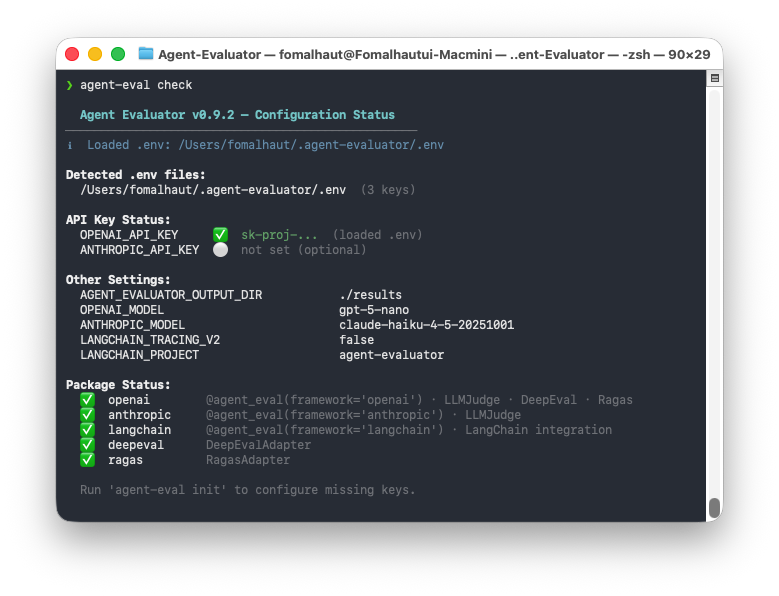
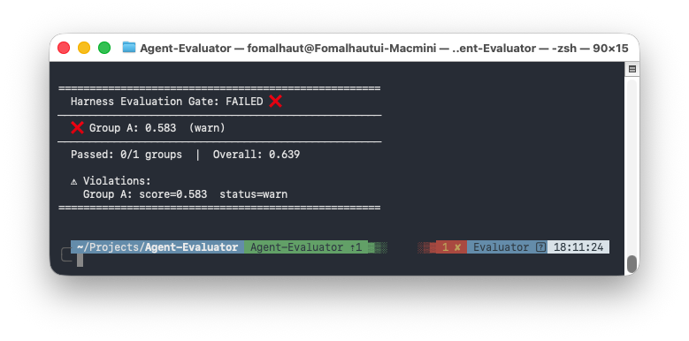
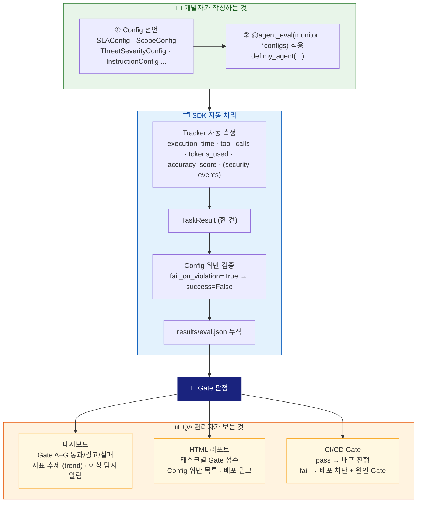
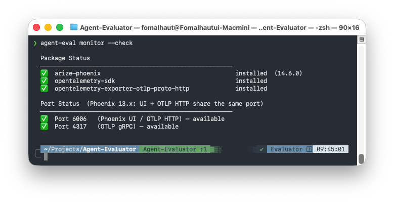
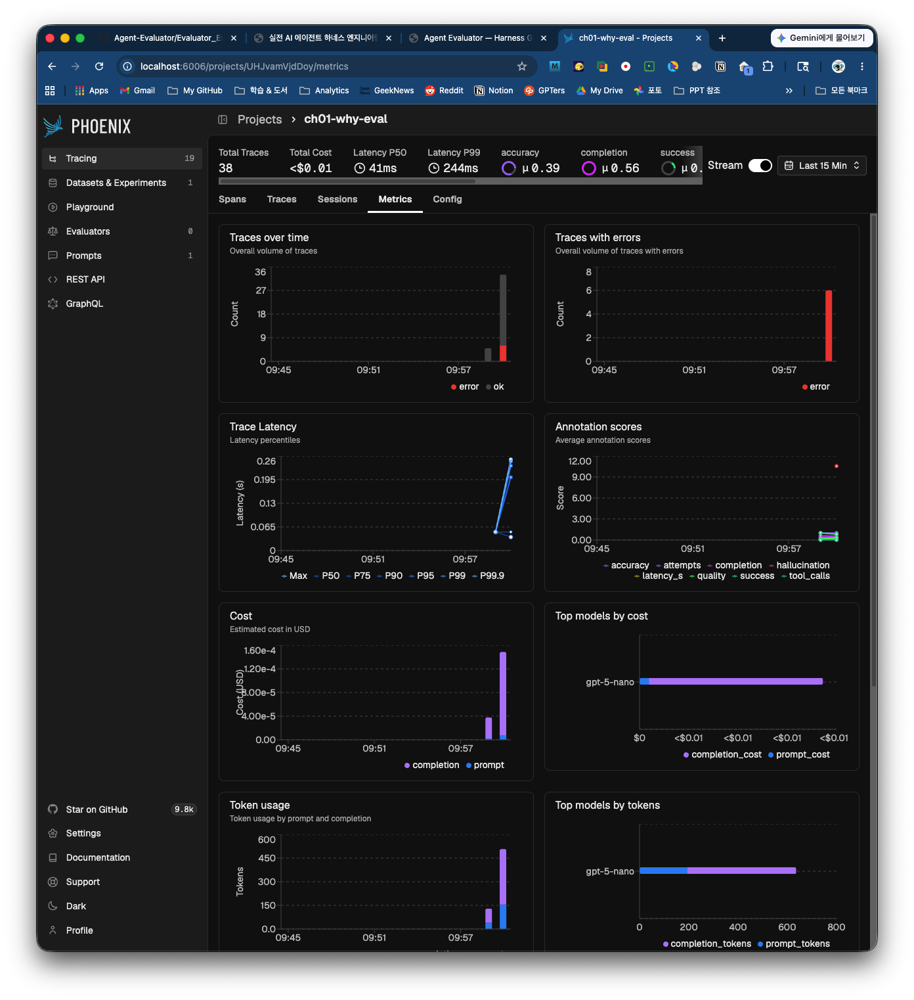
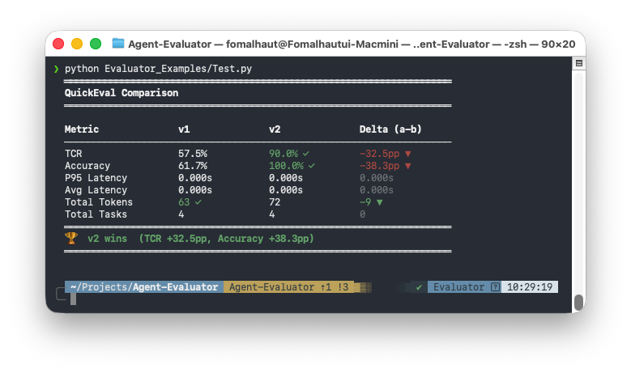

# Chapter 02: Agent-Evaluator 첫 시작

> 좋은 도구는 처음 사용하는 순간부터 작동해야 한다.

---

## 2.1 설치 — 용도별 extras 선택 가이드

Chapter 1에서 자율 에이전트의 배포 준비도를 7개의 독립적인 차원으로 평가해야 한다는 것을 확인했습니다. 목표달성(A)·행동무결성(B)·신뢰성(C)·성능계약(D)·보안경계(E)·다중에이전트(F)·운영관측성(G) — 이 7개 Gate 중 하나라도 검증하지 않고 배포하면 해당 차원에서 예상치 못한 장애가 발생합니다.

**Agent-Evaluator는 이 7차원 평가를 Python SDK로 구현합니다.** Tracker(25개)가 각 차원의 지표를 자동으로 측정하고, Config(33개)가 "어떤 수준이면 배포 가능한가"를 코드로 선언하며, Gate가 7개 차원을 종합해 배포 판정을 내립니다. 이렇게 자율 에이전트를 외부에서 제어·측정·판정하는 SDK 적용은 Prompt Engineering → Context Engineering → Harness Engineering으로 이어진 AI 최적화 방법론의 세 번째 AI-native 공학 패러다임에 해당합니다.

Agent-Evaluator의 기본 설치(`pip install agent-evaluator`)에는 핵심 평가 엔진(LLMJudge 포함)이 포함됩니다. `agent-eval dashboard`와 `agent-eval monitor` 등 CLI 기능 전체를 사용하려면 `[sdk]` extras를 추가하세요.

### 기본 설치에 포함된 기능

| 기능 | 패키지 | Harness 관련 |
|---|---|---|
| 25개 네이티브 트래커 (Gate A-G) | numpy, pandas, python-dotenv | 전 Gate |
| 33개 Harness Config 데이터클래스 | 코어 내장 | 전 Gate |
| LLM Judge 엔진 (Gate G) | openai, anthropic | Gate G |

### SDK extras — CLI 기능 전체 활성화

| extras | 포함 패키지 | CLI 명령 |
|---|---|---|
| `[serve]` | fastapi, uvicorn, jinja2, python-multipart | `agent-eval dashboard` |
| `[otel]` | opentelemetry-sdk, arize-phoenix ≥15.4.0 | `agent-eval monitor` |
| `[pdf]` | pdfplumber | 한국어 RAG PDF 처리 |
| **`[sdk]`** | serve + otel + pdf 묶음 | **전체 CLI (권장)** |

### 별도 설치가 필요한 extras

| extras | 포함 패키지 | 사용 시기 |
|---|---|---|
| `[eval]` | deepeval, ragas, datasets | 외부 평가 도구 연동 (HybridPerformanceMonitor) |
| `[langchain]` | langchain, langchain-core, langgraph | LangChain/LangGraph 프레임워크 사용 시 |
| `[dspy]` | dspy-ai | DSPy 프로그램 평가 |
| `[pydanticai]` | pydantic-ai | PydanticAI Agent 평가 |
| `[crewai]` | crewai | CrewAI (전이 의존성 100개+, 단독 설치 권장) |
| `[autogen]` | pyautogen, autogen-agentchat | AutoGen (무거움, 단독 설치 권장) |
| `[examples]` | sdk + eval 묶음 | 모든 예제 실행 |
| `[full]` | 위 전체 | 모든 기능 (설치 10분+ 소요) |

```bash
# 기본 설치 — 33개 Harness Config + LLMJudge 포함
pip install agent-evaluator

# SDK 전체 — 대시보드 + OTEL 모니터링 + PDF (권장)
pip install "agent-evaluator[sdk]"

# 개별 SDK 기능
pip install "agent-evaluator[serve]"    # agent-eval dashboard만
pip install "agent-evaluator[otel]"     # agent-eval monitor만

# LangChain 프레임워크 통합
pip install "agent-evaluator[langchain]"

# DeepEval/Ragas 외부 평가 도구 연동
pip install "agent-evaluator[eval]"

# 모든 예제 실행
pip install "agent-evaluator[examples]"

# 전체 설치 (⚠️ crewai/autogen 포함, 10분+)
pip install "agent-evaluator[full]"

# pipx 글로벌 설치 (zsh는 따옴표 필수)
pipx install 'agent-evaluator[sdk]'

# 설치 확인
agent-eval --version
# → agent-evaluator 0.9.6
```

> 👨‍💻 **개발자 TIP**: `[crewai]`와 `[autogen]`은 의존성이 무거워 단독 extras로 분리되어 있습니다. CrewAI와 AutoGen을 동시에 설치하면 pydantic 버전 충돌이 발생할 수 있으므로, 필요한 경우에만 하나씩 설치하세요.

---

## 2.2 환경 변수 설정

Agent-Evaluator는 소스 코드에 API 키를 하드코딩하지 않는 것을 원칙으로 합니다. 설정 방법은 두 가지입니다. **처음 설치한다면 `agent-eval init`이 가장 빠릅니다.**

### agent-eval init — 대화형 설정 마법사 (권장)

터미널에서 한 번만 실행하면 됩니다. 마법사가 단계별로 API 키를 물어보고 `.env` 파일을 자동으로 생성합니다.

```bash
agent-eval init
```

실행 예시:

```
  Agent Evaluator v0.9.7 — Setup Wizard
──────────────────────────────────────────────────
  No .env file found. A new one will be created.

[1/3] OpenAI API Key  required
  Used for: LLM Judge (GPT-4o), accuracy evaluation
  Get key: https://platform.openai.com/api-keys
  Current value: not set
  Enter API key (blank to skip): ********

  → Will be saved  sk-...xxxx

[2/3] Anthropic API Key  optional
  Used for: LLM Judge (Claude), evaluation
  Get key: https://console.anthropic.com/
  Current value: not set
  Enter API key (blank to skip): ********

  → Will be saved  sk-ant-...xxxx

✅  .env saved: /path/to/project/.env
```

이미 `.env` 파일이 있으면 기존 키를 보여주고 유지 여부를 묻습니다. API 키 없이 예제를 먼저 실행해보고 싶다면 Enter를 눌러 건너뛸 수 있습니다 (ch02~ch26 예제 전체는 API 키 없이 실행 가능).

### agent-eval check — 설정 상태 확인

`init` 이후 설정이 올바르게 반영됐는지 확인합니다.

```bash
agent-eval check
```

실행 예시:



키 옆에 ✅가 표시되고 `(.env)` 출처가 확인되면 준비 완료입니다. ❌가 보이면 `agent-eval init`을 다시 실행하세요.

### 수동 설정 — .env 파일 직접 작성

IDE나 CI 환경에서 직접 `.env`를 편집하고 싶을 때 사용합니다.

```bash
# .env (프로젝트 루트에 생성)

# LLM API 키 (Gate G — LLM Judge 사용 시 필요)
OPENAI_API_KEY=sk-...
ANTHROPIC_API_KEY=sk-ant-...

# 결과 저장 경로 (생략 시 자동 감지)
# AGENT_EVALUATOR_OUTPUT_DIR=/path/to/results
# AGENT_EVALUATOR_ROOT=/path/to/project
```

### 파이썬 코드에서 .env 로드하기

`.env` 파일을 만든 뒤, 예제 파일 상단에서 다음과 같이 로드합니다.

```python
# 출처: Evaluator_Examples/ch02_quickstart.py
# 방법 1: SDK가 자동 로드 (권장)
from agent_evaluator import load_env
load_env()  # 스크립트가 위치한 디렉토리부터 상위로 .env를 탐색해 로드

# 개념 코드 — python-dotenv 직접 사용 (대안 패턴)
from dotenv import load_dotenv
load_dotenv()
```

- **`load_env()`**: 스크립트 파일이 위치한 디렉토리부터 상위 방향으로 `.env`를 탐색해 처음 발견된 파일을 로드한다. `pip install` 또는 `pipx install`로 설치한 환경에서 스크립트를 어느 위치에서 실행하든 프로젝트 루트의 `.env`를 자동으로 찾는다.
- **`load_dotenv()`**: `python-dotenv`를 직접 사용하며, 현재 작업 디렉토리(`cwd`) 기준으로 `.env`를 탐색한다. 실행 경로가 달라지면 `.env`를 찾지 못할 수 있다.

**저장 경로 자동 감지**: `output_dir`를 별도로 지정하지 않으면 SDK가 다음 순서로 경로를 자동 결정합니다.

1. 환경 변수 `AGENT_EVALUATOR_OUTPUT_DIR` (최우선)
2. 환경 변수 `AGENT_EVALUATOR_ROOT` 아래 `results/`
3. 현재 작업 디렉토리 아래 `results/` (폴백)

`AGENT_EVALUATOR_OUTPUT_DIR`를 `.env`에 명시하면 설치 위치나 실행 경로에 관계없이 결과가 항상 같은 경로에 저장됩니다.

> 📋 **QA 관리자 TIP**: `.env` 파일은 `.gitignore`에 반드시 추가하세요. API 키가 저장소에 노출되면 심각한 보안 문제가 발생할 수 있습니다. `.env.example` 파일을 만들어 팀원이 필요한 변수 목록을 알 수 있도록 공유하는 것을 권장합니다.

> 👨‍💻 **개발자 TIP**: 스크립트 내에서 `.env`를 자동 로드하려면 스크립트 최상단에 `load_env()`를 가장 먼저 호출하세요. 스크립트가 있는 디렉토리에서 상위로 `.env`를 탐색해 로드합니다. `enable_llm_judge=True` 등 API 키가 필요한 기능을 쓸 때 반드시 선행 호출해야 합니다.
> ```python
> from agent_evaluator import PerformanceMonitor, load_env
> load_env()  # .env → ANTHROPIC_API_KEY, OPENAI_API_KEY 자동 로드
> monitor = PerformanceMonitor(output_dir="results/", enable_llm_judge=True)
> ```

> 📖 **더 깊이 알고 싶다면**: 지원되는 환경변수 전체 목록과 각 변수의 동작 방식은 **[Appendix C — 환경변수 & 설정 레퍼런스](../Appendix/C_환경변수_설정_레퍼런스.md)**를 참조하세요.

---

## 2.3 5분 안에 첫 Harness 배포 판정 경험

Chapter 1에서 정의한 7개 Gate는 추상적인 개념이 아닙니다. Agent-Evaluator를 실행하면 Tracker가 각 차원을 즉시 측정하고, Gate가 실제로 PASS/FAIL 판정을 내립니다.

이 실습에서 Harness 3요소를 순서대로 경험합니다.

- **단계 1–3** — `@eval_q.qa` 데코레이터가 **Tracker**를 자동 활성화합니다. 에이전트 함수를 감싸기만 하면 AccuracyEvaluator·LatencyTracker 등이 즉시 작동합니다.
- **단계 4** — `eval_q.gate(tcr=80, accuracy=70)`가 **Gate** 역할을 합니다. 기준 미달 시 `sys.exit(1)`로 파이프라인을 차단합니다.
- **단계 4 확장** — `SLAConfig`, `InstructionConfig`를 추가하면 **Config**가 합류합니다. 배포 기준을 코드로 선언하는 패턴입니다.

가장 짧은 코드로 이 흐름을 직접 확인해봅니다.

> **📌 예제 파일의 에이전트 구현 방식 — Mock 패턴**
>
> 이 책의 모든 예제 파일(`ch02_quickstart.py` ~ `ch26_cicd_weekly.py`)은 **실제 LLM API를 호출하지 않습니다.** 에이전트 함수 내부는 딕셔너리 조회, 조건 분기, 또는 `time.sleep()`을 이용한 시뮬레이션으로 구현합니다.
>
> ```python
> # 예제 파일의 전형적인 패턴 — 평가 프레임워크를 가르치기 위한 의도적 설계
> eval_q = QuickEval("results/")
>
> @eval_q.qa
> def my_agent(question: str, ground_truth: str = "") -> str:
>     # TODO(현업 적용): 아래를 실제 LLM 호출로 교체하세요.
>     answers = {
>         "한국의 수도는?":     "서울입니다.",
>         "파이썬 창시자는?":   "귀도 반 로섬입니다.",
>         "지구의 위성 이름은?": "달입니다.",
>     }
>     return answers.get(question, "모르겠습니다.")
> ```
>
> **① API 키 없이 즉시 실행**: `pip install agent-evaluator` 한 줄로 ch02~ch26 전체 예제를 바로 실행할 수 있습니다. `OPENAI_API_KEY`·`ANTHROPIC_API_KEY`가 없어도 됩니다.
>
> **② 평가 시나리오 정밀 제어**: Gate C(신뢰성)를 가르칠 때 "3번 중 1번 장애가 발생하는 에이전트"가 필요합니다. 실제 LLM으로는 이 시나리오를 재현할 수 없지만, 조건 코드로는 정확히 제어됩니다. Gate D(성능계약) SLA 교육을 위한 지연 시뮬레이션도 마찬가지입니다.
>
> ```python
> import time, random
> from agent_evaluator import PerformanceMonitor, FaultToleranceConfig, SLAConfig, agent_eval, RetryConfig, EvalMetadata
>
> monitor = PerformanceMonitor(output_dir="results/")
>
> # Gate C — FaultToleranceConfig + RetryConfig: 3번 중 1번 RuntimeError → 폴백 (ch06_group_c.py)
> _fault_call_count = {"n": 0}
>
> @agent_eval(monitor, task_type="tool_use",
>     fault_tolerance=FaultToleranceConfig(check_fallback_attempts=True, partial_success_threshold=0.5),
>     retry=RetryConfig(max=2, on=(RuntimeError,), delay=0.0))
> def fault_tolerant_agent(question: str, ground_truth: str = "") -> str:
>     _fault_call_count["n"] += 1
>     try:
>         if _fault_call_count["n"] % 3 == 1:
>             raise RuntimeError("외부 API 타임아웃 발생")   # 의도적 장애 시뮬레이션
>         return f"정상 처리 완료: {question}"
>     except RuntimeError as e:
>         return f"부분 완료(폴백): 외부 도구 일시 오류({e})로 인해 캐시 데이터로 응답합니다."
>
> # Gate D — SLAConfig + EvalMetadata: TTFT 측정 + p95/p99 계약 (ch03_harness_basics.py)
> @agent_eval(monitor, task_type="qa",
>     sla=SLAConfig(p95_ms=2000, p99_ms=5000))
> def gate_d_agent(question: str, ground_truth: str = "") -> tuple:
>     t0 = time.perf_counter()
>     time.sleep(random.uniform(0.05, 0.2))           # 50~200ms 랜덤 지연
>     ttft = (time.perf_counter() - t0) * 1000
>     return f"SLA 준수 응답: {question}", EvalMetadata(
>         extra={"ttft_ms": round(ttft, 1)},
>         tokens_used={"input": 80, "output": 150, "total": 230},
>     )
> ```
>
> **③ CI/CD 비용 제로**: ch18·ch26 예제는 push마다 자동 실행됩니다. LLM API 호출이라면 매 실행마다 비용이 발생하지만, Mock은 0원입니다.
>
> **④ 독자 코드와 교체 방식 동일**: 자신의 LLM 에이전트에 SDK를 연결할 때 **함수 내부 한 줄만 교체**하면 됩니다. Harness Config·Gate·저장 코드는 그대로 유지됩니다.
>
> ```python
> # Mock (예제 파일) → 실제 LLM (독자 코드): 함수 내부 한 줄만 교체
> @agent_eval(monitor, task_type="qa", sla=SLAConfig(p95_ms=2000))
> def my_agent(question: str, ground_truth: str = "") -> str:
>     return "하드코딩 응답"           # ← Mock
>     # return llm.invoke(question)  # ← 실제 LLM으로 교체 시 이 줄로 변경
> ```
>
> 이 책이 가르치는 Harness Config·Gate·저장 방식은 **에이전트 내부 구현과 완전히 독립적**입니다. Mock이든 실제 LLM이든 평가 결과 구조는 동일합니다.

### 단계 1 — QuickEval로 측정 시작

```python
# 출처: Evaluator_Examples/ch02_quickstart.py
from agent_evaluator import QuickEval

# QuickEval은 PerformanceMonitor + EvalDecorator를 하나로 감싼 Facade
eval_q = QuickEval("results/")
```

- **`QuickEval`**: `PerformanceMonitor`와 `EvalDecorator`를 1줄로 초기화하는 Facade 클래스다.
- **`"results/"`**: 평가 결과 JSON·HTML 파일이 저장될 디렉토리 경로다. 디렉토리가 없으면 자동으로 생성된다.
- **내부 동작**: `PerformanceMonitor(output_dir="results/", use_korean_tokenizer=True)` 인스턴스를 생성하고, 단축 데코레이터(`qa`, `rag`, `tool_use` 등)를 제공한다.

### 단계 2 — 에이전트 함수에 데코레이터 적용

```python
# 기반 코드 — @eval_q.qa 데코레이터 패턴 (단순화 버전, 실행: ch02_quickstart.py 섹션 1)
@eval_q.qa  # Gate A 목표달성: AccuracyEvaluator + TCR 자동 측정
def my_agent(question: str, ground_truth: str = "") -> str:
    # TODO(현업 적용): 아래 Mock 구현을 실제 LLM 호출로 교체하세요.
    #   예) return client.chat.completions.create(model="gpt-5-nano",
    #        messages=[{"role":"user","content":question}]).choices[0].message.content
    answers = {
        "한국의 수도는?": "서울입니다.",
        "파이썬 창시자는?": "귀도 반 로섬입니다.",
    }
    return answers.get(question, "모르겠습니다.")
```

- **`@eval_q.qa`**: `task_type="qa"`로 설정된 `@agent_eval` 데코레이터의 단축형으로, Gate A `AccuracyEvaluator`와 `TaskCompletionTracker`를 자동 활성화한다.
- **함수 시그니처**: `question`과 `ground_truth`를 파라미터로 받는 것이 규칙이다. `ground_truth`는 데코레이터가 정확도 계산에 사용하며 기본값 `""`으로 두면 생략 가능하다.
- **반환값**: 문자열을 반환하면 데코레이터가 `ground_truth`와 비교해 `accuracy_score`를 자동 계산한다.

### 단계 3 — 평가 실행

```python
my_agent("한국의 수도는?", ground_truth="서울입니다.")
my_agent("파이썬 창시자는?", ground_truth="귀도 반 로섬입니다.")
my_agent("우주의 나이는?", ground_truth="138억 년")
```

- **호출 방식**: 일반 함수처럼 호출하면 데코레이터가 실행 시간을 측정하고 `ground_truth`와 응답을 비교해 `TaskResult`를 자동 생성한다.
- **세 번째 케이스**: 딕셔너리에 없는 질문이므로 `"모르겠습니다."`를 반환하고 `ground_truth="138억 년"`과 비교해 낮은 정확도가 기록된다.
- **누적 저장**: 각 호출 결과가 `eval_q` 내부 버퍼에 누적되며, `save()` 또는 `gate()` 호출 시 한꺼번에 처리된다.

### 단계 4 — 첫 배포 판정 (Gate)

```python
# 기반 코드 — gate/save/summary 패턴 (단순화 버전, 실행: ch02_quickstart.py 섹션 1)
summary = eval_q.summary()
print(f"  TCR: {summary['tcr']:.1f}%  |  Accuracy: {summary['accuracy']:.1f}%"
      f"  |  p95: {summary.get('p95_latency', 0):.3f}s")

# Harness Gate — 배포 기준 선언 및 판정
eval_q.gate(tcr=80, accuracy=70)   # TCR < 80% 또는 Accuracy < 70% → sys.exit(1)

eval_q.save("ch02_quickstart")     # gate 통과 시에만 실행 — results/ch02_quickstart.json + .html
```

- **`eval_q.summary()`**: 주요 지표 요약 딕셔너리를 반환한다. `tcr`·`accuracy`·`quality_avg`는 **0–100 백분율**, `p95_latency`는 **초(s) 단위**이다.
- **`eval_q.gate(tcr=80, accuracy=70)`**: TCR이 80% 미만이거나 평균 정확도가 70% 미만이면 `sys.exit(1)`을 호출해 CI/CD 파이프라인을 차단한다. **이 줄 이후 코드는 Gate 통과 시에만 실행된다.**
- **`eval_q.save("ch02_quickstart")`**: `results/ch02_quickstart.json`과 `results/ch02_quickstart.html`을 동시에 생성한다.

실행 출력:

```
  TCR: 76.7%  |  Accuracy: 66.7%  |  p95: 0.000s

QuickEval quality gate failed:
  - TCR 76.7% < required 80%
  - Accuracy 66.7% < required 70%
```

단계 3에서 '우주의 나이는?' 케이스에서 `"모르겠습니다."`를 반환해 세 번째 태스크의 정확도가 크게 낮아지고, 그 결과 평균 정확도가 66.7%로, TCR은 76.7%로 각각 하락합니다(두 지표는 서로 다른 계산식이라 값이 다릅니다). `gate()`가 이를 감지해 `sys.exit(1)`을 호출합니다. **코드를 고쳐서 TCR이 80%를 넘기고 정확도가 70%를 넘길 때까지 배포는 차단됩니다.**

### Harness Config로 기준을 더 세밀하게

`gate()`는 간단한 단일 임계값 판정입니다. 더 복잡한 배포 기준은 **Harness Config** 데이터클래스로 선언합니다.

```python
# 기반 코드 — Harness Config 선언 및 통합 (단순화 버전, 실행: ch02_quickstart.py 섹션 2)
from agent_evaluator import (
    PerformanceMonitor, HarnessEvaluationGate, agent_eval,
    InstructionConfig,    # Gate A — 지시 준수
    SLAConfig,           # Gate D — 레이턴시 계약
)

monitor_h = PerformanceMonitor(output_dir="results/", use_korean_tokenizer=True)

# Config 선언 — 배포 기준을 소스 코드로 명세
instruction_cfg = InstructionConfig(
    required_keywords=["완료", "처리"],  # 응답에 "완료" 또는 "처리" 포함 필수
    fail_on_violation=True,              # 위반 시 해당 태스크 success=False
    violation_weight=0.5,                # 기본값 0.1 → 0.5로 강화 (Gate A FAIL 유도)
)
sla_cfg = SLAConfig(
    p95_ms=2000,                         # p95 응답 시간 2초 이하
)

# Tracker + Config 통합 — @agent_eval이 실행마다 Config 검증
@agent_eval(
    monitor_h,
    task_type="qa",
    instructions=instruction_cfg,
    sla=sla_cfg,
)
def task_agent(question: str, ground_truth: str = "") -> str:
    # TODO(현업 적용): 아래를 실제 LLM 호출로 교체하세요.
    #   예) return client.chat.completions.create(model="gpt-5-nano",
    #        messages=[{"role":"user","content":question}]).choices[0].message.content
    responses = {
        # "완료"/"처리"는 경계 인식 매칭으로 검사되므로, "완료되었습니다"처럼 조사가
        # 아닌 음절이 바로 뒤에 붙으면 매칭되지 않는다. "완료" 뒤에 문장부호가 오도록
        # 작성해야 실제로 두 키워드 모두 인식된다.
        "파일 삭제해줘":    "파일 삭제 처리 완료!",            # ✅ 키워드 포함
        "보고서 만들어줘":  "보고서 작성 중입니다.",           # ❌ 키워드 없음
        "데이터 분석해줘":  "분석 결과: 평균 42.5입니다.",     # ❌ 키워드 없음
    }
    return responses.get(question, "요청을 처리 완료했습니다.")

# 평가 실행 — 3케이스 호출 (2건 의도적 키워드 누락 → Gate A FAIL 유도)
TASK_CASES = [
    ("파일 삭제해줘",   "삭제 완료"),   # ✅ success=True
    ("보고서 만들어줘", "작성 완료"),   # ❌ success=False (키워드 없음)
    ("데이터 분석해줘", "분석 완료"),   # ❌ success=False (키워드 없음)
]
for question, gt in TASK_CASES:
    task_agent(question, ground_truth=gt)

# 결과 저장 — gate.enforce() 앞에 배치해야 sys.exit(1) 이후에도 파일이 보존됩니다
monitor_h.save_to_file("ch02_harness")   # results/ch02_harness.json + .html

# Gate — 선언한 InstructionConfig에 해당하는 Gate A만 검사
report = monitor_h.generate_report()
gate = HarnessEvaluationGate(report, required_groups=["A"])
gate.enforce()
```

- **Config 선언 패턴**: `InstructionConfig`, `SLAConfig` 등의 Config 객체를 먼저 만들고, `@agent_eval`의 파라미터로 전달하면 실행마다 자동 검증된다.
- **`fail_on_violation=True` + `violation_weight=0.5`**: `fail_on_violation`은 위반 태스크를 `success=False`로 처리하고, `violation_weight`는 IFR 차감량을 결정한다. 기본값 0.1은 점진적 도입을 위한 관대한 설정이고, 0.5는 엄격한 키워드 준수를 요구한다. Gate A는 TCR과 IFR의 단순 평균으로 계산된다.
- **`HarnessEvaluationGate(report, required_groups=["A"]).enforce()`**: `generate_report()` 결과를 받아 `required_groups`에 선언한 Gate만 판정한다. `required_groups=["A"]`이므로 `InstructionConfig`에 대응하는 Gate A만 검사하고, 기준 미달이면 `sys.exit(1)`을 호출한다.
- **`QuickEval.gate()` vs `HarnessEvaluationGate`**: 전자는 TCR·정확도 단순 임계값, 후자는 선언한 Config에 해당하는 Gate를 정밀 판정한다.

실행 출력 — Gate A(지시 준수) 기준 미달:


**Gate A는 0.549(warn)**입니다. 계산 과정을 단계별로 살펴봅니다.

**① TCR(Task Completion Rate, 태스크 완료율) — `completion_score` 기반, `success` 플래그 아님**

TCR은 `success` 플래그가 아닌 `completion_score`의 평균으로 계산됩니다. `completion_score`는 응답과 ground_truth의 Jaccard 유사도(정규화된 공백 단위 토큰)를 3단계로 나눠 매깁니다 — 유사도 ≥0.8이면 1.0, ≥0.5면 0.7, 그 미만이면 0.5.

| 태스크 | 응답(정규화) | ground_truth(정규화) | Jaccard | completion_score |
|---|---|---|---|---|
| 파일 삭제해줘 | 파일 삭제 처리 완료 | 삭제 완료 | 2/4 = 0.50 | 0.7 |
| 보고서 만들어줘 | 보고서 작성 중입니다 | 작성 완료 | 1/4 = 0.25 | 0.5 |
| 데이터 분석해줘 | 분석 결과 평균 425입니다 | 분석 완료 | 1/5 = 0.20 | 0.5 |

> "완료"는 경계 인식 매칭으로 검사되므로, `task_agent`의 응답이 "완료되었습니다"처럼 조사가 아닌 음절이 바로 뒤에 붙는 형태면 키워드가 인식되지 않는다(→ IFR·Jaccard 토큰화 모두에 영향). 위 응답은 "완료!"처럼 키워드 뒤에 문장부호를 둬 실제로 인식되도록 작성했다.

TCR = (0.7 + 0.5 + 0.5) / 3 × 100 = **56.7%**

`fail_on_violation=True`는 위반 태스크를 `success=False`로 처리하지만, TCR 계산에 직접 영향을 주지 않습니다. `success` 플래그는 `HarnessEvaluationGate` 판정이 아닌 개별 태스크 리포트(`report.tasks[n].success`) 조회에 사용됩니다.

**② IFR(Instruction-Following Rate, 지시 추적율) — 키워드 위반 차감**

IFR 공식: `max(0.0, 1.0 − violation_count × violation_weight)`

`violation_count`는 위반 항목(필수 키워드 누락, 형식 불일치 등) **종류** 수입니다. `required_keywords`에 누락 키워드가 여러 개여도 "필수 키워드 누락" 항목 1건으로 집계됩니다.

| 태스크 | "완료" | "처리" | violation_count | IFR (weight=**0.1**) | IFR (weight=**0.5**) |
|---|---|---|---|---|---|
| 파일 삭제해줘 | ✅ | ✅ | 0 | 1.0 | 1.0 |
| 보고서 만들어줘 | ✗ | ✗ | 1 | 1.0 − 0.1 = **0.9** | 1.0 − 0.5 = **0.5** |
| 데이터 분석해줘 | ✗ | ✗ | 1 | 1.0 − 0.1 = **0.9** | 1.0 − 0.5 = **0.5** |
| **avg_IFR** | | | | **(1.0+0.9+0.9)/3 = 0.933** | **(1.0+0.5+0.5)/3 = 0.667** |

**③ Gate A 점수 — TCR·정확도·품질·IFR의 가중 평균**

Gate A는 TCR과 IFR 두 값만의 단순 평균이 아닙니다. 실제로는 ①`AccuracyEvaluator`가 계산한 정확도를 `0.6×TCR + 0.4×정확도`로 TCR과 블렌딩하고, ②그 블렌딩 값과 `ResponseQualityEvaluator`(품질)·`avg_instruction_adherence`(IFR)의 평균을, `gate_a_tcr_weight`(기본값 0.4)로 가중 평균합니다. 이 예제는 violation_weight=0.5이므로 avg_IFR=0.667이 적용되고, 실측값은 다음과 같습니다.

| 구성요소 | 측정값 |
|---|---|
| TCR | 56.7% |
| 정확도(AccuracyEvaluator 평균) | 39.6% |
| 품질(ResponseQualityEvaluator 평균) | 0.500 |
| avg_instruction_adherence(IFR) | 0.667 |
| **Gate A 점수** | **0.549 → ⚠️ warn** |

TCR·IFR 두 값만으로는 이 점수가 정확히 역산되지 않습니다 — 정확도·품질 항목까지 포함된 전체 가중치 공식은 **Chapter 3 §3.3**에서 다룹니다. 지금은 "TCR과 IFR이 낮아지면 Gate A 점수도 함께 낮아진다"는 방향성만 기억하면 충분합니다. `violation_weight`를 기본값 0.1로 낮추면 avg_IFR이 0.933으로 올라가 Gate A 점수도 함께 상승합니다.

Gate A 점수 0.549는 `HarnessEvaluationGate.__init__`의 기본 파라미터 `min_group_score=0.7`에 미달하므로 `passed=False`가 되고 `sys.exit(1)`을 호출합니다. 예제 코드 `HarnessEvaluationGate(report, required_groups=["A"])`에는 `min_group_score`를 지정하지 않았으므로 SDK 기본값 0.7이 적용됩니다. 출력에 표시되는 `warn` 상태는 score 범위(0.5 ≤ score < 0.7)에 따른 레이블일 뿐이며, 게이트 통과 여부는 `score >= min_group_score` 비교로만 결정됩니다. `HarnessEvaluationGate(report, required_groups=["A"], min_group_score=0.5)`로 임계값을 낮추면 같은 0.549 점수도 통과합니다.

`monitor_h.save_to_file("ch02_harness")`를 `gate.enforce()` 앞에 두면 Gate 판정 실패로 `sys.exit(1)`이 호출되더라도 `results/ch02_harness.json`과 `results/ch02_harness.html`이 반드시 저장됩니다. HTML 파일을 브라우저에서 열면 Gate A–G별 시각화 리포트를 확인할 수 있습니다.


> 📋 **QA 관리자 TIP**: `gate(tcr=80)` 단일 임계값으로 시작하고, 팀이 익숙해지면 `InstructionConfig`, `SLAConfig`, `ThreatSeverityConfig`로 세분화하세요. Part IV — Chapter 14에서 팀 수준 임계값 설정 전략을 다룹니다.

> 👨‍💻 **개발자 TIP**: `HarnessEvaluationGate(report).evaluate()`는 Gate별 점수에 직접 접근할 수 있는 dict를 반환합니다. CI 스크립트에서 커스텀 알림·승인 로직을 추가할 때 유용합니다.
> ```python
> result = gate.evaluate()
> # result["groups"]["A"]["score"] → float | None
> # result["violations"]           → [{"group": "A", "score": 0.53, "status": "warn"}]
> # result["summary"]["overall_score"] → float | None
> ```
> 배포 차단만 필요하다면 `gate.enforce(exit_on_fail=True)`를 사용하면 실패 시 `sys.exit(1)`을 자동 호출합니다.

방금 5분 실습에서 `@eval_q.qa`, `eval_q.gate()`, `SLAConfig`를 경험했습니다. 이 코드가 내부적으로 어떻게 작동하는지 — Layer 구조, 3요소의 책임 분리, 58개 지표의 구성 방식 — 를 살펴봅니다.

---

## 2.4 Agent-Evaluator 아키텍처

Agent-Evaluator의 58개 지표는 **3개 레이어(Layer)**와 **3가지 역할(Tracker·Config·Gate)**, 그리고 **7개 Gate(A–G)**로 구성됩니다. 세 관점을 함께 이해하면 어느 시점에 어떤 도구를 선택해야 하는지 판단할 수 있습니다.

### 레이어 구조 — 외부 의존성 경계

@@HTML_START@@
<div class="la-wrap">
  <div class="la-header">
    PerformanceMonitor
    <span>중앙 오케스트레이터 — 모든 Tracker · Config · Gate 총괄</span>
  </div>
  <div class="la-grid">
    <div class="la-layer" style="--lc:#2e7d32;--lb:#e8f5e9">
      <div class="la-ltitle">Layer 1 — Foundation</div>
      <div class="la-ldesc">외부 의존성 없음 · 기본 설치에 포함<br/>Gate A · D 담당</div>
      <ul class="la-list">
        <li><code>TaskCompletionTracker</code><span class="la-meta">TCR · Gate A</span></li>
        <li><code>AccuracyEvaluator</code><span class="la-meta">4중 가중 정확도 · Gate A</span></li>
        <li><code>ResponseQualityEvaluator</code><span class="la-meta">5차원 품질 · Gate A</span></li>
        <li><code>LatencyTracker</code><span class="la-meta">p50·p95·p99 · Gate D</span></li>
        <li><code>TokenEconomyTracker</code><span class="la-meta">비용 추정 · Gate D</span></li>
        <li><code>HallucinationDetector</code><span class="la-meta">환각 탐지 · Gate C·G (opt-in)</span></li>
      </ul>
    </div>
    <div class="la-layer" style="--lc:#1565c0;--lb:#e3f2fd">
      <div class="la-ltitle">Layer 2 — Agentic</div>
      <div class="la-ldesc">외부 의존성 없음 · 기본 설치에 포함<br/>Gate B · C · E · F 담당</div>
      <ul class="la-list">
        <li><code>ToolCallAnalyzer</code><span class="la-meta">도구 패턴 · Gate B</span></li>
        <li><code>WorkflowExecutionTracker</code><span class="la-meta">워크플로우 · Gate B</span></li>
        <li><code>RetryCorrectionTracker</code><span class="la-meta">재시도 · Gate C</span></li>
        <li><code>ToolSelectionTracker</code><span class="la-meta">F1 정확도 · Gate F</span></li>
        <li><code>AgentCoordinationTracker</code><span class="la-meta">협업 · Gate F</span></li>
        <li><code>보안 Tracker ×5</code><span class="la-meta">위협 탐지 · Gate E (opt-in)</span></li>
      </ul>
    </div>
    <div class="la-layer" style="--lc:#e65100;--lb:#fff3e0">
      <div class="la-ltitle">Layer 3 — Hybrid</div>
      <div class="la-ldesc">선택적 의존성<br/>API 키 또는 [eval] extra</div>
      <ul class="la-list">
        <li><code>LLMJudge</code><span class="la-meta">faithfulness · G-Eval · 5차원 기본 채점 (context 제공 시 faithfulness 추가 = 최대 6차원) · Gate G<br/>기본 설치 내장, API 키 필요</span></li>
        <li><code>DeepEvalAdapter</code><span class="la-meta">DeepEval 연동 · [eval] extra</span></li>
        <li><code>RagasAdapter</code><span class="la-meta">Ragas RAG 평가 · [eval] extra</span></li>
        <li><code>HybridPerformanceMonitor</code><span class="la-meta">Layer 1+2+외부 통합 · [eval] extra</span></li>
      </ul>
    </div>
  </div>
</div>
@@HTML_END@@

---

### Harness Engineering 3요소

측정·기준·판정은 서로 다른 시점에 동작합니다. **Tracker**가 측정하고, **Config**가 기준을 선언하고, **Gate**가 배포 가능 여부를 판정합니다.

| 역할 | 구성 | 설명 |
|------|------|------|
| **🚦 Gate** | `HarnessEvaluationGate` | Gate A–G 전체 Config를 종합해 배포 통과/실패 판정. `.enforce()` / `QuickEval.gate()` / `agent-eval gate` CLI |
| **📋 Config** | 33개 Harness Config 데이터클래스 | 배포 기준을 소스 코드로 선언. `fail_on_violation=True` 시 위반 태스크 즉시 `success=False` 처리 |
| **🔍 Tracker** | 25개 네이티브 트래커 | Gate 직접 매핑 16종 (자동 활성 10 + opt-in 6) + 운영 지원 9종 |

**Harness Gate 직접 매핑 Tracker — 16종**

항상 자동 활성 (10종) — Gate A·B·C·D·F 담당:

| Tracker | 측정 지표 | Gate |
|---------|----------|------|
| `TaskCompletionTracker` | TCR | A |
| `AccuracyEvaluator` | 4중 가중 정확도 | A |
| `ResponseQualityEvaluator` | 5차원 품질 | A |
| `LatencyTracker` | p50 · p95 · p99 | D |
| `TokenEconomyTracker` | 비용 추정 | D |
| `ToolCallAnalyzer` | 도구 패턴 | B |
| `WorkflowExecutionTracker` | 워크플로우 | B |
| `AgentCoordinationTracker` | 협업 품질 | F |
| `ToolSelectionTracker` | F1 정확도 | F |
| `RetryCorrectionTracker` | 재시도 패턴 | C |

opt-in (6종) — 성능·비용 영향, 명시적 활성화 필요:

| Tracker | 활성화 방법 | Gate |
|---------|-----------|------|
| `HallucinationDetector` | `enable_hallucination_detection=True` | C/G |
| `InputSanitizationTracker` | `enable_security_metrics=True` | E |
| `OutputLeakageDetector` | `enable_security_metrics=True` | E |
| `ToolAuthorizationTracker` | `enable_security_metrics=True` | E |
| `PrivilegeEscalationDetector` | `enable_security_metrics=True` | E |
| `ToolChainAttackDetector` | `enable_security_metrics=True` | E |

**운영 지원 Tracker — 9종** (멀티턴·피드백·이상탐지·비용·스트리밍)

| Tracker | 역할 |
|---------|------|
| `LLMJudge` | Gate G 5차원 기본 채점, context 제공 시 최대 6차원 (`enable_llm_judge=True` + API 키) |
| `ConversationSession` | 멀티턴 대화 평가 (`@conversation_eval`) |
| `ImplicitFeedbackTracker` | 묵시적 사용자 피드백 수집 |
| `AnomalyDetector` | 지표 이상 탐지 및 경보 |
| `CostTracker` | 비용 추적 및 예산 관리 |
| `AdaptivePolicy` | 샘플링 비용 최적화 정책 |
| `SamplingStage` | 단계별 샘플링 전략 |
| `StreamingEvaluator` | 실시간 스트리밍 평가 |
| `AlertEngine` | 알림 규칙 실행 |

> 합계: Gate 직접 매핑 16종 + 운영 지원 9종 = **Native Tracker 25종**

위 목록은 Tracker에 집중했습니다. **Config 33개**가 어떤 파라미터로 기준을 선언하는지, **Gate**가 어떤 로직으로 종합 판정을 내리는지는 **[Chapter 3 §3.2](../Part_II_지표시스템/Chapter_03_Harness_Engineering_기초.md)**에서 다룹니다.

### 3요소의 실행 타이밍

```
에이전트 실행 → Tracker 자동 기록
                │
                ▼
         TaskResult 생성
                │
                ▼
         Config 검증 ← fail_on_violation=True → success=False
                │
                ▼
         monitor.record_task(result) → EvaluationReport 누적
                │
                ▼ (N건 후 또는 명시적 호출)
         Gate 판정 → pass / fail → 배포 결정
```

### 핵심 구성요소 — 3개 클래스 + 1개 팩토리 함수

Agent-Evaluator의 핵심 구성요소는 세 클래스(`PerformanceMonitor`, `TaskResult`, `EvaluationReport`)와 팩토리 함수(`create_taskresult`)입니다. `@agent_eval` 데코레이터는 이 세 요소를 내부적으로 자동으로 연결하지만, `create_taskresult`로 직접 `TaskResult`를 만들어 `record_task()`로 기록하는 방식도 동일하게 동작합니다.

```
create_taskresult()  →  TaskResult  →  PerformanceMonitor.record_task()
                                              ↓
                                       generate_report()  →  EvaluationReport
```

```python
# 개념 코드 — 핵심 구성요소 연결 흐름
# (실행 가능 전체 예제: Evaluator_Examples/ch02_quickstart.py 참고)
from agent_evaluator import PerformanceMonitor, TaskResult, create_taskresult, EvaluationReport

# ① PerformanceMonitor (class) — 중앙 오케스트레이터
#    모든 Tracker를 내부에서 구성, Config 검증, Gate 판정
monitor = PerformanceMonitor(
    output_dir="results/",
    enable_hallucination_detection=False,  # Gate C/G opt-in (성능 영향)
    enable_security_metrics=False,         # Gate E opt-in (성능 영향)
    enable_llm_judge=False,                # Gate G opt-in (LLM 비용)
    use_korean_tokenizer=True,
)

# ② create_taskresult (함수) → TaskResult (class) 생성
#    question·response·ground_truth로 accuracy_score·completion_score 자동 계산
result: TaskResult = create_taskresult(
    task_id="t001",
    question="한국의 수도는?",
    response="서울입니다.",
    ground_truth="서울입니다.",
    execution_time=0.85,
    task_type="qa",
)
monitor.record_task(result)   # TaskResult → PerformanceMonitor에 누적

# ③ EvaluationReport (class) — generate_report()의 반환 타입
#    record_task()로 누적된 모든 TaskResult를 집계한 보고서
report: EvaluationReport = monitor.generate_report()
# → to_dict()로 직렬화: accuracy_metrics["tcr"]["tcr"], efficiency_metrics["latency"]["p95"] 등
```

- **`PerformanceMonitor` (class)**: Gate A–G의 모든 Tracker를 내부에서 자동 구성하는 중앙 오케스트레이터. `record_task(TaskResult)`로 결과를 누적하고, `generate_report()`로 `EvaluationReport`를 반환한다.
- **`create_taskresult` (팩토리 함수)**: `question`·`response`·`ground_truth`를 받아 `accuracy_score`(TokenOverlapF1 40% + Jaccard 30% + LCS 20% + CharSimilarity/Levenshtein 10%)와 `completion_score`를 자동 계산한 `TaskResult` 객체를 반환한다. `@agent_eval` 데코레이터가 이 함수를 내부적으로 호출한다.
- **`TaskResult` (class, frozen dataclass)**: 단일 태스크의 모든 지표를 담는 불변 컨테이너. `task_id`·`success`·`accuracy_score`·`completion_score`·`execution_time` 등 필수 필드와 `question`·`response`·`extra` 등 선택 필드로 구성된다.
- **`EvaluationReport` (class, dataclass)**: `generate_report()`가 반환하는 보고서 객체. `accuracy_metrics`·`efficiency_metrics`·`extra_metrics`(harness_groups 포함) 필드를 가지며, `to_dict()`로 JSON 직렬화 가능하다.

### Gate A-G 활성화 방법

| Gate | 기본 활성 | 활성화 방법 |
|------|----------|-----------|
| A 목표달성 | ✅ 자동 | 항상 활성 |
| B 행동무결성 | ✅ 자동 | tool_calls 데이터 있으면 자동 |
| C 신뢰성 | ✅ 자동 | 항상 활성 |
| D 성능계약 | ✅ 자동 | 항상 활성 |
| E 보안경계 | ❌ opt-in | `enable_security_metrics=True` 또는 `PerformanceMonitor.for_secure_agents()` |
| F 다중에이전트 | ✅ 자동 | agent_interactions 데이터 있으면 자동 |
| G 운영관측성 | ⚠️ 부분 | `enable_llm_judge=True` + API 키 (샘플링 10%) |

```python
# 개념 코드 — 모든 Gate 활성화 패턴
# (실행 가능 전체 예제: Evaluator_Examples/ch02_quickstart.py 참고)
# 모든 Gate 활성화 — 최대 측정 모드
monitor = PerformanceMonitor(
    output_dir="results/",
    enable_hallucination_detection=True,  # Gate C/G 활성화
    enable_security_metrics=True,         # Gate E 전체
    enable_llm_judge=True,                # Gate G LLMJudge
    judge_sample_rate=0.1,                # 비용 절감: 10%만 채점
    use_korean_tokenizer=True,
)

# 또는 팩토리 메서드 — 용도별 최적 설정 자동 적용
# for_rag_evaluation(output_dir, ...)  → 첫 번째 파라미터가 output_dir → 위치 인수 가능
monitor_rag = PerformanceMonitor.for_rag_evaluation("results/")
# for_secure_agents(security_config, output_dir, ...)  → 첫 번째 파라미터가 security_config
# → "results/"를 위치 인수로 전달하면 security_config에 str이 들어가 AttributeError 발생
# → output_dir은 반드시 키워드 인수로 지정해야 한다
monitor_sec = PerformanceMonitor.for_secure_agents(output_dir="results/")
```

- **최대 측정 모드**: `enable_hallucination_detection`, `enable_security_metrics`, `enable_llm_judge`를 모두 켜면 Gate A–G 전체가 활성화되며 가장 포괄적인 평가가 가능하다.
- **`judge_sample_rate=0.1`**: LLMJudge가 전체 태스크의 10%만 채점하므로 Gate G 품질 측정 비용을 90% 절감한다.
- **팩토리 메서드**: `for_rag_evaluation()`은 `enable_hallucination_detection=True`를, `for_secure_agents()`는 `enable_security_metrics=True`를 자동 설정해 용도별 최적 구성을 한 줄로 초기화한다. 단, 두 메서드의 첫 번째 파라미터가 다르므로 `output_dir` 전달 방식이 다르다. `for_rag_evaluation`은 첫 번째 파라미터가 `output_dir`이어서 위치 인수로 전달 가능하지만, `for_secure_agents`는 첫 번째 파라미터가 `security_config`(dict)이어서 `output_dir`을 반드시 키워드 인수로 지정해야 한다. 위치 인수로 넘기면 str이 `security_config`에 전달되어 `AttributeError`가 발생한다.

> 📋 **QA 관리자 TIP**: Gate A·C·D·F는 기본 활성이지만, Gate E(보안)와 Gate G(LLMJudge 기반 관측성)는 opt-in입니다. 대시보드에서 Gate E·G가 계속 "N/A"로 보인다면 배포가 안전하다는 뜻이 아니라 **아직 측정 자체를 시작하지 않았다**는 뜻입니다.
> - 외부 입력을 처리하는 에이전트는 배포 전 `enable_security_metrics=True`를 반드시 켜서 Gate E를 실측하세요.
> - 대시보드 확인: `agent-eval dashboard` → Overview 탭의 Harness Gate A–G 바 차트에서 회색(N/A) Gate가 없는지 점검합니다.

> 📖 **더 깊이**: Gate별 Tracker 파라미터와 Config 전체 레퍼런스는 → **Part II — Chapter 03~10** (Gate A-G 챕터)에서 상세히 다룹니다.

아키텍처의 Layer 구조와 3요소의 책임이 명확해졌다면, 이제 같은 시스템을 개발자와 QA 관리자가 각각 어느 지점에서 만나는지를 살펴봅니다.

---

## 2.5 개발자와 QA 관리자가 보는 것 — 역할별 데이터 흐름

같은 평가 시스템을 두 역할이 서로 다른 지점에서 만납니다. 이 흐름을 한눈에 이해하면 나머지 챕터를 각자의 관점에서 효율적으로 읽을 수 있습니다.



### 개발자가 결정하는 것 → QA 관리자에게 미치는 영향

| 개발자 선언 | Tracker가 측정 | QA 관리자가 보는 판정 |
|-----------|--------------|-------------------|
| `SLAConfig(p95_ms=2000)` | LatencyTracker → p95 집계 | Gate D 성능계약: PASS / WARN |
| `ScopeConfig(allowed_tools=["search"])` | ToolCallAnalyzer → 범위 이탈 감지 | Gate B 행동무결성: PASS / FAIL |
| `enable_security_metrics=True` | InputSanitizationTracker → 위협 탐지 | Gate E 보안경계: 위협 건수 표시 |
| `enable_llm_judge=True` | LLMJudge → 5차원 기본 채점 (context 시 최대 6차원) | Gate G 운영관측성: 설명가능성 점수 |
| `fail_on_violation=True` (어떤 Config든) | TaskResult.success=False 처리 | TCR 하락 → Gate A 영향 |

> **개발자 읽기 경로**: Part II(지표 이해) → Part III(데코레이터·Config 구현) → Part V(CI/CD 연동)  
> **QA 관리자 읽기 경로**: Part II(지표 이해) → Part IV(임계값 설정·대시보드) → Part V(Gate 운영)

---

## 2.6 세 가지 결과 출력 시나리오

Agent-Evaluator는 평가 결과를 세 가지 방식으로 출력할 수 있습니다.

### 시나리오 ① 터미널 출력 — 빠른 확인

개발 중 빠르게 결과를 확인할 때 사용합니다.

```python
# 기반 코드 — 터미널 출력 시나리오 (단순화 버전, 실행: ch02_quickstart.py 섹션 4)
# (실행 가능 전체 예제: Evaluator_Examples/ch02_quickstart.py 참고)
from agent_evaluator import PerformanceMonitor, create_taskresult

monitor = PerformanceMonitor(output_dir="results/", use_korean_tokenizer=True)

result = create_taskresult(
    task_id="task_001",
    question="한국의 수도는?",
    response="서울입니다.",
    ground_truth="서울입니다.",
    execution_time=0.8,
    task_type="qa",
)
monitor.record_task(result)

report = monitor.generate_report()
import json
print(json.dumps(report.to_dict(), indent=2, ensure_ascii=False))
```

- **`record_task(result)`**: `TaskResult`를 내부 버퍼에 추가한다. 여러 번 호출해 누적한 뒤 `generate_report()`를 호출한다.
- **`report.to_dict()`**: `EvaluationReport`를 JSON 직렬화 가능한 딕셔너리로 변환한다. `summary`, `accuracy_metrics`, `efficiency_metrics` 등의 키를 포함한다.
- **`ensure_ascii=False`**: 한국어 등 비ASCII 문자를 이스케이프 없이 그대로 출력한다.

출력 예시 (핵심 필드):

```json
{
  "total_tasks": 1,
  "accuracy_metrics": {
    "tcr": { "tcr": 100.0, "success_rate": 100.0 },
    "accuracy_scores": { "overall_accuracy": 92.3 }
  },
  "efficiency_metrics": {
    "latency": { "mean": 0.8, "p95": 0.8 }
  }
}
```

> **스케일 주의**: `report.to_dict()`의 `tcr`·`success_rate`·`overall_accuracy`는 모두 **0–100 백분율**이다. 단, `latency`·`p95` 등 시간 관련 값은 **초(s)** 단위다.

전체 JSON 덤프 외에도, 특정 지표와 Gate A–G 점수만 선택적으로 조회할 수 있다. CI 스크립트에서 단일 임계값을 꺼내거나 Gate 상태를 로그로 남길 때 유용하다.

```python
# 출처: Evaluator_Examples/ch02_quickstart.py — 섹션 3 (줄 174~199)
d = report.to_dict()

# 주요 지표 키 경로 직접 접근
tcr_v = d.get("accuracy_metrics", {}).get("tcr", {}).get("tcr", 0.0)
p95_v = d.get("efficiency_metrics", {}).get("latency", {}).get("p95", 0.0)
acc_v = d.get("summary", {}).get("accuracy", 0.0)
print(f"TCR: {tcr_v:.1f}%  |  P95: {p95_v:.3f}s  |  Accuracy: {acc_v:.1f}%")

# Gate A–G 점수 일괄 조회 — extra_metrics.harness_groups
harness_groups = d.get("extra_metrics", {}).get("harness_groups", {})
for g in ["A", "B", "C", "D", "E", "F", "G"]:
    gdata = harness_groups.get(g, {})
    if isinstance(gdata, dict) and gdata.get("score") is not None:
        score  = gdata["score"]
        status = gdata.get("status", "n/a").upper()
        icon   = "✅" if status == "PASS" else ("⚠️ " if status == "WARN" else "❌")
        print(f"  Gate {g}: {score:.3f}  {icon} {status}")
# → Gate A: 0.549  ⚠️ WARN  (InstructionConfig 위반 2건 반영)
# → Gate C: 0.827  ✅ PASS
# (Gate D는 이 Mock 에이전트의 p95 레이턴시가 사실상 0이라 score=None,
#  Gate B·E·F·G는 tool_calls·보안 이벤트 등 해당 데이터가 없어 score=None → 둘 다 출력에서 생략)
```

- **키 경로 패턴**: `d["accuracy_metrics"]["tcr"]["tcr"]` / `d["efficiency_metrics"]["latency"]["p95"]` — CI 스크립트에서 숫자 하나만 꺼낼 때 이 경로를 그대로 사용한다.
- **`extra_metrics.harness_groups`**: `@agent_eval`에 Config 파라미터(`instructions`, `sla` 등)가 있을 때만 채워진다. Config 없이 실행하면 빈 dict(`{}`)를 반환한다.
- **`.get()` 체이닝**: 모니터 설정에 따라 일부 키가 없을 수 있으므로 반드시 `.get(key, 기본값)` 패턴으로 접근해야 `KeyError`를 피할 수 있다.

### 시나리오 ② 대시보드 — 시각화 UI

팀 내 공유나 지속적인 품질 모니터링에 적합합니다.

```python
# 개념 코드 — @agent_eval + save_to_file 출력 시나리오
# (실행 가능 전체 예제: Evaluator_Examples/ch02_quickstart.py, 섹션 4 참고)
from agent_evaluator import PerformanceMonitor, agent_eval

monitor = PerformanceMonitor(output_dir="results/", use_korean_tokenizer=True)

@agent_eval(monitor, task_type="qa")
def my_agent(question: str, ground_truth: str = "") -> str:
    # TODO(현업 적용): 아래를 실제 LLM 호출로 교체하세요.
    return f"{question}에 대한 응답입니다."

test_cases = [
    ("한국의 수도는?", "서울"),
    ("파이썬 창시자는?", "귀도 반 로섬"),
]
for question, answer in test_cases:
    my_agent(question, ground_truth=answer)

# JSON + HTML 파일 저장
monitor.save_to_file("ch02_s4")
```

- **`save_to_file("ch02_s4")`**: `results/ch02_s4.json`과 `results/ch02_s4.html` 두 파일을 동시에 생성한다.
- **HTML 리포트**: 브라우저에서 바로 열 수 있으며, Gate A–G 탭과 태스크별 점수 테이블이 포함된 시각화 리포트다.
- **`--watch` 옵션**: 결과 디렉토리의 파일 변경을 감시해 새 평가 결과가 추가될 때 대시보드를 자동으로 갱신한다.

```bash
# [serve] extra 필요: pip install "agent-evaluator[serve]" 또는 "agent-evaluator[sdk]"
agent-eval dashboard results/ --watch
# → http://localhost:8765 에서 확인
# Gate A-G별 탭으로 구성
```

> 📋 **QA 관리자 TIP**: 대시보드는 개발자가 코드를 몰라도 배포 판정을 확인할 수 있는 유일한 창구입니다. 매 스프린트 리뷰 전에 `agent-eval dashboard results/ --watch`를 열어두고, Overview 탭에서 Gate A–G 색상(초록=PASS/노랑=WARN/빨강=FAIL)만 먼저 훑어보세요. 빨강이 하나라도 있으면 Insights 탭에서 위반 원인을 확인한 뒤 배포 승인 여부를 결정합니다.

### 시나리오 ③ OTEL Phoenix — 실시간 운영 모니터링 (Gate G)

프로덕션 환경에서 에이전트 실행을 실시간으로 추적합니다.

**터미널 1 — Phoenix 서버 기동:**

```bash
# 설치 상태 확인
agent-eval monitor --check

# Phoenix 서버 시작 (UI: http://localhost:6006)
agent-eval monitor
```



**터미널 2 — 에이전트 코드:**

```python
# 개념 코드 — OTEL Phoenix 연동 패턴 (§2.6)
# (실행 가능 전체 예제: Evaluator_Examples/ch19_phoenix.py 참고)
# [otel] extra 필요: pip install "agent-evaluator[otel]" 또는 "agent-evaluator[sdk]"
from agent_evaluator import setup_otel, PerformanceMonitor, agent_eval

# setup_otel()은 PerformanceMonitor 생성 전에 반드시 호출
setup_otel(
    endpoint="http://localhost:6006",  # 경로("/v1/traces") 붙이지 말 것
    service_name="my-qa-agent"
)

monitor = PerformanceMonitor(output_dir="results/", use_korean_tokenizer=True)

@agent_eval(monitor, task_type="qa")
def my_agent(question: str, ground_truth: str = "") -> str:
    # TODO(현업 적용): 아래를 실제 LLM 호출로 교체하세요.
    return f"{question}에 대한 응답입니다."

my_agent("한국의 수도는?", ground_truth="서울입니다.")
# → Phoenix Tracing 탭에서 ae.tcr, ae.accuracy, ae.execution_time 실시간 확인
```

- **`setup_otel(endpoint=..., service_name=...)`**: OTLP HTTP 익스포터를 초기화하며, 반드시 `PerformanceMonitor` 생성 **이전**에 호출해야 트레이서가 올바르게 연결된다.
- **`endpoint` 주의사항**: 경로(`/v1/traces`)를 붙이지 않고 호스트:포트만 입력한다. SDK가 OTLP 경로를 자동으로 추가한다.
- **Phoenix UI**: `http://localhost:6006` 에서 Tracing 탭을 열면 태스크별 `ae.tcr`, `ae.accuracy`, `ae.execution_time` 등의 속성을 실시간으로 확인할 수 있다.
- **`service_name`**: Phoenix 대시보드에서 서비스를 구분하는 이름으로, 여러 에이전트를 동시에 추적할 때 식별자가 된다.



---

## 2.7 언제 어느 출력을 쓰는가 — 상황별 결정표

| 상황 | 권장 방법 | Harness 연관 |
|---|---|---|
| 개발 중 빠른 검증 | 터미널 출력 (`generate_report()`) | Gate A 기본 확인 |
| 팀 리뷰 또는 결과 공유 | 대시보드 (`save_to_file` + `agent-eval dashboard`) | Gate A-G 전체 시각화 |
| CI/CD 파이프라인 게이팅 | CLI (`agent-eval gate`) | HarnessEvaluationGate |
| 프로덕션 실시간 모니터링 | OTEL Phoenix (`setup_otel` + `agent-eval monitor`) | Gate G 운영관측성 |
| 배치 오프라인 평가 | `evaluation_session` 컨텍스트 매니저 | 전체 Gate 누적 |
| 에이전트 A/B 비교 | `QuickEval.compare(other)` → `CompareResult` | Gate A-D 비교 |
| 드리프트 감지 | `agent-eval trend` | Gate A/D 추세 |

### CI/CD Harness Gate 예시

```bash
# GitHub Actions 또는 Jenkins에서
python run_evaluation.py        # 평가 실행 → results/eval.json 생성

# Harness Gate — Gate A(TCR), Gate D(레이턴시) 기준으로 판정
agent-eval gate results/evaluation.json \
    --tcr 85 --accuracy 70 --p95-latency 3.0
# 기준 미달 시 exit 1 → 파이프라인 중단 → 배포 차단
```

### 드리프트 추세 감지 (Gate A/D 지속 평가)

```bash
# 최근 10개 평가 결과의 TCR·정확도 추세 분석
agent-eval trend results/ --fail-on-regression

# 결과 예시:
# TCR slope: -0.025/run → ⚠️ 지속적 하락 감지
# P95 slope: +0.12s/run → ⚠️ 레이턴시 증가 추세
# → exit 1 (CI/CD 파이프라인 중단)
```

### QuickEval로 A/B 비교

```python
# 출처: Evaluator_Examples/ch02_quickstart.py, 섹션 5 — A/B 에이전트 비교
from agent_evaluator import QuickEval

eval_a = QuickEval("results/")
eval_b = QuickEval("results/")

# 버전 A — 일부 답변 누락·오답
@eval_a.qa
def agent_v1(question: str, ground_truth: str = "") -> str:
    # TODO(현업 적용): 아래를 실제 v1 LLM 호출로 교체하세요.
    answers = {
        "한국의 수도는?":     "서울입니다.",
        "파이썬 창시자는?":    "",                    # 빈 응답 → 낮은 정확도
        "지구의 자전 주기는?": "약 1년입니다.",        # 오답 (공전과 혼동)
        "빛의 속도는?":       "초속 약 30만 km입니다.",
    }
    return answers.get(question, "모르겠습니다.")

# 버전 B — 개선된 답변
@eval_b.qa
def agent_v2(question: str, ground_truth: str = "") -> str:
    # TODO(현업 적용): 아래를 실제 v2 LLM 호출로 교체하세요.
    answers = {
        "한국의 수도는?":     "서울입니다.",
        "파이썬 창시자는?":    "귀도 반 로섬입니다.",   # ✅ 개선
        "지구의 자전 주기는?": "약 24시간입니다.",      # ✅ 개선
        "빛의 속도는?":       "초속 약 30만 km입니다.",
    }
    return answers.get(question, "모르겠습니다.")

# 동일 테스트 케이스로 두 버전 평가
test_cases = [
    ("한국의 수도는?",     "서울입니다."),
    ("파이썬 창시자는?",    "귀도 반 로섬입니다."),
    ("지구의 자전 주기는?", "약 24시간입니다."),
    ("빛의 속도는?",       "초속 약 30만 km입니다."),
]
for q, gt in test_cases:
    agent_v1(q, ground_truth=gt)
    agent_v2(q, ground_truth=gt)

eval_a.save("ch02_v1")
eval_b.save("ch02_v2")

# 비교 — CompareResult 반환: print()로 컬러 비교 테이블 즉시 출력
comparison = eval_a.compare(eval_b, self_name="v1", other_name="v2")
print(comparison)
```

출력 예시:



- **독립 `QuickEval` 인스턴스**: `eval_a`와 `eval_b`를 각각 초기화해 두 버전의 결과가 섞이지 않도록 분리한다. 동일 output_dir 사용 시 파일명(`save("ch02_v1")` / `save("ch02_v2")`)으로 구분한다.
- **동일 테스트 케이스**: 같은 케이스를 두 버전에 동일하게 적용해야 공정한 비교가 가능하다.
- **`eval_a.compare(eval_b)`**: `CompareResult` 객체를 반환한다. `print()`하면 Gate A(TCR·정확도)와 Gate D(레이턴시·비용)를 컬럼별로 정렬한 컬러 비교 테이블이 출력된다. 우수한 쪽에 ✓가 붙고, 🏆 배너에 승자와 주요 지표 격차가 표시된다.
- **`self_name` / `other_name`**: 테이블 헤더에 표시할 레이블을 지정한다. 생략하면 `"eval_a"` / `"eval_b"`가 기본값이다.
- **dict 호환 접근**: `CompareResult`는 기존 dict 접근을 그대로 지원한다. `comparison["delta"]["tcr"]`은 `self − other` 값이므로 음수이면 `other`가 우수하다. `comparison.winner`는 TCR 기준으로 `"self"` | `"other"` | `"tie"`를 반환하고, `comparison.to_dict()`는 기존 raw dict를 반환한다.

---

## 이 챕터의 핵심

- **설치 옵션** — `pip install agent-evaluator`에 33개 Harness Config · LLM Judge가 포함된다. 대시보드·OTEL·PDF는 `[sdk]`, 프레임워크 통합은 `[langchain]`, DeepEval/Ragas는 `[eval]`을 추가한다 (pipx: `pipx install 'agent-evaluator[sdk]'`)
- **Harness Engineering 3요소** — Tracker(25개 지표 자동 기록) × Config(33개 배포 기준 선언) × Gate(종합 판정)
- **첫 배포 판정은 한 줄** — `QuickEval.gate(tcr=80)`으로 바로 시작할 수 있다. 기준 미달 시 `sys.exit(1)` → CI/CD 배포 차단
- **고급 지표는 opt-in** — Gate E 보안은 `enable_security_metrics=True`로, Gate G LLMJudge는 `enable_llm_judge=True` + API 키로 각각 활성화한다
- **OTEL 연결 순서** — `setup_otel()`은 반드시 `PerformanceMonitor` 생성 전에 호출하고, endpoint에 경로를 붙이지 않는다: `"http://localhost:6006"`

---

## 실전 예제

챕터 2에서 설명한 Harness 아키텍처와 첫 시작 과정을 `ch02_quickstart.py`로 바로 체험할 수 있습니다.

**기본 예제**: `Evaluator_Examples/ch02_quickstart.py`

**핵심 코드**

```python
# 기반 코드 — @agent_eval 기본 사용 패턴 (단순화 버전, 참조: ch02_quickstart.py 섹션 2)
from agent_evaluator import PerformanceMonitor, agent_eval

monitor = PerformanceMonitor(output_dir="results/", use_korean_tokenizer=True)

@agent_eval(monitor, task_type="qa")
def my_agent(question: str, ground_truth: str = "") -> str:
    return "에이전트 응답 텍스트"

# 호출하면 Gate A (AccuracyEvaluator, TCR) + Gate D (LatencyTracker) 자동 집계
my_agent("한국의 수도는?", ground_truth="서울")

# 보고서 저장 (JSON + HTML 동시 생성)
monitor.save_to_file("my_first_eval")
```

- **`@agent_eval(monitor, task_type="qa")`**: 함수를 실행할 때마다 실행 시간을 측정하고 `ground_truth`와 응답을 비교해 `TaskResult`를 생성한 뒤 `monitor`에 자동 기록한다.
- **자동 집계 범위**: `task_type="qa"` 설정 시 Gate A(`AccuracyEvaluator`, `TaskCompletionTracker`)와 Gate D(`LatencyTracker`, `TokenEconomyTracker`)가 기본 활성화된다.
- **`save_to_file("my_first_eval")`**: `results/my_first_eval.json`과 `results/my_first_eval.html`을 동시에 생성한다.

```python
# 기반 코드 — QuickEval Facade 패턴 (단순화 버전, 실행: ch02_quickstart.py 섹션 1)
from agent_evaluator import QuickEval

eval_qe = QuickEval("results/")

@eval_qe.qa   # Gate A 목표달성
def qa_agent(question: str, ground_truth: str = "") -> str:
    return "QA 에이전트 응답"

@eval_qe.rag  # Gate C·G 활성화 (enable_hallucination_detection=True 자동 설정)
def rag_agent(question: str, context: str = "", ground_truth: str = "") -> str:
    return "RAG 에이전트 응답"

qa_agent("수도는?", ground_truth="서울")
qa_agent("인구는?", ground_truth="5천만")

# Harness Gate — TCR 80% 미달 시 sys.exit(1) → 배포 차단
eval_qe.gate(tcr=80, accuracy=70)

eval_qe.save()  # JSON + HTML
```

- **`@eval_qe.qa`와 `@eval_qe.rag`**: 같은 `QuickEval` 인스턴스에 여러 에이전트를 등록할 수 있으며, 각각 `task_type`이 다른 `TaskResult`로 누적된다.
- **`@eval_qe.rag`**: `task_type="information_retrieval"`로 설정되며 `enable_hallucination_detection=True`와 `rag_mode=True`가 자동 활성화되어 Gate C 신뢰성·Gate G 운영관측성 지표(환각 탐지)가 추가된다.
- **`eval_qe.gate(tcr=80, accuracy=70)`**: 누적된 모든 태스크(qa + rag 합산)의 TCR·정확도를 기준으로 Gate를 판정하며, 기준 미달 시 `sys.exit(1)`을 호출한다.
- **`eval_qe.save()`**: 파일명 없이 호출하면 기본 이름 `quickeval.json` / `quickeval.html`로 저장된다.

**Harness 아키텍처 4단계와 예제 매핑**

| 단계 | 역할 | 코드 | 예제 파일·섹션 |
|------|------|------|---------------|
| 1. Tracker | 지표 수집 | `@eval_q.qa` / `@agent_eval(monitor_h)` | ch02_quickstart, 섹션 1 |
| 2. Config | 기준 선언 | `InstructionConfig(required_keywords=["완료", "처리"], fail_on_violation=True, violation_weight=0.5)` | ch02_quickstart, 섹션 2 |
| 3. Gate | 배포 판정 | `eval_q.gate(tcr=80)` | ch02_quickstart, 섹션 1 |
| 4. 저장 | 결과 보존 | `eval_q.save()` / `monitor_h.save_to_file()` | ch02_quickstart, 섹션 4 |

**실행 결과 (v0.9.7 기준, `python Evaluator_Examples/ch02_quickstart.py`)**

```
=== 섹션 1: QuickEval 4단계 — 첫 배포 판정 (§2.3) ===
  Tracker(자동 측정) × Config(기준 선언) × Gate(배포 판정) 3요소 체험

  Q: 한국의 수도는?                →  서울입니다.
  Q: 파이썬을 만든 사람은?          →  귀도 반 로섬입니다.
  Q: 지구의 위성 이름은?            →  달입니다.
  Q: 물의 화학식은?                →  H₂O입니다.
  Q: 우주의 나이는?                →  138억 년입니다.

  TCR: 76.0%  |  Accuracy: 100.0%  |  p95: 0.000s

  [Gate] eval_q.gate(tcr=80, accuracy=70)
QuickEval quality gate failed:
  - TCR 76.0% < required 80%
  ❌ Gate 실패 — 임계값 미달 → 배포 차단
  저장: results/ch02_quickstart.json + .html
```

> **TCR 76%인 이유**: `completion_score`는 Jaccard 유사도 계산 전에 응답 길이를 먼저 확인합니다(`expected_min_length=10`). 기본 임계값에 미달하는 짧은 응답은 ground_truth와 완전히 일치해도 길이 기반 부분 점수를 받습니다. "서울입니다."(6자) → 0.6, "달입니다."(5자) → 0.5, "H₂O입니다."(7자) → 0.7. 11자 이상("귀도 반 로섬입니다.")이나 정확히 10자("138억 년입니다.")는 Jaccard 기반 1.0을 받아 TCR = (0.6+1.0+0.5+0.7+1.0)/5×100 = **76.0%** 입니다. 실제 LLM이 반환하는 자연어 응답은 대부분 10자를 넘으므로 이 현상은 Mock 응답 특유의 동작입니다.

> **2줄 시작 코드**: `eval_q = QuickEval("results/")` 한 줄로 Tracker + Config + Gate가 모두 설정됩니다. API 키 없이도 Gate A-F의 지표를 측정하며, `enable_llm_judge=True` + API 키 설정 시 Gate G LLMJudge가 활성화됩니다.
