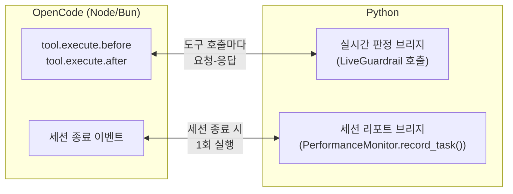

# Chapter 27. LiveGuardrail — 도구 호출을 실행 전에 막는 실시간 가드레일

> **이 챕터에서 배우는 것**
> - 배치 채점(세션이 끝난 뒤 점수를 매기는 것)과 실시간 가드레일(도구 호출을 실행 전에 막는 것)이 왜 다른 문제이고, `LiveGuardrail`이 이 둘을 어떻게 같은 판정 로직으로 풀어내는지
> - `LiveGuardrail`의 핵심 API 3개 — `check_before_tool_call()` / `record_tool_call()` / `snapshot()` — 와 실무에서 반드시 지켜야 할 사용 규칙
> - 위험한 도구 호출을 실제로 차단하는 설정을 처음부터 직접 설계하지 않고, 검증된 값에서 시작해 점진적으로 좁히는 방법
> - [OpenCode](https://opencode.ai)(로컬 코딩 에이전트 CLI)에 이 가드레일을 연결하는 방법과 설치·확인 절차
> - 팀·기업 환경에서 이 가드레일을 쓸 때 별도로 갖춰야 할 것 — 샌드박스, 공유 설정 관리, CI/CD와의 역할 분담

> **독자별 읽기 가이드**
> - **👨‍💻 개발자**: §27.2(핵심 API)를 먼저 읽고 자신의 에이전트 루프에 `LiveGuardrail`을 직접 붙여볼 수 있습니다. OpenCode를 쓰지 않아도 §27.2만으로 충분합니다.
> - **OpenCode 사용자**: §27.3–27.4 순서로 읽으면 설치부터 세션 리포트 확인까지 바로 따라 할 수 있습니다.
> - **📋 QA 관리자 / 보안 담당자**: §27.5(설정 레시피)와 §27.6(팀·기업 환경 운영)을 먼저 읽으면 이 가드레일이 화이트리스트가 아닌 블랙리스트 방어라는 점, 그리고 별도의 샌드박스가 왜 필요한지 먼저 파악할 수 있습니다.
> - **전제 지식**: Gate B(행동무결성) 설정 → [Chapter 5](../Part_II_지표시스템/Chapter_05_GroupB_행동무결성.md), Gate E(보안경계) 설정 → [Chapter 8](../Part_II_지표시스템/Chapter_08_GroupE_보안경계.md). `LiveGuardrail`은 이 두 Gate의 평가 로직을 그대로 재사용한다.
> - **다음 챕터와의 관계**: 이 챕터는 실시간 차단 메커니즘 자체에 집중한다. `LiveGuardrail`을 Ollama·OpenCode와 묶어 "AOO 스택"(Agent-Evaluator + Ollama + OpenCode)이라는 로컬 자가교정 개발 환경으로 완성하는 방법은 [Chapter 28](Chapter_28_로컬_ADE_구축.md)에서 다룬다.

---

## 27.1 왜 실시간인가 — 배치 채점과 무엇이 다른가

이 책 앞부분에서 다룬 Gate A–G는 전부 **배치(batch) 채점**이다. `PerformanceMonitor.record_task()`로 태스크를 기록하고, `generate_report()`를 호출한 시점에야 Gate 점수가 나온다. 세션이 끝난 *뒤에* "이 세션에 루프가 있었다", "권한 밖 도구를 호출했다"는 걸 알게 된다는 뜻이다.

이건 CI/CD 게이팅(Chapter 18)이나 주간 리뷰(Chapter 17)에는 충분하다. 하지만 로컬에서 코딩 에이전트를 돌리는 동안 `rm -rf`가 실제로 실행되는 걸 막고 싶다면 얘기가 다르다. 사후 채점으로는 이미 늦다.

`LiveGuardrail`(`agent_evaluator.gates.live_guardrail`)은 이 간극을 메운다. **같은 Gate B/E 평가 로직을, 세션 단위가 아니라 도구 호출(tool call) 단위로, 실행 전에 동기 호출**한다. 새로운 탐지 규칙을 만든 게 아니라 — 이미 배치 채점에 쓰이는 루프 탐지·범위 검사·도구 인가 검사를 호출 시점만 바꿔서 재사용한다.

| 배치 채점 (기존) | 실시간 평가 (LiveGuardrail) |
|---|---|
| 세션 종료 후 `generate_report()` | 도구 호출 직전 `check_before_tool_call()` |
| 위반을 "기록"하고 점수에 반영 | 위반을 "차단"하고 실행 자체를 막음 |
| Gate 점수(0.0–1.0)로 집계 | `block: bool` 즉시 판정 |
| CI/CD 게이팅, 주간 리뷰에 적합 | 로컬 에이전트 루프, 대화형 세션에 적합 |
| `PerformanceMonitor` 전체 관리 | 세션당 `LiveGuardrail` 인스턴스 1개 |

두 가지는 배타적이지 않다. §27.4에서 다루듯, 실시간으로 위험한 호출을 막으면서도 세션이 끝나면 그 세션의 최종 판정을 배치 리포트에 편입할 수 있다 — "실행 중 즉각 차단"과 "나중에 집계·감사"를 같은 판정 결과로 동시에 만족시킨다.

> 📋 **QA 관리자 TIP**: 팀에 이 챕터를 소개할 때 "새로운 채점 기준이 생긴 게 아니라, 이미 CI에서 쓰는 것과 같은 판정 로직이 개발자 로컬 머신에서 한 발 앞서 실행되는 것"이라고 설명하면 오해가 줄어든다.

---

## 27.2 핵심 API — check, record, snapshot

### 판정 결과: block, gate, reason

`check_before_tool_call()`을 호출하면 판정 결과 객체가 돌아온다. 실제 사용에 필요한 필드는 셋뿐이다.

```python
verdict = guardrail.check_before_tool_call("session-1", "bash", {"command": "rm -rf /"})

verdict.block   # True면 이 도구 호출을 막아야 한다
verdict.gate    # "B" | "E" | None — 어느 Gate가 막았는지
verdict.reason  # 사람이 읽을 수 있는 차단 사유 (모델에게 그대로 보여줘도 되는 문장)
```

`block=False`면 통과했다는 뜻이고 `gate`/`reason`은 비어 있다.

### 세션당 1개 인스턴스 만들기

```python
from agent_evaluator.gates.live_guardrail import LiveGuardrail
from agent_evaluator.gates.gate_b_behavioral.configs import (
    LoopDetectionConfig, ScopeConfig, ToolParameterSafetyConfig,
)
from agent_evaluator.core.trackers.security import ToolAuthorizationTracker

guardrail = LiveGuardrail(
    loop_detection=LoopDetectionConfig(
        consecutive_repeat_threshold=6,   # 기본값 3 — 왜 6인지는 §27.5에서 다룬다
        on_loop_detected="record",        # 기본값. "fail"로 바꾸면 실제 차단
    ),
    scope=ScopeConfig(
        forbidden_tools=["webfetch"],     # 이 도구는 아예 호출하지 못하게 막는다
        fail_on_violation=True,
    ),
    tool_parameter_safety=ToolParameterSafetyConfig(
        dangerous_patterns=[              # §27.5에서 실전 값을 그대로 다룬다
            r"\.\./", r"&&", r"\|\|", r";.*rm\s", r"__import__", r"eval\(", r"exec\(",
            r"\brm\s+\S",
        ],
        scope_tool_names=["bash"],        # 이 패턴 검사를 bash 호출에만 적용 (§27.5 참조)
        fail_on_dangerous=True,
    ),
    tool_authorization=ToolAuthorizationTracker(
        restricted_tools=["delete_database", "send_email"],  # 프로젝트별 실제 도구 이름으로 교체
    ),
    # privilege_escalation=PrivilegeEscalationDetector(), tool_chain_attack=ToolChainAttackDetector() 도 동일 방식
)
```

전달하지 않은 인자(`None`)는 검사 자체를 건너뛴다. 배치 채점의 `@agent_eval(loop_detection=..., scope=..., tool_parameter_safety=...)`와 **똑같은 Config 클래스**이므로, 이미 배치 평가에서 쓰던 설정을 그대로 재사용할 수 있다.

`LiveGuardrail`이 실제로 받는 지표는 7개다 — Gate B 6개 지표 중 4개, Gate E 3개 지표 전부.

| 지표 | 판정 내용 |
|---|---|
| `loop_detection` | 동일 도구 연속 반복 호출(루프) 탐지 |
| `deadlock` | 교착 상태 패턴 탐지 |
| `scope` | 허용 범위 밖 도구 호출 여부 |
| `tool_parameter_safety` | 위험한 파라미터를 가진 도구 호출 여부 |
| `tool_authorization` | 미인가·제한된·위험 파라미터 도구 호출 |
| `privilege_escalation` | 권한 상승 체인 탐지 |
| `tool_chain_attack` | 의심스러운 도구 호출 체인(공격 패턴) 탐지 |

(`state_consistency`/`context_window`는 실행 전 시점에 필요한 데이터 자체가 없어 제외된다 — 전자는 실행 전/후 상태 비교가 필요하고, 후자는 응답 텍스트가 나와야 계산할 수 있다. Gate A/C/D/F/G도 LLM Judge·누적 통계에 의존해 같은 이유로 실시간화 대상이 아니다.)

> **주의 — 리스트 필드를 명시하면 기본값을 완전히 대체한다.** `dangerous_patterns=[...]`처럼 리스트 필드를 직접 전달하면 기본 패턴과 **병합되지 않고 완전히 대체**된다. 커스텀 패턴을 추가하고 싶다면 기본값을 빠짐없이 함께 적어야 한다 — 위 예제가 그렇게 되어 있는 이유다. `forbidden_tools`/`allowed_tools`/`restricted_tools` 같은 도구 이름 목록도, 여러분이 실제로 쓰는 에이전트 프레임워크가 그 이름을 실제로 쓰는지 먼저 확인해야 한다(예: OpenCode는 `"shell_exec"`가 아니라 `"bash"`를 쓴다 — §27.5).
>
> **또 다른 흔한 실수 — 판정과 차단은 별도 플래그다.** `ScopeConfig(allowed_tools=[...])`처럼 화이트리스트를 지정해도, `fail_on_violation=True`를 함께 주지 않으면 위반이 **평가만 되고 차단되지 않는** 조용한 무동작 상태가 된다. `dangerous_patterns`도 마찬가지로 `fail_on_dangerous=True`가 있어야 실제로 막는다. "이 설정을 넣으면 자동으로 막아준다"고 가정하지 말고, 각 설정의 `fail_on_*` 플래그를 항상 함께 확인하라.

### 호출 흐름 — check 먼저, record는 실행 확정 후

```python
verdict = guardrail.check_before_tool_call(
    task_id="session-42",
    tool_name="bash",
    parameters={"command": "rm -f victim.txt"},
)

if verdict.block:
    print(f"차단됨 (Gate {verdict.gate}): {verdict.reason}")
    # 도구를 실행하지 않는다 — record_tool_call()도 호출하지 않는다
else:
    # TODO(현업 적용): run_tool()을 여러분의 실제 도구 실행 함수로 교체하세요.
    result = run_tool("bash", {"command": "rm -f victim.txt"})
    # 실행이 확정된 뒤에만 상태에 반영한다
    guardrail.record_tool_call("session-42", "bash", {"command": "rm -f victim.txt"})
```

두 메서드의 역할이 나뉜 이유가 중요하다. `check_before_tool_call()`은 **순수 조회**다 — 호출해도 내부 이력이 바뀌지 않는다. 후보 호출을 기존 이력에 임시로 얹어서 평가만 해보고, 실제로 그 호출을 실행할지는 호출자(OpenCode 훅, 또는 여러분의 에이전트 루프)가 결정한다. **실행이 확정된 경우에만** `record_tool_call()`로 이력에 반영해야 다음 판정이 정확한 이력을 기준으로 이뤄진다 — 차단된 시도는 실행되지 않았으므로 이력에도 남지 않는다.

이 구분이 실무에서 갖는 의미가 하나 있다. **차단에 성공한 시도는 이 세션의 확정 이력 어디에도 남지 않는다** — 나중에 "이 세션에서 무엇이 차단됐었지?"를 이력으로 다시 조회하려 해도, 완전히 차단된 시도 자체는 조회되지 않는다는 뜻이다. 이 사실이 왜 중요한지, 그리고 위반 이력을 검색 가능하게 남기려면 어떻게 해야 하는지는 [Chapter 28](Chapter_28_로컬_ADE_구축.md)에서 다룬다.

> **주의**: `LiveGuardrail`은 세션(에이전트 루프 1회 실행)마다 별도 인스턴스를 써야 한다. 내부 상태에 락을 걸지 않으므로 여러 세션이 인스턴스 하나를 공유하면 안 된다.

> 👨‍💻 **개발자 TIP**: 가장 흔한 실수는 `LiveGuardrail` 인스턴스를 모듈 전역 변수나 싱글턴으로 만들어 여러 세션이 재사용하게 하는 것이다 — 그러면 세션 A의 도구 호출 이력이 세션 B의 루프/스코프 판정에 섞여 들어간다. 세션이 시작될 때마다 `LiveGuardrail(...)`을 새로 생성하고, 세션 종료 시 그 인스턴스를 버리는 패턴을 지켜야 한다.

### 세션 종료 — snapshot()으로 최종 판정 얻기

`check_before_tool_call()`/`record_tool_call()`이 세션 *도중*의 API라면, `snapshot()`은 세션이 끝난 뒤 그때까지 확정 누적된 도구 호출 전체를 기준으로 Gate B/E 평가 결과를 한 번에 계산해 반환한다.

```python
session_extra = guardrail.snapshot()
# → {"loop_detection": {...}, "scope": {...}, "tool_authorization": {...}, ...}
#   생성자에서 설정하지 않은 지표, 또는 확정된 도구 호출이 없어 계산 자체가
#   불가능한 지표는 키 자체가 없다.
```

반환된 dict는 배치 리포트에 그대로 편입할 수 있는 형태다 — `create_taskresult(..., extra=session_extra, tool_calls=[...])`로 만들어 `PerformanceMonitor.record_task()`에 넘기면, 이 세션의 Gate B/E 점수가 배치 리포트에 반영된다. 이 API가 §27.4에서 다루는 세션 리포트 편입의 기반이다.

몇 번을 호출해도 부작용이 없다 — "완결된 시퀀스 1회 분석"이 필요한 지표(권한 상승 체인, 도구 호출 체인 공격 탐지)도 반복 호출 시 이력이 중복 누적되지 않도록 처리되어 있다.

여기까지가 순수 Python API다. OpenCode를 쓰지 않더라도, 자체 에이전트 루프의 도구 실행 직전에 `check_before_tool_call()`을 끼워 넣으면 동일하게 동작한다.

---

## 27.3 OpenCode 연동 — 설치와 구조

[OpenCode](https://opencode.ai)는 로컬에서 도는 코딩 에이전트 CLI다. Node/Bun에서 실행되고, `tool.execute.before`/`tool.execute.after` 훅으로 도구 호출 전후에 개입할 수 있다.

Agent-Evaluator는 Python SDK이므로, Gate B/E 로직을 TypeScript로 다시 짜는 대신 **세션당 Python 서브프로세스 하나**를 띄우고 stdin/stdout으로 데이터를 주고받는 얇은 플러그인을 제공한다 — 판정 로직의 유일한 소스는 항상 Python 쪽이고, 플러그인은 그걸 호출하는 클라이언트일 뿐이다.



두 개의 Python 브리지는 생명주기가 다르다 — 하나는 세션 내내 살아있는 요청-응답 루프이고, 다른 하나는 세션이 끝날 때 딱 한 번 실행돼 최종 판정을 배치 리포트에 저장하는 프로세스다. 둘 다 stdin/stdout을 쓰는 범용 프로토콜이라, OpenCode가 아닌 다른 언어의 에이전트 루프에서도 같은 방식으로 연결할 수 있다.

### 설치

```bash
# 1. Agent-Evaluator를 설치한다
pip install agent-evaluator

# 2. 플러그인을 설치한다 — 기본값은 프로젝트 로컬(.opencode/plugin/)
agent-eval opencode install
# 전역 설치: agent-eval opencode install --global
# 재설치(덮어쓰기): agent-eval opencode install --force
```

설치 명령은 **그 명령 자체를 실행한 인터프리터**의 절대경로를 플러그인 파일 안에 그대로 새겨 넣는다. OpenCode가 이 플러그인을 로드해 서브프로세스를 띄울 때는 이 절대경로로 직접 실행하므로(셸 PATH 탐색 없음), agent-eval을 어떤 방식으로 설치했든 플러그인 자체는 항상 정확한 인터프리터를 쓴다.

> **⚠️ 설치를 직접 확인할 때는 셸의 `python`을 그냥 쓰면 안 된다.** `agent-eval`을 pipx나 별도 venv로 설치했다면, 셸에서 `python`을 쳤을 때 resolve되는 인터프리터가 install에 실제로 쓰인 것과 다를 수 있다. install 명령이 출력하는 "python interpreter (baked in as default): ..." 줄의 경로를 그대로 복사해 확인 명령에 써야 한다.

```bash
# 확인 — install 출력에 찍힌 절대경로 그대로 실행
<install 출력에 찍힌 절대경로> -m agent_evaluator.integrations.live_guardrail_stdio
# 아무 입력 없이 대기 상태가 되면 정상 (Ctrl+C로 종료)
```

다른 인터프리터를 써야 하거나 리포트 저장 위치를 바꾸고 싶으면 환경변수로 오버라이드할 수 있다.

```bash
export AGENT_EVALUATOR_PYTHON=/path/to/venv/bin/python
export AGENT_EVALUATOR_OUTPUT_DIR=results/my_project
```

설치된 `.opencode/plugin/agent-evaluator.ts`(패키지 원본이 아니라 복사본) 상단의 설정 블록을 프로젝트 상황에 맞게 조정한다 — 필드는 §27.2에서 본 것과 동일한 Config 클래스를 그대로 받는다.

> **주의**: `agent-eval opencode install`을 다시 실행하면 대상 파일은 원본으로 덮어써진다(`--force` 없이는 거부). 커스터마이즈한 설정은 별도로 백업하거나 팀 공유 저장소로 관리해야 한다(§27.6).

---

## 27.4 세션 리포트 — 실시간 판정을 배치 리포트로 편입하기

세션이 끝나면 세션 리포트 브리지가 그 세션의 Gate B/E 판정을 SQLite에 upsert한다(태스크 ID 기준 upsert — 같은 세션 ID로 다시 저장하면 갱신된다). 기본 저장 위치는 `results/opencode_live_guardrail/opencode_sessions.db`이고, 여러 OpenCode 세션(각각 독립 프로세스)이 같은 파일에 누적된다. 세션이 끝날 때마다 콘솔에 다음이 출력된다.

```
[agent-evaluator] session <id> recorded to <path> (Gate B=n/a, Gate E=n/a)
```

> **주의 — 이 점수는 그 세션 하나만의 단일 표본이다.** 콘솔에 찍히는 `Gate B=`/`Gate E=` 값은 이번 세션 하나의 순간 점수이지, 누적된 전체 세션 이력을 반영한 값이 아니다. 위반이 없으면 대개 `n/a`로 찍힌다. 여러 세션에 걸친 추세를 보려면 아래처럼 전체를 다시 불러와 별도로 집계해야 한다.

```python
from agent_evaluator.storage.sqlite_backend import load_tasks_from_db

tasks = load_tasks_from_db("results/opencode_live_guardrail/opencode_sessions.db")
```

> 📋 **QA 관리자 TIP**: 세션 하나의 `Gate B=n/a, Gate E=n/a`는 "위반이 없었다"는 뜻이지 "이 프로젝트가 안전하다"는 배포 판단 근거가 아니다 — 표본 1건짜리 순간 점수이기 때문이다. 실제로 신뢰할 수 있는 신호는 ① 누적된 여러 세션을 모아 다시 계산한 집계 점수, ② Chapter 18의 CI/CD Harness Gate 게이팅 결과 두 가지다.

이걸로 "실시간 차단"과 "배치 집계"가 같은 판정 결과를 공유하는 고리가 완성된다 — 로컬에서는 즉시 차단하고, 여러 세션이 쌓이면 배치 리포트로 추세를 본다.

한 가지 더 알아둘 사실이 있다. 세션 종료 시점에 계산한 이 판정 요약은 SQLite뿐 아니라 OpenCode 세션 자체의 메시지 히스토리에도 남는다 — 모델의 새 응답을 유발하지 않으면서 세션 저장소에 영구히 기록되는 메시지다. 이 기록을 다음 세션에서 검색 가능하게 활용하는 방법은 [Chapter 28](Chapter_28_로컬_ADE_구축.md)에서 다룬다.

---

## 27.5 실전 설정 레시피

처음 이 가드레일을 도입한다면, 설정을 직접 처음부터 설계하려 하지 말고 아래 값에서 시작해 자신의 프로젝트에 맞게 점진적으로 좁혀나가는 것을 권한다.

```python
GUARDRAIL_CONFIG = LiveGuardrail(
    loop_detection=LoopDetectionConfig(consecutive_repeat_threshold=6),
    scope=ScopeConfig(forbidden_tools=["webfetch"], fail_on_violation=True),
    tool_parameter_safety=ToolParameterSafetyConfig(
        dangerous_patterns=[
            r"\.\./", r"&&", r"\|\|", r";.*rm\s", r"__import__", r"eval\(", r"exec\(",
            r"\brm\s+\S",
        ],
        fail_on_dangerous=True,
    ),
    tool_authorization=ToolAuthorizationTracker(),
)
```

### 왜 루프 탐지 threshold가 6인가 — 도구 세분성을 먼저 확인하라

"도구 이름" 기반 루프 탐지는 에이전트 프레임워크마다 세분성이 다르다. OpenCode는 셸 관련 동작을 전부 하나의 `"bash"` 도구로 처리한다(`"shell_exec"` 같은 세분화된 이름은 없다). 기본값(`consecutive_repeat_threshold=3`, 차단)을 그대로 쓰면 `ls → cat → ls`처럼 완전히 정상적인 연속 셸 사용조차 "루프"로 오탐해 세 번째 확인용 `ls`를 실제로 막아버린다. threshold를 넉넉히 올리고(6 정도), 기본 동작을 차단이 아니라 관찰(`on_loop_detected="record"`)로 낮추는 것이 안전한 출발점이다 — 실제로 차단하려면 사용 중인 에이전트의 도구 세분성이 그 임계값 가정에 맞는지 먼저 확인해야 한다.

### rm 계열 명령을 확실히 잡으려면

기본 위험 패턴만으로는 `rm` 명령을 확실히 막지 못한다. 로컬 모델이 `rm -rf`를 스스로 거부하고도 `rm -f`로, 그마저 막히면 플래그 없이 `rm <파일>`로 — 점점 더 단순한 형태로 우회를 시도하는 경우가 실제로 있었다. `\brm\s+\S`(플래그 유무와 무관하게 `rm` 다음에 인자가 있으면 매칭) 패턴을 위 레시피처럼 포함시켜야 이 세 가지 형태를 전부 잡는다.

이건 화이트리스트가 아니라 **블랙리스트 패턴 매칭**이라는 사실을 항상 염두에 두어야 한다 — "지금 이 패턴 목록"이 마지막 우회라고 가정해서는 안 된다.

### 셸과 무관한 도구까지 오탐하지 않으려면 — scope_tool_names

`dangerous_patterns`는 기본적으로 **도구 이름과 무관하게 모든 도구 호출의 파라미터 전체**를 검사한다. 그래서 위 `rm` 패턴을 그대로 쓰면, 셸과 전혀 무관한 도구(예: 메모리 저장 도구, 노트 작성 도구)가 "방금 rm 시도가 거부됨"처럼 그 사실을 **자연어 텍스트로 기록하려는 시도조차** 파라미터에 "rm "이 들어있다는 이유만으로 차단당하는 문제가 생긴다.

`scope_tool_names`로 이 검사를 실제로 셸 명령을 실행하는 도구로만 한정하면 이 문제가 해소된다.

```python
tool_parameter_safety=ToolParameterSafetyConfig(
    dangerous_patterns=[..., r"\brm\s+\S"],
    scope_tool_names=["bash"],   # 이 도구들에만 dangerous_patterns를 적용한다
    fail_on_dangerous=True,
)
```

기본값 `None`은 기존과 동일하게 전체 도구를 검사한다 — 셸 실행 도구가 여러 이름을 쓰는 프레임워크라면(`bash`, `shell_exec`, `run_command` 등) 그 이름을 전부 리스트에 포함해야 한다.

### 저장소 작업 세션 전용으로 확장하기

리팩토링·코드 정리처럼 저장소 자체를 다루는 세션에는 git 안전장치를 추가로 넣는 것이 좋다. 이때도 `scope_tool_names=["bash"]`를 함께 지정해야, 이 안전장치와 무관한 파일 편집(`edit`)까지 오탐하지 않는다 — 예를 들어 이 문서처럼 `"git push --force"` 같은 문자열을 예시 코드로 담고 있는 파일을 편집하려는 시도까지 차단되는 걸 막을 수 있다.

```python
tool_parameter_safety=ToolParameterSafetyConfig(
    dangerous_patterns=[
        r"\.\./", r"&&", r"\|\|", r";.*rm\s", r"__import__", r"eval\(", r"exec\(",
        r"\brm\s+\S",
        r"--no-verify",             # 커밋 훅 우회 시도 차단
        r"git\s+push\s+.*--force",  # 강제 푸시 차단
        r"git\s+reset\s+--hard",    # 비가역 리셋 차단
        r"#\s*noqa",                # 린트 위반을 숨기는 처방 차단
    ],
    scope_tool_names=["bash"],
    fail_on_dangerous=True,
),
scope=ScopeConfig(
    allowed_tools=["read", "edit", "grep", "glob", "bash"],
    fail_on_violation=True,
),
```

> **⚠️ 이건 정규식·이름 매칭이지 완전한 보안 경계가 아니다.** `git push --force`를 막는 정규식은 `git push --force-with-lease`나 셸 별칭(alias)으로 우회될 수 있다. 이 계층은 "명백한 실수"를 잡는 안전망이지, 그 자체로 충분한 보안 경계는 아니다(§27.6).

### 읽기 전용 세션 — 코드 리뷰·자가 점검용

파일을 수정하지 않아야 하는 세션(리뷰 전 자가 점검, 설계 검토 등)에는 `allowed_tools`에서 `edit`/`bash`를 아예 빼면, 모델이 스스로 "고치는 게 낫겠다"고 판단해도 실제로는 차단된다.

```python
scope=ScopeConfig(
    allowed_tools=["read", "grep", "glob"],  # edit·bash는 의도적으로 제외
    fail_on_violation=True,
)
```

---

## 27.6 팀·기업 환경에서 운영하기

지금까지는 개발자 한 명이 자신의 머신에서 이 가드레일을 쓰는 시나리오였다. 팀 단위로, 혹은 기업 내부에서 여러 개발자가 이 통합을 실제로 쓰려면 몇 가지를 추가로 결정해야 한다.

### LiveGuardrail은 방어의 마지막 층이 아니다

> **보안 경고**: `LiveGuardrail`은 정규식 기반 **블랙리스트** 방어다. 셸 명령을 실제로 실행할 수 있는 LLM 에이전트를 사람의 감독 없이 돌리는 것 자체가 위험을 내포한다 — 개인 실험 환경을 넘어 팀/기업에서 쓴다면 다음을 **LiveGuardrail과 별개로** 반드시 갖춰야 한다.
>
> - 에이전트 프로세스를 컨테이너·VM 등 격리된 환경에서 실행 (비루트 사용자, 읽기 전용 마운트 우선)
> - 실제 프로덕션 자격 증명·비밀키가 없는 디스포저블 devbox — 이 세션에서 무엇이 삭제되거나 유출되어도 복구 가능한 환경
> - 네트워크 접근 범위 제한 (사내망 전체가 아니라 필요한 엔드포인트만)
>
> `LiveGuardrail`은 "알려진 위험 패턴을 실행 전에 잡아낸다"는 실용적 완화책이지, 샌드박스를 대체하는 보안 경계가 아니다.

### 설정을 개인 로컬이 아니라 팀 공유 저장소로

각 개발자가 개별로 설정을 고치면, 팀원마다 보호 수준이 달라진다 — 한 사람이 우회 패턴을 발견하고 고쳐도, 그 수정이 다른 팀원에게 자동으로 전파되지 않는다(재설치는 커스터마이즈를 원본으로 덮어쓸 뿐이다). 팀의 dotfiles 저장소(혹은 사내 설정관리 저장소)에 이 설정을 버전 관리하고, 새로 발견된 위험 패턴은 PR로 그 저장소에 반영해 `git pull` 한 번으로 전 팀원에게 퍼지게 하는 편이 안전하다. 이 개인 발견 → 팀 자산 승격 절차를 반복 가능한 프로세스로 만드는 방법은 [Chapter 28](Chapter_28_로컬_ADE_구축.md)에서 더 구체적으로 다룬다.

### 세션 리포트 중앙화 — 가능하지만 신중해야 하는 경로

저장 위치를 팀 공유 스토리지(사내 네트워크 드라이브 등)로 지정하면, 여러 개발자의 세션 리포트가 이론적으로는 같은 파일에 누적될 수 있다. 다만 이 저장소가 안전하게 다루는 것은 "같은 머신 위 여러 프로세스의 동시 쓰기"이지, "네트워크 파일시스템을 통한 여러 머신의 동시 쓰기"는 별도로 검증된 경로가 아니다. 팀 전체 리포트를 한곳에 모으고 싶다면, 각자 로컬에 쌓은 뒤 CI 잡이나 주기적 스크립트로 병합하는 경로가 더 안전하다.

### 이 통합이 CI/CD 게이팅을 대체하지 않는다

`LiveGuardrail`은 로컬 세션 중 위험한 호출을 막는 것이지, Chapter 18의 CI/CD Harness Gate 게이팅을 대신하지 않는다. 팀 차원의 배포 승인 기준은 여전히 배치 채점(Gate A–G)과 `agent-eval gate`로 관리해야 한다 — 이 두 체계는 "로컬 개발 중 즉각 차단"과 "배포 전 정량적 승인"이라는 서로 다른 문제를 푼다.

---

## 이 챕터의 핵심

- **LiveGuardrail은 새 Gate가 아니라 재배치다.** Gate B(루프·교착·범위·파라미터 안전성)와 Gate E(도구 인가·권한 상승·도구 체인 공격)의 기존 평가 로직을, 세션 종료 후가 아니라 도구 호출 직전에 동기 호출한다.

- **`check_before_tool_call()`은 순수 조회, `record_tool_call()`이 상태를 확정한다.** 차단된 호출은 이력에 남지 않는다 — 실행되지 않은 시도이기 때문이다.

- **세션당 별도 인스턴스가 필수다.** 내부 상태에 락이 없으므로 여러 세션이 공유하면 안 된다.

- **판정 여부와 차단 여부는 별도 플래그다.** `fail_on_dangerous=True`, `fail_on_violation=True`가 각각 있어야 실제로 차단한다 — 설정만 하고 이 플래그를 빠뜨리면 조용히 아무것도 막지 않는다.

- **`snapshot()`으로 배치 리포트에 편입할 수 있다.** 여러 세션에 걸친 Gate B/E 추세를 배치 파이프라인으로 집계할 수 있다.

- **이건 블랙리스트 방어이지 화이트리스트가 아니다.** 지금 막힌 패턴 목록이 앞으로도 막을 모든 패턴이라고 가정해서는 안 된다.

- **`dangerous_patterns`는 도구 이름을 구분하지 않는다 — `scope_tool_names`로 지정해야 한다.** 그렇지 않으면 셸과 무관한 도구까지 오탐할 수 있다.

- **도구 세분성을 먼저 확인하라.** 프레임워크마다 도구 이름 세분성이 다르므로, 다른 프레임워크의 기본값을 그대로 가져오면 오탐 또는 놓침이 생긴다.

- **LiveGuardrail은 샌드박스를 대체하지 않는다.** 컨테이너/VM 격리, 디스포저블 자격 증명, 네트워크 범위 제한을 별개로 갖춰야 한다.

- **설정은 개인 로컬이 아니라 팀 공유 저장소로 관리하라.** 한 사람이 발견한 우회 패턴 수정이 다른 팀원에게 자동으로 전파되지 않는다.

## 실전 예제

**기본 예제**: [`Evaluator_Examples/ch27_live_guardrail.py`](../../Evaluator_Examples/ch27_live_guardrail.py) — OpenCode 없이 순수 Python으로 `LiveGuardrail`의 핵심 API를 시연한다. `rm` 우회 패턴이 어떻게 막히는지, `scope_tool_names`로 오탐이 어떻게 해소되는지, `snapshot()` → 배치 리포트 편입 → 재조회까지 전체 흐름을 실행 가능한 코드로 확인할 수 있다.

```python
from agent_evaluator.gates.live_guardrail import LiveGuardrail
from agent_evaluator.gates.gate_b_behavioral.configs import (
    LoopDetectionConfig, ToolParameterSafetyConfig,
)

guardrail = LiveGuardrail(
    loop_detection=LoopDetectionConfig(consecutive_repeat_threshold=6, on_loop_detected="record"),
    tool_parameter_safety=ToolParameterSafetyConfig(
        dangerous_patterns=[
            r"\.\./", r"&&", r"\|\|", r";.*rm\s", r"__import__", r"eval\(", r"exec\(",
            r"\brm\s+\S",
        ],
        fail_on_dangerous=True,
    ),
)

def run_agent_step(task_id: str, tool_name: str, params: dict):
    verdict = guardrail.check_before_tool_call(task_id, tool_name, params)
    if verdict.block:
        return f"차단됨 (Gate {verdict.gate}): {verdict.reason}"

    # TODO(현업 적용): 아래 Mock 실행을 실제 도구 실행 함수로 교체하세요.
    result = f"실행됨: {tool_name}({params})"
    guardrail.record_tool_call(task_id, tool_name, params)
    return result

# → 실행 전 항상 check, 실행 확정 시에만 record.
#   차단된 시도는 record하지 않으므로 다음 판정에 영향을 주지 않는다.
```

```bash
# OpenCode 플러그인 전체 흐름 확인 (설치 후)
opencode run --dir . "read config.yaml and summarize it" < /dev/null
# → 세션 종료 시 콘솔에:
#    [agent-evaluator] session <id> recorded to results/opencode_live_guardrail/opencode_sessions.db (Gate B=n/a, Gate E=n/a)

python -c "
from agent_evaluator.storage.sqlite_backend import load_tasks_from_db
tasks = load_tasks_from_db('results/opencode_live_guardrail/opencode_sessions.db')
print(len(tasks), 'session(s) recorded')
"
```

---

> **이 챕터에서 배운 것**
>
> Gate B와 Gate E는 배치 채점 전용이 아니다. `LiveGuardrail`은 같은 평가 로직을 도구 호출 직전으로 옮겨, 위반을 "기록"이 아니라 "차단"으로 바꾼다. `check_before_tool_call()`(조회)과 `record_tool_call()`(확정)이 역할을 나누고, `snapshot()`으로 세션 종료 시 그 결과를 배치 리포트에 편입할 수 있다.
>
> OpenCode 플러그인은 이 원칙을 로컬 코딩 에이전트에 적용한 참고 구현이다. Python SDK 로직을 재구현하지 않고 서브프로세스로 재사용했고, 세션 판정을 SQLite에 저장해 배치 분석 파이프라인과도 연결했다.
>
> 팀·기업 환경으로 가져간다면 세 가지를 잊지 말아야 한다 — 이건 블랙리스트 방어이지 완전한 보안 경계가 아니므로 샌드박스를 병행할 것, 설정은 개인 로컬이 아니라 팀 공유 저장소로 관리할 것, 그리고 이 가드레일이 CI/CD 게이팅을 대체하지 않는다는 것.
>
> **다음 챕터**에서는 이 실시간 판정 이력을 검색 가능한 형태로 쌓아, Agent-Evaluator·Ollama·OpenCode 세 조각을 "AOO 스택"으로 묶어 "차단된 실수를 다음 세션이 스스로 찾아내 반복하지 않는" 자가교정 개발 환경(ADE)을 구축하고, 이를 실제 개발 업무 — 신규 기능 개발, 버그 수정, 리팩토링, 코드 리뷰 — 에 적용하는 구체적인 절차를 다룬다.
