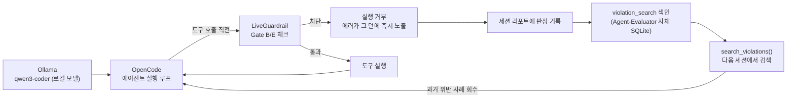

# Chapter 28. 로컬 자가교정 ADE 구축과 실무 적용 — AOO 스택

> **이 챕터에서 배우는 것**
> - "ADE"(Agentic Development Environment)가 왜 하나의 도구가 아니라 세 조각의 조합으로 완성되는지
> - Agent-Evaluator(안전+기억) · Ollama(로컬 모델) · OpenCode(에이전트 실행) — 이 조합("AOO 스택")을 로컬 머신에 설치하고, 세 조각이 실제로 살아있는지 확인하는 방법
> - 위험한 시도를 실행 전에 막고(Chapter 27), 그 판정을 세션이 끝난 뒤에도 검색 가능한 이력으로 남기는 방법 — 그리고 "완전히 차단된 시도"와 "감지만 하고 넘어간 시도"가 검색 관점에서 왜 다르게 취급되는지
> - 이 폐루프를 **개발자가 매일 반복하는 네 가지 워크플로우**에 적용하는 구체적 방법 — 신규 기능 개발·버그 재현수정·리팩토링·코드 리뷰
> - QA 관리자 관점에서 개인의 발견을 팀 지식 자산으로 승격하는 거버넌스 절차와 신규 팀원 온보딩 활용법
> - 개인 로컬 기억과 팀 공유 기억을 구분해 기업 환경으로 안전하게 확장하는 방법 — 하드웨어 사양, 데이터 거버넌스 포함

> **독자별 읽기 가이드**
> - **전제 지식**: 이 챕터는 [Chapter 27](Chapter_27_LiveGuardrail_OpenCode_연동.md)을 전제로 한다. `LiveGuardrail`의 차단·기록 메커니즘을 먼저 이해해야 이 챕터의 "검색" 단계가 왜 필요한지 납득할 수 있다.
> - **👨‍💻 개발자**: §28.2(설치) → §28.3(자가교정 루프) → §28.5(네 워크플로우)를 순서대로 따라 하면 자신의 머신에 전체 스택을 재현하고 매일 하는 실제 작업에 바로 적용할 수 있다.
> - **📋 QA 관리자 / 보안 담당자**: §28.6(거버넌스·온보딩)과 §28.7(기업 환경 확장)을 먼저 읽어라. 어떤 데이터가 어느 저장소에 마스킹 없이 남는지 구분하지 않으면 데이터 거버넌스 리스크를 놓치게 된다.

---

## 28.1 ADE란 무엇인가 — 세 조각의 역할 분담

"ADE"(Agentic Development Environment)는 새로운 프레임워크가 아니다. 이미 있는 세 도구를 **각자의 계층에 배치**해서 하나의 폐루프를 만든 것이다 — 이 책에서는 이 조합을 **AOO 스택**(Agent-Evaluator + Ollama + OpenCode)이라 부른다. LAMP(Linux + Apache + MySQL + PHP)가 웹 서비스 계층 구조를 한 단어로 부르는 관례이듯, AOO는 로컬 자가교정 ADE의 세 계층을 가리키는 이름이다.

| 구성 요소 | 역할 | 계층 |
|---|---|---|
| **A**gent-Evaluator `LiveGuardrail` | 실시간 가드레일 — 위험한 도구 호출을 실행 전에 차단하고, 판정을 검색 가능한 이력으로 남김 | 안전 + 기억 |
| **O**llama (`qwen3-coder`) | 로컬 LLM 추론 — 클라우드 API 비용·전송 없이 코딩 에이전트를 구동 | 모델 |
| **O**penCode | 에이전트 런타임 — 도구 호출 루프, 훅, 세션 관리 | 실행 |

각 조각은 이미 이 책에서 다뤘거나(Ch27 — LiveGuardrail/OpenCode 연동) 독립적으로 존재하는 도구다(Ollama). 이 챕터의 기여는 새 코드를 짜는 게 아니라, **세 조각을 정확한 순서로 배선**해서 "차단된 실수가 다음 세션에서 반복되지 않는" 폐루프를 완성하고, 그 폐루프를 실제 개발 업무(§28.5)에 적용하는 것이다.



> **Harness Engineering 관점**: 이 루프는 Gate B/E를 "실행 전 차단"(Ch27)에서 "학습된 회피"로 한 단계 더 밀어붙인다. `LiveGuardrail`이 위반을 막고, 이력 기록이 그 위반을 검색 가능한 사실로 바꾸고, 다음 세션이 그 사실을 조회한다. Gate 점수 자체는 여전히 배치 채점(Ch3–10)의 몫이지만, "왜 막혔는가"라는 진단 정보가 세션 경계를 넘어 재사용되는 것이 이 챕터의 핵심이다.

---

## 28.2 설치 — 세 조각을 순서대로 놓기

### 1) Ollama + 로컬 모델

```bash
# Ollama 설치 (https://ollama.com 참조) 후
ollama pull qwen3-coder:latest
ollama serve   # 기본 포트 11434
```

> **하드웨어 요구사항을 먼저 확인하라.** `qwen3-coder:latest`는 약 18GB 크기의 모델이다. 모델 파일 크기와 실제 추론에 필요한 메모리는 다르다 — 양자화 수준에 따라 다르지만, 대체로 모델 파일 크기에 근접하거나 그 이상의 RAM(CPU 추론) 또는 VRAM(GPU 추론)이 필요하다고 보고 여유 있게 계획하는 것이 안전하다. GPU/충분한 통합 메모리가 없는 머신에서 CPU만으로 돌리면 추론 속도가 눈에 띄게 느려져서, "실시간 가드레일"이라는 전제 자체(도구 호출마다 즉시 판단)가 실용적이지 않을 수 있다. 팀 단위로 로컬 ADE 도입을 검토한다면, 실제 배포 전에 대상 개발자 머신(또는 지급할 devbox 사양)에서 체감 응답 속도를 먼저 확인하는 것을 권한다.

### 2) OpenCode + Ollama 프로바이더 연결

`~/.config/opencode/opencode.json`(전역) 또는 프로젝트 루트의 `opencode.json`(로컬)에 Ollama를 OpenAI 호환 프로바이더로 등록한다.

```json
{
  "$schema": "https://opencode.ai/config.json",
  "provider": {
    "ollama": {
      "npm": "@ai-sdk/openai-compatible",
      "name": "Ollama (local)",
      "options": { "baseURL": "http://localhost:11434/v1" },
      "models": { "qwen3-coder:latest": { "name": "Qwen3-Coder (local)" } }
    }
  }
}
```

```bash
opencode          # TUI 실행
/models           # 모델 선택 — "Qwen3-Coder (local)" 선택
```

> **도구 호출이 안 되면**: Ollama의 `num_ctx`(컨텍스트 길이)가 너무 작으면 도구 호출 프롬프트가 잘려 모델이 도구를 아예 호출하지 못하는 경우가 있다. 16k–32k 범위로 늘려보는 것이 첫 번째 점검 대상이다.

### 3) Agent-Evaluator LiveGuardrail 플러그인

Chapter 27에서 다룬 그대로다. `pip install "agent-evaluator[mcp]"`로 설치하면 아래 §28.3에서 다루는 위반 검색 MCP 서버까지 함께 쓸 수 있다.

```bash
pip install "agent-evaluator[mcp]"
agent-eval opencode install --with-violation-search   # .opencode/plugin/ (프로젝트 로컬) + 검색 MCP 서버 등록
```

### 4) 설치 확인 — AOO 스택 전체 헬스체크

세 조각을 전부 설치했다면, §28.3의 자가교정 루프를 시도하기 전에 각 조각이 개별적으로 정상 동작하는지 먼저 확인한다. "설치 스크립트가 에러 없이 끝났다"와 "실제로 동작한다"는 다르다.

```bash
# ① Ollama — 모델이 실제로 받아졌고 서버가 응답하는지
ollama list                              # qwen3-coder:latest가 목록에 있어야 한다
curl -s http://localhost:11434/api/tags  # 서버가 살아있으면 같은 모델 목록이 JSON으로 온다

# ② OpenCode — Ollama 프로바이더로 실제 응답을 받아오는지 (헤드리스 1회 호출)
opencode run --dir . "1+1은?" < /dev/null
# → 클라우드 API 키 없이 로컬 모델의 답이 그대로 나오면 프로바이더 연결이 된 것이다.
#   "provider not found"류 에러가 나면 §28.2의 opencode.json 등록을 다시 확인하라.

# ③ Agent-Evaluator LiveGuardrail — 플러그인과 검색 MCP 서버가 모두 연결됐는지
opencode mcp list
# → "agent-evaluator-violations ... connected"가 보여야 한다.
#   ⚠️ 셸의 python이 아니라, `agent-eval opencode install` 출력의
#   "python interpreter (baked in as default): <경로>" 줄에 있는 절대경로를 그대로 쓸 것
<install 출력에 찍힌 절대경로> -m agent_evaluator.integrations.live_guardrail_stdio
# → 아무 입력 없이 대기 상태가 되면 정상 (Ctrl+C로 종료)
```

> 📋 **QA 관리자 TIP**: 이 세 가지 확인 중 하나라도 실패한 상태에서 §28.5의 워크플로우를 팀에 배포하면, "가드레일이 꺼진 채로 로컬 모델이 셸 명령을 실행하는" 상황을 눈치채지 못할 수 있다. 신규 팀원 온보딩 체크리스트(§28.6.2)에 이 세 가지 확인을 그대로 포함시키는 것을 권한다.

---

## 28.3 자가교정 루프 — 차단된 실수를 다음 세션이 검색하는 법

Chapter 27이 다룬 두 사실 — ① `LiveGuardrail`이 위험한 호출을 실행 전에 차단한다, ② 그 판정 요약이 세션 리포트에도 영구히 남는다 — 을 이어 붙이면 다음 흐름이 된다.

1. **차단** — `check_before_tool_call()`이 위반을 감지하면 실행을 막는다.
2. **즉시 노출** — 차단 사유가 그 턴의 모델에게 바로 전달된다. 로컬 모델이 "방금 시도가 보안 정책 때문에 거부됐다"는 걸 스스로 인지하고 그 사실을 사용자에게 그대로 전달하는 것이 이 단계다 — 같은 세션 안에서의 즉각적 자가교정.
3. **기록** — 세션이 끝나면 그 세션의 Gate B/E 판정 요약이 세션 리포트(SQLite)에 영구히 남는다. 요약은 점수만이 아니라 **구체적으로 어떤 위반이 있었는지**까지 담는다 — 점수만으로는 다음 세션의 모델이 "무엇을 피해야 하는지" 알 수 없기 때문이다.
4. **색인** — 이 리포트에 붙은 전문 검색 인덱스(`violation_search`)가 위반이 있는 태스크를 자동으로 색인한다. 별도 배치 작업이나 외부 프로세스가 필요 없다 — `save_tasks_to_db()`가 저장할 때 함께 처리한다.
5. **검색·회피** — 다음 세션에서 `search_violations()`로 과거 위반 사례를 찾아내거나, MCP로 등록해두면 에이전트 자신이 세션 도중 검색 도구를 호출해 "이 패턴을 전에 시도한 적 있는가"를 스스로 확인할 수 있다.

### 무엇을 검색할 수 있고, 무엇을 검색할 수 없는가

여기서 실무적으로 중요한 구분이 하나 있다. `check_before_tool_call()`이 어떤 호출을 **완전히 차단**했다면, 그 호출은 실제로 실행되지 않았으므로 세션의 확정 이력에도 남지 않는다(§27.2) — 즉 `fail_on_dangerous=True`/`fail_on_violation=True`로 강하게 막은 위반은, 나중에 "이 세션에서 무엇이 차단됐지?"를 검색으로 되짚어보려 해도 **검색되지 않는다.** 반대로, 감지는 하되 차단은 하지 않는 지표(예: 루프 탐지를 `on_loop_detected="record"`로 설정한 경우)는 실행이 그대로 허용되므로 이력에 남고, 그래서 검색도 가능하다.

이건 버그가 아니라 자연스러운 결과다 — "실행되지 않은 일"은 애초에 이력에 남을 것이 없다. 실무에서는 이렇게 나눠 쓰면 된다.

| 목적 | 설정 | 검색 가능 여부 |
|---|---|---|
| 이 패턴은 항상 즉시 막아야 한다 (`rm -rf`, `DROP TABLE` 등) | `fail_on_*=True` (완전 차단) | ❌ — 차단 자체가 목적이므로 이력 불필요 |
| 이 패턴은 일단 지켜보고 나중에 팀이 검토하고 싶다 | `fail_on_*=False` (감지만, 관찰 모드) | ✅ — 실행은 허용되지만 이력에 남아 검색 가능 |

즉 "차단할 것"과 "검색 가능한 이력으로 남길 것"은 같은 지표라도 **다른 설정 목적**이다. 팀 전체가 반드시 지켜야 할 규칙은 완전 차단으로, 아직 패턴을 파악하는 중이거나 감사 목적으로만 추적하고 싶은 신호는 관찰 모드로 설정하는 것을 권한다.

### 검색 — search_violations()

새 외부 프로세스나 별도 저장소가 필요 없다 — 이미 쌓이고 있는 세션 리포트를 검색 가능하게 만드는 것뿐이다.

```python
from agent_evaluator.storage.sqlite_backend import search_violations

results = search_violations("results/opencode_live_guardrail/opencode_sessions.db", "bash")
# → [{"task_id": "...", "summary": "tool_parameter_safety: dangerous_pattern:bash:...",
#      "timestamp": "...", "task_type": "...", "success": ...}, ...]
```

검색어는 정규식이 아니라 도구 이름·카테고리 단어로 고르는 것이 좋다 — 위험 패턴 자체(`\brm\s+\S` 같은 정규식 문자열)를 그대로 검색어로 쓰면 전문 검색 엔진이 이를 하나의 통짜 토큰으로 색인해 매치되지 않을 수 있다. `"bash"`, `"dangerous_pattern"`처럼 실제 단어 단위 키워드를 쓰는 것이 안전하다.

이 검색을 OpenCode의 MCP 도구로 등록해두면, 모델이 세션 중 스스로 호출할 수 있다.

```bash
# 설치 시 자동 등록 (§28.2에서 이미 실행했다면 생략)
agent-eval opencode install --with-violation-search
```

등록 후 "과거에 이런 시도가 막힌 적 있는지 검색해줘"라고 요청하면 모델이 이 도구를 호출한다.

> **주의 — 자율 호출은 보장이 아니라 성향이다.** 검색 도구를 등록해도 모델이 실제로 "선제적으로" 호출할지는 그 모델의 판단력에 달려 있다. 로컬 소형 모델은 프롬프트에서 도구 이름을 **명시적으로 언급**했을 때 훨씬 신뢰성 있게 호출한다 — 언급 없이 막연히 "확인해봐"라고만 하면 검색 도구를 아예 쓰지 않고 자체 판단으로 답하는 경우가 있다. 확실한 효과가 필요하면 개발자가 직접 검색해 결과를 프롬프트에 포함시키는 수동 경로를 병행하거나, 프롬프트에 도구 이름을 명시하라.

---

## 28.4 실습 — 세션 1의 실수를 세션 2가 피하는 과정

**세션 1** — 로컬 모델이 위험한 삭제 명령을 시도한다.

```
ls -la → cat victim2.txt → ls -la    (3회 연속 "bash" 호출, 전부 통과)
rm -f victim2.txt → [agent-evaluator] blocked by Gate B: dangerous tool parameters: ['bash']
```

세션이 끝나면 콘솔에 다음이 출력된다.

```
[agent-evaluator] session <id> recorded to results/opencode_live_guardrail/opencode_sessions.db (Gate B=n/a, Gate E=n/a)
```

이 특정 시도는 완전 차단(`fail_on_dangerous=True`)으로 막혔으므로, §28.3에서 다룬 대로 이 시도 자체는 검색 이력에 남지 않는다. 감사 목적으로 이런 패턴의 발생 빈도를 추적하고 싶다면, 그 지표를 관찰 모드로 별도 설정해 반복 발생 여부를 검색으로 확인할 수 있다.

```python
from agent_evaluator.storage.sqlite_backend import search_violations

results = search_violations("results/opencode_live_guardrail/opencode_sessions.db", "bash")
for r in results:
    print(r["task_id"], r["summary"])
```

**세션 2** — 같은 프로젝트에서 유사한 정리 작업을 다시 요청한다. 검색 도구가 MCP로 연결되어 있다면(§28.3) 모델이 도구 호출 전에 스스로 검색을 호출해 과거 이력을 회수할 수 있다 — 회수된 사실은 일반 검색 결과와 동일하게 그 턴의 컨텍스트에 들어가므로, 모델이 같은 우회를 다시 시도할 가능성이 줄어든다. 자율 호출을 신뢰할 수 없는 상황이라면, 개발자가 검색 결과를 직접 프롬프트에 붙여넣는 것으로 같은 효과를 낼 수 있다.

---

## 28.5 실제 개발 업무에 적용하기

§28.1–28.4는 삭제 명령 하나를 막는 단순 예제였다. 이 절은 같은 세 조각을 개발자가 실제로 매일 반복하는 **네 가지 개발 워크플로우** — 신규 기능 개발(§28.5.1), 버그 재현·수정(§28.5.2), 리팩토링(§28.5.3), 코드 리뷰(§28.5.4) — 에 겨눠 구체적으로 배선한다. 각 워크플로우는 ① 개발자가 실제로 밟는 단계, ② 그 단계에서 LiveGuardrail이 막아야 할 구체적 실수, ③ 검색이 회수해야 할 과거 맥락, ④ QA 관리자가 그 결과물에서 확인해야 할 것 — 네 요소로 구성된다.

이 네 워크플로우 전체에 공통으로 적용되는 원칙이 하나 있다: "기준이 코드 안에 있어야 한다"는 원칙(Chapter 3)을 세션 목표 자체에도 그대로 적용해, "코드를 고쳐줘" 같은 막연한 프롬프트 대신 **범위와 완료 조건을 명시적으로 좁힌다.**

### 28.5.1 신규 기능 개발 워크플로우 — 요구사항부터 PR까지

```
목표: agent_evaluator/gates/gate_b_behavioral/configs.py에 새 Config 클래스
      `RateLimitConfig`를 추가한다 — 초당 도구 호출 횟수를 제한하는 필드.
완료 조건:
  1. 기존 Config 클래스와 동일한 dataclass 컨벤션을 따른다 —
     특히 차단 여부를 결정하는 fail_on_* 플래그를 반드시 포함한다.
  2. 관련 테스트 파일에 최소 2개 테스트(정상 통과·차단 케이스)를 추가한다.
  3. 기존 테스트가 모두 그대로 통과한다.
  4. PR 설명에 이 Config가 어떤 시나리오를 막기 위한 것인지 1문단으로 요약한다.
금지: gate_b_behavioral/ 밖의 파일은 건드리지 않는다.
```

**LiveGuardrail이 막아야 할 실수**: 스코프를 특정 디렉토리로 좁혔다면, `ScopeConfig(allowed_tools=["read", "edit", "grep", "glob"], fail_on_violation=True)`로 세션이 그 범위를 벗어난 파일을 건드리지 못하게 강제한다.

**검색이 회수해야 할 맥락**: 새 Config 클래스를 만들 때 흔히 저지르는 실수 — 차단 플래그(`fail_on_*`)를 빠뜨려 화이트리스트가 평가만 되고 아무것도 차단하지 않는 실수 — 를 과거에 겪었다면, 그 사실을 검색으로 먼저 회수할 수 있다.

```python
search_violations(DB_PATH, "fail_on_violation")
```

> 👨‍💻 **개발자 TIP**: 신규 기능 개발 세션의 목표 선언에 "관련 과거 세션을 먼저 검색할 것"이라는 한 줄을 추가하면, 검색 도구가 자율 호출되지 않아도 개발자가 세션 시작 직전 수동으로 한 번 검색해보는 습관을 만들 수 있다.

> 📋 **QA 관리자 TIP**: 신규 기능 PR을 리뷰할 때 "완료 조건이 실제로 충족됐는가"를 그대로 체크리스트로 쓸 수 있다 — 특히 기존 컨벤션 일치(예: `fail_on_*` 플래그 존재)는 코드를 훑어보는 것만으로는 놓치기 쉬우므로, 새 Config·Tracker 추가 PR에서는 반드시 별도 항목으로 확인하라.

**추가 사례 — 의존성 업그레이드·마이그레이션**

"신규 기능 개발"은 새 코드를 추가하는 것만을 뜻하지 않는다. 외부 패키지를 새 버전으로 올리는 것도 같은 원칙(범위와 완료 조건을 명시적으로 좁히기)이 그대로 적용되는 영역이다.

```
목표: pyproject.toml의 `pydantic-ai`를 다음 메이저 버전으로 업그레이드한다.
완료 조건:
  1. 업그레이드 전후 `pip freeze` 스냅샷을 비교해, 의도치 않은 다른 패키지의
     버전 변경이 없는지 확인한다.
  2. `agent_evaluator/integrations/pydanticai_integration.py` 관련 테스트가
     모두 통과한다.
  3. API가 바뀐 부분이 있다면 PR에 마이그레이션 노트를 남긴다.
금지: 이 패키지와 무관한 다른 의존성은 임의로 업그레이드하지 않는다.
```

**LiveGuardrail이 막아야 할 실수**: 업그레이드가 막히면 `pip install --break-system-packages`나 lockfile을 강제로 지우고 재생성하는 식의 우회를 시도하기 쉽다.

```python
tool_parameter_safety=ToolParameterSafetyConfig(
    dangerous_patterns=[
        r"\.\./", r"&&", r"\|\|", r";.*rm\s", r"__import__", r"eval\(", r"exec\(",
        r"\brm\s+\S",
        r"--break-system-packages",       # pip의 안전장치 우회 차단
        r"pip\s+install\s+.*--no-deps",   # 의존성 검증을 건너뛰는 설치 차단
    ],
    scope_tool_names=["bash"],
    fail_on_dangerous=True,
),
```

**검색이 회수해야 할 맥락**: 이 패키지의 과거 업그레이드 시도에서 무엇이 깨졌었는지 확인한다. 이 저장소는 실제로 `pydantic-ai` 1.x→2.x 업그레이드에서 `AgentRunResult.data`가 `.output`으로, `.usage()` 메서드가 프로퍼티로 바뀌어 통합 코드가 실제로 깨진 적이 있다 — 그 사실이 CI 설정(`.github/dependabot.yml`의 메이저 버전 `ignore` 규칙)에 이미 문서화되어 있다.

```python
search_violations(DB_PATH, "pydantic")
```

> 👨‍💻 **개발자 TIP**: 팀의 Dependabot 설정에 특정 패키지의 메이저 버전 업그레이드를 의도적으로 무시(`ignore`)하는 규칙이 있다면, 그건 "과거에 이 업그레이드가 뭔가를 깨뜨렸다"는 팀 기억이 CI 설정으로 이미 승격된 것이다 — 수동 업그레이드 세션을 시작하기 전에 그 규칙의 주석과 커밋 이력을 먼저 확인하라.

### 28.5.2 버그 재현·수정 워크플로우 — 이슈부터 회귀 테스트까지

```
목표: ScopeConfig(allowed_tools=[...])가 fail_on_violation 없이도 차단해야 하는지,
      아니면 문서화로 해결해야 하는지 조사하고 고친다.
완료 조건:
  1. 이 버그를 재현하는 실패 테스트를 먼저 작성한다.
  2. 원인을 코드에서 직접 추적해 설명한다.
  3. 수정 후 1번 테스트가 통과하고, 기존 테스트 스위트 전체가 여전히 통과한다.
  4. PR에 "왜 이 방식으로 고쳤는지"를 함께 남긴다.
금지: 재현 테스트 없이 바로 수정 코드부터 작성하지 않는다.
```

**LiveGuardrail이 막아야 할 실수**: 버그 재현 과정에서 실제 파일·DB를 직접 조작해 재현하려는 시도(예: 진짜 로컬 DB 파일을 지웠다 만들었다 하는 것)를 `ToolParameterSafetyConfig`의 `rm`/`DROP TABLE` 패턴이 막는다.

**검색이 회수해야 할 맥락**: 에러 메시지나 증상을 그대로 검색어로 써서 "이 버그, 전에 본 적 있나"를 확인한다.

```python
search_violations(DB_PATH, "scope")
```

> 👨‍💻 **개발자 TIP**: "재현 테스트 먼저, 수정은 그다음"이라는 순서를 목표 선언의 완료 조건 1번으로 명시하면, 로컬 소형 모델이 재현 단계를 건너뛰고 바로 코드를 고치려는 경향을 줄일 수 있다 — 모델이 재현 테스트 없이 수정을 시작하면, 그 자체를 완료 조건 위반으로 지적하고 되돌리게 하라.

> 📋 **QA 관리자 TIP**: 버그 수정 PR을 승인하는 기준에 "회귀 테스트가 실제로 추가됐고, 그 테스트가 수정 전 커밋에서는 실패했었는지"를 반드시 포함하라. 회귀 테스트 없는 버그 수정은 같은 버그가 나중에 조용히 재발해도 아무도 알아채지 못한다.

### 28.5.3 리팩토링 안전망 워크플로우 — 동작 보존이 최우선

앞의 두 워크플로우가 "새로운 것을 만드는" 작업이라면, 리팩토링은 "겉보기 동작을 그대로 두고 안을 바꾸는" 작업이다 — 그래서 완료 조건의 무게중심이 "무엇을 고쳤는가"가 아니라 "무엇이 안 바뀌었는가"로 옮겨간다.

```bash
# 세션 시작 전 baseline을 반드시 먼저 측정해둔다
ruff check agent_evaluator/gates/gate_d_performance/
mypy agent_evaluator/gates/gate_d_performance/
pytest tests/ -k "gate_d or performance" -q
```

```
목표: agent_evaluator/gates/gate_d_performance/ 디렉토리의 린트 위반을 0건으로 줄인다.
완료 조건:
  1. 린트 검사가 "All checks passed!"를 출력한다.
  2. 위 pytest가 수정 전과 동일하게 전부 통과한다 —
     이 테스트가 하나라도 실패하면 "동작이 바뀌었다"는 뜻이므로 완료가 아니다.
  3. 수정한 파일 목록과 각 파일의 변경 이유를 세션 종료 시 요약한다.
금지: 이 디렉토리 밖의 파일은 건드리지 않는다. 억지로 위반을 숨기는 처방을 쓰지 않는다.
```

**LiveGuardrail이 막아야 할 실수**: "코드베이스 자체를 고치는" 작업 특성에 맞춰 위험 패턴을 확장한다. 파괴적 작업 앞에서 사람이 매번 검토하는 대신 **LiveGuardrail이 실행 시점에 기계적으로 강제**하도록 옮긴 것이다.

```python
tool_parameter_safety=ToolParameterSafetyConfig(
    dangerous_patterns=[
        r"\.\./", r"&&", r"\|\|", r";.*rm\s", r"__import__", r"eval\(", r"exec\(",
        r"\brm\s+\S",
        r"--no-verify",             # 커밋 훅 우회 시도 차단
        r"git\s+push\s+.*--force",  # 강제 푸시 차단
        r"git\s+reset\s+--hard",    # 비가역 리셋 차단
        r"#\s*noqa",                # 린트 위반을 숨기는 처방 차단
    ],
    scope_tool_names=["bash"],      # edit 등 무관한 도구까지 오탐하지 않도록 셸 호출로 한정 (Ch27 §27.5)
    fail_on_dangerous=True,
),
scope=ScopeConfig(
    allowed_tools=["read", "edit", "grep", "glob", "bash"],
    fail_on_violation=True,
),
```

> **⚠️ 이건 정규식·이름 매칭이지 완전한 보안 경계가 아니다.** `git push --force`를 막는 정규식은 `git push --force-with-lease`나 셸 별칭으로 우회될 수 있다 — 이 계층은 "명백한 실수"를 잡는 안전망이지 완전한 보안 경계가 아니다.

**검증 단계가 하나 더 필요하다**: §28.3의 다섯 단계에 **검증**(기록 직전) 단계를 끼워 넣는다 — LiveGuardrail은 "위험한 시도를 막을 뿐 고친 코드가 실제로 동작을 보존했다는 것을 보증하지 않기" 때문이다.

| 단계 | 이 워크플로우에서 하는 일 |
|---|---|
| 목표 선언 | 위 스코프·완료조건을 프롬프트에 명시 |
| 실행 (차단 포함) | 모델이 린트 결과를 읽고 수정 시도 → 위반 은폐·강제 푸시 등을 시도하면 확장된 설정이 차단 |
| **검증** (신규) | 세션이 "완료"를 선언하기 전에 테스트를 반드시 재실행하게 하고, 실패하면 세션을 계속하게 한다 — 이 판정은 LiveGuardrail이 아니라 **개발자가 세션 워크플로우에 직접 강제하는 규율**이다 |
| 기록 | 세션 종료 시 리포트에 "어떤 규칙을, 어떻게 고쳤고, 테스트가 통과했는지"가 남는다 |
| 검색 | 다음 세션이 모듈·규칙 이름으로 검색해, "이 방식으로 고치다 테스트가 깨졌다"는 과거 실패를 회수하고 같은 시도를 반복하지 않는다 |

> **💡 여러 세션에 걸친 점진적 상환**: 대규모 부채를 한 세션에 다 고치려 하지 않는 것이 중요하다. 디렉토리·규칙 단위로 잘게 쪼갠 목표를 세션마다 하나씩 부여하고, "이 규칙은 이 파일에서 이미 시도했다가 실패했다"는 사실을 다음 세션에 전달하게 하는 것이 이 루프 전체의 요점이다.

> 📋 **QA 관리자 TIP**: 리팩토링 PR의 승인 기준은 "테스트 스위트가 수정 전과 동일하게 전부 통과하는가" 하나로 요약된다 — 새 테스트가 추가됐다면 그건 리팩토링이 아니라 동작 변경이 섞인 것이니 별도로 검토하라. 린트 수치 감소는 부가 이득이지 승인 기준 자체가 아니다.

로컬 세션이 아무리 여러 번 반복돼도, 이 변경을 실제로 병합할지는 이 챕터의 루프가 아니라 **배치 채점**의 몫이다 — Harness Gate와 CI/CD 게이팅(Ch18)이 최종 관문이다. `LiveGuardrail`은 "이 시도가 명백히 위험한가"만 판단하지, "이 변경이 코드 품질을 실제로 개선했는가"는 판단하지 않는다. 이 원칙은 아래 §28.5.4를 포함해 이 절의 네 워크플로우 전체에 동일하게 적용된다 — 로컬 ADE 세션이 만든 diff는 여전히 사람의 PR 리뷰와 CI 파이프라인을 거쳐야 한다.

**추가 사례 — 성능 최적화와 벤치마크 회귀 방지**

동작 보존이 "결과가 같다"는 뜻이라면, 성능 최적화는 "결과는 같되 더 빨라야 한다"는 조건이 하나 더 붙는 변형이다. 완료 조건의 형태는 같지만 검증 스크립트가 다르다.

```
목표: eval_goal_alignment()의 반복 호출 시 캐싱을 도입해 처리 시간을 줄인다.
완료 조건:
  1. 최적화 전/후 동일 입력에 대한 출력값이 완전히 동일하다.
  2. 벤치마크 스크립트 결과, 처리 시간이 baseline 대비 개선됐다(악화되지 않았다).
  3. 캐시 무효화 조건(입력이 바뀌면 캐시를 쓰지 않는다)을 검증하는 테스트를 추가한다.
금지: 캐싱 도입 외의 로직 변경은 하지 않는다.
```

**LiveGuardrail이 막아야 할 실수**: "더 빨라졌다"는 결과만 보고 정확성 검증을 생략하려는 시도 — 예를 들어 캐시가 실제로는 stale한 값을 반환하는데도 벤치마크만 통과시키는 식. 이건 정규식으로 막을 수 있는 종류의 실수가 아니라, 위 GUARDRAIL_CONFIG 그대로에 **검증 단계**(동일 입력에 대한 출력값 비교)를 하나 더 강제하는 것으로 대응한다.

**검색이 회수해야 할 맥락**: 이 함수 또는 이 모듈에 과거에 시도했던 최적화가 있었다면, 그때 왜 롤백됐는지(정확성 문제였는지, 벤치마크가 오히려 나빠졌는지)를 검색으로 먼저 확인한다.

```python
search_violations(DB_PATH, "cache")
```

> 👨‍💻 **개발자 TIP**: "더 빨라졌다"는 주관적 인상이 아니라 벤치마크 스크립트의 숫자로만 판단하라 — 세션 프롬프트에 "벤치마크 스크립트를 실행하지 않고는 최적화가 됐다고 선언하지 말 것"을 명시하면, 모델이 근거 없이 "성능이 개선됐습니다"라고만 요약하는 것을 줄일 수 있다.

### 28.5.4 코드 리뷰 보조 워크플로우 — 리뷰 전 자가 점검과 과거 맥락 회수

앞의 세 워크플로우가 "코드를 바꾸는" 작업이었다면, 이 워크플로우는 "바꾼 코드를 남에게(또는 스스로에게) 설명 가능한 상태로 만드는" 작업이다.

```
목표: 방금 완성한 diff를 PR로 올리기 전에, 읽기 전용으로 자가 점검한다.
완료 조건:
  1. diff에 포함된 모든 변경 파일을 다시 훑어 목표 선언의 "금지" 조건을 어기지 않았는지 확인한다.
  2. 애매한 설계 결정 각각에 대해 1문장 근거를 PR 설명에 남긴다.
  3. 이 점검 세션에서는 파일을 수정하지 않는다 — 발견한 문제는 목록으로만 남긴다.
금지: 이 세션에서는 read/grep/glob 외의 도구를 쓰지 않는다.
```

**LiveGuardrail이 막아야 할 실수**: 자가 점검은 "읽기만 하는" 세션이어야 하는데, 로컬 모델이 점검 중 스스로 "고치는 게 낫겠다"고 판단해 파일을 수정해버리면 점검과 수정이 뒤섞여 diff가 다시 커진다. `ScopeConfig(allowed_tools=["read", "grep", "glob"], fail_on_violation=True)`로 이 세션을 읽기 전용으로 강제하면, `edit`나 `bash` 호출 자체가 차단된다.

**검색이 회수해야 할 맥락**: 리뷰 중 "이 함수는 왜 이렇게 짜여 있지?"라는 질문이 나오면, 과거 세션 리포트를 검색해 이미 답이 나와 있는지 먼저 확인한다 — 이미 검토되고 합의된 설계 결정을 리뷰 코멘트로 다시 제기하는 반복 작업을 줄인다.

```python
search_violations(DB_PATH, "scope")
```

> 👨‍💻 **개발자 TIP**: 이 자가 점검 세션에서 발견한 "설계 결정 근거"는 PR 설명뿐 아니라 세션 리포트에도 남는다 — 검색 가능하게 색인해두면, 나중에 리뷰어가 같은 질문을 하거나 자신이 몇 달 뒤 같은 코드를 다시 볼 때 근거를 검색으로 바로 찾을 수 있다.

> 📋 **QA 관리자 TIP**: 리뷰 코멘트가 같은 종류의 지적으로 반복되면, 그건 개별 PR의 문제가 아니라 팀 컨벤션 문서(또는 §28.6.1의 팀 공유 설정)로 승격해야 할 신호다 — 매 PR마다 같은 설명을 반복하는 대신, 한 번 문서화하고 다음부터는 링크로 대체하라.

**추가 사례 — 신규 입사자용 코드베이스 탐색**

이 워크플로우의 목적이 "이미 완성된 diff를 점검하는 것"이라면, 같은 읽기 전용 메커니즘을 "아직 diff가 없는 상태에서 코드베이스를 이해하는" 목적으로도 그대로 쓸 수 있다 — 신규 팀원이 첫 주에 로컬 모델과 함께 저장소를 탐색하는 세션이다.

```
목표: gates/ 디렉토리의 7개 Gate 패키지 구조를 파악하고, 각 Gate가 어떤 평가
      로직을 담당하는지 요약한다.
완료 조건:
  1. 각 Gate 패키지의 configs.py/evaluators.py/aggregate.py 역할을 1문장씩 요약한다.
  2. Gate 간에 서로 참조하는 부분(예: Gate B가 Gate A의 값을 진단용으로 재참조하는 것)이
     있다면 별도로 짚어낸다.
  3. 파악한 내용을 온보딩 노트로 정리한다(파일 수정 없이 노트만 작성).
금지: 이 세션에서는 read/grep/glob 외의 도구를 쓰지 않는다.
```

**LiveGuardrail이 막아야 할 실수**: 탐색 중 "이 부분이 이상해 보인다"며 바로 고치려는 시도를 막는다 — 신규 입사자는 아직 이 코드베이스의 의도된 설계와 실수를 구분할 판단력이 부족하므로, 이 단계에서는 발견을 "질문"으로만 남기고 실제 수정은 별도 세션(§28.5.1–28.5.3)으로 넘겨야 한다.

**검색이 회수해야 할 맥락**: "왜 이렇게 설계했는지" 질문이 나올 때마다, 그 답이 과거 세션에 이미 있는지 확인한다 — 팀 공유 설정의 커밋 이력(§28.6.2)과 함께 쓰면, 신규 입사자가 "이 프로젝트가 과거에 겪은 일"을 스스로 검색해 찾아낼 수 있다.

```python
search_violations(DB_PATH, "scope")
```

> 📋 **QA 관리자 TIP**: 신규 팀원 온보딩에 이 탐색 세션을 첫날 과제로 포함시키면, §28.6.2에서 권장한 "팀 공유 설정과 커밋 이력 읽어보기"보다 한 단계 더 능동적인 학습이 된다 — 다만 이 세션의 결과물(온보딩 노트)은 그 자체로 팀 문서 후보이므로, 정확성을 팀원이 한 번 검토한 뒤 온보딩 자료로 승격하는 것을 권한다.

---

## 28.6 QA 관리자 관점 — 팀 자산화와 온보딩

### 28.6.1 반복 위반 패턴을 팀 자산으로 승격하는 거버넌스 사이클

Chapter 27에서 "개인이 발견한 위반 패턴을 팀 공유 설정으로 승격시켜야 한다"고 했다. 이 절은 그 승격을 **일회성 사건**이 아니라 **반복 가능한 주기적 프로세스**로 만드는 방법을 다룬다.

**승격 판단 기준을 먼저 정한다.** 모든 개인 세션의 위반 사례를 팀 설정에 반영하면 설정이 개별 사례로 비대해지고 관리 부담이 커진다. 실무적으로 쓸 수 있는 기준 예시:

| 조건 | 판단 |
|---|---|
| 같은 위반 패턴이 서로 다른 세션(또는 다른 개발자)에서 2회 이상 반복 | 팀 자산 승격 후보 |
| 위반이 실제 파일 손상·데이터 유실로 이어질 뻔한 경우 | 발생 즉시 승격, 사후 승인 |
| 위반이 특정 세션의 우발적 실수(오타 등)이고 재현되지 않음 | 개인 기록에만 남기고 승격하지 않음 |

**정기 검토 주기를 둔다.** Chapter 17의 주간/월간 품질 리뷰와 같은 주기로, "이번 주기에 로컬 세션에서 새로 차단된 패턴이 있었는가"를 확인하는 항목을 추가한다.

```python
# 각자 로컬에서 실행 — 개인 세션 리포트는 팀 전체와 자동으로 공유되지 않는다(§28.7)
search_violations(DB_PATH, "blocked")
# → 이번 주기 동안 자신의 세션에서 관찰 모드로 감지된 위반 목록을 직접 확인한다.
#   팀 전체가 알아야 할 패턴이라 판단되면, 사람이 직접 설정 변경 PR을 올린다.
```

**승격 결과를 감사 가능하게 남긴다.** 팀 공유 설정이 버전 관리되는 저장소에 있다면, 각 패턴 추가 PR에 "어떤 세션에서, 어떤 시도가 있었는지"를 커밋 메시지나 PR 설명에 남기는 것을 권한다.

> 📋 **QA 관리자 TIP**: 이 거버넌스 사이클을 팀에 도입할 때 가장 중요한 것은 **누가 승격을 결정하는지**를 명확히 하는 것이다. 개별 개발자가 임의로 설정을 확장하면 팀원마다 보호 수준이 달라지는 문제가 그대로 재현된다. 승격은 PR 리뷰를 거치는 사람의 결정이어야 하고, 검색은 그 결정을 위한 근거 수집 도구일 뿐이라는 역할 분담을 분명히 하라.
> - 권장 주기: 주간 품질 리뷰(Ch17)에 "이번 주 신규 차단 패턴" 항목 1줄 추가.
> - 승격 기준: 위 표처럼 문서화하고, 예외(즉시 승격 대상)를 팀이 사전에 합의해 둔다.
> - 감사 근거: PR 설명에 발견 세션의 맥락(무엇을 시도했고 왜 위험했는지)을 남긴다.

### 28.6.2 신규 팀원 온보딩에 활용하기

팀 공유 설정이 자산으로 누적되면, 그 자체가 "이 프로젝트에서 실제로 겪었던 위험한 패턴 목록"이라는 살아있는 문서가 된다. 신규 팀원이 로컬 ADE를 처음 설정할 때, 팀 공유 설정을 그대로 설치하는 것만으로 "이 저장소에서 과거에 위험했던 패턴"을 처음부터 물려받는다 — 온보딩 문서를 따로 읽지 않아도, 실수를 하려는 순간 차단되면서 왜 위험한지를 즉시 배우게 된다.

여기에 더해, 신규 팀원이 자신의 세션 리포트가 아직 비어 있는 상태라도, **팀 공유 설정 저장소의 커밋 이력** 자체를 검색 가능한 학습 자료로 쓸 수 있다 — 각 패턴 추가 커밋에 "무엇을 시도했고 왜 위험했는지"가 남아 있다면, 커밋 로그 한 번으로 이 프로젝트의 위험 패턴 역사를 훑어볼 수 있다.

> 📋 **QA 관리자 TIP**: 신규 팀원 온보딩 체크리스트에 "팀 공유 설정을 설치하고, 그 커밋 이력을 한 번 읽어본다"는 항목과 함께 §28.2의 "설치 확인" 헬스체크 세 가지를 포함시키는 것을 권한다. 이건 별도 문서를 새로 작성할 필요 없이, 이미 팀이 겪은 실제 사례를 재활용하는 것이다 — 문서는 시간이 지나면 낡지만, 실행 가능한 설정 파일과 그 변경 이력은 실제 코드와 함께 계속 검증된다.

---

## 28.7 기업 환경으로 확장하기 — 개인 기억과 팀 기억은 다르다

이 챕터의 폐루프는 기본적으로 **한 사람의 로컬 머신**을 전제로 설계돼 있다. 각 개발자의 세션 리포트는 그 머신의 로컬 SQLite 파일에만 쌓이고, 별도 설정 없이는 여러 개발자의 기록이 하나로 합쳐지지 않는다. 팀·기업 환경으로 확장하려면 "무엇을 개인 로컬에 남기고 무엇을 팀 차원에서 공유할지"를 먼저 나눠야 한다 — §28.6.1의 거버넌스 사이클이 바로 이 구분을 실행하는 절차다.

| | 개인 기억 (로컬 세션 리포트) | 팀 기억 (공유 설정) |
|---|---|---|
| 저장 위치 | 각 개발자의 로컬 SQLite (`results/opencode_live_guardrail/`) | 버전 관리된 공유 저장소 |
| 내용 | 그 개발자의 세션 질문·응답·도구 호출 원문과 Gate B/E 판정 | "이런 패턴은 위험하다"는 정제된 규칙 |
| 공유 범위 | 원칙적으로 공유하지 않음 | 팀 전체에 `git pull` 한 번으로 전파 |
| 무엇이 되는가 | "내가 지난주에 이 파일을 지우려다 막혔었지" | "이 조직에서는 `rm -f`류 명령을 항상 막는다" |
| 승격 절차 | (해당 없음 — 개인 로컬에 남긴다) | §28.6.1의 정기 검토 사이클로 사람이 선별해 승격 |

즉 개인 세션 리포트 자체를 팀 차원에서 합치려 하기보다는, **개인이 겪은 위반 사례 중 팀 전체가 알아야 할 것만 사람이 골라 팀 공유 설정(혹은 팀 위키·런북)으로 승격**시키는 편이 안전하다.

### 로컬 데이터베이스는 커밋하지 마라

Agent-Evaluator가 남기는 세션 리포트에는 세션 질문·응답이 그대로 들어간다. 이 저장소를 그대로 git에 커밋하면 사내 코드나 민감한 대화 내용이 저장소 이력에 영구히 남는다.

```gitignore
# .gitignore
results/opencode_live_guardrail/
```

### PII 마스킹은 이 리포트에 자동 적용되지 않는다

`PerformanceMonitor(enable_pii_redaction=True)`(Chapter 8)는 **저장 시점**에만 질문·응답 등을 마스킹한다. 이 챕터가 다루는 세션 리포트(및 그 위에 붙는 위반 검색 인덱스)를 이 마스킹 없이 저장했다면, 검색 결과에도 원문이 그대로 노출된다. 규제 산업(금융·의료 등)에서 이 스택을 도입한다면, `enable_pii_redaction`을 활성화하거나 별도 데이터 정책을 배포 전에 정리해두는 것을 권한다.

---

## 이 챕터의 핵심

- **ADE는 새 소프트웨어가 아니라 배선이다.** Agent-Evaluator(안전+기억) · Ollama(모델) · OpenCode(실행) — 각 조각을 정확한 계층에 놓고 연결한 것이 이 챕터의 전부다.

- **다섯 단계의 폐루프**: 차단 → 즉시 노출 → 기록 → 색인 → 검색·회피. 전 구간이 Agent-Evaluator 하나의 저장소 안에서 이뤄진다 — 별도 외부 색인 도구나 프로세스가 필요 없다.

- **완전히 차단된 시도와 감지만 한 위반은 검색 관점에서 다르다.** 실행 자체가 막힌 시도는 이력에 남지 않으므로 검색되지 않는다 — 감사·추적 목적의 패턴은 관찰 모드(감지만, 차단은 안 함)로 별도 설정해야 검색 가능한 이력이 된다.

- **자율 호출은 보장이 아니라 성향이다.** 검색 도구를 등록해도 로컬 소형 모델이 스스로 호출할지는 판단력에 달려 있다 — 프롬프트에 도구 이름을 명시하거나 수동 검색을 병행하라.

- **실무 적용은 개발자와 QA 관리자 양쪽에 서로 다른 가치를 준다.** 개발자에게는 신규 기능 개발·버그 재현수정·리팩토링·코드 리뷰 네 워크플로우의 안전망이고, QA 관리자에게는 반복 위반 패턴을 팀 자산으로 승격하는 거버넌스 사이클과 신규 팀원 온보딩 자료다.

- **개인 기억과 팀 기억은 다른 것이다.** 개인 세션 리포트를 팀 차원에서 억지로 합치려 하지 말고, 그중 팀 전체가 알아야 할 위반 패턴만 사람이 골라 팀 공유 설정으로 승격시켜라.

- **로컬 데이터베이스는 `.gitignore`에 넣어라.** 세션 질문·응답 원문이 그대로 들어간다. PII 마스킹은 저장 시점에 별도로 활성화해야 하며, 기본값으로는 적용되지 않는다.

## 실전 예제

**기본 예제**: [`Evaluator_Examples/ch28_local_ade_loop.py`](../../Evaluator_Examples/ch28_local_ade_loop.py) — Ollama/OpenCode 없이 실행 가능한 Python 부분만 다룬다. 리팩토링 세션용 저장소 전용 가드레일 설정(강제 푸시·커밋 훅 우회·린트 은폐 차단)과 코드 리뷰용 읽기 전용 자가 점검 세션을 직접 시연하고, 차단→기록 흐름과 위반 이력 검색(`search_violations()`)까지 실행 가능한 코드로 확인할 수 있다.

```bash
# 전체 스택 기동 순서
ollama serve &
ollama pull qwen3-coder:latest      # 최초 1회

opencode                             # /models 로 Ollama qwen3-coder 선택
# .opencode/plugin/agent-evaluator.ts 는 Ch27과 동일하게 미리 배치돼 있다고 가정

# 세션 1 실행 후 — 위반 이력 확인
python -c "
from agent_evaluator.storage.sqlite_backend import search_violations
for r in search_violations('results/opencode_live_guardrail/opencode_sessions.db', 'bash'):
    print(r['task_id'], r['summary'])
"
```

```bash
# §28.5.3 — 리팩토링 세션의 시작·종료 체크 (동작 보존이 완료 조건)
ruff check agent_evaluator/gates/gate_d_performance/    # 세션 시작 전 baseline 확인
pytest tests/ -k "gate_d or performance" -q             # 수정 전 baseline 통과 확인

opencode   # 프롬프트에 §28.5.3의 목표·완료조건·금지사항을 그대로 명시

# 세션 종료 후 — 모델의 "완료" 선언을 그대로 믿지 말고 직접 재확인
ruff check agent_evaluator/gates/gate_d_performance/    # "All checks passed!"인지 확인
pytest tests/ -k "gate_d or performance" -q             # 여전히 전부 통과하는지 확인
```

---

> **Part VII에서 배운 것**
>
> Gate B와 Gate E는 배치 채점 전용이 아니다(Ch27). `LiveGuardrail`은 같은 평가 로직을 도구 호출 직전으로 옮겨 위반을 "기록"이 아니라 "차단"으로 바꾸고, 그 판정을 세션 리포트에 영구히 남긴다.
>
> 이 챕터는 그 기록에 검색 인덱스를 붙여 Ollama 로컬 모델·OpenCode와 결합해, 클라우드 의존도 외부 도구도 없이 자가교정 루프로 완성했다. Agent-Evaluator(안전+기억) · Ollama(모델) · OpenCode(실행) — 세 조각이 각자의 계층을 맡는다.
>
> §28.5는 이 루프를 개발자가 매일 반복하는 네 가지 워크플로우 — 신규 기능 개발·버그 재현수정·리팩토링·코드 리뷰 — 에 구체적으로 배선했다. QA 관리자 관점에서는 반복 위반 패턴을 팀 자산으로 승격하는 거버넌스 사이클과 신규 팀원 온보딩이 이 발견을 팀 차원으로 끌어올린다. 여기서도 최종 병합 여부는 여전히 배치 Gate·CI/CD(Ch18)의 몫이다 — `LiveGuardrail`이 대신하는 것은 "실행 중 명백한 사고 방지"뿐이다.
>
> 개인 실험을 넘어 팀·기업 환경으로 가져간다면 세 가지를 잊지 말아야 한다. `LiveGuardrail`은 샌드박스를 대체하지 않으므로 컨테이너·디스포저블 자격증명 같은 격리를 병행할 것. 위반 패턴 수정은 개인 로컬이 아니라 팀 공유 저장소로, 정기 사이클을 통해 승격시켜 전파할 것. 그리고 세션 리포트에는 원문이 마스킹 없이 남으므로 git 위생과 데이터 거버넌스를 배포 전에 점검할 것.
